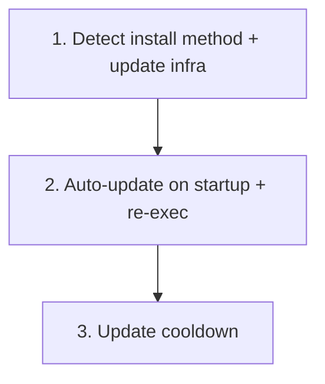

# Auto-Update

Plan for extending the startup flow in `crates/agentty/src/main.rs` and the version infrastructure in `crates/agentty/src/infra/version.rs` so `agentty` automatically updates to the latest version on launch and re-execs the new binary with no manual intervention.

## Steps

## 1) Detect installation method and build update infrastructure

### Why now

The update notification already exists in the status bar, but it hardcodes `npm i -g agentty@latest` regardless of how the user installed. Before auto-updating, we must know which update command to run and have a trait boundary for executing it.

### Usable outcome

`infra/version.rs` exposes an `InstallMethod` enum with detection logic and an `UpdateRunner` trait for executing updates. The status bar notification shows the correct command for the user's installation method. No auto-update yet — this is the foundation.

### Substeps

- [ ] **Add `InstallMethod` enum.** Define `InstallMethod` with variants `Npm`, `CargoInstall`, `CargoDist`, and `Unknown` in `crates/agentty/src/infra/version.rs`. Include an `update_command(&self, version: &str) -> Option<String>` method returning the shell command for each method (e.g. `npm i -g agentty@latest`, `cargo install agentty`, or the path to the `agentty-update` binary for `CargoDist`).
- [ ] **Detect installation method.** Add `pub fn detect_install_method() -> InstallMethod` in `crates/agentty/src/infra/version.rs`. Detection heuristic using `std::env::current_exe()`: path containing `node_modules` or `.npm` → `Npm`; under `.cargo/bin` and an `agentty-update` binary exists alongside → `CargoDist`; under `.cargo/bin` without updater → `CargoInstall`; otherwise `Unknown`.
- [ ] **Add `UpdateRunner` trait boundary.** Define `#[cfg_attr(test, mockall::automock)] trait UpdateRunner` in `crates/agentty/src/infra/version.rs` with `fn run_update(&self, command: &str) -> Result<String, String>`. The production implementation shells out via `std::process::Command` (synchronous, since this runs pre-TUI).
- [ ] **Thread install method through version check.** Update `TaskService::spawn_version_check_task()` in `crates/agentty/src/app/task.rs` to detect the install method and include it in the `AppEvent::VersionAvailabilityUpdated` event payload. Add an `install_method: InstallMethod` field to the event variant.
- [ ] **Update status bar notification.** Modify `StatusBar` in `crates/agentty/src/ui/component/status_bar.rs` to accept the `InstallMethod` and display the install-method-specific update command (or a generic "update available" message for `Unknown`).

### Tests

- [ ] Unit tests for `detect_install_method()` with mocked exe paths via a trait boundary or by testing the path-matching logic directly.
- [ ] Unit tests for `InstallMethod::update_command()` returning correct commands for each variant.
- [ ] Unit tests for `UpdateRunner` production implementation with a mock command.
- [ ] Update existing status bar render tests to verify method-specific update text.

### Docs

- [ ] No external docs needed for this step (internal infrastructure).

## 2) Auto-update on startup with automatic restart

### Why now

With install method detection and update runner in place, this step wires the actual auto-update flow: check for a new version before entering the TUI, run the update, and re-exec the binary so the user always starts with the latest version.

### Usable outcome

When `agentty` launches and a newer version is available, it prints "Updating agentty to vX.Y.Z..." to the terminal, runs the appropriate update command, and re-execs itself. If the update fails, it prints a warning and continues into the TUI with the current version. Users can opt out with `--no-update-check`.

### Substeps

- [ ] **Add `--no-update-check` CLI flag.** Add the flag to the CLI args in `crates/agentty/src/main.rs` (or wherever args are parsed). When set, skip the entire startup update flow.
- [ ] **Add startup update orchestrator.** Create a `pub fn check_and_update(runner: &dyn UpdateRunner, version_checker: &dyn VersionCommandRunner) -> UpdateOutcome` function in `crates/agentty/src/infra/version.rs`. This function: (1) calls `latest_npm_version_tag()` synchronously via `spawn_blocking` or a blocking variant, (2) compares with `env!("CARGO_PKG_VERSION")`, (3) if newer, detects install method and runs the update command via `UpdateRunner`, (4) returns `UpdateOutcome` enum (`Updated { version }`, `NoUpdate`, `Failed { error }`).
- [ ] **Print update progress to terminal.** Before the TUI initializes, use plain `eprintln!`/`println!` to print: "Checking for updates..." and either "Updating agentty to vX.Y.Z..." or "Already up to date." on success, or "Update failed: {error}. Continuing with current version." on failure.
- [ ] **Re-exec on successful update.** After a successful update, use `std::os::unix::process::CommandExt::exec()` to replace the current process with the newly installed binary, passing through the original `std::env::args()` plus `--no-update-check` to prevent an infinite update loop.
- [ ] **Wire into `main()`.** In `crates/agentty/src/main.rs`, call the startup update orchestrator after arg parsing but before DB open and `runtime::run()`. Gate behind `!args.no_update_check`.
- [ ] **Remove status bar update notification.** Since updates happen automatically on startup, remove the "update available" notification from the status bar in `crates/agentty/src/ui/component/status_bar.rs`. Keep the current version display. Also remove the `install_method` field from `AppEvent::VersionAvailabilityUpdated` and the background version check task (no longer needed — the startup check handles it).

### Tests

- [ ] Unit test for `check_and_update` with `MockUpdateRunner` and `MockVersionCommandRunner` returning a newer version — verifies update command is called with correct args.
- [ ] Unit test for `check_and_update` when current version is latest — verifies no update command is called.
- [ ] Unit test for `check_and_update` when update command fails — verifies `Failed` outcome returned.
- [ ] Unit test for `check_and_update` when version check itself fails (network error) — verifies `NoUpdate` outcome (graceful degradation).
- [ ] Unit test verifying `--no-update-check` flag is appended to re-exec args.

### Docs

- [ ] Update `docs/site/content/docs/usage/workflow.md` with auto-update lifecycle: startup check, automatic update, re-exec behavior.
- [ ] Update `docs/site/content/docs/getting-started/overview.md` mentioning auto-update capability.
- [ ] Update `docs/site/content/docs/architecture/testability-boundaries.md` with the `UpdateRunner` trait boundary.
- [ ] Update `README.md` with `--no-update-check` flag documentation.

## 3) Add update cooldown to avoid repeated checks

### Why now

Without a cooldown, every `agentty` launch hits the npm registry. This adds unnecessary latency for users who launch frequently. A short cooldown (e.g., 4 hours) avoids redundant checks while still catching updates promptly.

### Usable outcome

`agentty` records when it last checked for updates. If the last check was less than 4 hours ago, it skips the update check and launches the TUI immediately. The cooldown is stored in a lightweight local file (not the DB, since it should survive DB resets).

### Substeps

- [ ] **Add last-check timestamp persistence.** Store `last_update_check` as a Unix timestamp in a file at `~/.agentty/update_check` (or under the `AGENTTY_ROOT` directory). Use a simple text file with the timestamp and checked version.
- [ ] **Read/write helpers.** Add `read_last_update_check() -> Option<(i64, String)>` and `write_last_update_check(timestamp: i64, version: &str)` functions in `crates/agentty/src/infra/version.rs`.
- [ ] **Gate startup check with cooldown.** In `check_and_update()`, before hitting the network, read the last check timestamp. If it's less than 4 hours old and the recorded version matches the current binary version (no update was applied since), skip the check and return `NoUpdate`.
- [ ] **Update timestamp on check.** After a successful version check (whether or not an update was found), write the current timestamp and checked version.

### Tests

- [ ] Unit test for cooldown skip when last check is recent and version matches.
- [ ] Unit test for cooldown bypass when last check is stale (>4h).
- [ ] Unit test for cooldown bypass when current version differs from recorded version (post-manual-update).
- [ ] Unit test for read/write helpers with a temp directory.

### Docs

- [ ] Update `docs/site/content/docs/usage/workflow.md` with cooldown behavior (4-hour default, skips network check when recent).

## Cross-Plan Notes

- No conflicts with active plans. The version check infrastructure in `infra/version.rs` is touched only by this plan.

## Status Maintenance Rule

- After implementing any step in this plan, immediately update its checklist status and refresh the snapshot rows that changed.
- When a step changes behavior, complete its `### Tests` and `### Docs` work in that same step before marking it complete.
- When the full plan is complete, remove the implemented plan file; if more work remains, move that work into a new follow-up plan file before deleting the completed one.

## Current State Snapshot

| Area | Current state in codebase | Status |
|------|---------------------------|--------|
| Version detection | `infra/version.rs` checks npm for latest version | Exists, extend |
| Update notification | Status bar shows hardcoded `npm i -g agentty@latest` text | Exists, remove in Step 2 |
| Install method detection | Not implemented | New |
| Update execution | Not implemented | New |
| Auto-restart via re-exec | Not implemented | New |
| Update cooldown | Not implemented | New |
| cargo-dist updater | `install-updater = true` in `dist-workspace.toml` | Exists, leverage |

## Implementation Approach

- Start with install method detection and update runner trait (Step 1) — foundation for everything else.
- Step 2 wires the full startup auto-update flow: check, update, re-exec. This is the core feature.
- Step 3 adds a cooldown to avoid unnecessary network calls on every launch.
- Each step is independently mergeable and the app remains functional at every point.

## Suggested Execution Order

1. Start with `Step 1` — prerequisite for `Step 2` (provides `InstallMethod`, `UpdateRunner`).
1. `Step 2` depends on `Step 1` for update command resolution and execution.
1. `Step 3` depends on `Step 2` for the startup check flow to add cooldown logic to.

## Out of Scope for This Pass

- In-TUI update confirmation overlay or `/update` slash command (removed — updates are fully automatic).
- Update channels (stable/beta/nightly).
- Rollback to previous version on update failure.
- Windows support (no current target platform).
- Configurable cooldown duration (hardcoded at 4 hours for now).
