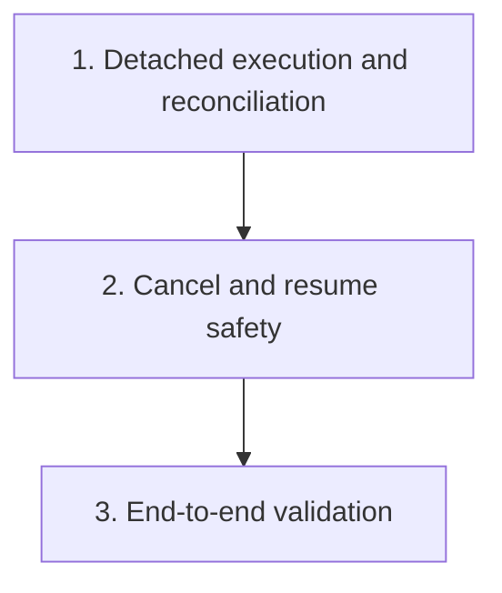

# Continue In-Progress Sessions After Exit Plan

Plan for changing `crates/agentty/src/app`, `crates/agentty/src/infra`, and `crates/agentty/src/main.rs` so active session turns keep running after the TUI exits and reconnect cleanly when Agentty starts again.

## Priorities

## 1) Ship detached execution with restart-safe reconciliation

### Why now

Detached execution is not actually user-usable until restart stops failing healthy unfinished work, so the first landed slice needs both the runner and the reconciliation path together.

### Usable outcome

A user can start a session turn, close Agentty, reopen it later, and still find the same turn running or completed because execution survives outside the TUI and restart preserves healthy work.

- [ ] Add a new migration extending `session_operation` with `runner_pid INTEGER` and `runner_heartbeat_at INTEGER` columns for liveness tracking. Do not edit `012_create_session_operation.sql`.
- [ ] Add a `ProcessInspector` trait in `crates/agentty/src/infra/` with `fn is_alive(&self, pid: u32) -> bool` and a real implementation using OS-level process checks, plus `#[cfg_attr(test, mockall::automock)]`. Register it in `docs/site/content/docs/architecture/testability-boundaries.md`.
- [ ] Add the `agentty run-turn` subcommand in `crates/agentty/src/main.rs` that loads one queued `session_operation` by ID and executes the existing session-turn flow without starting the Ratatui runtime.
- [ ] Refactor `crates/agentty/src/app/session/workflow/worker.rs` so queue persistence, turn execution, and post-turn status updates can be reused by both the TUI enqueue path and the detached runner without direct `App` ownership.
- [ ] Launch detached runners from the enqueue path via a `RunnerSpawner` trait boundary (in `infra/`) that spawns `agentty run-turn <operation-id>`, passing enough persisted context to reconstruct shared services (`Database`, git client, app-server router, worktree folder, session model).
- [ ] Ensure the detached runner writes its PID and a 10-second heartbeat to `session_operation` via `runner_pid` and `runner_heartbeat_at`, and writes incremental output to `<worktree>/.agentty-output.log`.
- [ ] Ensure the detached runner, not the TUI process, owns CLI child processes and app-server runtimes for the duration of the turn so closing the TUI no longer tears down active provider work.
- [ ] Replace `SessionManager::fail_unfinished_operations_from_previous_run()` with reconciliation that uses `ProcessInspector` and the 60-second heartbeat staleness threshold to decide whether to keep each unfinished operation active or mark it failed.
- [ ] Support `AGENTTY_DETACH=0` environment variable to disable detached execution and fall back to the current in-process worker model for rollback safety.
- [ ] Update session load and refresh flows to tail `<worktree>/.agentty-output.log` for live output from detached runners, feeding content into `SessionHandles.output`. Fall back to DB `output` column when the log file is absent or the runner has finished.
- [ ] Add a smoke test that validates the `run-turn` subcommand can start, execute a mock turn via an injected `AgentChannel`, write terminal state to the DB, and produce output in the log file — without the TUI.
- [ ] Update `docs/site/content/docs/usage/workflow.md` and `docs/site/content/docs/getting-started/overview.md` with minimal prose explaining that active sessions continue after the TUI exits and refresh from persisted state on reopen.

Primary files:

- `crates/agentty/src/main.rs`
- `crates/agentty/src/app/core.rs`
- `crates/agentty/src/app/session/workflow/load.rs`
- `crates/agentty/src/app/session/workflow/refresh.rs`
- `crates/agentty/src/app/session/workflow/worker.rs`
- `crates/agentty/src/infra/db.rs`
- `crates/agentty/src/infra/process.rs` (new — `ProcessInspector` trait)
- `crates/agentty/src/infra/runner.rs` (new — `RunnerSpawner` trait)
- `crates/agentty/migrations/`
- `docs/site/content/docs/usage/workflow.md`
- `docs/site/content/docs/getting-started/overview.md`
- `docs/site/content/docs/architecture/testability-boundaries.md`

## 2) Preserve cancel, stop, and resume safety across detached execution

### Why now

Keeping work alive after exit must not regress explicit user stop behavior, duplicate-runner protection, or provider resume correctness.

### Usable outcome

Cancel still stops detached work, reopening the app does not start duplicate runners, and follow-up replies continue using the right provider-native conversation state.

- [ ] Rework cancel and stop flows so app exit is no longer treated as a cancel signal, while explicit user-driven cancel still propagates through persisted `cancel_requested` flags and the detached runner's process boundary (e.g., `SIGTERM` to `runner_pid`).
- [ ] Enforce single-runner ownership per unfinished operation and per session turn so rapid reopen, repeated enqueue, or crash recovery cannot execute the same operation twice. Use `runner_pid` + `runner_heartbeat_at` as the ownership claim — a new runner must first verify no live owner exists.
- [ ] Add crash recovery: if a detached runner crashes (SIGKILL, OOM, panic) without writing a terminal status, the heartbeat staleness threshold (60s) allows any subsequent TUI startup or refresh cycle to reclaim and fail the orphaned operation.
- [ ] Keep provider conversation identifiers and transcript replay rules correct when a detached runner restarts an app-server runtime or a resumed reply happens after the user reopens Agentty.
- [ ] Update `docs/site/content/docs/architecture/runtime-flow.md`, `docs/site/content/docs/architecture/module-map.md`, and `docs/site/content/docs/architecture/testability-boundaries.md` to describe detached session runners, `ProcessInspector`/`RunnerSpawner` boundaries, ownership of provider subprocesses, and the liveness protocol.
- [ ] Add mock-driven tests around detached execution for CLI and app-server transports, including duplicate suppression, cancel-before-execution, cancel-during-execution, crash recovery, and reply-after-restart scenarios.

Primary files:

- `crates/agentty/src/app/session/workflow/lifecycle.rs`
- `crates/agentty/src/app/session/workflow/worker.rs`
- `crates/agentty/src/infra/channel/app_server.rs`
- `crates/agentty/src/infra/channel/cli.rs`
- `crates/agentty/src/infra/codex_app_server.rs`
- `crates/agentty/src/infra/gemini_acp.rs`
- `crates/agentty/src/infra/db.rs`
- `docs/site/content/docs/architecture/runtime-flow.md`
- `docs/site/content/docs/architecture/module-map.md`
- `docs/site/content/docs/architecture/testability-boundaries.md`

## 3) Validate detached session lifetime end to end

### Why now

The detached-runner model changes failure recovery and restart semantics, so one end-to-end regression pass is needed before treating the behavior as stable.

### Usable outcome

The repository has regression coverage for close-and-reopen behavior and the full validation gates confirm the final detached-session flow is ready to ship.

- [ ] Add an integration-style regression test that starts a turn, simulates TUI shutdown while the runner continues, and verifies that a fresh `App` instance observes either continued `InProgress` output or the final `Review` state from persistence.
- [ ] Run the repository validation gates after the implementation lands, including the full pre-commit checks and full test suite.

Primary files:

- `crates/agentty/src/app/core.rs`
- `crates/agentty/src/app/session/core.rs`
- `crates/agentty/src/app/session/workflow/worker.rs`

## Cross-Plan Notes

- `docs/plan/coverage_follow_up.md` may add tests around overlapping files, but detached-session behavior changes stay here.
- `docs/plan/forge_review_request_support.md` also touches `crates/agentty/src/app/core.rs`; this plan owns `App::new_with_clients` startup recovery and detached-runner lifetime, while the forge plan owns `handle_review_request` and review-request reconciliation.
- If another active plan conflicts with this plan and the correct resolution is not explicit, stop and ask the user which plan should control the work.

## Status Maintenance Rule

- After implementing any step in this plan, immediately update its checklist status, refresh the current-state snapshot rows that changed, and note any new migration or docs dependency before moving to the next step.
- When a step changes user-visible behavior or contributor guidance, update the corresponding documentation in that same step before marking it complete.

## Current State Snapshot

| Area | Current state in codebase | Status |
|------|---------------------------|--------|
| Startup recovery | Restart still fails every queued or running `session_operation` and forces affected sessions back to `Review`. | Not Started |
| Session worker lifetime | Session workers live only in an in-memory map and execute inside `tokio::spawn`, so quitting the app drops the only worker orchestration path. | Not Started |
| Provider runtime lifetime | App-server, CLI, and Gemini transports still live under the Agentty process that owns the worker task. | Not Started |
| Persistence available for recovery | The database already persists unfinished operations and heartbeat fields, but it does not yet track detached-runner ownership or liveness. | In Progress |
| Session reload behavior | Reload logic can already render persisted `InProgress` sessions when the worktree still exists. | In Progress |
| Live output bridging | No cross-process output streaming path exists; `SessionHandles.output` is an in-process `Arc<Mutex<String>>`. | Not Started |

## Design Decisions

### Runner form factor

Use an `agentty run-turn` subcommand on the existing binary. This avoids distributing a separate binary, keeps version parity automatic, and aligns with the existing `clap` infrastructure in `main.rs`.

### Liveness protocol

Use a hybrid PID + heartbeat approach. The detached runner writes its PID and a periodic heartbeat timestamp (every 10 seconds) to `session_operation`. On restart the TUI checks both: if the PID is no longer alive **or** the heartbeat is stale (>60 seconds), the operation is reclaimed and marked failed. This handles normal exit, crash, SIGKILL, and zombie scenarios.

Migration columns: `runner_pid INTEGER`, `runner_heartbeat_at INTEGER`.

### Live output bridging

The detached runner writes incremental output to a log file at `<worktree>/.agentty-output.log`. The TUI tails this file when it detects an active detached runner for the session, feeding content into `SessionHandles.output`. This avoids high-frequency DB writes and keeps latency under one second. The DB `output` column is still updated on turn completion as a durable fallback.

### Cross-process event delivery

DB polling at the existing 10-second refresh interval is sufficient for status transitions (queued → running → review). The log-file tail provides sub-second output updates. No cross-process event channel (Unix socket, named pipe) is needed for the initial implementation.

### Rollback path

A `AGENTTY_DETACH=0` environment variable disables detached execution and falls back to the current in-process worker model. This allows safe rollout and quick rollback without code changes.

## Implementation Approach

- Start with one detached execution path plus restart-safe reconciliation so a user can close Agentty mid-turn, reopen it later, and still observe the same turn progressing or finishing without manual repair.
- Keep SQLite plus the session worktree as the source of truth; the TUI should enqueue and observe work, while the long-running runner process owns turn execution, output persistence, and final status transitions.
- Fold usage and concept docs into the same iterations that change session-lifetime behavior; keep deeper architecture-boundary docs with the step that finalizes those boundaries.
- Add stronger cancel, duplicate-runner protection, and provider-resume hardening only after the detached happy path works end to end so the first shipped slice is already usable.

## Suggested Execution Order

1. Start with `1) Ship detached execution with restart-safe reconciliation`; it is the first slice that produces an end-to-end usable close-and-reopen workflow instead of runner groundwork alone.
1. Start `2) Preserve cancel, stop, and resume safety across detached execution` only after priority 1 is merged, because it depends on the detached-runner ownership and reconciliation shape established there.
1. Start `3) Validate detached session lifetime end to end` only after priority 2 is merged so the final regression test and validation pass cover the stabilized behavior.
1. No top-level priorities are safe to run in parallel because each step depends on the detached-runner behavior and ownership model finalized by the previous one.

## Out of Scope for This Pass

- Building a long-lived global daemon that multiplexes all sessions beyond what is needed for detached turn survival.
- Adding cross-machine or remote worker execution.
- Cross-process event delivery (Unix sockets, named pipes) beyond DB polling and log-file tailing.
- Changing merge, rebase, or review-request workflows except where they must respect the new detached session lifetime rules.
