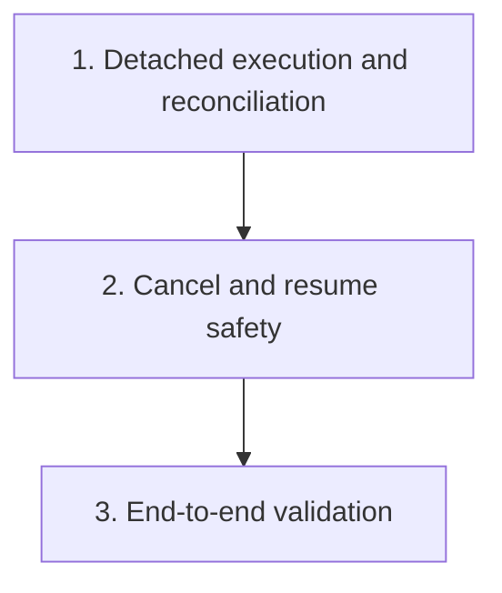

# Continue In-Progress Sessions After Exit Plan

Plan for changing `crates/agentty/src/app`, `crates/agentty/src/infra`, and `crates/agentty/src/main.rs` so active session turns keep running after the TUI exits and reconnect cleanly when Agentty starts again.

## Cross-Plan Check Before Implementation

- Before starting implementation, review other files in `docs/plan/` for overlapping scope, file ownership, sequencing, or dependency conflicts.
- `coverage_follow_up.md` overlaps only on test ownership for `crates/agentty/src/app/session/workflow/worker.rs`, `crates/agentty/src/infra/codex_app_server.rs`, and related runtime files; keep behavior changes here and leave pure coverage follow-up there.
- `forge_review_request_support.md` touches `crates/agentty/src/app/core.rs` and session workflow files, but it does not define shutdown or detached-runner behavior; if both plans are active, this plan controls session-execution lifetime rules.
- If another active plan conflicts with this plan and the correct resolution is not explicit, stop and ask the user which plan should control the work.

## Status Maintenance Rule

- After implementing any step in this plan, immediately update its checklist status, refresh the current-state snapshot rows that changed, and note any new migration or docs dependency before moving to the next step.
- When a step changes user-visible behavior or contributor guidance, update the corresponding documentation in that same step before marking it complete.

## Current State Snapshot

| Area | Current state in codebase | Status |
|------|---------------------------|--------|
| Startup recovery | `crates/agentty/src/app/core.rs` calls `SessionManager::fail_unfinished_operations_from_previous_run()` during `App::new_with_clients()`, so every queued or running `session_operation` is marked failed and affected sessions are forced back to `Review` on restart. | Blocking |
| Session worker lifetime | `crates/agentty/src/app/session/workflow/worker.rs` owns per-session workers in an in-memory `HashMap<String, UnboundedSender<SessionCommand>>` and executes turns inside `tokio::spawn`, so quitting the app drops the only worker orchestration path. | Blocking |
| Provider runtime lifetime | `crates/agentty/src/infra/codex_app_server.rs` keeps app-server runtimes in an in-memory `AppServerSessionRegistry` and starts `codex app-server` with `kill_on_drop(true)`; CLI turns and Gemini ACP turns are likewise children of the Agentty process that owns the worker task. | Blocking |
| Persistence available for recovery | `crates/agentty/src/infra/db.rs` and migration `crates/agentty/migrations/012_create_session_operation.sql` already persist queued and running operations plus `heartbeat_at` and `cancel_requested`, but there is no detached-runner ownership or liveness reconciliation yet. | Partial |
| Session reload behavior | `crates/agentty/src/app/session/workflow/load.rs` can reload persisted `InProgress` sessions when the worktree folder still exists, so DB-driven status and output updates from an external runner would already be renderable after restart. | Partial |

## Implementation Approach

- Start with one detached execution path plus restart-safe reconciliation so a user can close Agentty mid-turn, reopen it later, and still observe the same turn progressing or finishing without manual repair.
- Keep SQLite plus the session worktree as the source of truth; the TUI should enqueue and observe work, while the long-running runner process owns turn execution, output persistence, and final status transitions.
- Fold usage and concept docs into the same iterations that change session-lifetime behavior; keep deeper architecture-boundary docs with the step that finalizes those boundaries.
- Add stronger cancel, duplicate-runner protection, and provider-resume hardening only after the detached happy path works end to end so the first shipped slice is already usable.

## Updated Priorities

## 1) Ship detached execution with restart-safe reconciliation

**Why now:** Detached execution is not actually user-usable until restart stops failing healthy unfinished work, so the first landed slice needs both the runner and the reconciliation path together.
**Usable outcome:** A user can start a session turn, close Agentty, reopen it later, and still find the same turn running or completed because execution survives outside the TUI and restart preserves healthy work.

- [ ] Add a dedicated background-runner entry point, most likely as an `agentty` subcommand or a small sibling binary, that loads one queued `session_operation` and executes the existing session-turn flow without starting the Ratatui runtime.
- [ ] Refactor `crates/agentty/src/app/session/workflow/worker.rs` so queue persistence, turn execution, and post-turn status updates can be reused by both the TUI enqueue path and the detached runner without direct `App` ownership.
- [ ] Launch detached runners from the enqueue path with enough persisted context to reconstruct shared services (`Database`, git client, app-server router, worktree folder, session model) while keeping process spawning behind an explicit infrastructure boundary instead of direct orchestration-layer subprocess calls.
- [ ] Ensure the detached runner, not the TUI process, owns CLI child processes and app-server runtimes for the duration of the turn so closing the TUI no longer tears down active provider work.
- [ ] Replace `SessionManager::fail_unfinished_operations_from_previous_run()` with reconciliation that checks whether a detached runner still owns each unfinished operation before deciding to keep it active or mark it failed.
- [ ] Extend `session_operation` persistence with the minimum runner metadata needed for liveness checks and single ownership, such as runner PID, claim token, or last-known heartbeat timestamp, using a new migration instead of editing `012_create_session_operation.sql`.
- [ ] Add a small infrastructure boundary for process-liveness inspection so `app/` and `runtime/` code do not perform direct OS process checks.
- [ ] Update session load and refresh flows to trust DB-driven status and transcript updates from detached runners even when there is no live in-memory `SessionHandles` producer in the current TUI process.
- [ ] Update `docs/site/content/docs/usage/workflow.md` and `docs/site/content/docs/getting-started/overview.md` in the same slice so the shipped behavior explains that active sessions continue after the TUI exits and refresh from persisted state on reopen.

Primary files:

- `crates/agentty/src/main.rs`
- `crates/agentty/src/app/core.rs`
- `crates/agentty/src/app/session/workflow/load.rs`
- `crates/agentty/src/app/session/workflow/refresh.rs`
- `crates/agentty/src/app/session/workflow/worker.rs`
- `crates/agentty/src/infra/db.rs`
- `crates/agentty/migrations/`
- `docs/site/content/docs/usage/workflow.md`
- `docs/site/content/docs/getting-started/overview.md`

## 2) Preserve cancel, stop, and resume safety across detached execution

**Why now:** Keeping work alive after exit must not regress explicit user stop behavior, duplicate-runner protection, or provider resume correctness.
**Usable outcome:** Cancel still stops detached work, reopening the app does not start duplicate runners, and follow-up replies continue using the right provider-native conversation state.

- [ ] Rework cancel and stop flows so app exit is no longer treated as a cancel signal, while explicit user-driven cancel still propagates through persisted cancel flags and the detached runner's process boundary.
- [ ] Enforce single-runner ownership per unfinished operation and per session turn so rapid reopen, repeated enqueue, or crash recovery cannot execute the same operation twice.
- [ ] Keep provider conversation identifiers and transcript replay rules correct when a detached runner restarts an app-server runtime or a resumed reply happens after the user reopens Agentty.
- [ ] Update `docs/site/content/docs/architecture/runtime-flow.md`, `docs/site/content/docs/architecture/module-map.md`, and `docs/site/content/docs/architecture/testability-boundaries.md` to describe detached session runners, ownership of provider subprocesses, and the liveness boundary once those interfaces settle.
- [ ] Add mock-driven tests around detached execution for CLI and app-server transports, including duplicate suppression, cancel-before-execution, cancel-during-execution, and reply-after-restart scenarios.

Primary files:

- `crates/agentty/src/app/session/workflow/lifecycle.rs`
- `crates/agentty/src/app/session/workflow/worker.rs`
- `crates/agentty/src/infra/channel/app_server.rs`
- `crates/agentty/src/infra/channel/cli.rs`
- `crates/agentty/src/infra/codex_app_server.rs`
- `crates/agentty/src/infra/gemini_acp.rs`
- `crates/agentty/src/infra/db.rs`
- `docs/site/content/docs/architecture/runtime-flow.md`
- `docs/site/content/docs/architecture/module-map.md`
- `docs/site/content/docs/architecture/testability-boundaries.md`

## 3) Validate detached session lifetime end to end

**Why now:** The detached-runner model changes failure recovery and restart semantics, so one end-to-end regression pass is needed before treating the behavior as stable.
**Usable outcome:** The repository has regression coverage for close-and-reopen behavior and the full validation gates confirm the final detached-session flow is ready to ship.

- [ ] Add an integration-style regression test that starts a turn, simulates TUI shutdown while the runner continues, and verifies that a fresh `App` instance observes either continued `InProgress` output or the final `Review` state from persistence.
- [ ] Run the repository validation gates after the implementation lands, including the full pre-commit checks and full test suite.

Primary files:

- `crates/agentty/src/app/core.rs`
- `crates/agentty/src/app/session/core.rs`
- `crates/agentty/src/app/session/workflow/worker.rs`

## Suggested Execution Order

1. Start with `1) Ship detached execution with restart-safe reconciliation`; it is the first slice that produces an end-to-end usable close-and-reopen workflow instead of runner groundwork alone.
1. Start `2) Preserve cancel, stop, and resume safety across detached execution` only after priority 1 is merged, because it depends on the detached-runner ownership and reconciliation shape established there.
1. Start `3) Validate detached session lifetime end to end` only after priority 2 is merged so the final regression test and validation pass cover the stabilized behavior.
1. No top-level priorities are safe to run in parallel because each step depends on the detached-runner behavior and ownership model finalized by the previous one.

## Out of Scope for This Pass

- Building a long-lived global daemon that multiplexes all sessions beyond what is needed for detached turn survival.
- Adding cross-machine or remote worker execution.
- Changing merge, rebase, or review-request workflows except where they must respect the new detached session lifetime rules.
