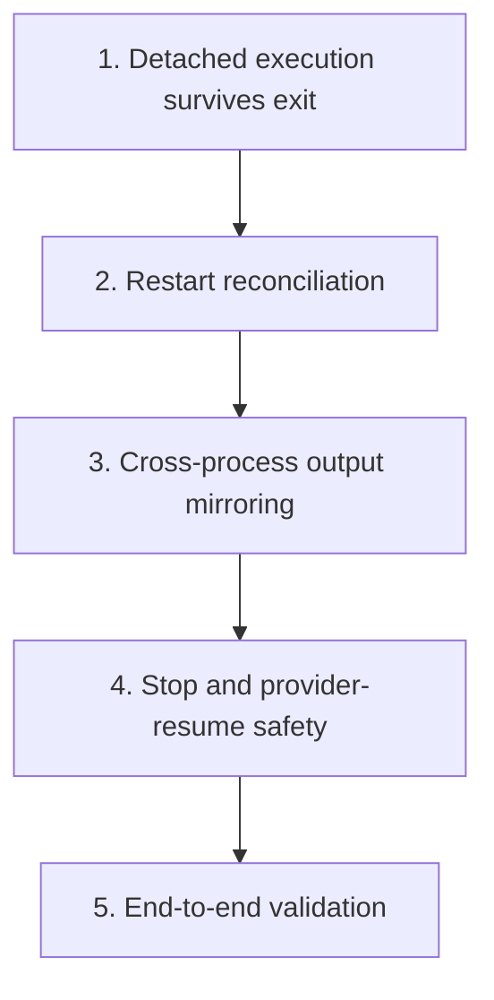

# Continue In-Progress Sessions After Exit Plan

Plan for changing `crates/agentty/src/app`, `crates/agentty/src/infra`, and `crates/agentty/src/main.rs` so active session turns keep running after the TUI exits, finish while Agentty is closed, and reconnect cleanly when Agentty starts again.

## Priorities

## 1) Ship detached turn execution that survives TUI exit

### Why now

The first slice needs to prove that turn execution can outlive the TUI at all, because the current worker model dies with the app process.

### Usable outcome

A user can start a session turn, close Agentty, reopen it after the turn finishes, and find the final `Review` or `Question` state persisted from a detached runner instead of losing the turn when the TUI exits.

### Substeps

- [ ] Add a new migration in `crates/agentty/migrations/` extending `session_operation` with the immutable turn payload a detached runner needs (`prompt`, `model`, `turn_mode`, `resume_output`) and the future liveness fields (`runner_pid INTEGER`, reusing `heartbeat_at`). Do not edit `012_create_session_operation.sql`.
- [ ] Add a typed detached-operation model plus the minimum DB methods in `crates/agentty/src/infra/db.rs` to insert, load, and finalize a persisted turn so `agentty run-turn` can execute from storage instead of TUI memory.
- [ ] Add a `RunnerSpawner` trait boundary in `crates/agentty/src/infra/runner.rs` that launches `agentty run-turn <operation-id>` after operation persistence succeeds.
- [ ] Add the `agentty run-turn` subcommand in `crates/agentty/src/main.rs` that opens the DB, loads one persisted operation by ID, and executes the shared turn-runner flow without starting the Ratatui runtime.
- [ ] Ensure the detached runner, not the TUI process, owns CLI child processes and app-server runtimes for the duration of the turn so closing the TUI no longer tears down active provider work.
- [ ] Persist the final transcript, terminal session status, and durable `session.output` state back through `crates/agentty/src/app/session/workflow/worker.rs` or a new `crates/agentty/src/app/session/workflow/turn_runner.rs` path before the detached runner exits.
- [ ] Stop blanket startup failure from corrupting detached-enabled unfinished work in `crates/agentty/src/app/core.rs`; until full reconciliation lands, reopening during an active detached turn may be stale but it must not force the operation into `failed`.
- [ ] Support `AGENTTY_DETACH=0` to disable detached execution and fall back to the current in-process worker model for rollback safety while the detached path stabilizes.

### Tests

- [ ] Add a smoke test that validates the `run-turn` subcommand can start, execute a mock turn via an injected `AgentChannel`, and write terminal state plus final output back to the DB without the TUI.

### Docs

- [ ] Update `docs/site/content/docs/usage/workflow.md` and `docs/site/content/docs/getting-started/overview.md` with minimal prose explaining that turns can finish while Agentty is closed and that `AGENTTY_DETACH=0` remains the rollback switch.
- [ ] Register the new `RunnerSpawner` boundary in `docs/site/content/docs/architecture/testability-boundaries.md` as part of the initial detached-runner slice.

## 2) Reconcile live detached operations on restart

### Why now

Once basic reopen safety exists, the next gap is distinguishing healthy detached runners from abandoned work so stale `InProgress` operations do not linger forever.

### Usable outcome

A user can reopen Agentty while a detached runner is still active and see the session remain `InProgress` only when a real live runner still owns it, while stale work is reclaimed deterministically.

### Substeps

- [ ] Add a `ProcessInspector` trait in `crates/agentty/src/infra/process.rs` with `fn is_alive(&self, pid: u32) -> bool`, a production implementation using OS-level process checks, and `#[cfg_attr(test, mockall::automock)]`.
- [ ] Extend `crates/agentty/src/infra/db.rs` with claim, heartbeat refresh, stale-failure, and owner-clear flows so `session_operation` can distinguish healthy detached runners from abandoned work.
- [ ] Replace `SessionManager::fail_unfinished_operations_from_previous_run()` in `crates/agentty/src/app/core.rs` with reconciliation in `crates/agentty/src/app/session/workflow/reconcile.rs` that uses `ProcessInspector`, `runner_pid`, and the 60-second heartbeat staleness threshold to decide whether to keep each unfinished operation active, reclaim it, or mark it failed.
- [ ] Split `crates/agentty/src/app/session/workflow/worker.rs` into focused modules only where it reduces coupling between queueing, detached execution, and restart reconciliation; keep `worker.rs` queue-focused and move restart-specific logic into `reconcile.rs`.
- [ ] Keep reopened sessions renderable from persisted `InProgress` state in `crates/agentty/src/app/session/workflow/load.rs` and `crates/agentty/src/app/session/workflow/refresh.rs` even before live output tailing lands.

### Tests

- [ ] Add mock-driven tests for healthy-runner reopen, stale-runner failure, claim refusal when a live owner exists, and post-finish reconciliation paths.

### Docs

- [ ] Update `docs/site/content/docs/architecture/runtime-flow.md`, `docs/site/content/docs/architecture/module-map.md`, and `docs/site/content/docs/architecture/testability-boundaries.md` to describe detached session runners, `ProcessInspector`, `RunnerSpawner`, and the liveness protocol.

## 3) Mirror live output across processes

### Why now

State-only recovery is usable, but it still leaves reopened sessions blind while a detached runner is streaming. The next slice should restore output continuity.

### Usable outcome

A user can reopen Agentty during an active detached turn and watch fresh output continue in the session view instead of waiting only for terminal DB state.

### Substeps

- [ ] Add `crates/agentty/src/app/session/workflow/output_replica.rs` and have the detached runner mirror incremental output into `<session-folder>/.agentty-output.log` instead of a worktree-only path so non-git sessions stay covered.
- [ ] Update `crates/agentty/src/app/session/workflow/load.rs` and `crates/agentty/src/app/session/workflow/refresh.rs` to attach and detach output-tail tasks through `output_replica.rs`, feeding the log into `SessionHandles.output` while a detached runner is live and falling back to DB `output` when no live runner remains.
- [ ] Import any remaining log tail before finalization or stale-runner failure so reconciliation does not discard already-streamed transcript content.

### Tests

- [ ] Add tests for output-log mirroring, reopen-time tail attachment, log-tail import on runner completion, and stale-runner cleanup with partial buffered output.

### Docs

- [ ] Update `docs/site/content/docs/usage/workflow.md` and `docs/site/content/docs/architecture/runtime-flow.md` with the reopened-session output behavior and the durable log-file handoff.

## 4) Preserve stop, cancel, and provider-resume safety across detached execution

### Why now

After detached execution and output bridging work, the remaining risk is behavioral regression around explicit stop actions and provider-native resume state.

### Usable outcome

A user can explicitly stop detached work, reopen Agentty without stale-output drift, and continue follow-up replies using the correct provider-native conversation state.

### Substeps

- [ ] Rework stop flows in `crates/agentty/src/app/session/workflow/lifecycle.rs` so app exit is no longer treated as a cancel signal, while explicit user-driven in-progress stop still propagates through persisted `cancel_requested` flags.
- [ ] Add the process-control boundary needed to terminate a live detached runner from `crates/agentty/src/infra/process.rs` before any stop flow depends on platform-specific signals such as `SIGTERM` to `runner_pid`.
- [ ] Keep review-session cancel and in-progress stop as separate workflows: review cancel still cleans worktrees, while in-progress stop terminates the detached runner and preserves transcript/output for review-state recovery.
- [ ] Keep provider conversation identifiers and transcript replay rules correct in `crates/agentty/src/infra/channel/app_server.rs`, `crates/agentty/src/infra/channel/cli.rs`, `crates/agentty/src/infra/codex_app_server.rs`, and `crates/agentty/src/infra/gemini_acp.rs` when a detached runner restarts an app-server runtime or a resumed reply happens after the user reopens Agentty.
- [ ] Define guardrails for persisted `cancel_requested` handling, detached-runner signal delivery, and transcript replay ownership so restart-safe stop behavior stays deterministic across transports.

### Tests

- [ ] Add mock-driven tests around detached execution for CLI and app-server transports, including stop-before-execution, stop-during-execution, review cancel cleanup, and reply-after-restart scenarios.

### Docs

- [ ] Update `docs/site/content/docs/architecture/runtime-flow.md`, `docs/site/content/docs/architecture/module-map.md`, and `docs/site/content/docs/architecture/testability-boundaries.md` to describe detached stop delivery, provider-resume ownership, and the final process boundary set.

## 5) Validate detached session lifetime end to end

### Why now

The detached-runner model changes failure recovery, restart semantics, and user-visible session refresh behavior, so one final regression pass is needed before treating the feature as stable.

### Usable outcome

The repository has close-and-reopen regression coverage that exercises detached lifetime from persisted state, and the final validation gates confirm the shipped behavior is stable.

### Substeps

- [ ] Add an integration-style regression test in `crates/agentty/src/app/core.rs`, `crates/agentty/src/app/session/core.rs`, `crates/agentty/src/app/session/workflow/reconcile.rs`, `crates/agentty/src/app/session/workflow/turn_runner.rs`, and `crates/agentty/src/app/session/workflow/output_replica.rs` that starts a turn, simulates TUI shutdown while the runner continues, and verifies that a fresh `App` instance observes continued `InProgress` output or the final `Review` or `Question` state from persistence.
- [ ] Add a regression test in `crates/agentty/src/app/core.rs` and `crates/agentty/src/app/session/core.rs` that completes a turn entirely while Agentty is closed and verifies the next app launch loads the final transcript, terminal operation state, and session status without replaying the turn.

### Tests

- [ ] Run the repository validation gates after the implementation lands, including the full pre-commit checks and full test suite.

### Docs

- [ ] Update the detached-session plan snapshot and any affected detached-session docs only if the end-to-end coverage changes user-visible terminology or narrows the supported close-and-reopen behavior.

## Cross-Plan Notes

- `docs/plan/end_to_end_test_structure.md` may add test-harness work around some of the same app and workflow modules, but detached-session behavior changes and acceptance scenarios stay here.
- `docs/plan/forge_review_request_support.md` also touches `crates/agentty/src/app/core.rs`; this plan owns `App::new_with_clients` startup recovery and detached-runner lifetime, while the forge plan owns `handle_review_request` and review-request reconciliation.
- If another active plan conflicts with this plan and the correct resolution is not explicit, stop and ask the user which plan should control the work.

## Status Maintenance Rule

- After implementing any step in this plan, immediately update its checklist status, refresh the current-state snapshot rows that changed, and note any new migration or docs dependency before moving to the next step.
- When a step changes behavior, complete its `### Tests` and `### Docs` work in that same priority before marking the step complete.

## Current State Snapshot

| Area | Current state in codebase | Status |
|------|---------------------------|--------|
| Startup recovery | Restart still fails every queued or running `session_operation` and forces affected sessions back to `Review`. | Not Started |
| Session worker lifetime | Session workers live only in an in-memory map and execute inside `tokio::spawn`, so quitting the app drops the only worker orchestration path. | Not Started |
| Provider runtime lifetime | App-server, CLI, and Gemini transports still live under the Agentty process that owns the worker task. | Not Started |
| Operation persistence | The database already persists unfinished operation status and one heartbeat field, but it does not yet persist the immutable turn payload a detached runner would need. | Partial |
| Ownership and liveness | No persisted runner owner exists today, so reopen cannot distinguish a healthy detached runner from abandoned work. | Not Started |
| Session reload behavior | Reload logic can already render persisted `InProgress` sessions when the worktree still exists, but startup still force-fails unfinished operations before reopen can trust them. | Partial |
| Live output bridging | No cross-process output streaming path exists; `SessionHandles.output` is an in-process `Arc<Mutex<String>>`. | Not Started |
| Binary entrypoint | `main.rs` currently launches the Ratatui app directly and has no subcommand dispatcher for detached execution. | Not Started |

## Design Decisions

### Runner form factor

Use an `agentty run-turn` subcommand on the existing binary. This keeps version parity automatic, avoids a second executable, and keeps detached execution wired through the same repository entrypoint as the TUI.

### Operation persistence

Persist the detached runner's immutable turn request in `session_operation` when the command is queued. The detached process must be able to reconstruct prompt text, model, turn mode, and any one-time transcript replay input from the DB alone.

Required persisted fields: `prompt`, `model`, `turn_mode`, `resume_output`, `runner_pid`, plus the existing `heartbeat_at`.

### Ownership protocol

Use a DB-backed claim before execution. A runner may execute an operation only after it atomically claims ownership, writes `runner_pid`, and starts heartbeating. Healthy claimed operations are never re-run on reopen.

### Liveness protocol

Use a hybrid PID plus heartbeat approach. The detached runner writes its PID and a periodic heartbeat timestamp every 10 seconds to `session_operation`. On restart the TUI checks both: if the PID is no longer alive or the heartbeat is stale for more than 60 seconds, the operation is reclaimed and marked failed. This handles normal exit, crash, `SIGKILL`, and zombie scenarios.

Migration column: `runner_pid INTEGER`. Reuse the existing `heartbeat_at INTEGER`.

### Live output bridging

The detached runner writes incremental output to `<session-folder>/.agentty-output.log`. The TUI tails this file when it detects an active detached runner for the session, feeding content into `SessionHandles.output`. This avoids high-frequency DB writes and keeps latency under one second. The DB `output` column remains the durable source of truth, and reconciliation imports any unflushed log tail before failing stale work.

### Cross-process event delivery

DB polling at the existing 5-second refresh interval is sufficient for status transitions (`queued` -> `running` -> `review`). The log-file tail provides sub-second output updates. No cross-process event channel (Unix socket, named pipe) is needed for the initial implementation.

### Stop versus cancel semantics

Keep review-session cancel and in-progress stop as separate flows. Detached execution should preserve the existing review-state cleanup behavior while adding a new in-progress stop path that signals the live runner process without deleting the session worktree mid-turn.

### Rollback path

An `AGENTTY_DETACH=0` environment variable disables detached execution and falls back to the current in-process worker model. This allows safe rollout and quick rollback without code changes.

## Implementation Approach

- Start with the smallest usable detached slice: one detached execution path that can finish a turn while Agentty is closed before layering restart reconciliation, output mirroring, and stop hardening on top.
- Keep SQLite plus the session worktree as the source of truth; the TUI should enqueue and observe work, while the long-running runner process owns turn execution, output persistence, and final status transitions.
- Introduce modularity only where it lowers cross-process complexity: keep queueing in `worker.rs`, move restart recovery into `reconcile.rs`, and add `turn_runner.rs` or `output_replica.rs` only when the detached slices make them pull their weight.
- Fold usage docs, architecture docs, and regression coverage into the same priorities that change session-lifetime behavior instead of deferring them to a final cleanup pass.
- Add stronger stop and provider-resume hardening only after detached execution, restart reconciliation, and output continuity each work as their own usable slices.

## Detached Turn Workflow

1. The TUI validates the prompt, persists session metadata, and inserts a fully populated `session_operation` row.
1. The enqueue path starts detached execution through `RunnerSpawner` unless `AGENTTY_DETACH=0` is set.
1. `agentty run-turn <operation-id>` opens the DB, loads the persisted operation payload, and atomically claims ownership once the restart-reconciliation slice lands.
1. The detached runner writes `runner_pid`, starts refreshing `heartbeat_at`, and initializes `.agentty-output.log` in the session folder when the relevant slices land.
1. The shared turn-runner flow creates the correct `AgentChannel`, executes the turn, persists progress and results, and later slices also mirror streamed output to the log.
1. If the TUI is open, `output_replica.rs` tails the log and feeds appended bytes into `SessionHandles.output`.
1. If the TUI exits, the detached runner keeps owning the provider subprocesses and continues to completion.
1. On TUI restart, `reconcile.rs` inspects `runner_pid` and `heartbeat_at`, keeps healthy operations alive, and fails only stale or orphaned work.
1. When the turn finishes, the runner persists final transcript and state, stops heartbeating, clears ownership, and leaves the session in `Review` or `Question`.
1. Follow-up replies create a new persisted operation and repeat the same flow.

## Suggested Execution Order

1. Start with `1) Ship detached turn execution that survives TUI exit`; it is the smallest slice that proves a turn can outlive the UI and still finish into durable session state.
1. Start `2) Reconcile live detached operations on restart` only after priority 1 is merged, because it depends on detached execution and persisted operation payloads already existing.
1. Start `3) Mirror live output across processes` only after priority 2 is merged so output attachment builds on the settled ownership and liveness protocol.
1. Start `4) Preserve stop, cancel, and provider-resume safety across detached execution` only after priority 3 is merged so stop behavior can rely on the final detached process and transcript handoff shape.
1. Start `5) Validate detached session lifetime end to end` only after priority 4 is merged so the final regression pass covers the stabilized behavior.
1. No top-level priorities are safe to run in parallel because each slice depends on the detached-runner ownership and recovery rules finalized by the previous slice.

## Out of Scope for This Pass

- Building a long-lived global daemon that multiplexes all sessions beyond what is needed for detached turn survival.
- Adding cross-machine or remote worker execution.
- Adding a cross-process event channel beyond DB polling and log-file tailing.
- Changing merge, rebase, or review-request workflows except where they must respect the new detached session lifetime rules.
