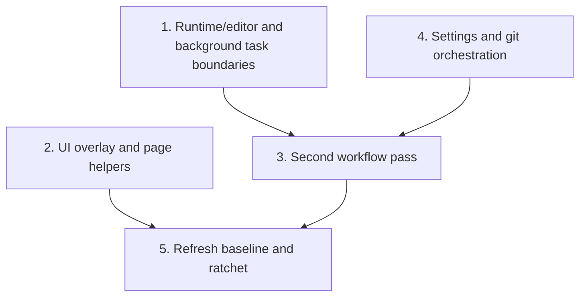

# Coverage Follow-up Plan

Second-pass coverage uplift plan for the remaining runtime, UI, settings, and workflow hotspots after the March 7, 2026 `cargo llvm-cov` refresh and ratchet landing.

## Cross-Plan Check Before Implementation

- Before starting implementation, review other files in `docs/plan/` for overlapping scope, file ownership, sequencing, or dependency conflicts.
- `forge_review_request_support.md` is the only neighboring plan that touches related infrastructure paths; keep any follow-up coverage work there limited to tests unless that feature plan explicitly requires behavior changes.
- If another active plan conflicts with this plan and the correct resolution is not explicit, stop and ask the user which plan should control the work.

## Status Maintenance Rule

- After implementing any step in this plan, immediately update its checklist status, refresh any affected snapshot rows, and record whether the coverage ratchet threshold should move.

## Current State Snapshot

Baseline captured on March 7, 2026 from `cargo llvm-cov --workspace --json --summary-only`.

| Area | Current state in codebase | Status |
|------|---------------------------|--------|
| Workspace baseline | 87.57% line coverage (`36614/41813`) and 85.30% function coverage (`4137/4850`) | Baseline captured |
| Runtime/editor boundaries | `crates/agentty/src/runtime/terminal.rs` is at 36.57% line coverage (`111` uncovered), `crates/agentty/src/app/task.rs` is at 45.28% (`116` uncovered), and `crates/agentty/src/runtime/event.rs` is at 71.71% (`73` uncovered) | Needs follow-up |
| UI overlay and page helpers | `crates/agentty/src/ui/overlay.rs` is at 54.22% line coverage (`114` uncovered), `crates/agentty/src/ui/page/project_list.rs` is at 55.65% (`102` uncovered), and `crates/agentty/src/ui/page/setting.rs` is at 16.39% (`51` uncovered) | Needs follow-up |
| Workflow hot spots after first pass | `crates/agentty/src/app/session/workflow/merge.rs` remains at 81.08% line coverage (`371` uncovered), `crates/agentty/src/infra/codex_app_server.rs` at 82.98% (`365` uncovered), `crates/agentty/src/runtime/mode/prompt.rs` at 80.46% (`299` uncovered), and `crates/agentty/src/runtime/mode/session_view.rs` at 81.27% (`234` uncovered) | Partial |
| Settings and git orchestration | `crates/agentty/src/app/setting.rs` is at 75.37% line coverage (`149` uncovered), `crates/agentty/src/infra/git/sync.rs` at 73.99% (`116` uncovered), `crates/agentty/src/infra/git/repo.rs` at 70.95% (`61` uncovered), and `crates/agentty/src/infra/git/merge.rs` at 52.38% (`30` uncovered) | Partial |
| Coverage ratchet | `.pre-commit-config.yaml` already enforces `--fail-under-lines 87 --fail-under-functions 85` | Implemented |

## Updated Priorities

## 1) Cover runtime/editor and background task boundaries

**Why now:** These files still have some of the lowest line coverage in the workspace, but their behavior is concentrated behind deterministic trait boundaries and helper functions.

- [ ] Add failure-path tests around `open_external_editor_with_launcher()` in `crates/agentty/src/runtime/terminal.rs`, including suspend failure, resume failure, and pause-flag restoration.
- [ ] Expand `crates/agentty/src/app/task.rs` tests for version-check event emission, review-assist command failures, and output-detail formatting branches without relying on live network or subprocess behavior.
- [ ] Add remaining branch tests in `crates/agentty/src/runtime/event.rs` for ignored events, paused-reader handling, and event-loop error exits.

Primary files:

- `crates/agentty/src/runtime/terminal.rs`
- `crates/agentty/src/app/task.rs`
- `crates/agentty/src/runtime/event.rs`

## 2) Raise UI overlay and page-helper coverage

**Why now:** The biggest UI gaps are in pure helper logic and small page render branches, which can increase coverage cheaply without brittle golden-frame tests.

- [ ] Add helper-focused tests for popup sizing, content width, and help-background fallback branches in `crates/agentty/src/ui/overlay.rs`.
- [ ] Expand row/value/formatting coverage in `crates/agentty/src/ui/page/project_list.rs`, especially active-project markers, session count rendering, and footer/help text assembly.
- [ ] Add page-local tests in `crates/agentty/src/ui/page/setting.rs` for footer mode switching and multiline row rendering; extract reusable helper logic first if assertions would otherwise stay too broad.

Primary files:

- `crates/agentty/src/ui/overlay.rs`
- `crates/agentty/src/ui/page/project_list.rs`
- `crates/agentty/src/ui/page/setting.rs`

## 3) Add a second pass over the highest uncovered workflow modules

**Why now:** The first coverage pass landed, but a small number of workflow-heavy modules still account for the largest absolute uncovered line totals.

- [ ] Add remaining no-progress, cleanup-failure, and retry-exhaustion tests in `crates/agentty/src/app/session/workflow/merge.rs`.
- [ ] Expand `crates/agentty/src/infra/codex_app_server.rs` coverage for restart, resume, timeout, and compaction branches using transport fixtures instead of live subprocesses.
- [ ] Add residual branch tests in `crates/agentty/src/runtime/mode/prompt.rs` and `crates/agentty/src/runtime/mode/session_view.rs` for stale selections, empty states, and status-gated actions still left uncovered.

Primary files:

- `crates/agentty/src/app/session/workflow/merge.rs`
- `crates/agentty/src/infra/codex_app_server.rs`
- `crates/agentty/src/runtime/mode/prompt.rs`
- `crates/agentty/src/runtime/mode/session_view.rs`

## 4) Tighten settings and git-orchestration coverage

**Why now:** Default-model persistence and git sync flows remain branch-heavy, user-visible, and still below the current workspace baseline.

- [ ] Add persistence fallback and row-edit lifecycle tests in `crates/agentty/src/app/setting.rs` for project overrides, legacy fallbacks, and open-command editing transitions.
- [ ] Add deterministic unhappy-path tests in `crates/agentty/src/infra/git/sync.rs`, `crates/agentty/src/infra/git/repo.rs`, and `crates/agentty/src/infra/git/merge.rs` for branch-state validation, already-present results, and command-detail error reporting.
- [ ] Keep multi-command git flows behind existing mockable boundaries and only introduce new boundaries when one test still requires multiple real subprocess calls.

Primary files:

- `crates/agentty/src/app/setting.rs`
- `crates/agentty/src/infra/git/sync.rs`
- `crates/agentty/src/infra/git/repo.rs`
- `crates/agentty/src/infra/git/merge.rs`

## 5) Refresh the baseline and ratchet again

**Why now:** The current ratchet only protects the first improved baseline; a second pass should convert these follow-up wins into a higher floor.

- [ ] Re-run `cargo llvm-cov --workspace --json --summary-only` after priorities 1 through 4 land and refresh this snapshot table with the new metrics.
- [ ] Raise `--fail-under-lines` and `--fail-under-functions` in `.pre-commit-config.yaml` only after the refreshed baseline remains stable across the full suite.
- [ ] Update `CONTRIBUTING.md` only if the contributor workflow changes again while raising the ratchet.

Primary files:

- `.pre-commit-config.yaml`
- `CONTRIBUTING.md`
- `docs/plan/coverage_follow_up.md`

## Suggested Execution Order

1. Start with `Cover runtime/editor and background task boundaries`; it targets the lowest-coverage non-UI modules and may expose reusable test helpers for later workflow work.
1. Run `Raise UI overlay and page-helper coverage` in parallel with priority 1 because it stays inside pure UI helpers and page-local rendering branches.
1. Run `Tighten settings and git-orchestration coverage` in parallel with priorities 1 and 2 because it stays in separate app/git modules with deterministic test boundaries.
1. Start `Add a second pass over the highest uncovered workflow modules` only after priorities 1 and 4 are merged so the larger workflow diff can reuse any smaller boundary refinements and stay reviewable.
1. Run `Refresh the baseline and ratchet again` only after priorities 2 and 3 are complete, then raise thresholds only if the refreshed baseline is stable across the full suite.

## Out of Scope for This Pass

- Adding live-network or credential-dependent coverage for real provider integrations.
- Replacing the existing coverage ratchet with a different automation system.
- Folding product-behavior work from `docs/plan/forge_review_request_support.md` into this coverage-only follow-up.
