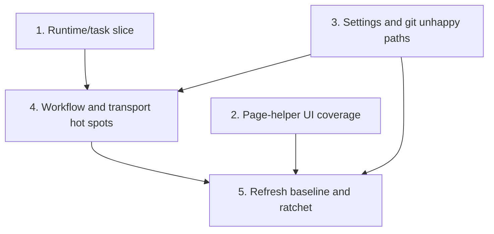

# Coverage Follow-up Plan

Second-pass coverage uplift plan for the remaining runtime, UI, settings, and workflow hotspots after the March 7, 2026 `cargo llvm-cov` refresh and ratchet landing.

## Priorities

## 1) Lock in a deterministic runtime/task coverage slice

### Why now

These files still have some of the lowest line coverage in the workspace, but they are already structured around deterministic helpers and event boundaries that can land as one reviewable slice.

### Usable outcome

`runtime/terminal`, `app/task`, and `runtime/event` gain the missing unhappy-path and branch coverage needed to validate the current harness approach before the plan expands into heavier modules.

- [x] Add failure-path tests around terminal setup/restore behavior in `crates/agentty/src/runtime/terminal.rs`, including raw-mode setup failure, alternate-screen setup failure, and cleanup-attempt restoration.
- [x] Expand `crates/agentty/src/app/task.rs` tests for version-check event emission, review-assist command failures, and output-detail formatting branches without relying on live network or subprocess behavior.
- [x] Add remaining branch tests in `crates/agentty/src/runtime/event.rs` for ignored events, paused-reader handling, and event-loop error exits.

Primary files:

- `crates/agentty/src/runtime/terminal.rs`
- `crates/agentty/src/app/task.rs`
- `crates/agentty/src/runtime/event.rs`

## 2) Land page-helper UI coverage without snapshot-heavy tests

### Why now

The biggest UI gaps are in pure helper logic and small page render branches, which can move coverage quickly without waiting on broader session-view or forge-flow work.

### Usable outcome

The overlay, project-list, and settings pages have deterministic branch coverage for their helper logic and footer/render edge cases without introducing brittle frame snapshots.

- [x] Add helper-focused tests for popup sizing, content width, and help-background fallback branches in `crates/agentty/src/ui/overlay.rs`.
- [x] Expand row/value/formatting coverage in `crates/agentty/src/ui/page/project_list.rs`, especially active-project markers, session count rendering, and footer/help text assembly.
- [x] Add page-local tests in `crates/agentty/src/ui/page/setting.rs` for footer mode switching and multiline row rendering; extract reusable helper logic first if assertions would otherwise stay too broad.

Ratchet note: No threshold change after priority 2 alone on March 10, 2026. Priority 5 still owns the next `.pre-commit-config.yaml` ratchet update after a refreshed workspace baseline.

Primary files:

- `crates/agentty/src/ui/overlay.rs`
- `crates/agentty/src/ui/page/project_list.rs`
- `crates/agentty/src/ui/page/setting.rs`

## 3) Tighten settings and git-orchestration unhappy paths

### Why now

Default-model persistence and git sync flows remain below the workspace baseline, yet they sit behind existing mockable boundaries and can land independently of the larger workflow-heavy follow-up.

### Usable outcome

Settings persistence and git sync/merge edge cases are covered behind deterministic boundaries, reducing regressions in user-visible configuration and repository-state flows.

- [ ] Add persistence fallback and row-edit lifecycle tests in `crates/agentty/src/app/setting.rs` for project overrides, legacy fallbacks, and open-command editing transitions.
- [ ] Add deterministic unhappy-path tests in `crates/agentty/src/infra/git/sync.rs`, `crates/agentty/src/infra/git/repo.rs`, and `crates/agentty/src/infra/git/merge.rs` for branch-state validation, already-present results, and command-detail error reporting.
- [ ] Keep multi-command git flows behind existing mockable boundaries and only introduce new boundaries when one test still requires multiple real subprocess calls.

Primary files:

- `crates/agentty/src/app/setting.rs`
- `crates/agentty/src/infra/git/sync.rs`
- `crates/agentty/src/infra/git/repo.rs`
- `crates/agentty/src/infra/git/merge.rs`

## 4) Finish the remaining workflow and transport hot spots

### Why now

After the smaller slices land, the highest uncovered totals concentrate in workflow-heavy modules that should be reviewed after the shared runtime and git test seams are already proven.

### Usable outcome

The remaining merge, app-server, prompt, and session-view hotspots only retain genuinely hard-to-reach branches, making the next baseline and ratchet increase credible.

- [ ] Add remaining no-progress, cleanup-failure, and retry-exhaustion tests in `crates/agentty/src/app/session/workflow/merge.rs`.
- [ ] Expand `crates/agentty/src/infra/codex_app_server.rs` coverage for restart, resume, timeout, and compaction branches using transport fixtures instead of live subprocesses.
- [ ] Add residual branch tests in `crates/agentty/src/runtime/mode/prompt.rs` and `crates/agentty/src/runtime/mode/session_view.rs` for stale selections, empty states, and status-gated actions still left uncovered.

Primary files:

- `crates/agentty/src/app/session/workflow/merge.rs`
- `crates/agentty/src/infra/codex_app_server.rs`
- `crates/agentty/src/runtime/mode/prompt.rs`
- `crates/agentty/src/runtime/mode/session_view.rs`

## 5) Refresh the baseline and ratchet again

### Why now

The current ratchet only protects the first improved baseline; a second pass should convert the landed follow-up slices into a stronger enforced floor.

### Usable outcome

The plan snapshot, ratchet thresholds, and any contributor guidance all reflect the new post-follow-up baseline instead of the first-pass numbers.

- [ ] Re-run `cargo llvm-cov --workspace --json --summary-only` after priorities 1 through 4 land and refresh this snapshot table with the new metrics.
- [ ] Raise `--fail-under-lines` and `--fail-under-functions` in `.pre-commit-config.yaml` only after the refreshed baseline remains stable across the full suite.
- [ ] Update `CONTRIBUTING.md` only if the contributor workflow changes again while raising the ratchet.

Primary files:

- `.pre-commit-config.yaml`
- `CONTRIBUTING.md`
- `docs/plan/coverage_follow_up.md`

## Cross-Plan Notes

- `docs/plan/continue_in_progress_sessions_after_exit.md` owns detached-session behavior in overlapping runner files; this plan should stay limited to tests or narrow testability refactors there.
- `docs/plan/forge_review_request_support.md` owns active review-request behavior in `crates/agentty/src/app/task.rs` and `crates/agentty/src/runtime/mode/session_view.rs`; coverage work here should follow that behavior rather than redefine it.
- If another active plan conflicts with this plan and the correct resolution is not explicit, stop and ask the user which plan should control the work.

## Status Maintenance Rule

- After implementing any step in this plan, immediately update its checklist status, refresh any affected snapshot rows, and record whether the coverage ratchet threshold should move.
- When a step changes contributor guidance or enforced thresholds, update the corresponding documentation in that same step before marking it complete.

## Current State Snapshot

Baseline captured on March 7, 2026 from `cargo llvm-cov --workspace --json --summary-only`.

| Area | Current state in codebase | Status |
|------|---------------------------|--------|
| Workspace baseline | Workspace coverage is 87.57% lines (`36614/41813`) and 85.30% functions (`4137/4850`). | Baseline captured |
| Runtime/editor boundaries | `runtime/terminal`, `app/task`, and `runtime/event` already have the first-pass deterministic branch coverage this plan depends on. | Complete |
| UI overlay and page helpers | `ui/overlay.rs`, `ui/page/project_list.rs`, and `ui/page/setting.rs` now have focused helper and render-branch coverage for popup sizing, footer assembly, and multiline row behavior; full baseline impact still rolls into the next `cargo llvm-cov` refresh. | Complete |
| Workflow hot spots after first pass | `workflow/merge.rs`, `infra/codex_app_server.rs`, `runtime/mode/prompt.rs`, and `runtime/mode/session_view.rs` still hold the largest remaining uncovered branch totals. | Partial |
| Settings and git orchestration | Settings persistence plus git sync, repo, and merge flows still sit below the workspace baseline. | Partial |
| Coverage ratchet | `.pre-commit-config.yaml` already enforces the current 87/85 coverage floor, with no threshold change after the March 8, 2026 update. | Healthy |

## Implementation Approach

- Start with one deterministic runtime/task slice that raises coverage in the weakest non-UI modules and establishes any reusable test helpers needed later.
- Run UI-helper and settings/git unhappy-path work as independent follow-up slices because they touch separate validation paths and can land without waiting on workflow-heavy modules.
- Tackle the larger workflow and transport hotspots only after the smaller slices land so the remaining uncovered branches are narrower and the final ratchet update is based on a stable merged baseline.

## Suggested Execution Order

1. Start with `Lock in a deterministic runtime/task coverage slice`; it is the smallest non-UI iteration that can raise coverage immediately and establish reusable harness patterns.
1. Run `Land page-helper UI coverage without snapshot-heavy tests` in parallel with priority 1 because it stays inside pure UI helpers and page-local rendering branches.
1. Run `Tighten settings and git-orchestration unhappy paths` in parallel with priorities 1 and 2 because it stays in separate settings/git modules with deterministic test boundaries.
1. Start `Finish the remaining workflow and transport hot spots` only after priorities 1 and 3 are merged so the larger workflow diff can reuse the proven runtime and git test seams and avoid conflicting with active feature-plan behavior changes.
1. Run `Refresh the baseline and ratchet again` only after priorities 2 through 4 are complete, then raise thresholds only if the refreshed baseline is stable across the full suite.

## Out of Scope for This Pass

- Adding live-network or credential-dependent coverage for real provider integrations.
- Replacing the existing coverage ratchet with a different automation system.
- Folding product-behavior work from `docs/plan/continue_in_progress_sessions_after_exit.md` or `docs/plan/forge_review_request_support.md` into this coverage-only follow-up.
