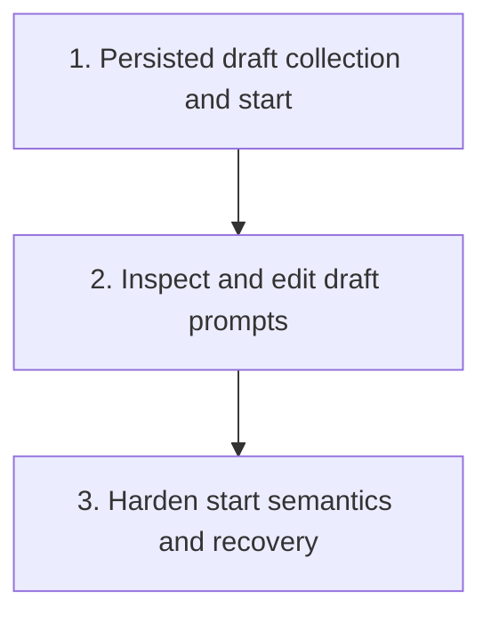

# Draft Session Prompt Collection Plan

Plan for extending `crates/agentty/src/app`, `crates/agentty/src/runtime`, `crates/agentty/src/ui`, and `crates/agentty/src/infra` so a draft session can accumulate multiple user prompts before its first real agent turn starts.

## Steps

## 1) Ship persisted draft sessions with explicit prompt collection and start

### Why now

The first slice should deliver the core workflow end to end: a user needs to be able to create a draft, collect more than one prompt, leave and reopen it, and then start the session intentionally.

### Usable outcome

A user can create a draft session, save several draft prompts in order, reopen the draft later, and start one real session turn that includes the collected prompts instead of launching immediately on the first `Enter`.

### Substeps

- [ ] **Replace the blank-session lifecycle with a draft-session baseline.** Rename the current `Status::New` path to `Status::Draft` across `crates/agentty/src/domain/session.rs`, `crates/agentty/src/app/session/workflow/lifecycle.rs`, `crates/agentty/src/app/session/workflow/load.rs`, and the related UI style/rendering modules so the code and docs describe the pre-start state consistently.
- [ ] **Persist ordered draft prompts.** Add a new migration in `crates/agentty/migrations/` creating a singular `session_draft_prompt` table with ordered prompt rows, attachment payload storage, timestamps, and `session_id` ownership so draft prompts survive reloads and can be queried independently of `session.output`.
- [ ] **Load and save draft prompts through the app layer.** Extend `crates/agentty/src/infra/db.rs`, `crates/agentty/src/app/session/workflow/load.rs`, and `crates/agentty/src/app/session/workflow/lifecycle.rs` with typed draft-prompt reads and writes so a draft session can append prompt items before the first turn and still keep `session.prompt` reserved for the started session's actual first-turn payload.
- [ ] **Add explicit draft collection and start controls in prompt mode.** Update `crates/agentty/src/runtime/mode/prompt.rs` and `crates/agentty/src/ui/state/prompt.rs` so draft sessions save the current composer contents as one draft prompt on `Enter`, support a new `/start` slash command that starts from the collected queue, and keep unsaved composer text separate from persisted draft entries.
- [ ] **Start the first turn from the collected draft queue.** Update `crates/agentty/src/app/core.rs` and `crates/agentty/src/app/session/workflow/lifecycle.rs` so starting a draft session builds one ordered opening `TurnPrompt` from the saved draft prompts, persists the final started-session `prompt` and title, and transitions the session from `Draft` to `InProgress`.

### Tests

- [ ] Add database and load tests covering draft-prompt persistence, draft-session reload, and the `Draft` status rename.
- [ ] Add prompt-mode and lifecycle tests covering draft prompt append, `/start`, empty-draft rejection, and the `Draft` to `InProgress` transition.

### Docs

- [ ] Update `docs/site/content/docs/usage/workflow.md` and `docs/site/content/docs/usage/keybindings.md` with the `Draft` status, draft prompt collection behavior, and `/start` shortcut.

## 2) Make collected draft prompts inspectable and editable before start

### Why now

Once draft collection works, users need a way to review and curate what they already stored instead of treating the queue as write-only state.

### Usable outcome

A user can reopen a draft session, inspect saved draft prompts in order, edit a saved prompt back into the composer, remove prompts they no longer want, and reorder prompts before starting the session.

### Substeps

- [ ] **Render saved draft prompts distinctly from started-session transcript output.** Update `crates/agentty/src/ui/page/session_chat.rs`, `crates/agentty/src/ui/component/session_output.rs`, and any session-list summary code that depends on the first prompt so draft sessions show collected prompt items as draft content instead of pretending they are already normal transcript output.
- [ ] **Add draft-prompt selection and edit actions.** Extend `crates/agentty/src/runtime/mode/session_view.rs`, `crates/agentty/src/runtime/mode/list.rs`, and `crates/agentty/src/ui/state/app_mode.rs` with the view state and key handling needed to select one saved draft prompt, open it in the existing composer for editing, and write the edited result back through `crates/agentty/src/app/session/workflow/lifecycle.rs`.
- [ ] **Support delete and reorder flows for draft prompts.** Add the database mutations and app-layer orchestration in `crates/agentty/src/infra/db.rs` and `crates/agentty/src/app/session/workflow/lifecycle.rs` so draft prompts can be deleted and re-positioned deterministically before the session starts.
- [ ] **Keep attachment lifecycle aligned with draft edits.** Ensure `crates/agentty/src/runtime/mode/prompt.rs`, `crates/agentty/src/ui/state/prompt.rs`, and draft-prompt persistence clean up or retain pasted image files correctly when a draft prompt is replaced, deleted, or moved.

### Tests

- [ ] Add key-handler and session-view tests covering draft prompt selection, edit, delete, and reorder behavior.
- [ ] Add attachment-focused tests proving draft prompt edits do not leak stale placeholder state or temp image files.

### Docs

- [ ] Update `docs/site/content/docs/usage/workflow.md` and `docs/site/content/docs/usage/keybindings.md` with the draft-prompt inspection, edit, delete, and reorder controls.

## 3) Harden draft start semantics, recovery, and architecture boundaries

### Why now

After the draft workflow is usable, the main remaining risk is turning a curated draft queue into one first turn without duplicate starts, partial persistence, or restart-only edge cases.

### Usable outcome

Starting a draft session is atomic and restart-safe: the collected prompt queue is consumed exactly once, question/reply flows ignore draft-only state after start, and session recovery never replays or loses queued draft prompts.

### Substeps

- [ ] **Make draft-start consumption atomic.** Add the transaction shape in `crates/agentty/src/infra/db.rs` and `crates/agentty/src/app/session/workflow/lifecycle.rs` that consumes ordered `session_draft_prompt` rows, persists the started-session prompt/title/status, and enqueues the first operation together so a failed start cannot duplicate or partially consume the draft queue.
- [ ] **Centralize first-turn prompt rendering from draft items.** Add a dedicated helper in `crates/agentty/src/app/session/workflow/lifecycle.rs` or a new focused helper module that renders ordered draft prompts into the initial `TurnPrompt` with stable separators and attachment ordering instead of ad-hoc string concatenation.
- [ ] **Keep reload and post-start flows draft-safe.** Update `crates/agentty/src/app/session/workflow/load.rs`, `crates/agentty/src/app/session/workflow/refresh.rs`, and the relevant prompt/question handlers so started sessions no longer consult draft-only rows, while deleted or canceled draft sessions still clean up their remaining persisted prompt items and attachment files.
- [ ] **Align start-time persistence with detached-turn work.** Coordinate any shared `session_operation` or startup-recovery changes in `crates/agentty/src/app/core.rs` and `crates/agentty/src/app/session/workflow/worker.rs` so this draft-start path composes cleanly with the detached-session plan instead of introducing a second first-turn enqueue shape.

### Tests

- [ ] Add transaction and recovery tests covering start failure rollback, reopen-before-start, reopen-after-start, and one-time consumption of draft prompts.
- [ ] Add regression tests proving question, reply, delete, and cancel flows no longer read draft-only state after the session has started.

### Docs

- [ ] Update `docs/site/content/docs/architecture/runtime-flow.md`, `docs/site/content/docs/architecture/testability-boundaries.md`, and `docs/site/content/docs/architecture/module-map.md` if draft-start orchestration introduces a new persistence or rendering boundary.
- [ ] Refresh `docs/site/content/docs/usage/workflow.md` if the final start-time wording or recovery behavior differs from the earlier draft-session slices.

## Cross-Plan Notes

- `docs/plan/continue_in_progress_sessions_after_exit.md` also changes first-turn enqueue and `session_operation` ownership. This draft-session plan owns pre-start draft persistence and prompt consumption, while the detached-session plan owns what happens after the first operation is enqueued.
- `docs/plan/end_to_end_test_structure.md` may eventually provide a higher-level scenario harness for this feature, but draft-session behavior and acceptance criteria stay in this plan.
- If another active plan conflicts with this plan and the correct resolution is not explicit, stop and ask the user which plan should control the work.

## Status Maintenance Rule

- After implementing any step in this plan, immediately update its checklist status in this document and refresh any current-state snapshot rows that changed.
- When a step changes behavior, complete its `### Tests` and `### Docs` work in that same step before marking it complete.
- When the full draft-session workflow is shipped, remove this plan file and move any remaining follow-up work into a new plan.

## Current State Snapshot

| Area | Current state in codebase | Status |
|------|---------------------------|--------|
| Pre-start lifecycle | `create_session()` still creates a blank `New` session and the first non-empty prompt immediately becomes the started session. | Not Started |
| Draft prompt persistence | The database persists one `session.prompt` string and session transcript fields, but it has no ordered draft-prompt rows or draft attachment storage. | Not Started |
| Prompt-mode controls | `crates/agentty/src/runtime/mode/prompt.rs` starts a new session on first submit and only exposes `/model` and `/stats` slash commands. | Not Started |
| Draft review and editing | Session view can show output, reply, diff, and review actions, but it cannot inspect or mutate a pre-start prompt queue. | Not Started |
| Recovery and validation | Tests and reload behavior only cover the single-initial-prompt workflow, so draft consumption and restart semantics are currently unverified. | Not Started |

## Design Decisions

### Draft anchor

Reuse the existing pre-start session concept as the draft-session anchor, but rename the status and behavior from `New` to `Draft` so the user-facing lifecycle matches the new workflow.

### Draft-prompt persistence

Store collected prompt items as ordered persisted rows instead of flattening them into `session.output` or a single JSON blob on `session`. That keeps editing, reordering, reload, and attachment cleanup explicit and testable.

### Start-time prompt shape

Start the first real turn from one deterministic prompt assembled from the ordered draft queue. Do not try to simulate provider-side multi-turn history before the session has actually started.

## Implementation Approach

- Land the smallest usable slice first: persisted draft collection plus an explicit start action that already survives reopen.
- Keep draft storage normalized and separate from live transcript storage so draft-only behavior can be removed cleanly after start.
- Extend the existing prompt/session-view flow in place where practical instead of introducing a second top-level session entity.
- Fold user-facing docs and regression coverage into each behavior slice instead of saving them for a final cleanup pass.

## Suggested Execution Order

1. Start with `1) Ship persisted draft sessions with explicit prompt collection and start`; it is the smallest slice that makes draft sessions real and usable.
1. Start `2) Make collected draft prompts inspectable and editable before start` only after step 1 lands, because edit and reorder flows depend on persisted draft rows and draft-specific rendering already existing.
1. Start `3) Harden draft start semantics, recovery, and architecture boundaries` only after steps 1 and 2 land, because the atomic start path should stabilize around the final user-facing draft workflow.
1. No top-level steps are safe to run in parallel right now because they all share the same session lifecycle, prompt-mode state, and draft-persistence paths.

## Out of Scope for This Pass

- Cross-session prompt libraries or reusable prompt templates.
- Simulating provider-native multi-turn history before the first real session turn starts.
- Shared drafts that can be attached to multiple sessions at once.
