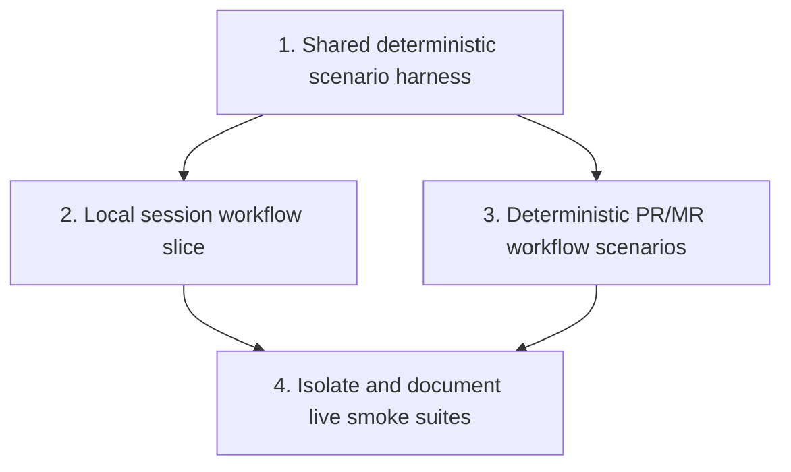

# End-to-End Test Structure Plan

Plan for organizing `crates/agentty/tests/`, selected source-level tests, and contributor guidance so Agentty keeps a small, trustworthy end-to-end smoke layer around git, forge, and live agent workflows.

## Cross-Plan Notes

- `docs/plan/coverage_follow_up.md` may add tests in some of the same modules, but it does not own the suite layout, harness shape, or execution tiers for end-to-end coverage.
- `docs/plan/forge_review_request_support.md` owns review-request product behavior; this plan only owns how PR/MR workflows are exercised and categorized in tests.
- If another active plan conflicts with this plan and the correct resolution is not explicit, stop and ask the user which plan should control the work.

## Status Maintenance Rule

- After implementing any step in this plan, immediately update its checklist status in this document and refresh any snapshot rows that changed.
- When a step changes contributor workflow, test commands, or documentation, update the corresponding docs in that same step before marking it complete.

## Current State Snapshot

| Area | Current state in codebase | Status |
|------|---------------------------|--------|
| Live provider smoke coverage | `crates/agentty/tests/protocol_compliance_e2e.rs` runs real ignored Codex, Gemini, and Claude protocol checks through `create_agent_channel()`. | Partial |
| Real local git coverage | `crates/agentty/src/infra/git/client.rs` already exercises temp-repo and linked-worktree behavior with real `git` commands. | Healthy |
| Workflow orchestration coverage | `crates/agentty/src/app/session/workflow/lifecycle.rs`, `refresh.rs`, and `merge.rs` cover multi-step session flows mainly through `mockall` boundaries. | Healthy |
| Forge and agent scenario harness | No shared crate-level harness currently composes temp repos, fake CLIs, scripted outputs, and app-level assertions into reusable user-journey tests. | Not started |
| Contributor guidance | Repository docs describe quality gates and trait boundaries, but they do not yet define a clear tiered strategy for deterministic local end-to-end tests versus live smoke suites. | Not started |

## Implementation Approach

- Keep the default suite deterministic: real local git plus fake agent and forge CLIs should cover the main user journeys without requiring credentials or network access.
- Preserve a thin live smoke layer for real provider and forge integrations, but isolate it clearly so failures are easy to attribute and the default `cargo test` path stays stable.
- Start with one reusable harness slice that can already validate a full session journey in a disposable repo, then extend it to review-request and live-smoke organization instead of building harness-only groundwork with no user-visible payoff.
- Update contributor guidance in the same iteration as any new suite layout or execution command so the structure is usable immediately after landing.

## Updated Priorities

## 1) Establish a shared deterministic scenario harness

**Why now:** The current suite has strong low-level coverage but no reusable integration harness for app-level user journeys, so each higher-level test would otherwise reinvent temp repo and fake CLI setup.
**Usable outcome:**
One shared harness can create disposable repos, install scripted fake agent and forge binaries on `PATH`, boot the app-facing workflow entrypoints, and assert transcript, status, and persisted side effects.

- [ ] Add a `crates/agentty/tests/support/` harness module that creates isolated repo fixtures, temp `AGENTTY_ROOT` state, and reusable session setup helpers.
- [ ] Add fake CLI support for agent and forge commands so integration tests can script stdout, stderr, exit status, and captured arguments without network or real credentials.
- [ ] Add shared assertions for user-visible outcomes such as session status, saved review-request metadata, commit creation, diff visibility, and worktree cleanup.

Primary files:

- `crates/agentty/tests/support/harness.rs`
- `crates/agentty/tests/support/fake_cli.rs`
- `crates/agentty/tests/support/assert.rs`

## 2) Land one local end-to-end session workflow slice

**Why now:** The first working slice should prove the harness by covering a real user journey end to end rather than stopping at test infrastructure.
**Usable outcome:**
A deterministic test verifies that starting a session inside a git repo creates the worktree, runs a scripted agent turn, persists transcript output, auto-commits changes, and moves the session into `Review`.

- [ ] Add a local scenario test that drives one session workflow through the app-facing boundary using a temp git repo and a scripted fake agent CLI.
- [ ] Assert the resulting branch, worktree, commit, session status, and transcript output from a user-observable perspective instead of internal call counts.
- [ ] Fold any small boundary refactors needed for testability into this slice, keeping multi-command flows behind explicit traits rather than adding shell-heavy test-only helpers.

Primary files:

- `crates/agentty/tests/local_session_workflow.rs`
- `crates/agentty/src/app/session/workflow/task.rs`
- `crates/agentty/src/app/session/workflow/worker.rs`

## 3) Add deterministic PR/MR workflow scenarios on top of the harness

**Why now:** Review-request flows are one of the main user journeys the harness needs to prove, and they can extend the same temp-repo and fake-CLI setup established in priorities 1 and 2.
**Usable outcome:**
Deterministic tests cover publish, existing-link reuse, create-on-miss, refresh-after-cleanup, and actionable forge CLI failures without depending on live `gh` or `glab` authentication.

- [ ] Add local GitHub and GitLab scenario tests that script fake forge CLIs and assert persisted PR/MR metadata from the session workflow boundary.
- [ ] Cover both create and reuse paths, plus refresh behavior for terminal sessions after worktree cleanup, using scenario assertions rather than duplicating lower-level adapter expectations.
- [ ] Keep source-level mock-based tests for edge sequencing, but move the highest-value user journeys into crate-level local scenarios so regressions show up at the behavior layer.

Primary files:

- `crates/agentty/tests/local_review_request_workflow.rs`
- `crates/agentty/src/app/session/workflow/lifecycle.rs`
- `crates/agentty/src/app/session/workflow/refresh.rs`

## 4) Isolate and document live smoke suites

**Why now:** Once deterministic coverage exists for the main journeys, the live tests can shrink to a clear smoke layer instead of carrying broad behavioral responsibility.
**Usable outcome:**
Real provider and forge smoke tests are clearly named, ignored by default, and documented with their prerequisites and intended failure domain.

- [ ] Rename or reorganize `crates/agentty/tests/protocol_compliance_e2e.rs` into an explicit live-smoke naming pattern and add a matching live forge smoke file if needed.
- [ ] Document the suite tiers and recommended commands in `CONTRIBUTING.md`, clarifying which tests run by default and which require credentials or network access.
- [ ] Update `docs/site/content/docs/architecture/testability-boundaries.md` only if new harness-facing trait boundaries are introduced while landing the deterministic scenarios.

Primary files:

- `crates/agentty/tests/live_provider_protocol.rs`
- `crates/agentty/tests/live_forge_review_request.rs`
- `CONTRIBUTING.md`
- `docs/site/content/docs/architecture/testability-boundaries.md`

## Suggested Execution Order

1. Start with `Establish a shared deterministic scenario harness`; it is the minimum reusable base for all higher-level user-journey tests.
1. Start `Land one local end-to-end session workflow slice` immediately after the harness skeleton is usable so the first iteration proves end-to-end value instead of staying infrastructure-only.
1. Run `Add deterministic PR/MR workflow scenarios on top of the harness` after priority 1 and in parallel with the tail of priority 2 once the shared fixtures and fake CLI support are stable.
1. Start `Isolate and document live smoke suites` only after priorities 2 and 3 land so the live layer reflects the final deterministic baseline and documented commands stay accurate.

## Out of Scope for This Pass

- Full terminal-frame snapshot automation for every keybinding and screen transition in the Ratatui UI.
- Replacing existing unit or mock-based workflow tests with slower scenario tests when the lower-level coverage already owns the behavior well.
- Adding a large live matrix across every provider, model, forge, and authentication state beyond a thin smoke layer.
