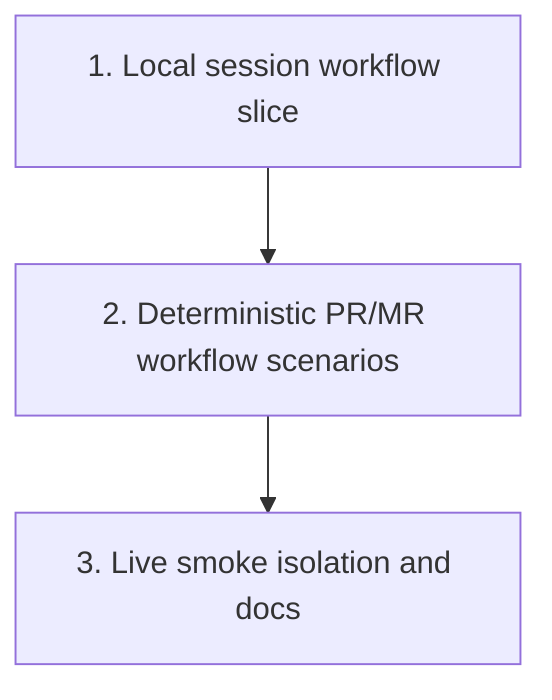

# End-to-End Test Structure Plan

Plan for organizing `crates/agentty/tests/`, selected source-level tests, and contributor guidance so Agentty keeps a small, trustworthy end-to-end smoke layer around git, forge, and live agent workflows.

## Steps

## 1) Ship one deterministic local session workflow slice

### Why now

The first slice needs to prove end-to-end value, not just infrastructure, because the repository currently lacks any app-level scenario that exercises a full local session journey through the user-facing workflow boundary.

### Usable outcome

A deterministic scenario test can create a disposable repo, run a scripted local agent turn through the app-facing workflow, and assert the resulting worktree, commit, transcript output, and terminal session state.

### Substeps

- [ ] **Add the minimal local-session harness.** Add the minimal `crates/agentty/tests/support/` harness needed for one full local session journey, centered on `crates/agentty/tests/support/harness.rs`, `crates/agentty/tests/support/fake_cli.rs`, and `crates/agentty/tests/support/assert.rs`.
- [ ] **Add one deterministic local session workflow scenario.** Add `crates/agentty/tests/local_session_workflow.rs` to drive one session workflow through the app-facing boundary using a temp git repo and a scripted fake agent CLI.
- [ ] **Refactor workflow boundaries only where the scenario needs them.** Fold any small boundary refactors needed in `crates/agentty/src/app/session/workflow/task.rs` and `crates/agentty/src/app/session/workflow/worker.rs` into this slice, keeping multi-command flows behind explicit traits instead of shell-heavy test-only helpers.

### Tests

- [ ] Run the new `crates/agentty/tests/local_session_workflow.rs` scenario and the touched workflow-module tests to confirm the harness covers the full local session path without live credentials.

### Docs

- [ ] Update `CONTRIBUTING.md` with the deterministic local-session scenario command and the expectation that fake CLIs, not live services, cover the default app-level workflow path.

## 2) Expand the harness for deterministic PR/MR workflow scenarios

### Why now

Once one local session journey is stable, the next high-value extension is review-request behavior, which reuses the same disposable repo and scripted CLI foundations.

### Usable outcome

Deterministic local scenarios cover publish, existing-link reuse, create-on-miss, refresh-after-cleanup, and actionable forge CLI failures without relying on live `gh` or `glab` authentication.

### Substeps

- [ ] **Extend the harness for review-request scripting.** Extend `crates/agentty/tests/support/fake_cli.rs` and `crates/agentty/tests/support/assert.rs` so review-request scenarios can script forge responses and assert persisted PR/MR metadata from the session workflow boundary.
- [ ] **Add deterministic GitHub and GitLab review-request scenarios.** Add local GitHub and GitLab scenario coverage in `crates/agentty/tests/local_review_request_workflow.rs` for create, reuse, refresh-after-cleanup, and actionable CLI failure paths.
- [ ] **Keep edge sequencing in source-level workflow tests.** Keep source-level mock-based tests for edge sequencing in `crates/agentty/src/app/session/workflow/lifecycle.rs`, but move the highest-value review-request journeys into the crate-level deterministic scenarios.

### Tests

- [ ] Run the new review-request scenario coverage plus the touched workflow tests so the deterministic PR/MR layer stays stable on the default local test path.

### Docs

- [ ] Update `CONTRIBUTING.md` and `docs/site/content/docs/architecture/testability-boundaries.md` if the expanded harness adds or changes trait boundaries needed to keep multi-command flows mockable.

## 3) Isolate live smoke suites and finalize suite guidance

### Why now

After deterministic local coverage owns the main user journeys, the remaining work is to reduce live tests to a clearly scoped smoke layer with accurate contributor guidance.

### Usable outcome

Real provider and forge smoke suites are clearly named, ignored by default, and documented with their prerequisites and intended failure domain.

### Substeps

- [ ] **Rename live provider coverage into explicit smoke files.** Rename or reorganize `crates/agentty/tests/protocol_compliance_e2e.rs` into an explicit live-smoke naming pattern at `crates/agentty/tests/live_provider_protocol.rs` and add a matching live forge smoke file at `crates/agentty/tests/live_forge_review_request.rs` if needed.
- [ ] **Keep live smoke coverage thin and purpose-specific.** Keep the live smoke files thin and purpose-specific so failures point at provider or forge integration health rather than deterministic workflow ownership.

### Tests

- [ ] Run the default `cargo test` path plus compile-only or appropriately ignored coverage for the renamed live smoke files so the suite layout change does not break contributor workflows.

### Docs

- [ ] Document the deterministic-versus-live suite tiers and recommended commands in `CONTRIBUTING.md`, clarifying which tests run by default and which require credentials or network access.

## Cross-Plan Notes

- `docs/plan/coverage_follow_up.md` may add tests in some of the same modules, but it does not own the suite layout, harness shape, or execution tiers for end-to-end coverage.
- `docs/plan/forge_review_request_support.md` owns review-request product behavior; this plan only owns how PR/MR workflows are exercised and categorized in tests.
- If another active plan conflicts with this plan and the correct resolution is not explicit, stop and ask the user which plan should control the work.

## Status Maintenance Rule

- After implementing any step in this plan, immediately update its checklist status in this document and refresh any snapshot rows that changed.
- When a step changes contributor workflow, test commands, or documentation, complete its `### Tests` and `### Docs` work in that same step before marking it complete.

## Current State Snapshot

| Area | Current state in codebase | Status |
|------|---------------------------|--------|
| Live provider smoke coverage | `crates/agentty/tests/protocol_compliance_e2e.rs` runs real ignored Codex, Gemini, and Claude protocol checks through `create_agent_channel()`. | Partial |
| Real local git coverage | `crates/agentty/src/infra/git/client.rs` already exercises temp-repo and linked-worktree behavior with real `git` commands. | Healthy |
| Workflow orchestration coverage | `crates/agentty/src/app/session/workflow/lifecycle.rs`, `refresh.rs`, and `merge.rs` cover multi-step session flows mainly through `mockall` boundaries. | Healthy |
| Forge and agent scenario harness | No shared crate-level harness currently composes temp repos, fake CLIs, scripted outputs, and app-level assertions into reusable user-journey tests. | Not started |
| Contributor guidance | Repository docs describe quality gates and trait boundaries, but they do not yet define a clear tiered strategy for deterministic local end-to-end tests versus live smoke suites. | Not started |

## Implementation Approach

- Keep the default suite deterministic: real local git plus fake agent and forge CLIs should cover the main user journeys without requiring credentials or network access.
- Preserve a thin live smoke layer for real provider and forge integrations, but isolate it clearly so failures are easy to attribute and the default `cargo test` path stays stable.
- Start with the smallest usable slice: one deterministic local session journey that lands only the harness pieces needed for that user-visible path.
- Extend the harness to review-request scenarios only after the first local session flow is stable so later slices build on a working baseline instead of a harness-only checkpoint.
- Update contributor guidance in the same iteration as any new suite layout or execution command so the structure is usable immediately after landing.

## Suggested Execution Order

1. Start with `1) Ship one deterministic local session workflow slice` so the first iteration already proves an end-to-end user journey instead of stopping at harness scaffolding.
1. Start `2) Expand the harness for deterministic PR/MR workflow scenarios` only after step 1 lands, because the review-request slice should reuse the already-working local session baseline.
1. Start `3) Isolate live smoke suites and finalize suite guidance` only after step 2 lands so the live layer and contributor docs reflect the final deterministic suite ownership.

## Out of Scope for This Pass

- Full terminal-frame snapshot automation for every keybinding and screen transition in the Ratatui UI.
- Replacing existing unit or mock-based workflow tests with slower scenario tests when the lower-level coverage already owns the behavior well.
- Adding a large live matrix across every provider, model, forge, and authentication state beyond a thin smoke layer.
