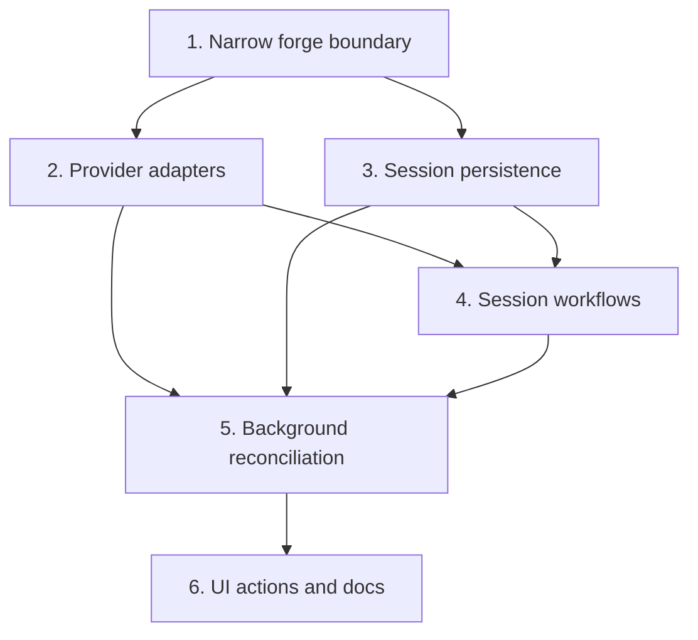

# Forge Review Request Support Plan

Plan for extending `crates/agentty/src/app`, `crates/agentty/src/infra`, and `crates/agentty/src/ui` so review-ready sessions can publish and track forge review requests across GitHub pull requests and GitLab merge requests.

## Status Maintenance Rule

- After implementing any step in this plan, immediately update its status in this document.

## Current State Snapshot

| Area | Current state in codebase | Status |
|------|---------------------------|--------|
| Session lifecycle and review actions | `crates/agentty/src/domain/session.rs`, `crates/agentty/src/runtime/mode/session_view.rs`, and `crates/agentty/src/ui/state/help_action.rs` already expose reply, diff, focused-review, rebase, and merge-queue flows for `Review` sessions. | Healthy |
| Git remote and push foundations | `crates/agentty/src/infra/git/client.rs` exposes `repo_url()` and `push_current_branch()`, `crates/agentty/src/infra/git/repo.rs` normalizes GitHub remotes to HTTPS, and `crates/agentty/src/app/core.rs` already shows actionable push-auth guidance. | Partial |
| Forge CLI foundations | `crates/agentty/src/infra/forge.rs` and `crates/agentty/src/infra/forge/` now provide a dedicated review-request client boundary plus a mockable forge CLI runner for `gh` and `glab` operations. | Healthy |
| Background polling infrastructure | `crates/agentty/src/app/task.rs` already runs periodic git-status and version-check jobs, and `crates/agentty/src/app/session/workflow/refresh.rs` performs low-frequency session metadata refresh, but nothing polls remote review-request state or auto-reconciles session statuses from merged or closed outcomes. | Partial |
| Forge-specific integrations | `crates/agentty/src/infra/forge/github.rs` and `crates/agentty/src/infra/forge/gitlab.rs` now implement create, find, and refresh adapter flows, but session persistence and UI wiring are still pending. | Partial |
| Session persistence model | `crates/agentty/src/infra/db.rs` and `crates/agentty/migrations/` persist session title, summary, questions, size, and provider conversation ids, but no forge review-request linkage or sync metadata. | Not started |
| User-facing docs | `docs/site/content/docs/usage/workflow.md` and `docs/site/content/docs/usage/keybindings.md` document merge, rebase, diff, and review flows only. | Not started |

## Updated Priorities

## 1) Define a narrow cross-forge review-request boundary

**Why now:** The app should depend on one small orchestration contract, not on GitHub- or GitLab-specific endpoint shapes leaking through session workflows.

- [x] Add a generic boundary such as `ReviewRequestClient` or `ForgeClient` under `crates/agentty/src/infra/` with only the core operations Agentty actually needs.
- [x] Keep the contract narrow: detect supported forge, find an existing review request by source branch, create one, refresh summary state, and produce an openable web URL.
- [x] Add concrete adapters for GitHub pull requests and GitLab merge requests instead of a broad lowest-common-denominator abstraction over every provider feature.
- [x] Route GitHub operations through `gh` and GitLab operations through `glab` so authentication, host selection, and user-local CLI setup stay aligned with each forge's native tooling.
- [x] Fail fast for unsupported remotes and non-forge repositories with actionable session UI copy.
- [x] Add focused tests for forge detection and unsupported-remote handling so this boundary can land independently before any provider-specific API work.

Primary files:

- `crates/agentty/src/infra.rs`
- `crates/agentty/src/infra/forge.rs`
- `crates/agentty/src/infra/git/repo.rs`
- `crates/agentty/src/app/core.rs`

## 2) Design provider adapters around realistic API differences

**Why now:** GitHub and GitLab diverge on review metadata, approval models, and checks or pipelines, so the implementation plan needs explicit adapter boundaries before any persistence or UI work starts.

- [x] Implement a GitHub adapter around `gh` commands such as `gh pr create`, `gh pr view`, and `gh api`, reusing the existing `gh auth login` guidance for authentication failures.
- [x] Implement a GitLab adapter around `glab` commands such as `glab mr create`, `glab mr view`, and `glab api`, with explicit handling for both `gitlab.com` and self-hosted GitLab instances.
- [x] Keep provider-specific detail mapping inside each adapter and expose only a normalized review-request summary to the app layer.
- [x] Normalize missing-CLI, unauthenticated-CLI, and host-resolution failures into actionable messages that tell users whether they need `gh auth login`, `glab auth login`, or local CLI installation.
- [x] Store any unavoidable provider-specific extras in adapter-owned metadata rather than expanding the generic contract for one-off fields.
- [x] Add adapter-level tests for GitHub and GitLab request construction, response parsing, and provider-specific error mapping so this section can merge without UI or database changes.

Primary files:

- `crates/agentty/src/infra/forge.rs`
- `crates/agentty/src/infra/forge/github.rs`
- `crates/agentty/src/infra/forge/gitlab.rs`
- `crates/agentty/src/app/core.rs`

## 3) Persist forge review-request linkage on sessions

**Why now:** Session view, refresh, and post-rebase flows need durable review-request identity that works for both GitHub pull requests and GitLab merge requests.

- [ ] Add a migration for generic linkage fields on `session`, such as forge kind, display id, web URL, state, source branch, target branch, title, status summary, and last-refresh timestamp.
- [ ] Extend `crates/agentty/src/infra/db.rs::SessionRow`, session update helpers, and `crates/agentty/src/domain/session.rs::Session` to carry the new normalized metadata.
- [ ] Avoid GitHub-only naming such as `pull_request_number`; use generic names that can represent GitHub numbers and GitLab IIDs without ambiguity.
- [ ] Define lifecycle rules for linked review-request metadata when sessions are rebased, merged, canceled, or when the remote review request is already closed or merged.
- [ ] Add database and session-loading tests that prove the new metadata round-trips cleanly without any live forge integration.

Primary files:

- `crates/agentty/migrations/NNN_add_review_request_metadata_to_session.sql`
- `crates/agentty/src/infra/db.rs`
- `crates/agentty/src/domain/session.rs`
- `crates/agentty/src/app/session/workflow/load.rs`

## 4) Add session workflows for publish, create, refresh, and open

**Why now:** Once the generic boundary and persistence model exist, `SessionManager` needs a single review-request flow that delegates provider specifics to adapters and does not duplicate GitHub and GitLab orchestration logic.

- [ ] Add `SessionManager` helpers that push the session branch when needed, detect the forge from the remote, and either locate or create the session's review request.
- [ ] Reuse an existing linked review request when one is already stored, and fall back to source-branch lookup before creating a duplicate.
- [ ] Add a refresh path that reloads normalized state such as open or merged status, approvals or reviews summary, and checks or pipelines summary for the active session.
- [ ] Decide and document how `Done` sessions should present linked review-request state, and remove any alternate legacy branch of behavior.
- [ ] Cover publish, create, duplicate-detection, and refresh flows with mock-driven workflow tests that use the git and forge trait boundaries instead of live network calls.

Primary files:

- `crates/agentty/src/app/session/core.rs`
- `crates/agentty/src/app/session/workflow/lifecycle.rs`
- `crates/agentty/src/app/session/workflow/merge.rs`
- `crates/agentty/src/app/session/workflow/refresh.rs`

## 5) Add background review-request status reconciliation

**Why now:** Once review requests can be created and refreshed on demand, Agentty still needs an automatic path to detect remote merges or closes and reconcile local session status without user intervention.

- [ ] Add an app-scoped background job that periodically checks linked review-request state for active sessions with forge metadata.
- [ ] Route poller results through `AppEvent` or an equivalent reducer-driven path instead of mutating session state directly inside the task.
- [ ] Reuse the `gh` and `glab` adapter refresh commands inside the poller instead of introducing a second direct network client for background reconciliation.
- [ ] Move a session to `Done` when the linked review request is merged and to `Canceled` when it is closed without merge, while preserving explicit local terminal states when no transition is needed.
- [ ] Define guardrails for polling cadence, unsupported or unauthenticated forge failures, and stale-session behavior so the poller stays low-noise and cheap.
- [ ] Add deterministic tests for poll scheduling, event reduction, and status-transition rules for merged, closed, reopened, and unavailable review-request states.

Primary files:

- `crates/agentty/src/app/task.rs`
- `crates/agentty/src/app/core.rs`
- `crates/agentty/src/app/session/workflow/refresh.rs`
- `crates/agentty/src/app/session/workflow/task.rs`
- `crates/agentty/src/domain/session.rs`

## 6) Add discoverable UI actions and docs sync

**Why now:** After the orchestration flow exists, the final user-facing step is to surface review-request actions and state without disrupting the existing review, diff, and merge workflows.

- [ ] Add one session-view action for create, open, or refresh review-request behavior based on the current forge and link state.
- [ ] Extend `AppMode`, help/footer projections, and view-mode key handling to show loading, success, and blocked states without leaving session context.
- [ ] Render normalized review-request metadata in session UI without displacing existing diff and focused-review behavior.
- [ ] Show actionable blocked states when `gh` or `glab` is missing or unauthenticated so users can fix local CLI setup from the same review flow.
- [ ] Document that merged review requests automatically move sessions to `Done` and closed review requests automatically move sessions to `Canceled` once the background reconciliation job observes the remote state change.
- [ ] Add UI-focused tests that keep the new action availability, footer/help text, and session rendering aligned with session status and linked review-request state.
- [ ] Update `docs/site/content/docs/usage/workflow.md`, `docs/site/content/docs/usage/keybindings.md`, `docs/site/content/docs/architecture/runtime-flow.md`, `docs/site/content/docs/architecture/testability-boundaries.md`, and `docs/site/content/docs/architecture/module-map.md` when the feature lands.

Primary files:

- `crates/agentty/src/runtime/mode/session_view.rs`
- `crates/agentty/src/ui/state/app_mode.rs`
- `crates/agentty/src/ui/state/help_action.rs`
- `crates/agentty/src/ui/page/session_chat.rs`
- `crates/agentty/src/infra/forge.rs`
- `docs/site/content/docs/usage/workflow.md`
- `docs/site/content/docs/usage/keybindings.md`
- `docs/site/content/docs/architecture/runtime-flow.md`
- `docs/site/content/docs/architecture/testability-boundaries.md`
- `docs/site/content/docs/architecture/module-map.md`

## Suggested Execution Order

1. Start with `1) Define a narrow cross-forge review-request boundary`; it is the prerequisite for both provider adapters and session persistence naming.
1. Run `2) Design provider adapters around realistic API differences` in parallel with `3) Persist forge review-request linkage on sessions` after `1)` is merged, because the adapter work and storage work validate independently.
1. Start `4) Add session workflows for publish, create, refresh, and open` only after `2)` and `3)` are merged, because workflow orchestration depends on both the forge client surface and persisted metadata.
1. Start `5) Add background review-request status reconciliation` only after `2)`, `3)`, and `4)` are merged, because the poller depends on stable forge refresh semantics, persisted linkage, and agreed session transition rules.
1. Start `6) Add discoverable UI actions and docs sync` only after `5)` is merged, because the user-facing docs and status affordances should describe the final automatic reconciliation behavior instead of an intermediate partial flow.

## Out of Scope for This Pass

- A repository-wide inbox for browsing arbitrary pull requests or merge requests independent of sessions.
- Inline review-comment authoring, draft review management, or one-click merge parity with forge web UIs.
- Support for forges beyond GitHub and GitLab.
- Background polling or webhook infrastructure beyond the existing session refresh cadence.
