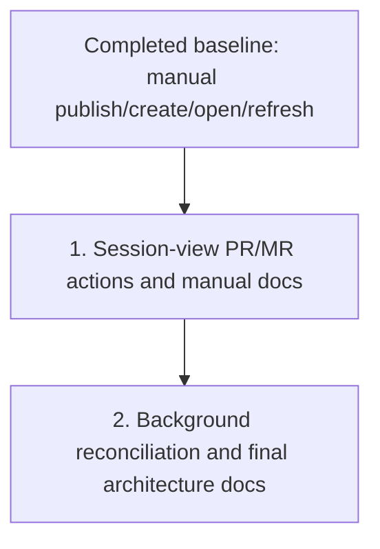

# Forge Review Request Support Plan

Plan for extending `crates/agentty/src/app`, `crates/agentty/src/infra`, and `crates/agentty/src/ui` so review-ready sessions can publish and track forge review requests across GitHub pull requests and GitLab merge requests.

## Cross-Plan Check Before Implementation

- `docs/plan/coverage_follow_up.md` only tracks coverage-ratchet follow-up work and does not overlap forge review-request sequencing, file ownership, or rollout assumptions.
- No other active plan in `docs/plan/` currently claims the remaining review-request poller, session-view action, or usage-doc work.

## Status Maintenance Rule

- After implementing any step in this plan, immediately update its status in this document.

## Current State Snapshot

| Area | Current state in codebase | Status |
|------|---------------------------|--------|
| Manual session review-request workflow | `crates/agentty/src/app/service.rs`, `crates/agentty/src/app/session/workflow/lifecycle.rs`, and `crates/agentty/src/app/session/workflow/refresh.rs` now wire `ReviewRequestClient` into publish, open, and refresh helpers that persist normalized PR/MR linkage and can refresh archived sessions from stored forge URLs after worktree cleanup. | Healthy |
| Forge adapters and persistence | `crates/agentty/src/infra/forge/github.rs`, `crates/agentty/src/infra/forge/gitlab.rs`, `crates/agentty/src/infra/db.rs`, and `crates/agentty/src/app/session/workflow/load.rs` cover normalized create/find/refresh behavior plus durable `session_review_request` loading. | Healthy |
| Background reconciliation | `crates/agentty/src/app/task.rs` still only runs git-status and version-check jobs, and no app event currently polls linked review requests or reconciles merged or closed remote outcomes back into session status. | Not started |
| Session view UI | `crates/agentty/src/runtime/mode/session_view.rs`, `crates/agentty/src/ui/state/help_action.rs`, and `crates/agentty/src/ui/page/session_chat.rs` now expose session-view review-request create/open/refresh actions, popup feedback, and inline PR/MR metadata without displacing diff or focused-review flows. | Healthy |
| Documentation coverage | `docs/site/content/docs/usage/workflow.md`, `docs/site/content/docs/usage/keybindings.md`, and `docs/site/content/docs/architecture/runtime-flow.md` now document the manual session-view review-request flow; automatic reconciliation docs are still pending step 2. | Partial |

## Implementation Approach

- Keep the already-landed manual review-request workflow as the working baseline: a review-ready session can publish its branch, link or create a review request, refresh stored metadata, and open the linked URL.
- Surface session-view actions and rendered metadata next so users can drive the manual workflow from the primary TUI without leaving session context.
- Keep the first UI slice compatible with explicit refresh; automatic reconciliation can land afterward as an extension of the visible workflow rather than a prerequisite for it.
- Update usage docs in the same iteration as the session-view action, then update architecture docs when the background reconciliation boundary and reducer flow are stable.

## Updated Priorities

The manual review-request workflow in `crates/agentty/src/app/session/workflow` and `crates/agentty/src/infra/forge` is already landed and remains the prerequisite baseline for the priorities below.

## 1) Ship Session-View PR/MR Actions and Manual Usage Docs

**Why now:** The baseline workflow already supports publish/create/open/refresh, so the next smallest user-visible iteration is surfacing that behavior in the main session view.
**Usable outcome:** A user can create a PR/MR when missing, open an existing PR/MR, and refresh linked metadata directly from session view with clear help/footer guidance and updated usage docs.

- [x] Add a session-view review-request action that creates a PR/MR when no link exists and otherwise opens or refreshes the linked review request based on state.
- [x] Extend `AppMode`, help/footer projections, and view-mode key handling to show loading, success, and blocked states without leaving session context.
- [x] Render normalized review-request metadata in session UI without displacing existing diff and focused-review behavior.
- [x] Show actionable blocked states when `gh` or `glab` is missing or unauthenticated so users can fix local CLI setup from the same review flow.
- [x] Add UI-focused tests that keep the new action availability, footer/help text, and session rendering aligned with session status and linked review-request state.
- [x] Update `docs/site/content/docs/usage/workflow.md` and `docs/site/content/docs/usage/keybindings.md` to document the manual session-view review-request flow and its local CLI prerequisites.

Primary files:

- `crates/agentty/src/runtime/mode/session_view.rs`
- `crates/agentty/src/ui/state/app_mode.rs`
- `crates/agentty/src/ui/state/help_action.rs`
- `crates/agentty/src/ui/page/session_chat.rs`
- `docs/site/content/docs/usage/workflow.md`
- `docs/site/content/docs/usage/keybindings.md`

## 2) Add Background Review-Request Status Reconciliation and Final Architecture Docs

**Why now:** Automatic status gathering should extend a workflow users can already trigger and inspect in session view, not precede it.
**Usable outcome:** Linked sessions automatically reconcile to `Done` or `Canceled` after the remote review request is observed as merged or closed, and architecture docs describe the final poller and reducer boundaries.

- [ ] Add an app-scoped background job that periodically checks linked review-request state for active sessions with forge metadata.
- [ ] Route poller results through `AppEvent` or an equivalent reducer-driven path instead of mutating session state directly inside the task.
- [ ] Reuse the `gh` and `glab` adapter refresh commands inside the poller instead of introducing a second direct network client for background reconciliation.
- [ ] Move a session to `Done` when the linked review request is merged and to `Canceled` when it is closed without merge, while preserving explicit local terminal states when no transition is needed.
- [ ] Define guardrails for polling cadence, unsupported or unauthenticated forge failures, and stale-session behavior so the poller stays low-noise and cheap.
- [ ] Add deterministic tests for poll scheduling, event reduction, and status-transition rules for merged, closed, reopened, and unavailable review-request states.
- [ ] Update `docs/site/content/docs/usage/workflow.md`, `docs/site/content/docs/architecture/runtime-flow.md`, `docs/site/content/docs/architecture/testability-boundaries.md`, and `docs/site/content/docs/architecture/module-map.md` to describe the automatic reconciliation behavior and its new runtime boundary.

Primary files:

- `crates/agentty/src/app/task.rs`
- `crates/agentty/src/app/core.rs`
- `crates/agentty/src/app/session/workflow/refresh.rs`
- `crates/agentty/src/app/session/workflow/task.rs`
- `crates/agentty/src/domain/session.rs`
- `docs/site/content/docs/usage/workflow.md`
- `docs/site/content/docs/architecture/runtime-flow.md`
- `docs/site/content/docs/architecture/testability-boundaries.md`
- `docs/site/content/docs/architecture/module-map.md`

## Suggested Execution Order

1. Treat the manual publish/create/open/refresh workflow as the already-landed prerequisite baseline.
1. Start `1) Ship Session-View PR/MR Actions and Manual Usage Docs` first so users can create and manage PR/MR links from the primary TUI flow.
1. Start `2) Add Background Review-Request Status Reconciliation and Final Architecture Docs` only after `1)` is merged, because status gathering should extend the already-discoverable UI workflow.
1. No top-level priorities are safe to run in parallel right now; the usage-doc tasks inside `1)` can trail final keybinding and action names, and the architecture-doc tasks inside `2)` can trail the final poller boundary once reducer flow is settled.

## Out of Scope for This Pass

- A repository-wide inbox for browsing arbitrary pull requests or merge requests independent of sessions.
- Inline review-comment authoring, draft review management, or one-click merge parity with forge web UIs.
- Support for forges beyond GitHub and GitLab.
- Webhook-driven reconciliation or any server-side push infrastructure beyond the local CLI-based polling planned here.
