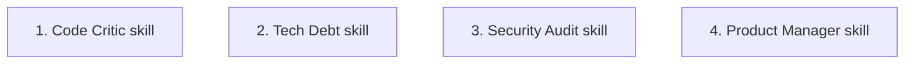

# Meta-Agent Skills

Add analysis-focused skills that guide session agents to review a codebase and return formatted task lists using the existing `answer` protocol field, with organic discovery via `AGENTS.md`.

## Steps

## 1) Create Code Critic skill

### Why now

This is the first concrete analysis skill, validating that an interactive session agent can organically discover a skill via `AGENTS.md`, follow its instructions, and return a formatted task list in its `answer` markdown. It establishes the pattern for all subsequent analysis skills.

### Usable outcome

`skills/code-critic/SKILL.md` exists. When a user asks the session agent to review code quality, the agent reads the skill and returns findings as a prioritized markdown task list in its answer.

### Substeps

- [ ] **Create Code Critic skill file.** Write `skills/code-critic/SKILL.md` with frontmatter (`name`, `description`) instructing the agent to: (1) read root `AGENTS.md` for project conventions and directory index, (2) traverse into target directories reading their `AGENTS.md` files, (3) analyze code for non-idiomatic patterns, swallowed errors (`unwrap()`, `expect()`), optimization opportunities, and concurrency issues, (4) return findings as a prioritized markdown task list in the answer with title, priority (`Critical`/`High`/`Medium`/`Low`), scope (file/module), and description for each item.
- [ ] **Create symlinks.** Create `CLAUDE.md` and `GEMINI.md` symlinks pointing to `SKILL.md` in `skills/code-critic/`.
- [ ] **Register in `skills/AGENTS.md`.** Add a directory index entry for `code-critic/` in `skills/AGENTS.md`.

### Tests

- [ ] No automated tests — skill is pure markdown. Manual verification: confirm file renders correctly and symlinks resolve.

### Docs

- [ ] Add Code Critic to the Meta-Agent Inventory table in root `AGENTS.md` under a new "Analysis Skills" subsection.

## 2) Create Tech Debt skill

### Why now

Follows the pattern established in Step 1 with a different analysis focus. Validates that the skill pattern works for a scavenger-style sweep (TODOs, stale patterns, missing docstrings) rather than a targeted code review.

### Usable outcome

`skills/tech-debt/SKILL.md` exists. When a user asks the session agent to find tech debt, the agent reads the skill and returns a prioritized markdown task list.

### Substeps

- [ ] **Create Tech Debt skill file.** Write `skills/tech-debt/SKILL.md` with frontmatter instructing the agent to: (1) read root `AGENTS.md`, (2) traverse directories reading their `AGENTS.md` files, (3) find TODOs, outdated patterns, inconsistent error handling, missing docstrings, and stale dependencies, (4) return findings as a prioritized markdown task list in the answer with priority (`Critical`/`High`/`Medium`/`Low`).
- [ ] **Create symlinks.** Create `CLAUDE.md` and `GEMINI.md` symlinks pointing to `SKILL.md` in `skills/tech-debt/`.
- [ ] **Register in `skills/AGENTS.md`.** Add a directory index entry for `tech-debt/` in `skills/AGENTS.md`.

### Tests

- [ ] No automated tests — pure markdown. Manual verification of file structure and symlinks.

### Docs

- [ ] Add Tech Debt to the Meta-Agent Inventory table in root `AGENTS.md`.

## 3) Create Security Audit skill

### Why now

Covers a distinct analysis domain (auth flows, injection vulnerabilities, panic conditions) that the Code Critic and Tech Debt skills do not address. Validates that the skill pattern works for security-focused analysis.

### Usable outcome

`skills/security-audit/SKILL.md` exists. When a user asks the session agent to audit security, the agent reads the skill and returns security findings as a prioritized markdown task list.

### Substeps

- [x] **Create Security Audit skill file.** Write `skills/security-audit/SKILL.md` with frontmatter instructing the agent to: (1) read root `AGENTS.md`, (2) traverse target directories reading their `AGENTS.md` files, (3) review auth flows, data parsing, edge cases, panic conditions, and injection vulnerabilities, (4) return findings as a prioritized markdown task list in the answer with priority (`Critical`/`High`/`Medium`/`Low`).
- [x] **Create symlinks.** Create `CLAUDE.md` and `GEMINI.md` symlinks pointing to `SKILL.md` in `skills/security-audit/`.
- [x] **Register in `skills/AGENTS.md`.** Add a directory index entry for `security-audit/` in `skills/AGENTS.md`.

### Tests

- [x] No automated tests — pure markdown. Manual verification of file structure and symlinks.

### Docs

- [x] Add Security Audit to the Meta-Agent Inventory table in root `AGENTS.md`.

## 4) Create Product Manager skill

### Why now

Validates a different input shape from the other analysis skills: instead of analyzing existing code, the agent breaks a high-level goal into independent implementation tasks. This proves the skill pattern is flexible beyond code review.

### Usable outcome

`skills/product-manager/SKILL.md` exists. When a user describes a high-level goal, the agent reads the skill and returns a breakdown of 5–10 small independent implementation tasks as a prioritized markdown list.

### Substeps

- [ ] **Create Product Manager skill file.** Write `skills/product-manager/SKILL.md` with frontmatter instructing the agent to: (1) read root `AGENTS.md` for project context, (2) break the user's high-level goal into 5–10 small independent implementation tasks, (3) return tasks as a prioritized markdown list with title, priority, scope, and description for each.
- [ ] **Create symlinks.** Create `CLAUDE.md` and `GEMINI.md` symlinks pointing to `SKILL.md` in `skills/product-manager/`.
- [ ] **Register in `skills/AGENTS.md`.** Add a directory index entry for `product-manager/` in `skills/AGENTS.md`.

### Tests

- [ ] No automated tests — pure markdown. Manual verification of file structure and symlinks.

### Docs

- [ ] Add Product Manager to the Meta-Agent Inventory table in root `AGENTS.md`.

## Cross-Plan Notes

- No active plans in `docs/plan/` conflict with this work. The meta-agent skills are a new feature area that does not overlap with existing session lifecycle, forge, or testing plans.

## Status Maintenance Rule

- After implementing any step in this plan, immediately update its status in this document.
- When a step changes behavior, complete its `### Tests` and `### Docs` work in that same step before marking it complete.
- When the full plan is complete, remove the implemented plan file; if more work remains, move that work into a new follow-up plan file before deleting the completed one.

## Current State Snapshot

| Area | Current state in codebase | Status |
|------|---------------------------|--------|
| Skills | 4 interactive skills exist (`git-commit`, `implementation-plan`, `release`, `review`); no analysis-focused skills | Needs new skills |
| `AGENTS.md` inventory | Lists interactive skills and runtime prompt templates; no analysis skills section | Needs new subsection |
| `AgentResponse` protocol | Supports `answer`, `questions`, and `summary` fields | Unchanged — skills use existing `answer` markdown |

## Implementation Approach

- Each step creates one skill file with symlinks and registration. The skill files themselves are independent and can be authored in parallel.
- **Shared-file serialization:** Each step edits `skills/AGENTS.md` (registration) and root `AGENTS.md` (inventory). Serialize these shared-file updates — apply them sequentially in a single pass after skill files are created — to avoid merge churn.
- Skills instruct agents to return findings as formatted markdown task lists in the existing `answer` field — no protocol or UI changes needed.
- Agents discover skills organically by reading `AGENTS.md` files, which already list available skills.

## Suggested Execution Order

Skill file creation is independent across steps. Shared-file updates (`skills/AGENTS.md`, root `AGENTS.md`) should be serialized into a single pass to avoid merge conflicts.

## Out of Scope for This Pass

- Extending `AgentResponse` with a structured `tasks` field (use existing `answer` markdown instead).
- Custom task list rendering widgets in the TUI.
- Session spawning from task list items.
- Agent-to-agent orchestration (meta-agent automatically dispatching to workers without user approval).
- Persistent task storage in the database.
- Scheduling or recurring meta-agent runs.
- Custom user-defined meta-agent skills.
- Integration with external issue trackers (GitHub Issues, Linear).
- Slash command invocation for skills (organic discovery via `AGENTS.md` only).
