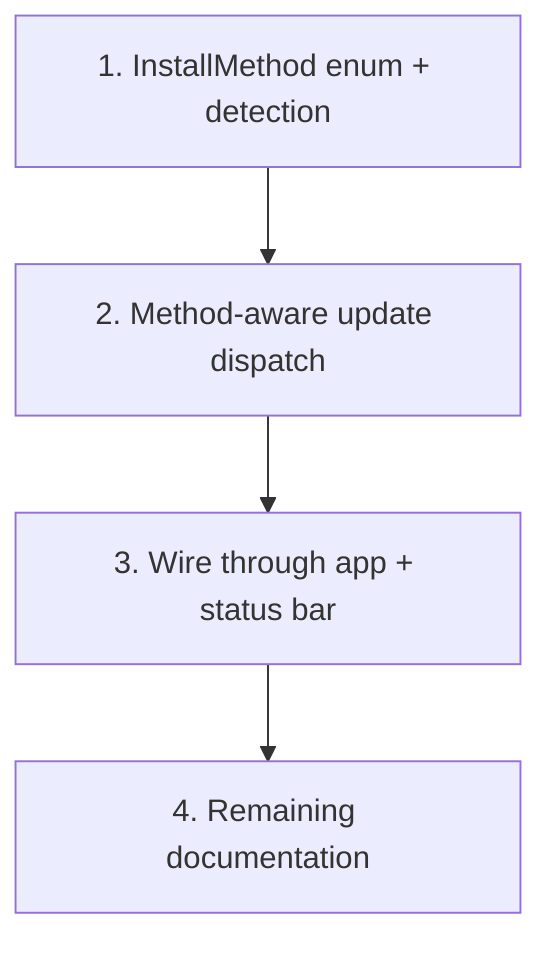

# Multi-Method Auto-Update

Extend auto-update to detect how `agentty` was installed and run the appropriate update command for each method (npm, cargo, sh, npx).

## Steps

## 1) Add `InstallMethod` enum and detection logic

### Why now

All subsequent steps depend on knowing how the binary was installed. Detection must land first so the update dispatcher and UI can branch on it.

### Usable outcome

`InstallMethod::detect()` returns the correct variant for each installation method. No user-visible behavior changes yet, but the building block is testable in isolation.

### Substeps

- [ ] **Define `InstallMethod` enum.** Add a `pub(crate) enum InstallMethod { Npm, Cargo, Shell, Npx, Unknown }` to `crates/agentty/src/infra/version.rs`. Include a `pub(crate) fn manual_update_hint(&self) -> &str` method that returns the appropriate command string for each variant (used later by the status bar).
- [ ] **Implement `InstallMethod::detect()`.** Add a `pub(crate) fn detect() -> Self` associated function that uses `std::env::current_exe()` to resolve the binary path and applies these heuristics in order:
  1. Path contains `.npm/` or `/node_modules/` → `Npm`.
  1. Path is inside npm global prefix (run `npm root -g` and check if binary is a sibling of that tree) → `Npm`.
  1. Path contains `/.npm/_npx/` → `Npx`.
  1. A sibling `agentty-update` binary exists next to the resolved exe (cargo-dist `install-updater = true` leaves this) → `Shell`.
  1. Path is under `$CARGO_HOME/bin/` (default `~/.cargo/bin/`) → `Cargo`.
  1. Otherwise → `Unknown`.
- [ ] **Extract detection behind a trait boundary.** Define a `#[cfg_attr(test, mockall::automock)] trait InstallDetector: Send + Sync` with a method `fn detect_install_method(&self) -> InstallMethod` so tests can inject deterministic results without filesystem probing. `RealInstallDetector` calls the heuristic logic above.

### Tests

- [ ] Unit-test each heuristic branch using `MockInstallDetector` to verify the enum variant returned for representative paths (npm global dir, cargo home, npx cache, shell-installed with updater sibling, unknown path).
- [ ] Test `manual_update_hint()` returns the correct command string for each variant.

### Docs

- [ ] No docs changes in this step; detection is internal-only.

______________________________________________________________________

## 2) Add method-aware update command dispatch

### Why now

With `InstallMethod` available, the update runner can dispatch the right command instead of always calling `npm i -g agentty@latest`.

### Usable outcome

`run_update_sync()` accepts an `InstallMethod` and executes the correct update command. `run_npm_update_sync()` is removed.

### Substeps

- [ ] **Replace `run_npm_update_sync` with `run_update_sync`.** In `crates/agentty/src/infra/version.rs`, replace the existing function with `pub(crate) fn run_update_sync(install_method: &InstallMethod, update_runner: &dyn UpdateRunner) -> Result<String, String>` that dispatches:
  - `Npm` → `npm i -g agentty@latest`
  - `Cargo` → `cargo install agentty`
  - `Shell` → `sh -c "curl --proto '=https' --tlsv1.2 -LsSf https://github.com/agentty-xyz/agentty/releases/latest/download/agentty-installer.sh | sh"`
  - `Npx` → return `Ok` immediately (npx always fetches latest; no update needed).
  - `Unknown` → return `Err` with a message listing all manual options.
- [ ] **Update `run_background_update` caller.** In `crates/agentty/src/app/task.rs`, update the `run_background_update` call to pass the detected `InstallMethod` and call `version::run_update_sync` instead of `version::run_npm_update_sync`.

### Tests

- [ ] Test `run_update_sync` for each `InstallMethod` variant using `MockUpdateRunner`, verifying the correct command and args are passed.
- [ ] Test that `Npx` returns `Ok` without calling the runner.
- [ ] Test that `Unknown` returns `Err` with a descriptive message.

### Docs

- [ ] No docs changes in this step; dispatch is internal-only.

______________________________________________________________________

## 3) Wire detection through app state and update status bar hints

### Why now

Detection and dispatch are ready; this step makes them user-visible by threading `InstallMethod` through the app and showing the correct manual update hint in the status bar.

### Usable outcome

Users see the correct update command for their installation method in the status bar (e.g., `cargo install agentty` instead of `npm i -g agentty@latest`). Auto-update runs the right command for their method. `npx` users see no update hint (always latest).

### Substeps

- [ ] **Detect install method at startup.** In `crates/agentty/src/main.rs`, call `InstallMethod::detect()` (or the `RealInstallDetector`) before constructing `App` and pass the result into `App::new()`.
- [ ] **Thread `InstallMethod` through `App`.** Add an `install_method: InstallMethod` field to `App` in `crates/agentty/src/app/core.rs`. Pass it from `App::new()` to `TaskService::spawn_version_check_task()`.
- [ ] **Update `spawn_version_check_task` signature.** In `crates/agentty/src/app/task.rs`, accept `InstallMethod` and forward it to `run_background_update`. For `Npx`, skip the auto-update entirely (npx always fetches latest on next run).
- [ ] **Update status bar manual hint.** In `crates/agentty/src/ui/component/status_bar.rs`:
  - Accept `install_method: &InstallMethod` (or the hint string) in the builder.
  - Replace the hardcoded `"npm i -g agentty@latest"` with `install_method.manual_update_hint()`.
  - For `Npx`, suppress the manual hint entirely.
  - For `Unknown`, show a generic message like `"update available — see docs for install options"`.
- [ ] **Update render call sites.** Pass `install_method` from `App` state through the render path to `StatusBar` in `crates/agentty/src/ui/render.rs` or `crates/agentty/src/ui/page/` where `StatusBar` is constructed.

### Tests

- [ ] Test status bar renders the correct hint for each `InstallMethod` variant (update existing status bar tests and add new ones for `Cargo`, `Shell`, `Npx`, `Unknown`).
- [ ] Test that `spawn_version_check_task` skips auto-update for `Npx`.
- [ ] Verify existing `--no-update` behavior is preserved (version check still runs, manual hint shown, no auto-update).

### Docs

- [ ] Update `docs/site/content/docs/usage/workflow.md` auto-update section to document method detection and per-method behavior.
- [ ] Update `docs/site/content/docs/getting-started/overview.md` to mention auto-update works for all installation methods.
- [ ] Update `README.md` usage section if it references npm-specific update behavior.

______________________________________________________________________

## 4) Update documentation for multi-method auto-update

### Why now

All code changes are complete. This step covers remaining documentation that was not updated inline in step 3.

### Usable outcome

All user-facing and architecture docs reflect multi-method auto-update support.

### Substeps

- [ ] **Update installation docs.** In `docs/site/content/docs/getting-started/installation.md`, add a note under each installation method about auto-update support (e.g., "Auto-update supported" for npm/cargo/sh, "Always runs latest version" for npx).
- [ ] **Update testability boundaries.** In `docs/site/content/docs/architecture/testability-boundaries.md`, document the `InstallDetector` trait boundary if it was added.

### Tests

- [ ] No code tests; documentation-only step.

### Docs

- [ ] Covered by the substeps above.

______________________________________________________________________

## Cross-Plan Notes

- No active overlaps with existing plans in `docs/plan/`.

## Status Maintenance Rule

- After implementing any step in this plan, immediately update its status in this document.
- When a step changes behavior, complete its `### Tests` and `### Docs` work in that same step before marking it complete.
- When the full plan is complete, remove the implemented plan file; if more work remains, move that work into a new follow-up plan file before deleting the completed one.

## Current State Snapshot

| Area | Current state in codebase | Status |
|------|---------------------------|--------|
| Install detection | No detection; assumes npm | Not started |
| Update dispatch | Hardcoded `npm i -g agentty@latest` in `infra/version.rs` | Not started |
| Status bar hint | Hardcoded npm hint in `ui/component/status_bar.rs` | Not started |
| Version check source | npm registry (works for all methods) | Stays as-is |
| Documentation | References npm-only auto-update | Not started |

## Implementation Approach

- Start with the detection enum and heuristics (step 1) since all other steps depend on knowing the install method.
- Step 2 replaces the npm-only update dispatch with method-aware dispatch, building on step 1.
- Step 3 wires everything through the app and makes changes user-visible.
- Step 4 finalizes documentation.
- Version checking via npm registry stays unchanged — the npm registry has the canonical version for all distribution channels.

## Suggested Execution Order

1. Start with step 1 (detection); it is the foundation for all subsequent steps.
1. Step 2 depends on step 1 (needs `InstallMethod` enum).
1. Step 3 depends on step 2 (needs the dispatch function).
1. Step 4 depends on step 3 (needs user-visible behavior finalized).

All steps are sequential — no parallelism due to data dependencies.

## Out of Scope for This Pass

- Changing the version check source (npm registry is canonical for all methods).
- Supporting additional package managers (e.g., Homebrew, Nix).
- Persisting detected install method to config/database.
- Using cargo-dist's built-in `agentty-update` binary directly (the shell installer re-download approach is simpler and more reliable).
