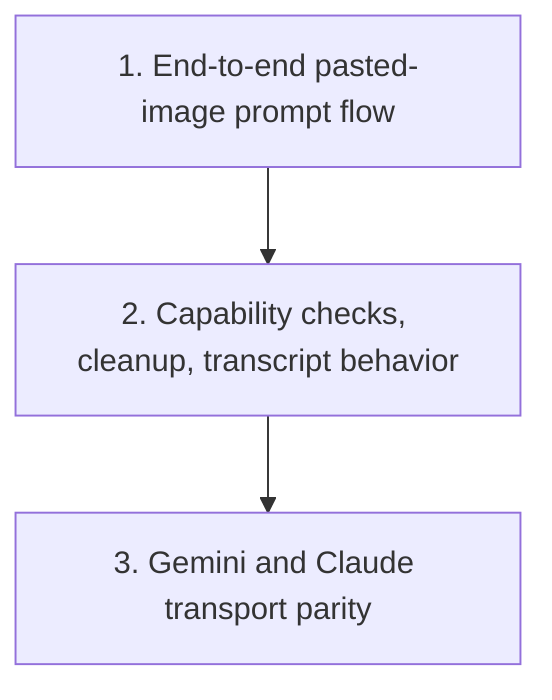

# Paste Images into Session Prompts

Plan for extending the session chat composer in `crates/agentty/src/ui/component/chat_input.rs`, plus the required prompt/runtime plumbing, so users can paste clipboard images only while entering the first session prompt or a reply.

## Steps

Codex CLI already has a workable reference shape: `codex-rs/tui/src/clipboard_paste.rs` reads clipboard images into temp PNG files and `codex-rs/tui/src/chatwidget.rs` binds `Ctrl+V`/`Alt+V` to `attach_image(path)` with model-capability checks. This plan keeps that split, but adapts it to Agentty's prompt mode and transport boundaries.

## 1) Ship one end-to-end pasted-image flow for prompt mode

### Why now

The current prompt flow is text-only from the terminal event layer through session submission. The smallest usable iteration is a real pasted-image path that users can exercise in `AppMode::Prompt`, even if unsupported providers only surface a clear warning in this pass.

### Usable outcome

While composing a new session prompt or reply, a user can trigger image paste from the clipboard, see a highlighted inline placeholder such as `[Image #1]` inserted directly into the prompt field, submit it with the message, and get an explicit error when the active model/backend cannot accept images.

### Size

Target: `XL` (`201..=500` changed lines). If the first end-to-end image path grows beyond that range, move remaining backend or UI polish into a follow-up priority.

### Substeps

- [x] **Add prompt attachment state for inline image tokens.** Add prompt attachment state alongside `InputState` in `crates/agentty/src/ui/state/app_mode.rs` and `crates/agentty/src/ui/state/prompt.rs` so prompt mode can track pasted local images, the ordered inline `[Image #n]` placeholders inserted into the composer, and their mapping separately from plain text and at-mention/slash-menu state.
- [x] **Add clipboard image capture and temp-file persistence.** Add a clipboard-image helper module under `crates/agentty/src/runtime/` or `crates/agentty/src/infra/` that mirrors Codex CLI's `clipboard_paste.rs` structure: read clipboard image data or file-backed clipboard entries, encode to PNG, persist each pasted image under `AGENTTY_ROOT/tmp/<session-id>/images/`, and return metadata suitable for inline token labels and error messages.
- [x] **Add a dedicated prompt-mode paste-image event path.** Extend `crates/agentty/src/runtime/event.rs` and `crates/agentty/src/runtime/mode/prompt.rs` so the session chat composer used for initial prompts and replies handles a dedicated paste-image shortcut separately from `Event::Paste`, while preserving the current text-paste behavior.
- [x] **Render highlighted inline image placeholders in the composer.** Update `crates/agentty/src/ui/component/chat_input.rs` to render pasted images as highlighted inline placeholders such as `[Image #1]` inside the text input, similar to Gemini CLI, while preserving slash-command dropdown behavior and cursor math for multiline text with mixed text and image-token spans.
- [x] **Show the paste-image keybinding and errors in session chat.** Update `crates/agentty/src/ui/page/session_chat.rs` so the session prompt footer exposes the paste-image keybinding and unsupported-model feedback without relying on a separate attachment row above the composer.
- [x] **Expand prompt submission to structured multimodal payloads.** Expand the submission path in `crates/agentty/src/runtime/mode/prompt.rs`, `crates/agentty/src/app/core.rs`, `crates/agentty/src/app/session/workflow/lifecycle.rs`, `crates/agentty/src/infra/channel/contract.rs`, and `crates/agentty/src/infra/app_server.rs` from `prompt: String` to a structured prompt payload that can carry text plus ordered local image attachments keyed to inline `[Image #n]` placeholders.
- [x] **Send pasted images through the first supported backend.** Implement the first backend transport that can actually forward pasted images, starting with the Codex path in `crates/agentty/src/infra/channel/app_server.rs` and `crates/agentty/src/infra/codex_app_server.rs`, while other providers fail fast with a user-visible capability message instead of silently dropping attachments.

### Tests

- [x] Add focused tests for prompt attachment state, inline `[Image #n]` token rendering/layout math, prompt event routing, temp-path generation under `AGENTTY_ROOT/tmp/<session-id>/images/`, and Codex payload serialization in `crates/agentty/src/ui/component/chat_input.rs`, `crates/agentty/src/ui/page/session_chat.rs`, `crates/agentty/src/runtime/event.rs`, `crates/agentty/src/runtime/mode/prompt.rs`, and the affected transport tests.

### Docs

- [x] Update `docs/site/content/docs/usage/keybindings.md` and `docs/site/content/docs/usage/workflow.md` with the first shipped paste-image shortcut and prompt-composer behavior as part of the same slice.

## 2) Harden capability checks, cleanup, and session transcript behavior for the session chat composer

### Why now

Once one prompt flow works end to end, the next risk is scope drift: cleanup and capability handling can accidentally expand into broader prompt lifecycle rules instead of staying attached to the session chat composer that handles the first prompt and replies.

### Usable outcome

Attachment handling remains scoped to the session chat composer for initial prompts and replies, unsupported providers are gated consistently, and the session transcript preserves enough context to explain when a turn included pasted images.

### Size

Target: `L` (`81..=200` changed lines). Keep this hardening slice focused on capability checks, cleanup ownership, and transcript behavior.

### Substeps

- [x] **Add shared backend image-capability checks.** Add agent/model capability helpers in `crates/agentty/src/domain/agent.rs` so the UI and runtime can share one source of truth for whether image inputs are supported.
- [x] **Define attachment temp-file cleanup ownership.** Decide and implement temp-file ownership in `crates/agentty/src/app/session/workflow/lifecycle.rs` and the relevant runtime/session cleanup path so pasted files under `AGENTTY_ROOT/tmp/<session-id>/images/` survive long enough for backend upload from the session chat composer but do not accumulate indefinitely after handoff or failed submission.
- [x] **Preserve attachment markers in stored transcripts.** Update prompt-output formatting in `crates/agentty/src/app/session/workflow/lifecycle.rs` and any related transcript helpers so submitted prompts preserve the inline `[Image #n]` markers or an equivalent attachment summary instead of pretending the turn was text-only.
- [x] **Normalize clipboard and unsupported-model errors.** Add focused error handling for clipboard-unavailable, no-image, encode-failure, and unsupported-model cases so users get actionable status text without leaving prompt mode.
- [x] **Finalize the paste-image shortcut without regressing text paste.** Validate whether the first shipped shortcut should be `Ctrl+V`, `Alt+V`, or a platform-aware combination; keep text paste on `Event::Paste` intact and avoid stealing the common plain-text paste path.

### Tests

- [x] Add focused tests for capability helpers, clipboard error normalization, session chat composer reset after send, transcript attachment summaries, and unsupported-provider gating in `crates/agentty/src/domain/agent.rs`, `crates/agentty/src/runtime/mode/prompt.rs`, `crates/agentty/src/runtime/event.rs`, and `crates/agentty/src/app/session/workflow/lifecycle.rs`.
- [ ] Run focused tests while iterating and finish with the repository validation gates when this hardening slice lands.

### Docs

- [x] Update `docs/site/content/docs/usage/keybindings.md`, `docs/site/content/docs/usage/workflow.md`, and `docs/site/content/docs/architecture/testability-boundaries.md` if the final cleanup and transport boundary work changes contributor guidance or user-visible behavior.

## 3) Add prompt-image transport support for Gemini and Claude session models

### Why now

The prompt composer and lifecycle are now stable enough that broadening provider support no longer needs to change the attachment model itself. What remains is transport parity: Gemini and Claude still fail fast even though the UI/runtime path is ready to hand off structured attachments.

### Usable outcome

Users can paste images into the session composer and submit them successfully for Codex, Gemini, and Claude sessions, with provider-specific transport behavior covered by tests instead of a Codex-only special case.

### Size

Target: `XL` (`201..=500` changed lines). Keep this split focused on provider transport parity and capability verification; if one provider needs substantially more work, split Gemini and Claude into separate follow-up steps before implementation.

### Substeps

- [ ] **Verify real provider image input shapes before wiring parity.** Confirm the current Gemini and Claude runtime/app-server surfaces that Agentty uses in `crates/agentty/src/infra/gemini_acp.rs`, `crates/agentty/src/infra/app_server.rs`, and any Claude transport path can accept local image attachments, and record any provider-specific constraints or model exclusions before relaxing capability checks.
- [ ] **Extend Gemini transport for structured prompt attachments.** Implement ordered text-plus-image submission for Gemini in the relevant transport layer under `crates/agentty/src/infra/`, keeping placeholder ordering aligned with `TurnPrompt` and preserving the existing session replay/context behavior.
- [ ] **Extend Claude transport for structured prompt attachments.** Implement equivalent attachment submission for Claude in its active channel/backend path under `crates/agentty/src/infra/channel/` and `crates/agentty/src/infra/agent/`, including any provider-specific file upload or CLI argument handling required for local images.
- [ ] **Broaden shared capability checks only after transport support lands.** Update `crates/agentty/src/domain/agent.rs`, `crates/agentty/src/runtime/mode/prompt.rs`, and `crates/agentty/src/ui/page/session_chat.rs` so model capability helpers reflect the newly supported providers without ever advertising support before transport parity is real.
- [ ] **Keep cleanup and transcript behavior provider-agnostic.** Validate that the existing attachment cleanup ownership in `crates/agentty/src/app/session/workflow/lifecycle.rs` and `crates/agentty/src/app/session/workflow/worker.rs` still holds once Gemini and Claude consume submitted image files.

### Tests

- [ ] Add focused transport and serialization tests for Gemini and Claude attachment submission in the affected `crates/agentty/src/infra/` modules, plus capability-gating regression tests in `crates/agentty/src/domain/agent.rs` and `crates/agentty/src/runtime/mode/prompt.rs`.
- [ ] Run the repository validation gates after provider parity lands, and note any provider-specific live-test gaps separately from deterministic coverage.

### Docs

- [ ] Update `docs/site/content/docs/usage/keybindings.md` and `docs/site/content/docs/usage/workflow.md` so image-paste behavior no longer describes Codex-only support.
- [ ] Update `docs/site/content/docs/agents/backends.md` if provider/model capability tables need to describe pasted local-image support for Gemini and Claude.

## Cross-Plan Notes

- No active `docs/plan/` file currently owns prompt attachments, inline image-token composition, or image-capable transport payloads.
- Keep this plan scoped to pasted local images in session prompt mode; broader multimodal parity such as remote URLs, screenshots, or drag-and-drop should stay in a separate follow-up plan.

## Status Maintenance Rule

- After implementing any step in this plan, immediately update its checklist status and refresh the snapshot rows that changed.
- When a step changes user-visible prompt behavior or keybindings, complete the corresponding `### Tests` and `### Docs` work in that same step before marking it complete.

## Current State Snapshot

| Area | Current state in codebase | Status |
|------|---------------------------|--------|
| Prompt UI state | `AppMode::Prompt` now carries dedicated attachment state next to `InputState`, including ordered local-image metadata and `[Image #n]` placeholder mapping, and submission drains that state into structured turn payloads. | Done |
| Composer rendering | Prompt input highlights inline `[Image #n]` placeholders in the composer, keeps slash/at-mention behavior intact, and shows a footer hint for `Ctrl+V`/`Alt+V` plus unsupported-model guidance. | Done |
| Terminal paste handling | `Event::Paste` still inserts multiline text, while `Ctrl+V` and `Alt+V` run the dedicated clipboard-image path for new-session prompts and replies. | Done |
| Prompt submission contract | `TurnRequest`, `AppServerTurnRequest`, and the session lifecycle now carry `TurnPrompt` payloads with text plus ordered local image attachments. | Done |
| Backend support | Codex app-server turns serialize local image inputs, while non-Codex providers fail fast with a visible capability error instead of dropping attachments. | Done |
| Capability and cleanup hardening | Shared model capability helpers now gate paste/submit behavior, prompt-mode errors stay actionable in the composer, transcript formatting preserves image markers, and attachment temp files are cleaned on cancel, failed enqueue, completed upload, and session cleanup. | Done |
| Provider parity | Gemini and Claude still need provider-specific attachment transport work before capability helpers can advertise image support beyond Codex. | Pending |
| Dependencies | Workspace manifests now include the clipboard/image helpers needed to persist prompt images as local PNG files. | Done |

## Implementation Approach

- Follow the Codex CLI split of concerns: one helper for clipboard-image capture and one prompt/composer path that owns attachment state and inline token rendering.
- Keep `Event::Paste` reserved for text so multiline clipboard paste does not regress; route image paste through an explicit shortcut that is only active in the session chat composer for initial prompts and replies.
- Persist pasted image temp files under `AGENTTY_ROOT/tmp/<session-id>/images/` so attachment storage keys off the stable session identifier instead of parsing the worktree folder name.
- Make the first merged slice usable end to end for one backend instead of landing a UI-only attachment shell.
- Gate unsupported providers through shared capability checks before transport submission so Agentty never silently drops pasted images.
- Keep attachment metadata local-path based for this pass; the composer should show highlighted inline `[Image #n]` placeholders rather than a row above the input, while remote URLs, drag-and-drop, screenshots, and inline bitmap previews remain follow-up work once the local clipboard path is stable.

## Suggested Execution Order

1. Start with `1) Ship one end-to-end pasted-image flow for prompt mode`; the prompt state shape, keybinding, and transport payload need to exist before follow-up hardening can be finalized.
1. Continue with `2) Harden capability checks, cleanup, and session transcript behavior` once one backend can already receive pasted images and the first user-visible path is stable.
1. Start `3) Add prompt-image transport support for Gemini and Claude session models` only after `2)` is stable, because it reuses the hardened capability and cleanup rules instead of redefining them per provider.

## Out of Scope for This Pass

- Drag-and-drop files, screenshot capture commands, or remote image URL attachments.
- Adding image inputs to non-session text inputs such as question mode, publish-branch popups, or settings overlays.
- Full backend parity across Codex, Gemini, and Claude in the first implementation if only one provider can be shipped safely at first.
- Inline terminal image previews; this pass only needs durable attachment labels and summaries.
