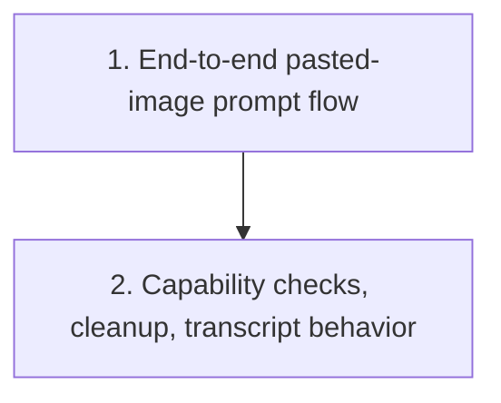

# Paste Images into Session Prompts

Plan for extending the session chat composer in `crates/agentty/src/ui/component/chat_input.rs`, plus the required prompt/runtime plumbing, so users can paste clipboard images only while entering the first session prompt or a reply.

## Priorities

Codex CLI already has a workable reference shape: `codex-rs/tui/src/clipboard_paste.rs` reads clipboard images into temp PNG files and `codex-rs/tui/src/chatwidget.rs` binds `Ctrl+V`/`Alt+V` to `attach_image(path)` with model-capability checks. This plan keeps that split, but adapts it to Agentty's prompt mode and transport boundaries.

## 1) Ship one end-to-end pasted-image flow for prompt mode

### Why now

The current prompt flow is text-only from the terminal event layer through session submission. The smallest usable iteration is a real pasted-image path that users can exercise in `AppMode::Prompt`, even if unsupported providers only surface a clear warning in this pass.

### Usable outcome

While composing a new session prompt or reply, a user can trigger image paste from the clipboard, see the pending attachment rendered above the prompt field, submit it with the message, and get an explicit error when the active model/backend cannot accept images.

### Substeps

- [ ] Add prompt attachment state alongside `InputState` in `crates/agentty/src/ui/state/app_mode.rs` and `crates/agentty/src/ui/state/prompt.rs` so prompt mode can track pasted local images separately from plain text and at-mention/slash-menu state.
- [ ] Add a clipboard-image helper module under `crates/agentty/src/runtime/` or `crates/agentty/src/infra/` that mirrors Codex CLI's `clipboard_paste.rs` structure: read clipboard image data or file-backed clipboard entries, encode to PNG, persist a temp file, and return metadata suitable for UI labels and error messages.
- [ ] Extend `crates/agentty/src/runtime/event.rs` and `crates/agentty/src/runtime/mode/prompt.rs` so the session chat composer used for initial prompts and replies handles a dedicated paste-image shortcut separately from `Event::Paste`, while preserving the current text-paste behavior.
- [ ] Update `crates/agentty/src/ui/component/chat_input.rs` to render an attachment strip or stacked rows above the text input while preserving slash-command dropdown behavior and cursor math for multiline text.
- [ ] Update `crates/agentty/src/ui/page/session_chat.rs` so bottom-panel height calculation accounts for attachment rows and so the session prompt footer exposes the paste-image keybinding and unsupported-model feedback.
- [ ] Expand the submission path in `crates/agentty/src/runtime/mode/prompt.rs`, `crates/agentty/src/app/core.rs`, `crates/agentty/src/app/session/workflow/lifecycle.rs`, `crates/agentty/src/infra/channel/contract.rs`, and `crates/agentty/src/infra/app_server.rs` from `prompt: String` to a structured prompt payload that can carry text plus local image attachments.
- [ ] Implement the first backend transport that can actually forward pasted images, starting with the Codex path in `crates/agentty/src/infra/channel/app_server.rs` and `crates/agentty/src/infra/codex_app_server.rs`, while other providers fail fast with a user-visible capability message instead of silently dropping attachments.

### Tests

- [ ] Add focused tests for prompt attachment state, bottom-panel layout math, prompt event routing, and Codex payload serialization in `crates/agentty/src/ui/component/chat_input.rs`, `crates/agentty/src/ui/page/session_chat.rs`, `crates/agentty/src/runtime/event.rs`, `crates/agentty/src/runtime/mode/prompt.rs`, and the affected transport tests.

### Docs

- [ ] Update `docs/site/content/docs/usage/keybindings.md` and `docs/site/content/docs/usage/workflow.md` with the first shipped paste-image shortcut and prompt-composer behavior as part of the same slice.

## 2) Harden capability checks, cleanup, and session transcript behavior for the session chat composer

### Why now

Once one prompt flow works end to end, the next risk is scope drift: cleanup and capability handling can accidentally expand into broader prompt lifecycle rules instead of staying attached to the session chat composer that handles the first prompt and replies.

### Usable outcome

Attachment handling remains scoped to the session chat composer for initial prompts and replies, unsupported providers are gated consistently, and the session transcript preserves enough context to explain when a turn included pasted images.

### Substeps

- [ ] Add agent/model capability helpers in `crates/agentty/src/domain/agent.rs` so the UI and runtime can share one source of truth for whether image inputs are supported.
- [ ] Decide and implement temp-file ownership in `crates/agentty/src/app/session/workflow/lifecycle.rs` and the relevant runtime/session cleanup path so pasted files survive long enough for backend upload from the session chat composer but do not accumulate indefinitely after handoff or failed submission.
- [ ] Update prompt-output formatting in `crates/agentty/src/app/session/workflow/lifecycle.rs` and any related transcript helpers so submitted prompts record an attachment summary instead of pretending the turn was text-only.
- [ ] Add focused error handling for clipboard-unavailable, no-image, encode-failure, and unsupported-model cases so users get actionable status text without leaving prompt mode.
- [ ] Validate whether the first shipped shortcut should be `Ctrl+V`, `Alt+V`, or a platform-aware combination; keep text paste on `Event::Paste` intact and avoid stealing the common plain-text paste path.

### Tests

- [ ] Add focused tests for capability helpers, clipboard error normalization, session chat composer reset after send, transcript attachment summaries, and unsupported-provider gating in `crates/agentty/src/domain/agent.rs`, `crates/agentty/src/runtime/mode/prompt.rs`, `crates/agentty/src/runtime/event.rs`, and `crates/agentty/src/app/session/workflow/lifecycle.rs`.
- [ ] Run focused tests while iterating and finish with the repository validation gates when this hardening slice lands.

### Docs

- [ ] Update `docs/site/content/docs/usage/keybindings.md`, `docs/site/content/docs/usage/workflow.md`, and `docs/site/content/docs/architecture/testability-boundaries.md` if the final cleanup and transport boundary work changes contributor guidance or user-visible behavior.

## Cross-Plan Notes

- No active `docs/plan/` file currently owns prompt attachments or image-capable transport payloads.
- If a later plan adds generic multimodal provider parity, keep this plan scoped to pasted local images in session prompt mode and treat broader backend parity as follow-up work.

## Status Maintenance Rule

- After implementing any step in this plan, immediately update its checklist status and refresh the snapshot rows that changed.
- When a step changes user-visible prompt behavior or keybindings, complete the corresponding `### Tests` and `### Docs` work in that same step before marking it complete.

## Current State Snapshot

| Area | Current state in codebase | Status |
|------|---------------------------|--------|
| Prompt UI state | `AppMode::Prompt` carries text input, slash-menu state, history, and `@`-mention state, but no attachment list or image metadata. | Not Started |
| Composer rendering | `crates/agentty/src/ui/component/chat_input.rs` renders only the bordered text field plus optional dropdown, and `crates/agentty/src/ui/page/session_chat.rs` sizes the bottom panel only for text plus menus. | Not Started |
| Terminal paste handling | `crossterm` bracketed paste is enabled and `Event::Paste` inserts multiline text, but there is no dedicated image-paste shortcut or clipboard-image reader. | Partial |
| Prompt submission contract | `TurnRequest`, `AppServerTurnRequest`, and the session lifecycle currently carry only `prompt: String`, so attachments cannot reach any backend. | Not Started |
| Backend support | Agentty has Codex, Gemini, and Claude backends, but no shared capability model or image-attachment serialization path. | Not Started |
| Dependencies | The workspace already includes `tempfile`, but clipboard/image helpers such as `arboard`, `image`, or URL/path normalization support are not yet defined in the workspace manifest. | Not Started |

## Implementation Approach

- Follow the Codex CLI split of concerns: one helper for clipboard-image capture and one prompt/composer path that owns attachment state and rendering.
- Keep `Event::Paste` reserved for text so multiline clipboard paste does not regress; route image paste through an explicit shortcut that is only active in the session chat composer for initial prompts and replies.
- Make the first merged slice usable end to end for one backend instead of landing a UI-only attachment shell.
- Gate unsupported providers through shared capability checks before transport submission so Agentty never silently drops pasted images.
- Keep attachment metadata local-path based for this pass; remote URLs, drag-and-drop, screenshots, and inline bitmap previews can be follow-up work once the local clipboard path is stable.

## Suggested Execution Order

1. Start with `1) Ship one end-to-end pasted-image flow for prompt mode`; the prompt state shape, keybinding, and transport payload need to exist before follow-up hardening can be finalized.
1. Continue with `2) Harden capability checks, cleanup, and session transcript behavior` once one backend can already receive pasted images and the first user-visible path is stable.
1. The clipboard helper and the chat-input rendering work inside `1)` can proceed in parallel, but the transport payload change must land before the feature is usable.

## Out of Scope for This Pass

- Drag-and-drop files, screenshot capture commands, or remote image URL attachments.
- Adding image inputs to non-session text inputs such as question mode, publish-branch popups, or settings overlays.
- Full backend parity across Codex, Gemini, and Claude in the first implementation if only one provider can be shipped safely at first.
- Inline terminal image previews; this pass only needs durable attachment labels and summaries.
