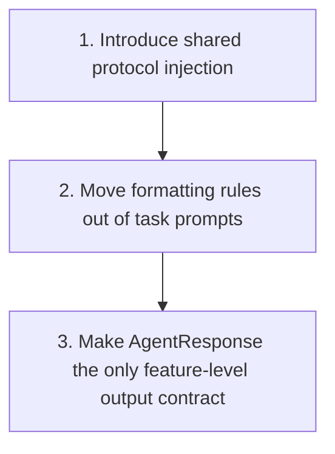

# Protocol-First Agent Request Unification Plan

Unify `crates/agentty/resources/protocol_instruction_prompt.md`, `crates/agentty/src/infra/agent/protocol.rs`, and the agent request call sites so every Agentty request goes through one shared protocol contract, with any request-specific behavior expressed as injected protocol guidance instead of ad hoc prompt-format rules.

## Steps

## 1) Introduce Shared Protocol Injection for Every Request Path

### Why now

Agentty cannot separate feature-specific intent from protocol enforcement until start, resume, one-shot, repair, and app-server reset flows all share the same protocol entry point.

### Usable outcome

Every request path can select a protocol profile and render it through the shared `protocol_instruction_prompt.md` wrapper without backend-specific prompt duplication.

### Substeps

- [x] **Define one protocol-owned request-profile surface.** Add one focused profile abstraction in `crates/agentty/src/infra/agent/protocol.rs` that names the supported request families and returns the extra protocol guidance they need, instead of scattering raw string constants across `crates/agentty/src/app/task.rs`, `crates/agentty/src/app/session/workflow/merge.rs`, and future call sites.
- [x] **Route the profile through every transport boundary.** Finish threading the selected profile through `crates/agentty/src/infra/agent/submission.rs`, `crates/agentty/src/infra/agent/backend.rs`, `crates/agentty/src/infra/channel/cli.rs`, `crates/agentty/src/infra/app_server.rs`, and the Codex, Claude, and Gemini backend prompt builders so start, resume, one-shot, repair, and context-reset paths all use the same renderer.
- [x] **Keep the shared template as the only rendered protocol preamble.** Preserve `crates/agentty/resources/protocol_instruction_prompt.md` as the single place that renders the schema and optional request-specific protocol block, and remove any backend-local or call-site-local duplication of protocol-format instructions.

### Tests

- [x] Extend `crates/agentty/src/infra/agent/backend.rs`, `crates/agentty/src/infra/agent/submission.rs`, `crates/agentty/src/infra/channel/cli.rs`, and `crates/agentty/src/infra/app_server.rs` tests to prove default and request-specific profiles are preserved across direct turns, repair turns, and context-reset turns.

### Docs

- [x] Update `docs/site/content/docs/agents/backends.md` and `docs/site/content/docs/architecture/runtime-flow.md` to describe the shared protocol injection point and the fact that every request path now flows through it.

## 2) Move Request Formatting Rules Out of Task Prompts

### Why now

The shared plumbing does not fully separate concerns while task-specific prompt templates still define response-shape rules that belong to the protocol layer.

### Usable outcome

Review, rebase assist, auto-commit assist, session commit generation, session title generation, and similar utility requests keep only task context in their templates, while the protocol layer owns response format, file-path rules, and request-specific output constraints.

### Substeps

- [ ] **Audit every agent prompt template for protocol leakage.** Review `crates/agentty/resources/review_assist_prompt.md`, `crates/agentty/resources/rebase_assist_prompt.md`, `crates/agentty/resources/auto_commit_assist_prompt.md`, `crates/agentty/resources/session_commit_message_prompt.md`, `crates/agentty/resources/session_title_generation_prompt.md`, and any similar request template to identify instructions that should move into protocol-owned profiles.
- [ ] **Replace ad hoc request constants with profile selection.** Convert the current request-specific literals in `crates/agentty/src/app/task.rs`, `crates/agentty/src/app/session/workflow/merge.rs`, `crates/agentty/src/app/session/workflow/task.rs`, and `crates/agentty/src/app/session/workflow/lifecycle.rs` into explicit protocol profile selection so future request types only choose a profile instead of inventing their own prompt wrapper rules.
- [ ] **Leave only true domain validation at the feature layer.** Keep post-response checks such as commit-message validation or title normalization in their workflow consumers, but make those helpers operate on protocol answers rather than compensating for custom prompt formats.

### Tests

- [ ] Add prompt-render and workflow tests proving the specialized templates no longer duplicate protocol-format instructions and that each request family selects the intended protocol profile.

### Docs

- [ ] Update `docs/site/content/docs/agents/backends.md`, `docs/site/content/docs/architecture/module-map.md`, and `docs/site/content/docs/architecture/change-recipes.md` to document the split between task prompts and protocol-owned request profiles.

## 3) Make `AgentResponse` the Only Feature-Level Output Contract

### Why now

Once request construction is unified, Agentty can only build higher-level features reliably if feature code consumes structured protocol output instead of relying on request-specific plain-text assumptions.

### Usable outcome

Session turns and utility requests all consume `AgentResponse` as the canonical output shape, with malformed-output repair and compatibility fallback isolated to shared protocol helpers.

### Substeps

- [ ] **Normalize request consumers around structured responses.** Review `crates/agentty/src/app/task.rs`, `crates/agentty/src/app/session/workflow/lifecycle.rs`, `crates/agentty/src/app/session/workflow/task.rs`, `crates/agentty/src/app/session/workflow/merge.rs`, `crates/agentty/src/infra/channel/cli.rs`, and `crates/agentty/src/infra/app_server.rs` so request-specific consumers extract answers, questions, and summaries from `AgentResponse` helpers instead of depending on bespoke raw-text shapes.
- [ ] **Centralize malformed-output handling in protocol helpers.** Tighten `crates/agentty/src/infra/agent/protocol.rs` and shared repair flows so invalid output is repaired or downgraded in one place, rather than each workflow carrying its own parsing fallback expectations.
- [ ] **Add protocol-oriented helper APIs only where feature code still needs them.** Introduce small extraction helpers in `crates/agentty/src/infra/agent/protocol.rs` when feature code needs first-answer, summary, or profile-aware validation access, while keeping request orchestration out of the protocol module.

### Tests

- [ ] Expand protocol parsing and workflow tests to cover each migrated request family and verify that request consumers do not accept raw plain text except through the explicit shared compatibility fallback.

### Docs

- [ ] Update `docs/site/content/docs/architecture/runtime-flow.md`, `docs/site/content/docs/architecture/testability-boundaries.md`, and `docs/site/content/docs/usage/workflow.md` if the migrated output handling changes user-visible summary or question behavior.

## Cross-Plan Notes

- No other active file in `docs/plan/` currently owns protocol prompt unification; if another plan starts changing the same request call sites, this plan should own the protocol contract while the other plan owns the feature-specific workflow.
- This branch now intentionally contains only the planning docs after the recent rollback, so step 1 starts from the current baseline code in `crates/agentty/src/infra/agent/backend.rs`, `crates/agentty/src/infra/agent/submission.rs`, and the request call sites.

## Status Maintenance Rule

- After implementing any step in this plan, immediately update its checklist status in this document and refresh the snapshot rows that changed.
- When a step changes behavior, complete its `### Tests` and `### Docs` work in that same step before marking it complete.
- When the full plan is complete, remove this file and open a narrower follow-up plan only if unresolved work remains.

## Current State Snapshot

| Area | Current state in codebase | Status |
|------|---------------------------|--------|
| Shared response schema and parser | `crates/agentty/src/infra/agent/protocol.rs` already owns the JSON schema, parsing, repair prompts, and `AgentResponse` model for structured output. | Healthy |
| Request-specific protocol injection | `ProtocolRequestProfile` now flows from session workers and one-shot utility call sites through `TurnRequest`, `AppServerTurnRequest`, `BuildCommandRequest`, repair retries, and app-server context-reset retries, so every request path renders the same shared protocol wrapper with request-family-specific guidance. | Healthy |
| Task prompt templates | Several templates under `crates/agentty/resources/` still mix task context with output-format instructions that belong in the protocol layer. | Not started |
| Feature-level response handling | Utility workflows still keep request-specific output assumptions such as title extraction and commit-message validation outside a fully protocol-owned helper surface. | Partial |
| Runtime and backend docs | `docs/site/content/docs/agents/backends.md` and `docs/site/content/docs/architecture/runtime-flow.md` now describe the shared protocol injection point and profile preservation across direct, repair, and context-reset flows, while later steps still need broader prompt/consumer documentation cleanup. | Partial |

## Implementation Approach

- Keep `crates/agentty/resources/protocol_instruction_prompt.md` as the one rendered contract that every provider sees, with request-specific additions injected into a dedicated section instead of embedded inside individual task prompts.
- Treat prompt templates under `crates/agentty/resources/` as task-context builders, not response-format builders, so Agentty-specific logic sits above the protocol while providers still receive one consistent structured-output contract.
- Keep higher-level feature logic focused on domain validation and UI behavior, with protocol parsing, repair, and structured extraction centralized under `crates/agentty/src/infra/agent/protocol.rs` and its immediate wiring.

## Suggested Execution Order

1. Start with `1) Introduce Shared Protocol Injection for Every Request Path` because the migration needs one canonical request-profile mechanism before any prompt or consumer cleanup is safe.
1. Continue with `2) Move Request Formatting Rules Out of Task Prompts` once every transport can carry the same protocol profile, so prompt cleanup does not create backend divergence.
1. Finish with `3) Make AgentResponse the Only Feature-Level Output Contract` after prompt construction is unified, because consumer cleanup should depend on the final protocol surface instead of an intermediate one.
1. No top-level steps are good parallel candidates right now because they all touch the same request-contract boundary and their tests depend on the previous slice landing first.

## Out of Scope for This Pass

- Redesigning the `AgentResponse` JSON schema shape beyond what is required to express request-specific protocol guidance cleanly.
- Replacing task-specific prompts with one generic prompt template for every feature; this plan keeps task context specialized while unifying the protocol contract.
- Removing the shared compatibility fallback for malformed provider output before the unified protocol path has proven stable across all supported backends.
