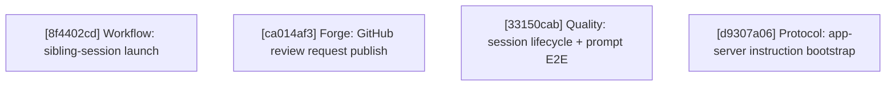

# Agentty Roadmap

Single-file roadmap for the active project backlog. Humans keep priorities and guardrails here, while only `Ready Now` work carries full execution detail and everything else stays intentionally lighter.

## Current State Snapshot

| Area | Current state in codebase | Status |
|------|---------------------------|--------|
| Follow-up task workflow | Persisted follow-up tasks now launch sibling sessions from session view, and launched/open state survives refresh, reopen, and restart flows. | Landed |
| Review request publish flow | Review sessions still expose one generic `p` branch-publish action; GitHub only gets a post-push pull-request creation link, while GitLab uses the same publish flow. | Partial |
| Model availability scoping | Agentty now requires at least one locally runnable backend CLI at startup, `/model` and Settings filter model choices to runnable backends, and unavailable stored defaults fall back to the first available backend default. | Landed |
| Draft session workflow | `Shift+A` now creates explicit draft sessions that persist ordered staged draft messages, while `a` keeps the immediate-start first-prompt flow. | Landed |
| Session activity timing | `session` persists cumulative `InProgress` timing fields, and both chat and the grouped session list now show the same cumulative active-work timer. | Landed |
| Deterministic scenario coverage | E2E tests live in `crates/agentty/tests/e2e/` multi-file layout with shared `Journey` builders and tests for tab cycling, reverse tab, help overlay, quit confirmation, session empty state, and project page; session-lifecycle and prompt E2E coverage remains open. | Partial |
| Typed errors and hygiene | `DbError`, `GitError`, `AppServerTransportError`, `AppServerError`, `AgentError`, `SessionError`, and `AppError` enums propagate typed errors through all infra and app-layer boundaries; module-level regression tests cover session access, review replay, agent backend, CLI error formatting, and stdin write helpers; convention cleanup remains open. | Partial |
| Agent instruction delivery | Claude, Codex, and Gemini still receive the full Agentty-managed protocol wrapper on every turn; app-server sessions persist provider conversation ids, but instruction bootstrap state is not tracked separately from transcript replay. | Missing |
| Testty proof pipeline | PTY-driven sessions, VT100 frame parsing, VHS tape compilation, snapshot baselines, overlay renderer, recipe layer, proof reports (labeled captures, four backends: frame-text, PNG strip, GIF, HTML), native bitmap renderer, frame diffing, journey composition, and scale tooling are all landed. | Landed |
| Project delivery strategy | Review-ready sessions can already merge into the base branch or publish a session branch, but projects configured in Agentty still cannot declare whether their normal landing path should be direct merge to `main` or a pull-request flow. | Missing |

## Active Streams

- `Agents`: machine-scoped model availability for settings and slash-model selection.
- `Forge`: GitHub review-request creation/update from session view while preserving GitLab branch publishing.
- `Workflow`: draft-session staging before the first agent turn.
- `Quality`: deterministic local session coverage, typed-error migration, and hygiene follow-up.
- `Delivery`: project-level landing strategy for review-ready sessions, including direct-merge vs. pull-request expectations.
- `Protocol`: provider-managed session bootstrap instructions and compact context replay without repo-side agent files.

## Planning Model

- Keep no more than `5` fully expanded steps in `Ready Now`.
- Keep `Queued Next` as the compact promotion queue for the next few outcomes, not as a second fully detailed backlog.
- Keep `Parked` for strategic work that matters, but should not consume active planning attention yet.
- Treat `500` changed lines as the hard implementation ceiling and keep `Ready Now` slices estimated at `350` changed lines or less so normal implementation drift still stays reviewable.
- Run `cargo run -q -p ag-xtask -- roadmap context-digest` before promoting queued or parked work so the decision uses fresh repository context.
- When a `Ready Now` step lands and queued work remains, promote the next queued card into `Ready Now` instead of leaving the execution window short.
- Until lease automation exists, only `Ready Now` items can carry an assignee and only `Ready Now` items should be claimed.
- Claim ownership in a dedicated roadmap-only commit before starting implementation so the roadmap diff advertises who is taking the step, and resolve that assignee with `gh api user --jq .login` before writing `@<login>`.
- Keep tests and documentation attached to the same `Ready Now` step that changes behavior.
- Keep `Ready Now` implementation scopes to `1..=3` bullets under `#### Substeps`; when a step needs broader adoption, copy polish, or a second peer surface, queue the follow-up instead of widening the current slice.

## Ready Now

### [8f4402cd-beff-4b4d-b9f7-00efd834249b] Workflow: Launch sibling sessions from follow-up tasks and retain task state

#### Assignee

`@minev-dev`

#### Why now

The follow-up task persistence slice is already landed, so the next workflow step should deliver the remaining user-visible action instead of leaving stored tasks as read-only output.

#### Usable outcome

Selecting a persisted follow-up task can launch it into a sibling session, and the original session keeps the launched and open task state stable across reopen and refresh flows.

#### Substeps

- [ ] **Add the sibling-session launch path.** Wire one persisted follow-up task through `crates/agentty/src/app/core.rs`, `crates/agentty/src/app/session_state.rs`, and `crates/agentty/src/app/session/workflow/load.rs` so the app can create a sibling session from stored task content without inventing a parallel session-creation path.
- [ ] **Expose the launch action in session view.** Update `crates/agentty/src/runtime/mode/session_view.rs`, `crates/agentty/src/ui/page/session_chat.rs`, and `crates/agentty/src/ui/state/help_action.rs` so the selected follow-up task can be launched from the existing session UI with a clear launched/open affordance.
- [ ] **Persist launched-task state through reloads.** Extend `crates/agentty/src/infra/db.rs`, `crates/agentty/src/domain/session.rs`, and any required migration under `crates/agentty/migrations/` so launched and open task state survives refresh, app restart, and session reopen.

#### Tests

- [ ] Add or extend coverage in `crates/agentty/src/app/core.rs`, `crates/agentty/src/app/session/workflow/load.rs`, `crates/agentty/src/infra/db.rs`, and `crates/agentty/src/runtime/mode/session_view.rs` for sibling-session launch, persisted task-state reload, and the session-view action path.

#### Docs

- [ ] Update `docs/site/content/docs/usage/workflow.md` and `docs/site/content/docs/usage/keybindings.md` for launching follow-up tasks into sibling sessions and the resulting task-state behavior.

### [ca014af3-5cd0-4567-bf11-3495765dcf6f] Forge: Replace GitHub branch publish with create or update pull request

#### Assignee

`@minev-dev`

#### Why now

The current `p` flow already has the git push path, the `ag-forge` review-request client, and session-side review-request persistence; promoting this slice now closes the remaining GitHub-specific review gap without waiting on unrelated workflow work.

#### Usable outcome

Pressing `p` in `Review` creates or refreshes the session pull request for GitHub remotes, while GitLab and other non-GitHub remotes keep the existing branch-publish behavior.

#### Substeps

- [ ] **Route `p` through a forge-aware publish action.** Update `crates/agentty/src/domain/session.rs`, `crates/agentty/src/runtime/mode/session_view.rs`, `crates/agentty/src/runtime/key_handler.rs`, and `crates/agentty/src/app/core.rs` so review sessions choose between the existing push-only path and one GitHub review-request action without splitting the current session-view popup flow into parallel entry points.
- [ ] **Reuse the existing review-request workflow for GitHub sessions.** Wire `crates/agentty/src/app/session/workflow/lifecycle.rs`, `crates/agentty/src/app/session/workflow/refresh.rs`, and the `ag-forge` client boundary so GitHub publication pushes the branch, finds any existing pull request for the session branch, refreshes it when present, and creates it when absent while persisting the normalized review-request summary back onto the session.
- [ ] **Align publish UI copy with the new GitHub outcome.** Update `crates/agentty/src/ui/component/publish_branch_overlay.rs`, `crates/agentty/src/ui/component/info_overlay.rs`, `crates/agentty/src/ui/state/help_action.rs`, and `crates/agentty/src/ui/page/session_chat.rs` so the popup title, help text, and success messaging describe create-or-update pull-request behavior for GitHub while preserving the current branch-publish copy for GitLab and other remotes.

#### Tests

- [ ] Add or extend coverage in `crates/agentty/src/app/core.rs`, `crates/agentty/src/app/session/workflow/lifecycle.rs`, `crates/agentty/src/app/session/workflow/refresh.rs`, `crates/agentty/src/runtime/mode/session_view.rs`, and `crates/agentty/src/ui/component/publish_branch_overlay.rs` for GitHub vs. GitLab action selection, existing-pull-request refresh, first-time pull-request creation, and the resulting popup copy/state.

#### Docs

- [ ] Update `docs/site/content/docs/usage/workflow.md`, `docs/site/content/docs/usage/keybindings.md`, and `docs/site/content/docs/architecture/runtime-flow.md` to explain that `p` creates or refreshes GitHub pull requests while non-GitHub remotes continue to use the branch-publish flow.

### [33150cab-7c16-4eea-b5a2-34f316243709] Quality: Add session lifecycle and prompt E2E tests

#### Assignee

No assignee

#### Why now

The multi-file E2E layout with shared `Journey` builders just landed in `crates/agentty/tests/e2e/`, and the existing tests only cover navigation, confirmation, and empty-state rendering. Adding session lifecycle and prompt input coverage now exercises the next layer of user-facing flows while the scaffolding is fresh and the patterns are established.

#### Usable outcome

E2E tests cover session creation via `a` key, opening a session with `Enter`, session list `j`/`k` navigation, deleting a session with confirmation, prompt input basics (typing text, multiline via Alt+Enter, cancel via Esc), and returning to list from session view, all driven through full UI flows without pre-seeded database state.

#### Substeps

- [ ] **Add session creation and list navigation tests.** Create or extend `crates/agentty/tests/e2e/session.rs` with tests for `a` key creating a new session, `Enter` opening a session, `j`/`k` navigating the session list, and `Esc` returning to the list from session view; add any needed `Journey` builders to `crates/agentty/tests/e2e/common.rs`.
- [ ] **Add session deletion and prompt input tests.** Add tests for deleting a session with confirmation dialog, typing text in the prompt input, multiline input via Alt+Enter, and cancelling prompt input via Esc; extend `crates/agentty/tests/e2e/common.rs` with any shared helpers needed for prompt-mode scenarios.

#### Tests

- [ ] Each substep above produces its own E2E tests. Run `cargo test -p agentty --test e2e` to validate the full suite passes.

#### Docs

- [ ] No user-facing behavior changes — no doc updates needed.

### [d9307a06-1a0f-483a-96db-04587dce6dc1] Protocol: Bootstrap direct agent instructions once per app-server session

#### Assignee

`@minev-dev`

#### Why now

Codex and Gemini already persist provider-native session identity, so Agentty can cut repeated prompt weight for the persistent transports now without relying on `AGENTS.md` or waiting for Claude-specific session tracking.

#### Usable outcome

Codex and Gemini sessions send the full Agentty-managed instruction contract only on the first turn of a provider context or after a runtime reset, while later turns use a compact refresh reminder and still keep strict per-turn schema enforcement.

#### Substeps

- [ ] **Add one provider-managed instruction delivery planner.** Introduce an instruction-profile and delivery-mode module under `crates/agentty/src/infra/agent/` and route `crates/agentty/src/infra/agent/prompt.rs`, `crates/agentty/src/infra/app_server/prompt.rs`, and `crates/agentty/src/infra/app_server/retry.rs` through explicit `BootstrapFull`, `DeltaOnly`, and `BootstrapWithReplay` decisions instead of unconditionally prepending the full protocol wrapper.
- [ ] **Persist bootstrap state against the active app-server context.** Extend `crates/agentty/src/infra/db.rs`, `crates/agentty/src/app/session/workflow/worker.rs`, and `crates/agentty/src/infra/channel/app_server.rs` so Codex and Gemini store which instruction-profile version or hash was delivered for the current `provider_conversation_id`, invalidate that state when the runtime restarts or reports `context_reset`, and resend the full bootstrap only when the provider context is new or changed.
- [ ] **Shrink normal follow-up prompts without weakening validation.** Keep Codex `outputSchema` enforcement in `crates/agentty/src/infra/agent/app_server/codex/client.rs` and the existing strict host-side response parsing, but change ordinary app-server follow-up turns to prepend only a compact refresh reminder instead of the full schema and policy block.

#### Tests

- [ ] Add or extend coverage in `crates/agentty/src/infra/agent/prompt.rs`, `crates/agentty/src/infra/app_server/prompt.rs`, `crates/agentty/src/infra/app_server/retry.rs`, `crates/agentty/src/app/session/workflow/worker.rs`, and the app-server client tests so first-turn bootstrap, same-context follow-up turns, and restart or `context_reset` invalidation all preserve the protocol contract while removing repeated prompt duplication.

#### Docs

- [ ] Update `docs/site/content/docs/architecture/runtime-flow.md` and `docs/site/content/docs/agents/backends.md` to document that persistent app-server sessions now reuse an Agentty-managed bootstrap instruction contract while still enforcing structured output per turn.

## Ready Now Execution Order

## Queued Next

### [4f491812-f373-4ac5-bd57-b46c4f9d91e3] Workflow: Polish draft-session editing after baseline staging lands

#### Outcome

Refine the draft-session UX with edit/remove affordances and any transcript/title cleanup that proves necessary once the explicit-start baseline is in place.

#### Promote when

Promote after the explicit `Shift+A` draft-session baseline sees enough use to clarify which edit/remove affordances are worth standardizing.

#### Depends on

`[64c9bb7f] Workflow: Stage draft session messages and start them explicitly`

### [5a84d7a9-3346-4e01-90be-ce5d3783b32f] Quality: Add settings, stats, and resize E2E tests

#### Outcome

E2E tests cover settings page navigation and edit overlay (`Enter` opens, `Esc` cancels), stats page empty-state rendering, project selection switching to sessions tab, small terminal graceful rendering (40x12), and wide terminal layout adaptation (200x50).

#### Promote when

Promote when a `Ready Now` slot opens. Can promote independently of `[33150cab]`.

#### Depends on

`[01c37d54] Quality: Restructure E2E tests and add navigation coverage` (landed)

### [17a9e2ba-0b7d-407d-9cd4-72807ef7bc1f] Delivery: Add project commit strategy selection

#### Outcome

Let each project stored in Agentty choose its expected landing path so review-ready sessions can steer users toward either direct merge to `main` or a pull-request workflow instead of treating both paths as an undifferentiated default.

#### Promote when

Promote when maintainers want review and publish actions to respect the target project's expected delivery flow rather than leaving that decision entirely manual.

#### Depends on

`[ca014af3] Forge: Replace GitHub branch publish with create or update pull request`

### [8d03ed45-0f91-4d1d-b761-2d74f7027ef7] Protocol: Track explicit Claude session identity for one-time bootstrap reuse

#### Outcome

Give Claude-backed sessions an explicit provider session identifier so Agentty can safely reuse the same bootstrap-once instruction delivery strategy instead of relying on implicit `claude -c` continuation behavior.

#### Promote when

Promote after `[d9307a06] Protocol: Bootstrap direct agent instructions once per app-server session` lands or sooner if Claude prompt duplication becomes the dominant context cost.

#### Depends on

`[d9307a06] Protocol: Bootstrap direct agent instructions once per app-server session`

### [84aa58cc-8cd0-41cb-a6fc-a97016e85f0d] Protocol: Replace reset replay with compact session memory

#### Outcome

Restarted provider sessions resend a structured session-memory summary of constraints, open questions, and touched files instead of replaying the full transcript whenever a runtime loses native context.

#### Promote when

Promote after `[d9307a06] Protocol: Bootstrap direct agent instructions once per app-server session` stabilizes the normal follow-up path so reset-specific context replay can be optimized independently.

#### Depends on

`[d9307a06] Protocol: Bootstrap direct agent instructions once per app-server session`

## Parked

### [282012e4-d4c0-4a83-8d24-a5d137f40111] Quality: Refresh discard-path documentation

#### Outcome

Bring discard-path documentation and comments back in sync after the typed-error and workflow changes settle.

#### Promote when

Promote when the active quality slices stop changing the discard behavior and wording.

#### Depends on

`[ed9de74b] Quality: Propagate typed errors through the app layer` (landed)

### [d2e6ee6c-e784-4d54-aad6-559c2c580101] Quality: Sweep convention cleanup follow-up

#### Outcome

Finish the remaining convention cleanup after active behavior work is no longer changing the same files.

#### Promote when

Promote when the active `Workflow`, `Platform`, and `Quality` steps stop rewriting the same modules.

#### Depends on

`[832c9729] Quality: Fill the missing module-level regression tests` (landed)

### [1c7b7080-deaf-4e2c-8e3c-df24e01d9251] Quality: Ship one deterministic local session workflow slice

#### Outcome

Add one deterministic local-session scenario plus the minimal reusable harness so the default in-process workflow path can be validated without live credentials.

#### Promote when

Promote when a `Ready Now` slot opens and the active workflow and model-availability slices stop competing for the same session lifecycle boundaries.

#### Depends on

`None`

## Context Notes

- `Forge: Replace GitHub branch publish with create or update pull request` should reuse the existing `ag-forge` review-request create/refresh flow and keep GitLab on the current push-only branch-publish path.
- `Agents: Scope model lists to locally available backends` should reuse one shared availability snapshot across Settings and `/model` instead of probing CLIs separately in render paths.
- `Protocol: Bootstrap direct agent instructions once per app-server session` should keep the canonical instruction contract inside Agentty-managed prompt construction and persistence, not in user-maintained provider instruction files.
- `Workflow: Stage draft session messages and start them explicitly` should keep using `Status::New` for draft sessions instead of introducing a second pre-start lifecycle status.
- The parked local session harness slice should come back only when the active workflow and model-availability changes stop churning the same lifecycle seams.
- The typed-error migration and module-test backfill are both complete. Convention cleanup remains open in the parked sweep card.
- `Delivery: Add project commit strategy selection` should define the landing policy at the Agentty project level so merge and publish actions can present the right default path for each managed repository.
- Testty proof pipeline is fully landed in `crates/testty/`. Future enhancements (e.g., additional proof backends, CI integration, or new recipe types) should be queued as new parked cards referencing that crate.
- E2E tests use the testty framework and drive the full UI flow (no pre-seeded database). Tests that require agent-dependent states (diff view from `Review`, question mode, follow-up task navigation) are deferred until an in-process mock agent channel can be wired into the PTY binary or the parked local session workflow harness lands.
- The parked `[1c7b7080] Quality: Ship one deterministic local session workflow slice` covers in-process session testing with mock agent channels. The E2E test stream covers PTY-driven TUI testing. These are complementary, not overlapping.
- Run `cargo run -q -p ag-xtask -- roadmap context-digest` before promoting queued or parked work to `Ready Now`.

## Status Maintenance Rule

- Keep no more than `5` items in `## Ready Now`.
- Keep only `Ready Now` items fully expanded with `#### Assignee`, `#### Why now`, `#### Usable outcome`, `#### Substeps`, `#### Tests`, and `#### Docs`.
- Keep `## Queued Next` and `## Parked` as compact promotion cards with `#### Outcome`, `#### Promote when`, and `#### Depends on`.
- Claim work only from `## Ready Now` by updating that step's `#### Assignee` field in a dedicated commit before implementation starts, using `gh api user --jq .login` to determine the `@<login>` value.
- Keep each `Ready Now` step estimated at `350` changed lines or less so implementation remains below the `500`-line hard ceiling, and split any wider follow-up into `## Queued Next`.
- After a `Ready Now` step lands, remove it from `## Ready Now`, refresh any changed snapshot rows, and promote the next queued card whenever `## Queued Next` still has work.
- If follow-up work remains after a step lands, add or update a compact queued or parked card instead of preserving the completed step.
