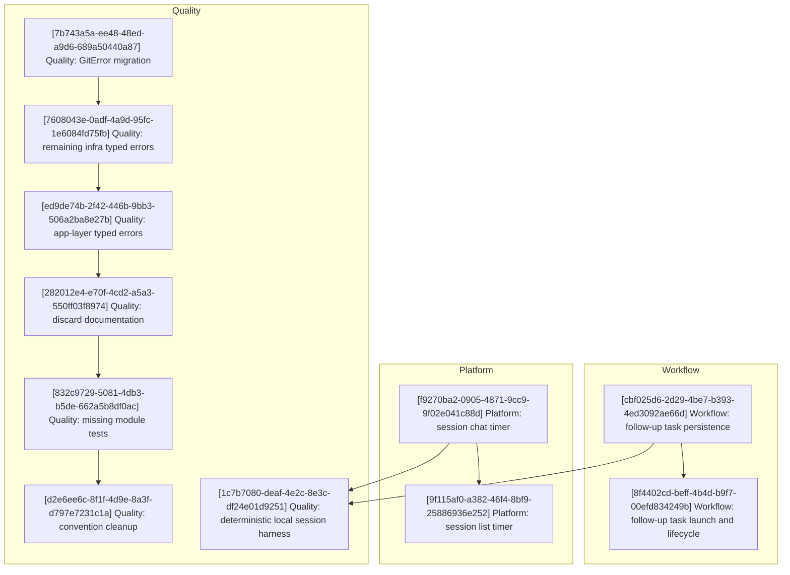

# Agentty Roadmap

Single-file roadmap for the active implementation backlog in `docs/plan/roadmap.md`. This document keeps one shared execution diagram and one shared implementation step list, with parallel work expressed as streams rather than as separate plan files.

## Current State Snapshot

| Area | Current state in codebase | Status |
|------|---------------------------|--------|
| Follow-up task workflow | Structured follow-up tasks do not exist in the protocol, persistence, or session UI. | Not Started |
| Session activity timing | `session` has no cumulative `InProgress` timing fields, chat shows no timer, and the session list has no time column. | Not Started |
| Deterministic scenario coverage | Local git tests exist, but there is no shared app-level scenario harness for a full local session workflow. | Partial |
| Typed errors and hygiene | `DbError` is landed, but git, app-server, remaining infra surfaces, and the app layer still expose string errors; discard comments, missing module tests, and convention cleanup remain open. | Partial |

## Active Streams

- `Workflow`: follow-up task persistence and sibling-session launch behavior.
- `Platform`: session timing surfaces.
- `Quality`: deterministic local session coverage, typed-error migration, and hygiene follow-up.

## Implementation Approach

- Keep one shared backlog and one step list for the whole roadmap instead of splitting work into per-feature mini-plans.
- Use `[UUID] Stream: Title` step headings so each slice stays identifiable in the roadmap while still showing stream ownership at a glance.
- Group adjacent steps by stream where dependencies allow, and only interleave streams when one stream needs a baseline from another.
- Start each stream with the smallest usable slice, then extend that stream only after the baseline slice lands.
- Reflect already-landed behavior only in the snapshot above; do not keep implemented steps in the plan below.
- Keep tests and documentation in the same step that changes behavior so each step stays mergeable on its own.
- In the current direct-to-`main` workflow, engineers claim roadmap ownership by landing and pushing a dedicated assignee-only commit before any implementation commits.

## Suggested Execution Order

## Implementation Steps

### [cbf025d6-2d29-4be7-b393-4ed3092ae66d] Workflow: Persist and render emitted follow-up tasks

#### Assignee

`No assignee`

#### Why now

The follow-up-task stream needs a durable response contract and visible session-level output before launch behavior can be layered on top.

#### Usable outcome

After a turn completes, the session shows a persisted list of low-severity follow-up tasks, and that list survives refresh and reopen.

#### Substeps

- [ ] **Extend the structured response protocol.** Add `follow_up_tasks` to the protocol model, schema, parser, prompt instructions, and wire type definitions in `crates/agentty/src/infra/agent/protocol/`.
- [ ] **Add durable follow-up task storage.** Create the singular `session_follow_up_task` table and thread task loading and replacement through `crates/agentty/src/infra/db.rs` and the session domain model.
- [ ] **Persist tasks during the existing turn-finalization path.** Update the current session completion flow so parsed follow-up tasks persist alongside summary and question state without introducing a second task-specific write path.
- [ ] **Render a read-only follow-up task section.** Update session chat and output components so follow-up tasks are visible without being merged into transcript markdown.

#### Tests

- [ ] Add protocol tests, DB round-trip tests, and session workflow/UI tests proving follow-up tasks persist and render without altering transcript output.

#### Docs

- [ ] Update `docs/site/content/docs/architecture/runtime-flow.md` and `docs/site/content/docs/architecture/module-map.md`.

### [8f4402cd-beff-4b4d-b9f7-00efd834249b] Workflow: Launch sibling sessions from follow-up tasks and retain task state

#### Assignee

`No assignee`

#### Why now

Once follow-up tasks are visible, the next usable slice is launching them into independent work without losing track of which tasks were already acted on.

#### Usable outcome

A user can launch a follow-up task into a normal sibling session, keep the source session open, and reopen later without duplicate launch noise.

#### Substeps

- [ ] **Add follow-up task selection and launch actions.** Extend session-view and app state so emitted follow-up tasks can be focused and launched through the normal session creation flow, seeding the new session's first prompt from the selected task content.
- [ ] **Mark launched tasks locally without parent links.** Persist launched/open task state on the source session without storing a parent-child session relationship.
- [ ] **Replace only open tasks on later turns.** Refresh open follow-up tasks on new turn results while retaining launched rows as local history.
- [ ] **Keep reopen and refresh behavior consistent.** Rehydrate follow-up task state through load and refresh paths so launched/open state survives session reloads.

#### Tests

- [ ] Add reducer, key-handler, workflow, worker, and reload tests for task launch, replacement rules, and reopen-time hydration.

#### Docs

- [ ] Update `docs/site/content/docs/usage/workflow.md`, `docs/site/content/docs/usage/keybindings.md`, and `docs/site/content/docs/architecture/runtime-flow.md` if the final lifecycle rules introduce visible launched/open task states.

### [f9270ba2-0905-4871-9cc9-9f02e041c88d] Platform: Persist cumulative `InProgress` time and render it in session chat

#### Assignee

`No assignee`

#### Why now

The timer stream needs a persistence baseline before the session list can add another column. Chat is the smallest end-to-end surface that proves the timing model.

#### Usable outcome

Session chat shows a compact cumulative active-work timer once a session has entered `InProgress`, the value ticks while work is active, and it freezes when the session leaves `InProgress`.

#### Substeps

- [ ] **Persist session timing fields.** Add `in_progress_total_seconds` and `in_progress_started_at` to `session` via a new migration and thread the fields through the DB and domain models.
- [ ] **Make status transitions timing-aware.** Update production status transitions and interrupted-work cleanup so entering and leaving `InProgress` opens and closes the persisted timing window consistently.
- [ ] **Render the timer in session chat.** Thread a deterministic wall-clock value into session chat rendering and reuse `format_duration_compact()` instead of inventing a second formatting path.
- [ ] **Document timing semantics in code.** Refresh or add `///` doc comments around the timing fields and helper behavior in the touched Rust files.

#### Tests

- [ ] Add DB tests for timing accumulation, workflow tests for repeated `InProgress` intervals, and session-chat tests for live ticking and truncation.

#### Docs

- [ ] Update `docs/site/content/docs/usage/workflow.md` to distinguish cumulative active-work timing from `/stats` lifetime duration.

### [9f115af0-a382-46f4-8bf9-25886936e252] Platform: Add the timer to the grouped session list

#### Assignee

`No assignee`

#### Why now

Chat proves the timing model first; the list should extend that settled behavior rather than inventing separate timer math.

#### Usable outcome

The Sessions tab shows a compact cumulative active-work timer for active and completed sessions using the same semantics as session chat.

#### Substeps

- [ ] **Add a dedicated time column to `session_list.rs`.** Render the compact `Time` column and keep grouped headers and placeholders aligned with the new layout.
- [ ] **Reuse the shared timer-label path.** Keep list rendering on the same session timing helper and `format_duration_compact()` output used by chat.
- [ ] **Thread the current timestamp into list rendering.** Extend render context and page constructors so active rows can tick without extra DB churn.

#### Tests

- [ ] Add session-list tests for the new column, row layout, and timer text for active, archived, and never-started sessions.

#### Docs

- [ ] Extend the same `docs/site/content/docs/usage/workflow.md` update with a short note about the session-list timer column.

### [1c7b7080-deaf-4e2c-8e3c-df24e01d9251] Quality: Ship one deterministic local session workflow slice

#### Assignee

`No assignee`

#### Why now

The quality stream needs one full app-level scenario that exercises the default local path before the remaining cleanup work keeps landing around it.

#### Usable outcome

A deterministic scenario test can create a disposable repo, run one scripted local agent turn through the app-facing workflow, and verify the resulting commit, worktree, transcript output, and terminal session state.

#### Substeps

- [ ] **Add the minimal local-session harness.** Create the smallest reusable harness under `crates/agentty/tests/support/` for temp repos, fake CLIs, and workflow assertions.
- [ ] **Add one deterministic local-session scenario.** Add `crates/agentty/tests/local_session_workflow.rs` to exercise a full local session journey without live credentials.
- [ ] **Refactor only the boundaries the scenario needs.** Keep any workflow refactors constrained to explicit boundaries rather than shell-heavy test-only helpers.

#### Tests

- [ ] Run the new local-session scenario and the touched workflow-module tests to confirm the harness covers the full local path.

#### Docs

- [ ] Update `CONTRIBUTING.md` with the deterministic local-session scenario command and the expectation that fake CLIs cover the default workflow path.

### [7b743a5a-ee48-48ed-a9d6-689a50440a87] Quality: Introduce `GitError` for `infra/git/` and `GitClient`

#### Assignee

`agentty/9ef45b3e`

#### Why now

The git boundary is the largest remaining source of `Result<..., String>` signatures and should set the typed-error pattern for the rest of the pending infra work.

#### Usable outcome

The git modules and `GitClient` return typed `GitError` variants instead of strings, while app-layer bridges remain only where later steps still need them.

#### Substeps

- [ ] **Define and re-export `GitError`.** Add `crates/agentty/src/infra/git/error.rs` and re-export the enum from `crates/agentty/src/infra/git.rs`.
- [ ] **Migrate the git modules.** Convert `sync.rs`, `rebase.rs`, `repo.rs`, `merge.rs`, and `worktree.rs` to return `GitError`.
- [ ] **Update `GitClient` and `RealGitClient`.** Move the trait and production implementation to typed git errors and keep temporary app bridges only where still required.
- [ ] **Maintain touched docs and indexes.** Add `///` doc comments for the new error type and update the relevant local `AGENTS.md` directory index.

#### Tests

- [ ] Run the existing git tests with `GitError` return types and add at least one assertion for a simulated `GitError::CommandFailed` path.

#### Docs

- [ ] Keep the new error type documented in code and the touched directory index synchronized with the new file layout.

### [7608043e-0adf-4a9d-95fc-1e6084fd75fb] Quality: Introduce typed errors for the remaining infra boundaries

#### Assignee

`No assignee`

#### Why now

After `GitError` lands, the remaining infra surfaces are small enough to finish in one follow-up slice before app-layer propagation removes the temporary bridges.

#### Usable outcome

Gemini, Codex, filesystem, version, clipboard, and remaining leaf helpers all return typed errors instead of strings.

#### Substeps

- [ ] **Add `AppServerError` and migrate the Gemini/Codex clients.** Introduce the typed app-server error surface and move both app-server client implementations to it.
- [ ] **Add `FsError`, `VersionError`, and `ClipboardError`.** Convert the filesystem, version, and clipboard-image boundaries to typed errors and route filesystem access through the explicit boundary where needed.
- [ ] **Migrate the remaining leaf helpers.** Convert the small remaining provider, submission, registry, and prompt helpers to existing or new typed errors.
- [ ] **Maintain touched docs and indexes.** Add `///` doc comments for the new error types and update any touched local `AGENTS.md` directory indexes.

#### Tests

- [ ] Run the touched infra test suites and add at least one representative typed-error assertion for each newly introduced boundary family.

#### Docs

- [ ] Keep the new infra error types documented in code and reflected in any touched directory indexes.

### [ed9de74b-2f42-446b-9bb3-506a2ba8e27b] Quality: Propagate typed errors through the app layer

#### Assignee

`No assignee`

#### Why now

The app layer is the last major place where the new infra errors are still flattened into strings.

#### Usable outcome

Session workflow, app services, and the CLI entrypoint propagate structured app-layer errors instead of `String`, and the temporary `.to_string()` bridges disappear.

#### Substeps

- [ ] **Define `SessionError`.** Add the typed session-layer error enum in `crates/agentty/src/app/session/` and re-export it from the session module router.
- [ ] **Migrate the session workflow surfaces.** Convert the remaining fallible workflow functions to `SessionError` and remove their temporary string bridges.
- [ ] **Define `AppError` and migrate top-level app paths.** Convert `App` methods plus `main.rs` error propagation to typed app-layer errors.
- [ ] **Maintain touched docs and indexes.** Add `///` doc comments for the new app-layer errors and update any touched local `AGENTS.md` indexes.

#### Tests

- [ ] Verify the full suite passes with no remaining `.map_err(|error| error.to_string())` bridges and add at least one app-level propagation assertion.

#### Docs

- [ ] Keep the new app-layer error types documented in code and in any touched directory indexes.

### [282012e4-e70f-4cd2-a5a3-550ff03f8974] Quality: Document silent `let _ =` result discards

#### Assignee

`No assignee`

#### Why now

Once the typed-error migration stabilizes, the next quality gap is distinguishing intentional fire-and-forget behavior from accidental swallow sites.

#### Usable outcome

Every `let _ =` that discards a `Result` in the touched backlog has a short justification comment explaining why the discard is safe.

#### Substeps

- [ ] **Document channel-send discards.** Add justification comments to the transport and worker send paths where disconnected receivers are acceptable.
- [ ] **Document reducer and workflow event discards.** Add the same justification style to event-sender discard sites in app/session workflow code.
- [ ] **Document cleanup and fallback discards.** Cover the remaining terminal cleanup, child-kill, lock-file cleanup, and similar best-effort discard paths.

#### Tests

- [ ] Run `cargo check -q --all-targets --all-features` after the comment sweep to ensure the touched files still compile cleanly.

#### Docs

- [ ] No external docs changes are required for the discard-comment sweep.

### [832c9729-5081-4db3-b5de-662a5b8df0ac] Quality: Add test modules for currently untested files

#### Assignee

`No assignee`

#### Why now

The roadmap still tracks a small set of public non-router files that lack `#[cfg(test)]` coverage entirely.

#### Usable outcome

Every targeted non-router file with public functions has at least a focused happy-path test module.

#### Substeps

- [ ] **Cover the remaining git/worktree and app-server registry gaps.** Add tests for `crates/agentty/src/infra/git/worktree.rs` and `crates/agentty/src/infra/app_server/registry.rs`.
- [ ] **Cover the remaining prompt/channel/style gaps.** Add tests for `crates/agentty/src/infra/app_server/prompt.rs`, `crates/agentty/src/infra/channel/factory.rs`, and `crates/agentty/src/ui/style.rs`.
- [ ] **Keep the test structure explicit.** Use Arrange/Act/Assert comments in every new test and reuse the existing mock or temp-dir boundaries instead of adding shell-heavy test helpers.

#### Tests

- [ ] Run `cargo test -q` with the shared-host thread budget from `AGENTS.md` after the new module tests land.

#### Docs

- [ ] No external docs changes are required for the missing-module test sweep.

### [d2e6ee6c-8f1f-4d9e-8a3f-d797e7231c1a] Quality: Fix the remaining convention violations

#### Assignee

`No assignee`

#### Why now

The final cleanup slice should happen after the larger migrations stop churning the same files.

#### Usable outcome

The remaining convention violations from the current audit are resolved without carrying open lint work into later roadmap updates.

#### Substeps

- [ ] **Rename the remaining single-letter variables.** Replace the outstanding single-letter layout variables with descriptive names.
- [ ] **Remove the remaining clippy bypass in test code.** Restructure the affected test assertion so no `#[allow()]` is needed.
- [ ] **Resolve or spin out the remaining deferred TODO.** Either implement the prompt-related TODO directly or add a new pending roadmap step if the follow-up is still too large for this slice.

#### Tests

- [ ] Run `pre-commit run clippy --all-files --hook-stage manual` and keep the touched code free of new `#[allow()]` workarounds.

#### Docs

- [ ] No external docs changes are required unless the deferred TODO turns into a new roadmap step.

## Cross-Stream Notes

- The `Workflow` follow-up-task launch flow depends on the persisted task storage from step 1. Step 2 should reuse the same stored task content instead of adding a second prompt source.
- The `Platform` timer stream should keep `session` timing math shared between step 3 and step 4 so chat and list views cannot drift.
- The `Quality` deterministic local scenario from step 5 should exercise the default in-process session flow that steps 1 through 4 rely on.
- The typed-error stream must keep local `AGENTS.md` directory indexes and `///` doc comments synchronized whenever it adds files such as `error.rs`.

## Status Maintenance Rule

- Keep only not-yet-implemented work in `## Implementation Steps`. Do not preserve completed steps in the roadmap.
- In the current direct-to-`main` workflow, claim a step by landing and pushing a dedicated commit that updates only that step's exact `#### Assignee` field before implementation work begins.
- After implementing a step, remove it from `## Implementation Steps`, refresh the snapshot rows that changed, and update the execution diagram only if the dependency graph changed materially.
- When a step changes behavior, complete its `#### Tests` and `#### Docs` work in that same step before removing it from the roadmap.
- If follow-up work remains after a step is otherwise complete, add a new pending step instead of keeping completed detail in place.
