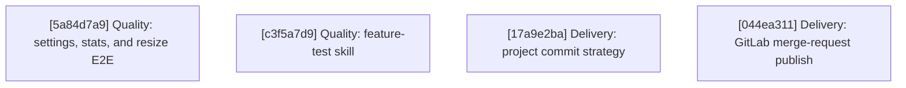

# Agentty Roadmap

Single-file roadmap for the active project backlog. Humans keep priorities and guardrails here, while only `Ready Now` work carries full execution detail and everything else stays intentionally lighter.

## Current State Snapshot

| Area | Current state in codebase | Status |
|------|---------------------------|--------|
| Follow-up task workflow | Persisted follow-up tasks now launch sibling sessions from session view, and launched/open state survives refresh, reopen, and restart flows. | Landed |
| Review request publish flow | Session chat keeps `p` for generic branch publishing and now exposes `Shift+P` to create or refresh the linked GitHub pull request while preserving the existing branch-publish popup flow. | Landed |
| Model availability scoping | Agentty now requires at least one locally runnable backend CLI at startup, `/model` and Settings filter model choices to runnable backends, and unavailable stored defaults fall back to the first available backend default. | Landed |
| Draft session workflow | `Shift+A` now creates explicit draft sessions that persist ordered staged draft messages, while `a` keeps the immediate-start first-prompt flow. | Landed |
| Session activity timing | `session` persists cumulative `InProgress` timing fields, and both chat and the grouped session list now show the same cumulative active-work timer. | Landed |
| Deterministic scenario coverage | E2E tests live in `crates/agentty/tests/e2e/` with shared `Journey` builders, `BuilderEnv` isolation, and high-quality VHS feature GIF generation; tests cover tab cycling, help overlay, quit confirmation, session lifecycle (creation, open, `j`/`k` navigation, deletion), prompt input (typing, multiline, cancel), and project page. | Landed |
| Typed errors and hygiene | `DbError`, `GitError`, `AppServerTransportError`, `AppServerError`, `AgentError`, `SessionError`, and `AppError` enums propagate typed errors through all infra and app-layer boundaries; module-level regression tests cover session access, review replay, agent backend, CLI error formatting, and stdin write helpers; convention cleanup remains open. | Partial |
| Agent instruction delivery | Codex and Gemini app-server turns now persist instruction-bootstrap state and reuse a compact reminder after the first full bootstrap for a provider context; Claude still resends the full wrapper until explicit session identity lands. | Partial |
| Testty proof pipeline | PTY-driven sessions, VT100 frame parsing, VHS tape compilation, snapshot baselines, overlay renderer, recipe layer, proof reports (labeled captures, four backends: frame-text, PNG strip, GIF, HTML), native bitmap renderer, frame diffing, journey composition, and scale tooling are all landed. | Landed |
| Project delivery strategy | Review-ready sessions can already merge into the base branch or publish a session branch, but projects configured in Agentty still cannot declare whether their normal landing path should be direct merge to `main` or a pull-request flow. | Missing |

## Active Streams

- `Agents`: machine-scoped model availability for settings and slash-model selection.
- `Quality`: E2E expansion for settings/stats/resize, feature-test skill for agent-driven E2E creation, feature test backlog for shipped features, and convention hygiene follow-up.
- `Delivery`: project-level landing strategy plus forge-aware review-request publishing for review-ready sessions, including direct-merge vs. review-request expectations.
- `Protocol`: provider-managed session bootstrap instructions and compact context replay without repo-side agent files.

## Planning Model

- Keep no more than `5` fully expanded steps in `Ready Now`.
- Keep `Queued Next` as the compact promotion queue for the next few outcomes, not as a second fully detailed backlog.
- Keep `Parked` for strategic work that matters, but should not consume active planning attention yet.
- Treat `500` changed lines as the hard implementation ceiling and keep `Ready Now` slices estimated at `350` changed lines or less so normal implementation drift still stays reviewable.
- Run `cargo run -q -p ag-xtask -- roadmap context-digest` before promoting queued or parked work so the decision uses fresh repository context.
- When a `Ready Now` step lands and queued work remains, promote the next queued card into `Ready Now` instead of leaving the execution window short.
- Until lease automation exists, only `Ready Now` items can carry an assignee, and every promoted `Ready Now` step must set that assignee in the promotion edit.
- When promoting queued or parked work into `Ready Now`, either name an explicit `@username` or default to the current promoter resolved with `gh api user --jq .login`; do not use a separate claim-only edit.
- Keep tests and documentation attached to the same `Ready Now` step that changes behavior.
- Keep `Ready Now` implementation scopes to `1..=3` bullets under `#### Substeps`; when a step needs broader adoption, copy polish, or a second peer surface, queue the follow-up instead of widening the current slice.

## Ready Now

### [5a84d7a9-3346-4e01-90be-ce5d3783b32f] Quality: Add settings, stats, and resize E2E tests

#### Assignee

`@minev-dev`

#### Why now

The session-lifecycle E2E slice is already active in `Ready Now`, and the next deterministic coverage gap is still confined to the same PTY-driven test harness. Promoting this follow-up now keeps the quality stream moving without reopening workflow or protocol planning.

#### Usable outcome

E2E coverage validates settings navigation and edit overlays, stats-page empty-state rendering, project selection tab switching, and both cramped and wide terminal layout behavior through full UI flows.

#### Substeps

- [ ] **Cover settings, stats, and project navigation flows.** Extend `crates/agentty/tests/e2e/navigation.rs`, `crates/agentty/tests/e2e/project.rs`, and shared helpers in `crates/agentty/tests/e2e/common.rs` so the E2E suite covers opening the settings overlay with `Enter`, cancelling it with `Esc`, rendering the stats page empty state, and switching from project selection back to the sessions tab.
- [ ] **Add terminal-size layout coverage.** Add or extend scenarios in `crates/agentty/tests/e2e/navigation.rs` and `crates/agentty/tests/e2e/common.rs` so the PTY suite exercises a cramped `40x12` terminal and a wide `200x50` terminal without regressing layout stability.

#### Tests

- [ ] Run `cargo test -p agentty --test e2e` after adding the new scenarios so the full PTY-driven suite validates the shared helpers and terminal-size coverage together.

#### Docs

- [ ] No user-facing behavior changes — no doc updates needed.

### [c3f5a7d9-2b4e-6f18-8a0c-5d7e9f1b3a5c] Quality: Add feature-test skill for agent-driven E2E test creation

#### Assignee

`@andagaev`

#### Why now

Zola auto-discovery just landed, proving the full workflow from E2E test to VHS GIF to feature `.md` page to auto-rendered features page. Codifying this pattern into a reusable skill now ensures agents create feature tests consistently using the `FeatureTest` builder before the pattern diverges across contributors.

#### Usable outcome

A `feature-test` skill in `skills/feature-test/SKILL.md` guides agents through creating E2E tests with VHS GIF generation for new visible UI features, including criteria for when a feature test is warranted (visible UI behavior change, user-facing, demonstrable in a scenario), naming conventions (test name = GIF filename = content page `extra.gif` reference), the `FeatureTest` builder pattern from `crates/agentty/tests/e2e/common.rs`, and Zola content page creation in `docs/site/content/features/`.

#### Substeps

- [ ] **Create `skills/feature-test/SKILL.md` with the feature-test workflow.** Define when a feature test is warranted, the naming convention (`test_name` → `name.gif` → `content/features/name.md`), the `FeatureTest` builder pattern from `crates/agentty/tests/e2e/common.rs`, and the Zola content page creation step with frontmatter fields (`title`, `description`, `weight`, `[extra]` with `gif`).
- [ ] **Register the skill in `skills/AGENTS.md` and update the root `AGENTS.md` meta-agent inventory.** Add a `feature-test` entry to both the skill catalog and the Interactive Skills table.

#### Tests

- [ ] No Rust tests needed for a pure-markdown skill. Verify the skill file exists and symlinks resolve.

#### Docs

- [ ] No user-facing doc pages need updating — the skill itself is the documentation.

### [17a9e2ba-0b7d-407d-9cd4-72807ef7bc1f] Delivery: Add project commit strategy selection

#### Assignee

`@minev-dev`

#### Why now

The GitHub-specific `Shift+P` pull-request publish shortcut is now landed, so the next delivery gap is deciding which repositories should default to that review-request flow versus direct merge to `main`.

#### Usable outcome

Each Agentty project can declare its expected landing path, and review-ready sessions can use that policy to present the right default delivery path instead of treating merge and pull-request workflows as interchangeable.

#### Substeps

- [ ] **Persist the per-project landing strategy setting.** Update the project and settings domain models plus the backing persistence in `crates/agentty/src/domain/project.rs`, `crates/agentty/src/domain/setting.rs`, `crates/agentty/src/infra/db.rs`, and `crates/agentty/src/app/setting.rs` so each project stores a canonical delivery strategy such as direct merge versus pull request.
- [ ] **Expose the landing strategy in project settings UI.** Update the settings runtime and UI flow in `crates/agentty/src/runtime/mode/list.rs`, `crates/agentty/src/ui/page/setting.rs`, and related settings state/helpers so users can view and change the active project's landing strategy without leaving Agentty.
- [ ] **Apply the landing strategy in review-ready session actions.** Update `crates/agentty/src/app/core.rs`, `crates/agentty/src/runtime/mode/session_view.rs`, `crates/agentty/src/ui/state/help_action.rs`, and related delivery workflow code so session-chat defaults and copy respect whether the active project expects direct merge or pull-request publishing.

#### Tests

- [ ] Add or extend coverage in `crates/agentty/src/app/setting.rs`, `crates/agentty/src/infra/db.rs`, `crates/agentty/src/runtime/mode/list.rs`, `crates/agentty/src/runtime/mode/session_view.rs`, and `crates/agentty/src/ui/page/setting.rs` for persisted strategy round-trips, settings editing, and delivery-action selection in session view.

#### Docs

- [ ] Update `docs/site/content/docs/usage/workflow.md`, `docs/site/content/docs/usage/keybindings.md`, and `docs/site/content/docs/getting-started/overview.md` to explain the new per-project delivery strategy setting and how it affects review-ready session actions.

### [044ea311-f8d5-4fe5-945f-a08df8ef5f57] Delivery: Support GitLab merge-request publish on `Shift+P`

#### Assignee

`@minev-dev`

#### Why now

The current `Shift+P` flow already concentrates its GitHub-only assumptions in the forge model, publish workflow, and a small set of session-view copy surfaces. That makes GitLab merge-request support an atomic delivery slice that can land now without waiting on separate roadmap work.

#### Usable outcome

GitLab-hosted projects can use `Shift+P` to create or refresh merge requests with forge-native titles, messages, and helper copy, while GitHub pull-request behavior remains unchanged.

#### Substeps

- [ ] **Add GitLab review-request support to the forge and publish workflow.** Extend `crates/ag-forge/src/model.rs` and the review-request client plumbing it drives so Agentty can recognize GitLab remotes, build merge-request creation URLs, and expose GitLab display metadata needed by `crates/agentty/src/app/branch_publish.rs`.
- [ ] **Make `Shift+P` status and overlay copy forge-aware.** Update the GitLab-sensitive publish titles, success and failure messages, and review-request URL handling in `crates/agentty/src/app/branch_publish.rs`, `crates/agentty/src/app/session/workflow/refresh.rs`, `crates/agentty/src/ui/component/publish_branch_overlay.rs`, and `crates/agentty/src/ui/state/help_action.rs` so session chat and publish overlays describe pull requests versus merge requests correctly for the active forge.

#### Tests

- [ ] Add or extend regression coverage in `crates/ag-forge/src/model.rs`, `crates/agentty/src/app/branch_publish.rs`, `crates/agentty/src/app/session/workflow/refresh.rs`, `crates/agentty/src/ui/component/publish_branch_overlay.rs`, and `crates/agentty/src/ui/state/help_action.rs` for GitLab remote detection, merge-request URL generation, forge-aware publish messaging, and `Shift+P` help text.

#### Docs

- [ ] Update `docs/site/content/docs/usage/workflow.md` and `docs/site/content/docs/usage/keybindings.md` to explain that `Shift+P` publishes the active forge review request, including GitHub pull requests and GitLab merge requests.

## Ready Now Execution Order

## Queued Next

### [a7e41b3c-9d28-4f56-8c1a-6b5e2d4f8a91] Quality: Add draft session and prompt input feature tests

#### Outcome

Ship `FeatureTest`-based E2E coverage for draft session creation via `Shift+A` (verify draft state, staged message persistence, draft title sync) and prompt input features (file `@` mention completion, slash command input) so the feature test gate is satisfied for these already-landed features.

#### Promote when

Promote when a `Ready Now` quality slot opens and the feature-test skill `[c3f5a7d9]` has landed to guide the test creation pattern.

#### Depends on

`[c3f5a7d9] Quality: Add feature-test skill for agent-driven E2E test creation` (in Ready Now)

### [b2f83d5e-1a64-47c9-9e3b-8c7d6f2a4e10] Quality: Migrate legacy E2E tests to `FeatureTest` builder

#### Outcome

Migrate the 15 E2E tests that currently use the legacy `save_feature_gif` or direct `Scenario` patterns to the declarative `FeatureTest` builder, ensuring consistent lifecycle management, GIF generation, and Zola page creation across all feature tests.

#### Promote when

Promote when the feature-test skill has landed and the draft/prompt feature tests validate the `FeatureTest` pattern at scale.

#### Depends on

`[c3f5a7d9] Quality: Add feature-test skill for agent-driven E2E test creation` (in Ready Now)

### [8d03ed45-0f91-4d1d-b761-2d74f7027ef7] Protocol: Track explicit Claude session identity for one-time bootstrap reuse

#### Outcome

Give Claude-backed sessions an explicit provider session identifier so Agentty can safely reuse the same bootstrap-once instruction delivery strategy instead of relying on implicit `claude -c` continuation behavior.

#### Promote when

Promote when maintainers want Claude sessions to reuse the bootstrap-once flow now that Codex and Gemini app-server contexts have the baseline delivery planner.

#### Depends on

`[d9307a06] Protocol: Bootstrap direct agent instructions once per app-server session` (landed)

### [84aa58cc-8cd0-41cb-a6fc-a97016e85f0d] Protocol: Replace reset replay with compact session memory

#### Outcome

Restarted provider sessions resend a structured session-memory summary of constraints, open questions, and touched files instead of replaying the full transcript whenever a runtime loses native context.

#### Promote when

Promote when the compact app-server follow-up path proves stable enough that restart-specific replay size becomes the next protocol bottleneck.

#### Depends on

`[d9307a06] Protocol: Bootstrap direct agent instructions once per app-server session` (landed)

## Parked

### [282012e4-d4c0-4a83-8d24-a5d137f40111] Quality: Refresh discard-path documentation

#### Outcome

Bring discard-path documentation and comments back in sync after the typed-error and workflow changes settle.

#### Promote when

Promote when the active quality slices stop changing the discard behavior and wording.

#### Depends on

`[ed9de74b] Quality: Propagate typed errors through the app layer` (landed)

### [d2e6ee6c-e784-4d54-aad6-559c2c580101] Quality: Sweep convention cleanup follow-up

#### Outcome

Finish the remaining convention cleanup after active behavior work is no longer changing the same files.

#### Promote when

Promote when the active quality slices stop rewriting the same modules.

#### Depends on

`[832c9729] Quality: Fill the missing module-level regression tests` (landed)

### [1c7b7080-deaf-4e2c-8e3c-df24e01d9251] Quality: Ship one deterministic local session workflow slice

#### Outcome

Add one deterministic local-session scenario plus the minimal reusable harness so the default in-process workflow path can be validated without live credentials.

#### Promote when

Promote when a `Ready Now` slot opens and the active quality slices stop competing for the same session lifecycle boundaries.

#### Depends on

`None`

### [c4d92f8a-3e71-4b05-a8f6-9d1e5c7b2a63] Quality: Add agent-dependent feature tests

#### Outcome

Ship `FeatureTest`-based E2E coverage for features that require active session state: diff view (`d` key from `Review`), question mode (agent-generated questions with predefined answers), follow-up task navigation (sibling session launch), review request publish flow (`p` and `Shift+P` from `Review`), session activity timer display, and active model display in session header.

#### Promote when

Promote when `[1c7b7080] Quality: Ship one deterministic local session workflow slice` lands, providing in-process mock agent channels that can drive sessions to `Review`, `Question`, and other agent-dependent states within the PTY binary.

#### Depends on

`[1c7b7080] Quality: Ship one deterministic local session workflow slice` (parked)

### [6bb0cae7-c07c-4fab-ae6b-e74444d3f0f0] Planning: Move roadmap tasks to a single canonical TOML plan

#### Outcome

Let Agentty and `skills/implementation-plan` manage roadmap tasks through one canonical `docs/plan/roadmap.toml` file instead of Markdown-first task editing.

#### Promote when

Promote when maintainers want Agentty to list, claim, reorder, or transition roadmap tasks directly without maintaining both a rendered roadmap document and a separate structured source.

#### Depends on

`None`

## Context Notes

- `Agents: Scope model lists to locally available backends` should reuse one shared availability snapshot across Settings and `/model` instead of probing CLIs separately in render paths.
- `Protocol: Bootstrap direct agent instructions once per app-server session` should keep the canonical instruction contract inside Agentty-managed prompt construction and persistence, not in user-maintained provider instruction files.
- The parked `[6bb0cae7] Planning: Move roadmap tasks to a single canonical TOML plan` should make `docs/plan/roadmap.toml` the only roadmap source of truth for Agentty and `skills/implementation-plan`.
- The parked local session harness slice should come back only when the active quality slices stop churning the same session lifecycle seams.
- The typed-error migration and module-test backfill are both complete. Convention cleanup remains open in the parked sweep card.
- `Delivery: Add project commit strategy selection` should define the landing policy at the Agentty project level so merge and publish actions can present the right default path for each managed repository.
- `Delivery: Support GitLab merge-request publish on Shift+P` should generalize the current GitHub-only review-request wording in session chat and related publish overlays, rather than adding a second forge-specific shortcut path.
- Testty proof pipeline is fully landed in `crates/testty/`. Future enhancements (e.g., additional proof backends, CI integration, or new recipe types) should be queued as new parked cards referencing that crate.
- VHS feature GIF generation is fully landed with `VhsTapeSettings::feature_demo()` in testty, `BuilderEnv` + `save_feature_gif()` in E2E common helpers, and content-hash caching via `.hash` sidecar files. The showcase tests in `crates/agentty/tests/showcase.rs` remain separate for polished marketing demos with seeded databases.
- Zola auto-discovery for feature GIFs is fully landed with `get_section()` in `features.html`, individual `.md` pages in `content/features/` with `weight` ordering and `extra.gif` frontmatter, a `feature-page.html` template for standalone pages, and the pattern documented in `managing-docs-with-zola.md`. The homepage feature card in `index.html` remains hardcoded and curated separately.
- `Quality: Add feature-test skill` should codify the proven E2E → VHS GIF → feature `.md` → auto-discovered features page workflow into `skills/feature-test/SKILL.md`, referencing the `FeatureTest` builder pattern from `crates/agentty/tests/e2e/common.rs` and the Zola content page conventions from `docs/site/content/features/`.
- The Feature Test Gate rule in `AGENTS.md` requires every user-visible feature to ship with a `FeatureTest`-based E2E test. The backlog of feature tests for already-shipped features is tracked across three queued/parked cards: `[a7e41b3c]` covers draft sessions and prompt input (testable now), `[b2f83d5e]` covers migrating legacy tests to the `FeatureTest` builder, and `[c4d92f8a]` covers agent-dependent features blocked on the local session harness `[1c7b7080]`.
- E2E tests use the testty framework and drive the full UI flow (no pre-seeded database). Tests that require agent-dependent states (diff view from `Review`, question mode, follow-up task navigation) are deferred until an in-process mock agent channel can be wired into the PTY binary or the parked local session workflow harness lands.
- The parked `[1c7b7080] Quality: Ship one deterministic local session workflow slice` covers in-process session testing with mock agent channels. The E2E test stream covers PTY-driven TUI testing. These are complementary, not overlapping.
- Run `cargo run -q -p ag-xtask -- roadmap context-digest` before promoting queued or parked work to `Ready Now`.

## Status Maintenance Rule

- Keep no more than `5` items in `## Ready Now`.
- Keep only `Ready Now` items fully expanded with `#### Assignee`, `#### Why now`, `#### Usable outcome`, `#### Substeps`, `#### Tests`, and `#### Docs`.
- Keep `## Queued Next` and `## Parked` as compact promotion cards with `#### Outcome`, `#### Promote when`, and `#### Depends on`.
- Promote queued or parked work into `## Ready Now` by assigning that step in the same roadmap edit, either to an explicit `@username` or to the current promoter resolved through `gh api user --jq .login`.
- Keep each `Ready Now` step estimated at `350` changed lines or less so implementation remains below the `500`-line hard ceiling, and split any wider follow-up into `## Queued Next`.
- After a `Ready Now` step lands, remove it from `## Ready Now`, refresh any changed snapshot rows, and promote the next queued card whenever `## Queued Next` still has work.
- If follow-up work remains after a step lands, add or update a compact queued or parked card instead of preserving the completed step.
