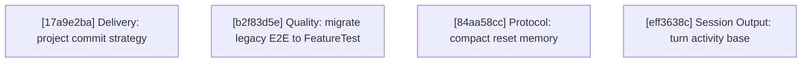

# Agentty Roadmap

Single-file roadmap for the active user-facing project backlog. Humans keep priorities and guardrails here, while only `Ready Now` work carries full execution detail and everything else stays intentionally lighter.

## Current State Snapshot

| Area | Current state in codebase | Status |
|------|---------------------------|--------|
| Review request publish flow | Session chat keeps `p` for generic branch publishing, and `Shift+P` now creates or refreshes the linked GitHub pull request or GitLab merge request while preserving the same publish popup flow. | Landed |
| Published branch sync | Sessions now auto-push already-published remote branches after later completed turns and surface sync progress or failure in session output. | Landed |
| Model availability scoping | Agentty now requires at least one locally runnable backend CLI at startup, `/model` and Settings filter model choices to runnable backends, and unavailable stored defaults fall back to the first available backend default. | Landed |
| Draft session workflow | `Shift+A` now creates explicit draft sessions that persist ordered staged draft messages, while `a` keeps the immediate-start first-prompt flow. | Landed |
| Session activity timing | `session` persists cumulative `InProgress` timing fields, and both chat and the grouped session list now show the same cumulative active-work timer. | Landed |
| Header guidance FYIs | The top status bar now rotates page-specific `FYI:` guidance for the sessions list and session chat once per minute while keeping version and update-state text visible. | Landed |
| Project delivery strategy | Review-ready sessions can already merge into the base branch or publish a session branch, but projects configured in Agentty still cannot declare whether their normal landing path should be direct merge to `main` or a pull-request flow. | Missing |
| Chained session workflow | Follow-up tasks can already launch sibling sessions, but each new session still starts from the active project base branch and published review requests always target that same base branch instead of another session branch. | Missing |
| Session resume efficiency | Codex and Gemini app-server turns already reuse a compact reminder after the first bootstrap, but Claude sessions still resend the full wrapper because session identity is not yet explicit. | Partial |
| Turn activity summaries | Session output stores the assistant answer, questions, and summary, but it does not append a normalized per-turn digest of used skills, executed commands, or changed-file CRUD after each turn. | Missing |

## Active Streams

- `Delivery`: project-level landing strategy, forge-aware review-request publishing, and chained-session delivery for review-ready sessions, including direct-merge vs. review-request expectations.
- `Quality`: PTY-driven E2E coverage and `FeatureTest` migration for landed visible session flows.
- `Protocol`: provider session continuity and compact context replay so resumed chats stay responsive without losing guidance.
- `Session Output`: per-turn execution digests that summarize the commands, changed files, and skill activity users need to review directly in the chat transcript.

## Planning Model

- Keep no more than `5` fully expanded steps in `Ready Now`.
- Keep `Queued Next` as the compact promotion queue for the next few outcomes, not as a second fully detailed backlog.
- Keep `Parked` for strategic work that matters, but should not consume active planning attention yet.
- Treat `500` changed lines as the hard implementation ceiling and keep `Ready Now` slices estimated at `350` changed lines or less so normal implementation drift still stays reviewable.
- Run `cargo run -q -p ag-xtask -- roadmap context-digest` before promoting queued or parked work so the decision uses fresh repository context.
- When a `Ready Now` step lands and queued work remains, promote the next queued card into `Ready Now` instead of leaving the execution window short.
- Until lease automation exists, only `Ready Now` items can carry an assignee, and every promoted `Ready Now` step must set that assignee in the promotion edit.
- When promoting queued or parked work into `Ready Now`, either name an explicit `@username` or default to the current promoter resolved with `gh api user --jq .login`; do not use a separate claim-only edit.
- Keep roadmap items focused on user-facing outcomes; validation and documentation stay in the same roadmap item through its `#### Tests` and `#### Docs` sections instead of becoming standalone cards.
- Keep `Ready Now` implementation scopes to `1..=3` bullets under `#### Substeps`; when a step needs broader adoption, copy polish, or a second peer surface, queue the follow-up instead of widening the current slice.

## Ready Now

### [17a9e2ba-0b7d-407d-9cd4-72807ef7bc1f] Delivery: Add project commit strategy selection

#### Assignee

`@minev-dev`

#### Why now

The GitHub-specific `Shift+P` pull-request publish shortcut is now landed, so the next delivery gap is deciding which repositories should default to that review-request flow versus direct merge to `main`.

#### Usable outcome

Each Agentty project can declare its expected landing path, and review-ready sessions can use that policy to present the right default delivery path instead of treating merge and pull-request workflows as interchangeable.

#### Substeps

- [ ] **Persist the per-project landing strategy setting.** Update the project and settings domain models plus the backing persistence in `crates/agentty/src/domain/project.rs`, `crates/agentty/src/domain/setting.rs`, `crates/agentty/src/infra/db.rs`, and `crates/agentty/src/app/setting.rs` so each project stores a canonical delivery strategy such as direct merge versus pull request, with coverage for persisted strategy round-trips.
- [ ] **Expose the landing strategy in project settings UI.** Update the settings runtime and UI flow in `crates/agentty/src/runtime/mode/list.rs`, `crates/agentty/src/ui/page/setting.rs`, and related settings state/helpers so users can view and change the active project's landing strategy without leaving Agentty, and cover the editing flow in the touched runtime and UI tests.
- [ ] **Apply the landing strategy in review-ready session actions.** Update `crates/agentty/src/app/core.rs`, `crates/agentty/src/runtime/mode/session_view.rs`, `crates/agentty/src/ui/state/help_action.rs`, and `docs/site/content/docs/usage/workflow.md`, `docs/site/content/docs/usage/keybindings.md`, and `docs/site/content/docs/getting-started/overview.md` so session-chat defaults, help copy, and end-user docs all reflect whether the active project expects direct merge or pull-request publishing.

#### Tests

- [ ] Add or extend coverage in `crates/agentty/src/app/setting.rs`, `crates/agentty/src/infra/db.rs`, `crates/agentty/src/runtime/mode/list.rs`, `crates/agentty/src/runtime/mode/session_view.rs`, and `crates/agentty/src/ui/page/setting.rs` for persisted strategy round-trips, settings editing, and delivery-action selection in session view.

#### Docs

- [ ] Update `docs/site/content/docs/usage/workflow.md`, `docs/site/content/docs/usage/keybindings.md`, and `docs/site/content/docs/getting-started/overview.md` to explain the new per-project delivery strategy setting and how it affects review-ready session actions.

### [b2f83d5e-1a64-47c9-9e3b-8c7d6f2a4e10] Quality: Migrate legacy E2E tests to `FeatureTest` builder

#### Assignee

`@andagaev`

#### Why now

The `feature-test` skill has landed, codifying the `FeatureTest` builder pattern. Migrating the remaining legacy tests now standardizes the entire E2E suite before new feature tests accumulate more pattern divergence.

#### Usable outcome

All E2E tests in `crates/agentty/tests/e2e/` use the declarative `FeatureTest` builder for lifecycle management, GIF generation, and Zola page creation, eliminating the legacy `save_feature_gif` and direct `Scenario` patterns.

#### Substeps

- [ ] **Migrate navigation and confirmation E2E tests to `FeatureTest` builder.** Update tests in `crates/agentty/tests/e2e/navigation.rs` and `crates/agentty/tests/e2e/confirmation.rs` to use the `FeatureTest` builder from `crates/agentty/tests/e2e/common.rs` instead of manual `Scenario` + `save_feature_gif` calls.
- [ ] **Migrate session and project E2E tests to `FeatureTest` builder.** Update tests in `crates/agentty/tests/e2e/session.rs` and `crates/agentty/tests/e2e/project.rs` to use the `FeatureTest` builder, and remove the legacy `save_feature_gif` helper from `crates/agentty/tests/e2e/common.rs` once no tests reference it.

#### Tests

- [ ] Run `cargo test -p agentty --test e2e` after migration to verify all scenarios still pass and GIF generation still works.

#### Docs

- [ ] No user-facing doc changes needed — this is an internal test infrastructure migration.

### [84aa58cc-8cd0-41cb-a6fc-a97016e85f0d] Protocol: Replace reset replay with compact session memory

#### Assignee

`@minev-dev`

#### Why now

Codex and Gemini follow-up turns already reuse a compact reminder after the
first bootstrap, but provider restarts still force a heavier replay path and
Claude continues to resend the full wrapper when native session identity is not
carried across reconnects.

#### Usable outcome

Restarted provider sessions resend a compact structured session-memory summary
of constraints, open questions, and touched files instead of replaying the full
transcript whenever a runtime loses native context.

#### Substeps

- [ ] **Define one restart-safe session-memory summary contract.** Update the touched prompt templates and protocol builders in `crates/agentty/src/infra/agent/template/`, `crates/agentty/src/infra/agent/protocol/`, and related prompt-shaping code so restart flows can serialize a compact summary of constraints, open questions, and touched files without replaying the full transcript.
- [ ] **Route restart and resume flows through the compact memory path.** Update the touched provider and app-server resume plumbing in `crates/agentty/src/infra/agent/`, `crates/agentty/src/infra/app_server/`, and any related session wiring so restarts reuse the compact session-memory summary while the first-turn bootstrap rules stay unchanged.
- [ ] **Adopt the compact path for Claude without regressing existing follow-up behavior.** Update the touched Claude session wiring and resume coverage so Claude no longer resends the full wrapper after a reset, and keep the already-compact Codex and Gemini follow-up behavior aligned with the shared restart contract.

#### Tests

- [ ] Add or extend coverage in the touched `crates/agentty/src/infra/agent/`, `crates/agentty/src/infra/app_server/`, and protocol-template tests for session-memory serialization, restart-triggered prompt selection, and Claude resume flows that now avoid full-transcript replay.

#### Docs

- [ ] Update `docs/site/content/docs/usage/workflow.md`, `docs/site/content/docs/agents/backends.md`, and `docs/site/content/docs/architecture/runtime-flow.md` to describe compact restart memory, the resume path it affects, and the provider behavior changes for restarted sessions.

### [eff3638c-359c-4374-9388-d3e9e4c2f26c] Session Output: Define turn activity storage and protocol base

#### Assignee

`@minev-dev`

#### Why now

Review-ready workflows and header guidance still leave one transcript gap: users cannot review a stable per-turn record of commands, skills, and changed-file CRUD without reading raw stream noise or opening the diff.

#### Usable outcome

Completed turns persist one shared activity-summary record and can print a stable session-output block for changed-file CRUD immediately, while the same contract is ready for later Claude, Gemini, and Codex command and skill capture.

#### Substeps

- [ ] **Define the shared turn-activity protocol and persistence shape.** Update `crates/agentty/src/infra/channel/contract.rs`, `crates/agentty/src/infra/app_server/contract.rs`, `crates/agentty/src/infra/agent/protocol/`, `crates/agentty/src/domain/session.rs`, and `crates/agentty/src/infra/db.rs` so Agentty has one normalized model for used skills, executed commands, and changed-file CRUD plus the migrations or persistence wiring needed to store that per-turn activity data.
- [ ] **Add provider-independent changed-file CRUD derivation from git state.** Update `crates/agentty/src/infra/git/client.rs`, `crates/agentty/src/infra/git/sync.rs`, `crates/agentty/src/app/session/workflow/task.rs`, and related session workflow plumbing so completed turns compute create, update, and delete file sets from the session worktree relative to the base branch and attach that result to the shared activity record without depending on provider-specific file events.
- [ ] **Render the shared activity record into session output and replay paths.** Update `crates/agentty/src/app/core.rs`, `crates/agentty/src/app/session/workflow/worker.rs`, `crates/agentty/src/runtime/mode/session_view.rs`, and the touched transcript helpers so the new summary block prints once per completed turn, survives reload and replay, and leaves command or skill sections ready to populate as provider capture cards land.

#### Tests

- [ ] Add or extend coverage in `crates/agentty/src/infra/channel/contract.rs`, `crates/agentty/src/infra/db.rs`, `crates/agentty/src/infra/git/client.rs`, `crates/agentty/src/app/session/workflow/task.rs`, `crates/agentty/src/app/session/workflow/worker.rs`, and `crates/agentty/src/app/core.rs` for activity-record serialization, migration or persistence round-trips, changed-file CRUD classification, and transcript replay without duplicate summary blocks.

#### Docs

- [ ] Update `docs/site/content/docs/usage/workflow.md`, `docs/site/content/docs/architecture/runtime-flow.md`, and `docs/site/content/docs/architecture/testability-boundaries.md` to document the shared turn-activity summary contract, the git-derived CRUD source of truth, and how later provider integrations populate command and skill data.

## Ready Now Execution Order

## Queued Next

### [8e074c6d-64ad-427f-9262-0769e68a8a2b] Delivery: Chain sessions for stacked review requests

#### Outcome

Review-ready sessions can launch a child session from the current session branch, keep the parent-child relationship visible in Agentty, and publish the child review request against the parent branch so stacked pull requests or merge requests stay ordered.

#### Promote when

Promote when `[17a9e2ba-0b7d-407d-9cd4-72807ef7bc1f] Delivery: Add project commit strategy selection` lands and the Delivery stream is ready for the next review-workflow outcome.

#### Depends on

`[17a9e2ba-0b7d-407d-9cd4-72807ef7bc1f] Delivery: Add project commit strategy selection`

### [b5ff4c83-3af4-4df4-905f-80fd7e8f9d49] Session Output: Capture Claude turn activity

#### Outcome

Claude-backed turns populate the shared activity model with executed commands, skill usage, and file-change hints sourced from Claude stream or hook surfaces so Claude sessions can contribute to the per-turn execution summary.

#### Promote when

Promote when `[eff3638c-359c-4374-9388-d3e9e4c2f26c] Session Output: Define turn activity storage and protocol base` is in place and Claude is the next provider chosen for activity-summary rollout.

#### Depends on

`[eff3638c-359c-4374-9388-d3e9e4c2f26c] Session Output: Define turn activity storage and protocol base`

### [55c3f18d-7185-41de-8d2b-c109fdb9d3ca] Session Output: Capture Gemini turn activity

#### Outcome

Gemini-backed turns populate the shared activity model with executed commands, skill or tool usage, and file-change hints sourced from Gemini ACP or CLI activity surfaces so Gemini sessions can contribute to the per-turn execution summary.

#### Promote when

Promote when `[eff3638c-359c-4374-9388-d3e9e4c2f26c] Session Output: Define turn activity storage and protocol base` is in place and Gemini is the next provider chosen for activity-summary rollout.

#### Depends on

`[eff3638c-359c-4374-9388-d3e9e4c2f26c] Session Output: Define turn activity storage and protocol base`

### [593a1d75-5790-4904-a69c-b31eb9b1af2e] Session Output: Capture Codex turn activity

#### Outcome

Codex-backed turns populate the shared activity model with executed commands, used skills, and file-change data sourced from Codex app-server turn events so Codex sessions can contribute to the per-turn execution summary.

#### Promote when

Promote when `[eff3638c-359c-4374-9388-d3e9e4c2f26c] Session Output: Define turn activity storage and protocol base` is in place and Codex is the next provider chosen for activity-summary rollout.

#### Depends on

`[eff3638c-359c-4374-9388-d3e9e4c2f26c] Session Output: Define turn activity storage and protocol base`

## Parked

No parked user-facing cards right now.

## Context Notes

- `Delivery: Add project commit strategy selection` should define the landing policy at the Agentty project level so merge and publish actions can present the right default path for each managed repository.
- `Delivery: Chain sessions for stacked review requests` should build on the existing follow-up-task sibling-session flow, persist session lineage, and let review-request publishing target the parent session branch instead of always targeting the project base branch.
- `Protocol: Replace reset replay with compact session memory` should stay restart-specific, preserve the first-turn bootstrap prompt, and reuse the already-compact steady-state follow-up path instead of inventing another session-memory format.
- `Session Output: Define turn activity storage and protocol base` should introduce the shared DB and protocol shape plus git-derived changed-file CRUD classification once so the Claude, Gemini, and Codex capture cards all target the same stored summary contract.
- `Session Output` provider capture cards should map Claude, Gemini, and Codex activity surfaces into that shared contract instead of inventing provider-specific transcript formats.
- Roadmap entries stay user-facing; implementation validation and documentation belong in each step's `#### Tests` and `#### Docs` sections instead of as standalone backlog cards.
- Run `cargo run -q -p ag-xtask -- roadmap context-digest` before promoting queued or parked work to `Ready Now`.

## Status Maintenance Rule

- Keep no more than `5` items in `## Ready Now`.
- Keep only `Ready Now` items fully expanded with `#### Assignee`, `#### Why now`, `#### Usable outcome`, `#### Substeps`, `#### Tests`, and `#### Docs`.
- Keep `## Queued Next` and `## Parked` as compact promotion cards with `#### Outcome`, `#### Promote when`, and `#### Depends on`.
- Promote queued or parked work into `## Ready Now` by assigning that step in the same roadmap edit, either to an explicit `@username` or to the current promoter resolved through `gh api user --jq .login`.
- Keep each `Ready Now` step estimated at `350` changed lines or less so implementation remains below the `500`-line hard ceiling, and split any wider follow-up into `## Queued Next`.
- Keep the roadmap focused on user-facing outcomes; do not add standalone test-only, docs-only, cleanup-only, or other internal-only cards.
- After a `Ready Now` step lands, remove it from `## Ready Now`, refresh any changed snapshot rows, and promote the next queued card whenever `## Queued Next` still has work.
- If follow-up work remains after a step lands, add or update a compact queued or parked card instead of preserving the completed step.
