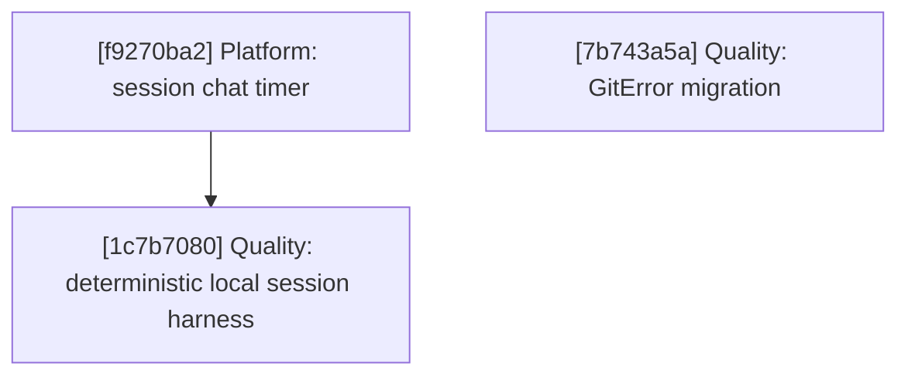

# Agentty Roadmap

Single-file roadmap for the active project backlog. Humans keep priorities and guardrails here, while only `Ready Now` work carries full execution detail and everything else stays intentionally lighter.

## Current State Snapshot

| Area | Current state in codebase | Status |
|------|---------------------------|--------|
| Follow-up task workflow | Persisted follow-up tasks now flow through the protocol, SQLite storage, and session UI; sibling-session launch behavior remains queued. | Partial |
| Session activity timing | `session` has no cumulative `InProgress` timing fields, chat shows no timer, and the session list has no time column. | Not Started |
| Deterministic scenario coverage | Local git tests exist, but there is no shared app-level scenario harness for a full local session workflow. | Partial |
| Typed errors and hygiene | `DbError` is landed, but git, app-server, remaining infra surfaces, and the app layer still expose string errors; discard comments, missing module tests, and convention cleanup remain open. | Partial |
| Testty proof pipeline | PTY-driven sessions, VT100 frame parsing, VHS tape compilation, snapshot baselines, overlay renderer, and recipe layer exist. Proof reports, native frame rendering, and scale tooling remain backlog work. | Partial |

## Active Streams

- `Workflow`: follow-up task persistence and sibling-session launch behavior.
- `Platform`: session timing surfaces.
- `Quality`: deterministic local session coverage, typed-error migration, and hygiene follow-up.
- `Testty`: proof-driven TUI testing framework and scale tooling for `crates/testty/`.

## Planning Model

- Keep no more than `5` fully expanded steps in `Ready Now`.
- Keep `Queued Next` as the compact promotion queue for the next few outcomes, not as a second fully detailed backlog.
- Keep `Parked` for strategic work that matters, but should not consume active planning attention yet.
- Run `cargo run -q -p ag-xtask -- roadmap context-digest` before promoting queued or parked work so the decision uses fresh repository context.
- Until lease automation exists, only `Ready Now` items can carry an assignee and only `Ready Now` items should be claimed.
- Claim ownership in a dedicated roadmap-only commit before starting implementation so the roadmap diff advertises who is taking the step.
- Keep tests and documentation attached to the same `Ready Now` step that changes behavior.

## Ready Now

### [f9270ba2-0905-4871-9cc9-9f02e041c88d] Platform: Persist cumulative `InProgress` time and render it in session chat

#### Assignee

`No assignee`

#### Why now

The timer stream needs a persistence baseline before the session list can add another column. Chat is the smallest end-to-end surface that proves the timing model.

#### Usable outcome

Session chat shows a compact cumulative active-work timer once a session has entered `InProgress`, the value ticks while work is active, and it freezes when the session leaves `InProgress`.

#### Substeps

- [ ] **Persist session timing fields.** Add `in_progress_total_seconds` and `in_progress_started_at` to `session` via a new migration and thread the fields through the DB and domain models.
- [ ] **Make status transitions timing-aware.** Update production status transitions and interrupted-work cleanup so entering and leaving `InProgress` opens and closes the persisted timing window consistently.
- [ ] **Render the timer in session chat.** Thread a deterministic wall-clock value into session chat rendering and reuse `format_duration_compact()` instead of inventing a second formatting path.
- [ ] **Document timing semantics in code.** Refresh or add `///` doc comments around the timing fields and helper behavior in the touched Rust files.

#### Tests

- [ ] Add DB tests for timing accumulation, workflow tests for repeated `InProgress` intervals, and session-chat tests for live ticking and truncation.

#### Docs

- [ ] Update `docs/site/content/docs/usage/workflow.md` to distinguish cumulative active-work timing from `/stats` lifetime duration.

### [1c7b7080-deaf-4e2c-8e3c-df24e01d9251] Quality: Ship one deterministic local session workflow slice

#### Assignee

`No assignee`

#### Why now

The quality stream needs one full app-level scenario that exercises the default local path before the remaining cleanup work keeps landing around it.

#### Usable outcome

A deterministic scenario test can create a disposable repo, run one scripted local agent turn through the app-facing workflow, and verify the resulting commit, worktree, transcript output, and terminal session state.

#### Substeps

- [ ] **Add the minimal local-session harness.** Create the smallest reusable harness under `crates/agentty/tests/support/` for temp repos, fake CLIs, and workflow assertions.
- [ ] **Add one deterministic local-session scenario.** Add `crates/agentty/tests/local_session_workflow.rs` to exercise a full local session journey without live credentials.
- [ ] **Refactor only the boundaries the scenario needs.** Keep any workflow refactors constrained to explicit boundaries rather than shell-heavy test-only helpers.

#### Tests

- [ ] Run the new local-session scenario and the touched workflow-module tests to confirm the harness covers the full local path.

#### Docs

- [ ] Update `CONTRIBUTING.md` with the deterministic local-session scenario command and the expectation that fake CLIs cover the default workflow path.

### [7b743a5a-ee48-48ed-a9d6-689a50440a87] Quality: Introduce `GitError` for `infra/git/` and `GitClient`

#### Assignee

`@andagaev`

#### Why now

The git boundary is the largest remaining source of `Result<..., String>` signatures and should set the typed-error pattern for the rest of the pending infra work.

#### Usable outcome

The git modules and `GitClient` return typed `GitError` variants instead of strings, while app-layer bridges remain only where later steps still need them.

#### Substeps

- [ ] **Define and re-export `GitError`.** Add `crates/agentty/src/infra/git/error.rs` and re-export the enum from `crates/agentty/src/infra/git.rs`.
- [ ] **Migrate the git modules.** Convert `sync.rs`, `rebase.rs`, `repo.rs`, `merge.rs`, and `worktree.rs` to return `GitError`.
- [ ] **Update `GitClient` and `RealGitClient`.** Move the trait and production implementation to typed git errors and keep temporary app bridges only where still required.
- [ ] **Maintain touched docs and semantic guides.** Add `///` doc comments for the new error type and refresh the nearest semantic `AGENTS.md` guidance when the module boundary changes.

#### Tests

- [ ] Run the existing git tests with `GitError` return types and add at least one assertion for a simulated `GitError::CommandFailed` path.

#### Docs

- [ ] Keep the new error type documented in code and the touched semantic guidance aligned with the new file layout.

## Ready Now Execution Order

## Queued Next

### [8f4402cd-beff-4b4d-b9f7-00efd834249b] Workflow: Launch sibling sessions from follow-up tasks and retain task state

#### Outcome

Launch a follow-up task into a sibling session while keeping launched and open task state stable across reopen and refresh flows.

#### Promote when

Promote when the next workflow slot opens and sibling-session launch behavior becomes the highest-priority follow-up slice.

#### Depends on

`None`

### [9f115af0-a382-46f4-8bf9-25886936e252] Platform: Add the timer to the grouped session list

#### Outcome

Show the same cumulative active-work timer in the session list without inventing a second timing path.

#### Promote when

Promote after the chat timer lands and the shared timing helper proves stable.

#### Depends on

`[f9270ba2] Platform: Persist cumulative InProgress time and render it in session chat`

### [7608043e-3ae8-44b4-bcb4-341f8070d0d2] Quality: Introduce typed errors for the remaining infra boundaries

#### Outcome

Replace stringly typed errors in the remaining infra boundaries so the app layer can consume typed failures consistently.

#### Promote when

Promote after `Quality: Introduce GitError for infra/git/ and GitClient` lands and the git boundary pattern is reusable.

#### Depends on

`[7b743a5a] Quality: Introduce GitError for infra/git/ and GitClient`

### [ed9de74b-64c0-4ca6-86b5-d29c8bc26591] Quality: Propagate typed errors through the app layer

#### Outcome

Replace app-layer string error bridges with typed errors after the infra boundaries expose stable enums.

#### Promote when

Promote after the remaining infra typed-error step lands and the app-facing shape is clear.

#### Depends on

`[7608043e] Quality: Introduce typed errors for the remaining infra boundaries`

### [832c9729-acde-45c0-93d8-d31511100082] Quality: Fill the missing module-level regression tests

#### Outcome

Backfill missing module tests once the active workflow and typed-error slices stop moving underneath them.

#### Promote when

Promote after the current `Ready Now` behavioral steps settle enough that the new tests will not churn immediately.

#### Depends on

`[cbf025d6] Workflow: Persist and render emitted follow-up tasks`, `[f9270ba2] Platform: Persist cumulative InProgress time and render it in session chat`, `[ed9de74b] Quality: Propagate typed errors through the app layer`

## Parked

### [282012e4-d4c0-4a83-8d24-a5d137f40111] Quality: Refresh discard-path documentation

#### Outcome

Bring discard-path documentation and comments back in sync after the typed-error and workflow changes settle.

#### Promote when

Promote when the active quality slices stop changing the discard behavior and wording.

#### Depends on

`[ed9de74b] Quality: Propagate typed errors through the app layer`

### [d2e6ee6c-e784-4d54-aad6-559c2c580101] Quality: Sweep convention cleanup follow-up

#### Outcome

Finish the remaining convention cleanup after active behavior work is no longer changing the same files.

#### Promote when

Promote when the active `Workflow`, `Platform`, and `Quality` steps stop rewriting the same modules.

#### Depends on

`[832c9729] Quality: Fill the missing module-level regression tests`

### [3e7f1a92-4b8d-4c6e-9a15-d2f8e0b71c34] Testty: Land proof report fundamentals

#### Outcome

Add labeled captures and the proof report core so the proof pipeline can generate reviewable artifacts.

#### Promote when

Promote when the active product-facing streams no longer dominate planning attention or when `Testty` becomes the primary investment stream.

#### Depends on

`None`

### [b8e4a6d2-1f3c-4d7e-a952-c6b0d8e3f419] Testty: Add native rendering and visual proof backends

#### Outcome

Render terminal frames natively and use that renderer to unlock screenshot, GIF, and HTML proof outputs.

#### Promote when

Promote after `Testty: Land proof report fundamentals` lands and the proof object model is stable.

#### Depends on

`[3e7f1a92] Testty: Land proof report fundamentals`

### [4c9f2e68-d1a5-4b7c-8e34-a6b0c3d9e271] Testty: Add scale tooling for high-volume scenarios

#### Outcome

Add scenario tiering and reusable journey helpers so the proof pipeline scales without manual test choreography.

#### Promote when

Promote after the proof fundamentals land and there is enough scenario volume to justify scale tooling.

#### Depends on

`[3e7f1a92] Testty: Land proof report fundamentals`

## Context Notes

- `Workflow: Launch sibling sessions from follow-up tasks and retain task state` should reuse the same stored task content that the persistence slice lands.
- The local session harness should keep validating the default in-process workflow path that `Workflow` and `Platform` depend on.
- The typed-error sequence should stay linear so each layer learns from the previous enum shape instead of reworking multiple error surfaces at once.
- `Testty` remains strategically important, but it is independent of the active `agentty` product work and should stay parked until a human intentionally rebalances the queue.
- Run `cargo run -q -p ag-xtask -- roadmap context-digest` before promoting queued or parked work to `Ready Now`.

## Status Maintenance Rule

- Keep no more than `5` items in `## Ready Now`.
- Keep only `Ready Now` items fully expanded with `#### Assignee`, `#### Why now`, `#### Usable outcome`, `#### Substeps`, `#### Tests`, and `#### Docs`.
- Keep `## Queued Next` and `## Parked` as compact promotion cards with `#### Outcome`, `#### Promote when`, and `#### Depends on`.
- Claim work only from `## Ready Now` by updating that step's `#### Assignee` field in a dedicated commit before implementation starts.
- After a `Ready Now` step lands, remove it from `## Ready Now`, refresh any changed snapshot rows, and either promote a queued card or leave the slot open.
- If follow-up work remains after a step lands, add or update a compact queued or parked card instead of preserving the completed step.
