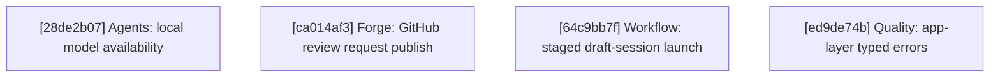

# Agentty Roadmap

Single-file roadmap for the active project backlog. Humans keep priorities and guardrails here, while only `Ready Now` work carries full execution detail and everything else stays intentionally lighter.

## Current State Snapshot

| Area | Current state in codebase | Status |
|------|---------------------------|--------|
| Follow-up task workflow | Persisted follow-up tasks now launch sibling sessions from session view, and launched/open state survives refresh, reopen, and restart flows. | Landed |
| Review request publish flow | Review sessions still expose one generic `p` branch-publish action; GitHub only gets a post-push pull-request creation link, while GitLab uses the same publish flow. | Partial |
| Model availability scoping | `/model` and settings still cycle through the full static backend catalog even when one or more agent CLIs are not installed on the current machine. | Missing |
| Draft session workflow | `New` sessions are still blank placeholders whose first submitted prompt starts the agent immediately, so users cannot stage multiple draft messages and explicitly launch the session later. | Missing |
| Session activity timing | `session` persists cumulative `InProgress` timing fields, and both chat and the grouped session list now show the same cumulative active-work timer. | Landed |
| Deterministic scenario coverage | Local git tests exist, but there is no shared app-level scenario harness for a full local session workflow. | Partial |
| Typed errors and hygiene | `DbError`, `GitError`, `AppServerTransportError`, `AppServerError`, and `AgentError` enums are landed across all infra boundaries; the app layer still uses `Result<T, String>` in review-assist, sync-assist, and session-lifecycle helpers; discard comments, missing module tests, and convention cleanup remain open. | Partial |
| Testty proof pipeline | PTY-driven sessions, VT100 frame parsing, VHS tape compilation, snapshot baselines, overlay renderer, and recipe layer exist. Proof reports, native frame rendering, and scale tooling remain backlog work. | Partial |

## Active Streams

- `Agents`: machine-scoped model availability for settings and slash-model selection.
- `Forge`: GitHub review-request creation/update from session view while preserving GitLab branch publishing.
- `Workflow`: draft-session staging before the first agent turn.
- `Quality`: deterministic local session coverage, typed-error migration, and hygiene follow-up.
- `Testty`: proof-driven TUI testing framework and scale tooling for `crates/testty/`.

## Planning Model

- Keep no more than `5` fully expanded steps in `Ready Now`.
- Keep `Queued Next` as the compact promotion queue for the next few outcomes, not as a second fully detailed backlog.
- Keep `Parked` for strategic work that matters, but should not consume active planning attention yet.
- Run `cargo run -q -p ag-xtask -- roadmap context-digest` before promoting queued or parked work so the decision uses fresh repository context.
- When a `Ready Now` step lands and queued work remains, promote the next queued card into `Ready Now` instead of leaving the execution window short.
- Until lease automation exists, only `Ready Now` items can carry an assignee and only `Ready Now` items should be claimed.
- Claim ownership in a dedicated roadmap-only commit before starting implementation so the roadmap diff advertises who is taking the step, and resolve that assignee with `gh api user --jq .login` before writing `@<login>`.
- Keep tests and documentation attached to the same `Ready Now` step that changes behavior.

## Ready Now

### [28de2b07-70a0-442a-821b-8b1946a1cea4] Agents: Scope model lists to locally available backends

#### Assignee

`@minev-dev`

#### Why now

Agentty already documents that each backend depends on a locally installed CLI, but the current static model lists still expose unavailable choices in `/model` and Settings, which makes first-run setup and cross-machine use noisier than the runtime actually supports.

#### Usable outcome

The `/model` picker and persisted default-model selectors only offer models whose backend is locally runnable on the user's machine, while stored but unavailable model values fall back predictably instead of trapping the UI on hidden choices.

#### Substeps

- [ ] **Add one machine-scoped agent-availability boundary.** Introduce a focused availability module under `crates/agentty/src/infra/agent/` plus the matching router exports in `crates/agentty/src/infra/agent.rs` so backend discovery lives behind a trait-based subprocess boundary instead of direct orchestration calls; wire one startup/background refresh path through `crates/agentty/src/app/task.rs` and `crates/agentty/src/app/core.rs` to cache which `AgentKind` values are locally runnable.
- [ ] **Scope settings defaults and fallback resolution.** Update the model-selection helpers in `crates/agentty/src/app/setting.rs` and any needed domain helpers in `crates/agentty/src/domain/agent.rs` so smart, fast, and review defaults cycle only through available models, and persisted unavailable values resolve to a stable fallback path instead of remaining silently selectable-but-unrunnable.
- [ ] **Scope prompt model switching and empty-state messaging.** Update `crates/agentty/src/runtime/mode/prompt.rs` and `crates/agentty/src/ui/page/session_chat.rs` so `/model` shows only locally available agent kinds and models, preserves the current session model when it is still valid, and surfaces explicit guidance when no supported backend CLI is installed.

#### Tests

- [ ] Add or extend coverage in `crates/agentty/src/infra/agent/`, `crates/agentty/src/app/setting.rs`, `crates/agentty/src/runtime/mode/prompt.rs`, and `crates/agentty/src/ui/page/session_chat.rs` for mixed installed/missing CLIs, persisted unavailable defaults, and the no-backend-installed empty state, keeping the external-command checks behind mockable trait boundaries.

#### Docs

- [ ] Update `docs/site/content/docs/agents/backends.md` and `docs/site/content/docs/usage/workflow.md` to explain that model choices are filtered by locally available backend CLIs and to describe the fallback behavior for stored defaults that are unavailable on the current machine.

### [ca014af3-5cd0-4567-bf11-3495765dcf6f] Forge: Replace GitHub branch publish with create or update pull request

#### Assignee

`@minev-dev`

#### Why now

The current `p` flow already has the git push path, the `ag-forge` review-request client, and session-side review-request persistence; promoting this slice now closes the remaining GitHub-specific review gap without waiting on unrelated workflow work.

#### Usable outcome

Pressing `p` in `Review` creates or refreshes the session pull request for GitHub remotes, while GitLab and other non-GitHub remotes keep the existing branch-publish behavior.

#### Substeps

- [ ] **Route `p` through a forge-aware publish action.** Update `crates/agentty/src/domain/session.rs`, `crates/agentty/src/runtime/mode/session_view.rs`, `crates/agentty/src/runtime/key_handler.rs`, and `crates/agentty/src/app/core.rs` so review sessions choose between the existing push-only path and one GitHub review-request action without splitting the current session-view popup flow into parallel entry points.
- [ ] **Reuse the existing review-request workflow for GitHub sessions.** Wire `crates/agentty/src/app/session/workflow/lifecycle.rs`, `crates/agentty/src/app/session/workflow/refresh.rs`, and the `ag-forge` client boundary so GitHub publication pushes the branch, finds any existing pull request for the session branch, refreshes it when present, and creates it when absent while persisting the normalized review-request summary back onto the session.
- [ ] **Align publish UI copy with the new GitHub outcome.** Update `crates/agentty/src/ui/component/publish_branch_overlay.rs`, `crates/agentty/src/ui/component/info_overlay.rs`, `crates/agentty/src/ui/state/help_action.rs`, and `crates/agentty/src/ui/page/session_chat.rs` so the popup title, help text, and success messaging describe create-or-update pull-request behavior for GitHub while preserving the current branch-publish copy for GitLab and other remotes.

#### Tests

- [ ] Add or extend coverage in `crates/agentty/src/app/core.rs`, `crates/agentty/src/app/session/workflow/lifecycle.rs`, `crates/agentty/src/app/session/workflow/refresh.rs`, `crates/agentty/src/runtime/mode/session_view.rs`, and `crates/agentty/src/ui/component/publish_branch_overlay.rs` for GitHub vs. GitLab action selection, existing-pull-request refresh, first-time pull-request creation, and the resulting popup copy/state.

#### Docs

- [ ] Update `docs/site/content/docs/usage/workflow.md`, `docs/site/content/docs/usage/keybindings.md`, and `docs/site/content/docs/architecture/runtime-flow.md` to explain that `p` creates or refreshes GitHub pull requests while non-GitHub remotes continue to use the branch-publish flow.

### [64c9bb7f-4d11-4c3c-b2ad-4a86db9bd6c9] Workflow: Stage draft session messages and start them explicitly

#### Assignee

`@minev-dev`

#### Why now

`New` sessions still burn the first prompt immediately, which prevents users from staging multi-message context before launch and leaves the follow-up draft-polish card blocked on a missing baseline workflow.

#### Usable outcome

Users can queue ordered draft messages inside a `New` session, reopen that session without losing the staged bundle, and explicitly launch the first agent turn only when the draft is ready.

#### Substeps

- [ ] **Persist staged draft messages for `New` sessions.** Extend `crates/agentty/src/domain/session.rs`, `crates/agentty/src/infra/db.rs`, the required migration under `crates/agentty/migrations/`, and `crates/agentty/src/app/session/workflow/load.rs` so each `Status::New` session can store and reload an ordered draft-message bundle instead of only one transient composer state.
- [ ] **Switch first-submit behavior from immediate launch to staging.** Update `crates/agentty/src/runtime/mode/prompt.rs`, `crates/agentty/src/app/core.rs`, and `crates/agentty/src/app/session/workflow/lifecycle.rs` so submitting from a `New` session appends one staged `TurnPrompt` entry, while a dedicated start action submits the full staged bundle as the first live agent turn.
- [ ] **Render staged drafts and the explicit start affordance.** Update `crates/agentty/src/runtime/mode/session_view.rs`, `crates/agentty/src/ui/page/session_chat.rs`, and `crates/agentty/src/ui/state/help_action.rs` so `New` sessions show the queued draft bundle, distinguish staging from sending in composer/help text, and expose a clear explicit-start action.

#### Tests

- [ ] Add or extend coverage in `crates/agentty/src/app/session/workflow/lifecycle.rs`, `crates/agentty/src/app/session/core.rs`, `crates/agentty/src/runtime/mode/prompt.rs`, `crates/agentty/src/infra/db.rs`, and `crates/agentty/src/ui/page/session_chat.rs` for staged-draft persistence, ordered reload, explicit launch, and the `New`-session UI state.

#### Docs

- [ ] Update `docs/site/content/docs/usage/workflow.md`, `docs/site/content/docs/usage/keybindings.md`, and `docs/site/content/docs/getting-started/overview.md` for the staged-draft workflow, explicit start action, and the meaning of `New` sessions after this slice lands.

### [ed9de74b-64c0-4ca6-86b5-d29c8bc26591] Quality: Propagate typed errors through the app layer

#### Assignee

`@andagaev`

#### Why now

The infra boundaries now expose stable typed enums (`AppServerTransportError`, `AppServerError`, `AgentError`, `GitError`, `DbError`), but the app layer still flattens them to `Result<T, String>` in the review-assist pipeline, the sync-assist client trait, and several session-lifecycle helpers, losing the structured failure context before it reaches callers.

#### Usable outcome

Every app-layer function that crosses an infra boundary propagates typed errors through `AppError` or `SessionError` instead of `String`, so callers can discriminate failure causes without parsing formatted messages.

#### Substeps

- [ ] **Replace string errors in the review-assist pipeline.** Convert `review_assist_text`, `review_assist_text_with_submitter`, `review_output_text`, and `review_assist_prompt` in `crates/agentty/src/app/task.rs` from `Result<T, String>` to return `AppError`; update the `ReviewUpdate` result field in `crates/agentty/src/app/core.rs` and the `from_result` helper to carry `AppError` instead of `String`.
- [ ] **Replace string errors in the sync-assist client boundary.** Convert `SyncAssistClient::resolve_rebase_conflicts` and `run_assist_command` in `crates/agentty/src/app/session/workflow/merge.rs` from `Result<(), String>` to return `SessionError`; update call sites, `SyncSessionStartError`, and the mock implementations to propagate the typed variant.
- [ ] **Replace string errors in session-lifecycle helpers.** Convert `apply_reply_reply_context` and `session_title_generation_prompt` in `crates/agentty/src/app/session/workflow/lifecycle.rs` from `Result<T, String>` to return `SessionError`; remove the corresponding `map_err(|e| e.to_string())` bridges at the call sites in `crates/agentty/src/app/core.rs`.
- [ ] **Eliminate remaining `map_err` string bridges.** Audit and replace the remaining `map_err(|error| error.to_string())` and `map_err(|error| format!(...))` conversions in `crates/agentty/src/app/core.rs`, `crates/agentty/src/app/session/workflow/merge.rs`, and `crates/agentty/src/app/session/workflow/task.rs` where the infra typed error can propagate directly through `AppError` or `SessionError` `#[from]` variants.

#### Tests

- [ ] Add or extend coverage in `crates/agentty/src/app/task.rs`, `crates/agentty/src/app/core.rs`, `crates/agentty/src/app/session/workflow/merge.rs`, and `crates/agentty/src/app/session/workflow/lifecycle.rs` for typed error propagation, `From` conversions, and `Display` output across the refactored app-layer boundaries.

#### Docs

- [ ] Update `docs/site/content/docs/architecture/testability-boundaries.md` to reflect the typed error propagation through `AppError` and `SessionError` at the app layer.

## Ready Now Execution Order

## Queued Next

### [832c9729-acde-45c0-93d8-d31511100082] Quality: Fill the missing module-level regression tests

#### Outcome

Backfill missing module tests once the active workflow and typed-error slices stop moving underneath them.

#### Promote when

Promote after the current `Ready Now` behavioral steps settle enough that the new tests will not churn immediately.

#### Depends on

`[ed9de74b] Quality: Propagate typed errors through the app layer`

### [4f491812-f373-4ac5-bd57-b46c4f9d91e3] Workflow: Polish draft-session editing after baseline staging lands

#### Outcome

Refine the draft-session UX with edit/remove affordances and any transcript/title cleanup that proves necessary once the explicit-start baseline is in place.

#### Promote when

Promote after `Workflow: Stage draft session messages and start them explicitly` lands and real usage clarifies which draft-editing actions are worth standardizing.

#### Depends on

`[64c9bb7f] Workflow: Stage draft session messages and start them explicitly`

## Parked

### [282012e4-d4c0-4a83-8d24-a5d137f40111] Quality: Refresh discard-path documentation

#### Outcome

Bring discard-path documentation and comments back in sync after the typed-error and workflow changes settle.

#### Promote when

Promote when the active quality slices stop changing the discard behavior and wording.

#### Depends on

`[ed9de74b] Quality: Propagate typed errors through the app layer`

### [d2e6ee6c-e784-4d54-aad6-559c2c580101] Quality: Sweep convention cleanup follow-up

#### Outcome

Finish the remaining convention cleanup after active behavior work is no longer changing the same files.

#### Promote when

Promote when the active `Workflow`, `Platform`, and `Quality` steps stop rewriting the same modules.

#### Depends on

`[832c9729] Quality: Fill the missing module-level regression tests`

### [1c7b7080-deaf-4e2c-8e3c-df24e01d9251] Quality: Ship one deterministic local session workflow slice

#### Outcome

Add one deterministic local-session scenario plus the minimal reusable harness so the default in-process workflow path can be validated without live credentials.

#### Promote when

Promote when a `Ready Now` slot opens and the active workflow and model-availability slices stop competing for the same session lifecycle boundaries.

#### Depends on

`None`

### [3e7f1a92-4b8d-4c6e-9a15-d2f8e0b71c34] Testty: Land proof report fundamentals

#### Outcome

Add labeled captures and the proof report core so the proof pipeline can generate reviewable artifacts.

#### Promote when

Promote when the active product-facing streams no longer dominate planning attention or when `Testty` becomes the primary investment stream.

#### Depends on

`None`

### [b8e4a6d2-1f3c-4d7e-a952-c6b0d8e3f419] Testty: Add native rendering and visual proof backends

#### Outcome

Render terminal frames natively and use that renderer to unlock screenshot, GIF, and HTML proof outputs.

#### Promote when

Promote after `Testty: Land proof report fundamentals` lands and the proof object model is stable.

#### Depends on

`[3e7f1a92] Testty: Land proof report fundamentals`

### [4c9f2e68-d1a5-4b7c-8e34-a6b0c3d9e271] Testty: Add scale tooling for high-volume scenarios

#### Outcome

Add scenario tiering and reusable journey helpers so the proof pipeline scales without manual test choreography.

#### Promote when

Promote after the proof fundamentals land and there is enough scenario volume to justify scale tooling.

#### Depends on

`[3e7f1a92] Testty: Land proof report fundamentals`

## Context Notes

- `Forge: Replace GitHub branch publish with create or update pull request` should reuse the existing `ag-forge` review-request create/refresh flow and keep GitLab on the current push-only branch-publish path.
- `Agents: Scope model lists to locally available backends` should reuse one shared availability snapshot across Settings and `/model` instead of probing CLIs separately in render paths.
- `Workflow: Stage draft session messages and start them explicitly` should treat `Status::New` as the persisted draft container instead of introducing a second pre-start lifecycle status.
- The parked local session harness slice should come back only when the active workflow and model-availability changes stop churning the same lifecycle seams.
- The typed-error sequence stays linear: infra enums are now stable, so the app-layer propagation step can rely on their shapes without rework risk.
- `Testty` remains strategically important, but it is independent of the active `agentty` product work and should stay parked until a human intentionally rebalances the queue.
- Run `cargo run -q -p ag-xtask -- roadmap context-digest` before promoting queued or parked work to `Ready Now`.

## Status Maintenance Rule

- Keep no more than `5` items in `## Ready Now`.
- Keep only `Ready Now` items fully expanded with `#### Assignee`, `#### Why now`, `#### Usable outcome`, `#### Substeps`, `#### Tests`, and `#### Docs`.
- Keep `## Queued Next` and `## Parked` as compact promotion cards with `#### Outcome`, `#### Promote when`, and `#### Depends on`.
- Claim work only from `## Ready Now` by updating that step's `#### Assignee` field in a dedicated commit before implementation starts, using `gh api user --jq .login` to determine the `@<login>` value.
- After a `Ready Now` step lands, remove it from `## Ready Now`, refresh any changed snapshot rows, and promote the next queued card whenever `## Queued Next` still has work.
- If follow-up work remains after a step lands, add or update a compact queued or parked card instead of preserving the completed step.
