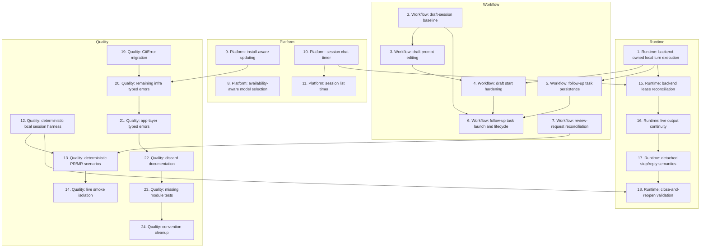

# Agentty Roadmap

Single-file roadmap for the active implementation backlog in `docs/plan/roadmap.md`. This document keeps one shared execution diagram and one shared implementation step list, with parallel work expressed as streams rather than as separate plan files.

## Current State Snapshot

| Area | Current state in codebase | Status |
|------|---------------------------|--------|
| Session runtime durability | Restart still fails unfinished `session_operation` rows, turns still belong to the TUI process, and no cross-process output replica exists yet. | Not Started |
| Draft session workflow | `create_session()` still starts from one blank prompt, there is no persisted draft-prompt queue, and draft editing before start does not exist. | Not Started |
| Review-request automation | Manual publish, open, and refresh flows already exist, but no background reconciliation moves linked sessions to `Done` or `Canceled`. | Partial |
| Follow-up task workflow | Structured follow-up tasks do not exist in the protocol, persistence, or session UI. | Not Started |
| Local backend awareness | Startup, settings, and `/model` flows still assume every backend CLI is available locally. | Not Started |
| Install-aware updating | Auto-update detection, dispatch, and status-bar hints still assume npm-style installation. | Not Started |
| Session activity timing | `session` has no cumulative `InProgress` timing fields, chat shows no timer, and the session list has no time column. | Not Started |
| Deterministic scenario coverage | Local git tests exist, but there is no shared app-level scenario harness for full session and review-request workflows. | Partial |
| Typed errors and hygiene | `DbError` is landed, but git, app-server, remaining infra surfaces, and the app layer still expose string errors; discard comments, missing module tests, and convention cleanup remain open. | Partial |

## Active Streams

- `Runtime`: backend-owned session execution, restart reconciliation, output continuity, and detached stop/reply semantics.
- `Workflow`: draft sessions, follow-up tasks, and review-request lifecycle behavior that changes what users can do inside Agentty.
- `Platform`: startup environment awareness, install-aware updating, and session timing surfaces.
- `Quality`: deterministic scenario coverage, live smoke isolation, typed-error migration, and hygiene follow-up.

## Implementation Approach

- Keep one shared backlog and one numbered step list for the whole roadmap instead of splitting work into per-feature mini-plans.
- Use stream tags in step titles to make parallel work obvious without creating separate step sections or extra diagrams.
- Group adjacent steps by stream where dependencies allow, and only interleave streams when one stream needs a baseline from another.
- Start each stream with the smallest usable slice, then extend that stream only after the baseline slice lands.
- Reflect already-landed behavior only in the snapshot above; do not keep implemented steps in the plan below.
- Keep tests and documentation in the same step that changes behavior so each step stays mergeable on its own.

## Suggested Execution Order

## Implementation Steps

### 1) `Runtime`: Ship backend-owned local turn execution that survives TUI exit

#### Why now

Detached execution is the foundation for the session-runtime stream. Until a turn becomes a durable backend-owned unit, restart handling, output continuity, and detached follow-up semantics are all blocked.

#### Usable outcome

A user can start a turn, Agentty can hand the persisted operation to a `LocalProcess` backend, the TUI can exit, and reopening Agentty after the turn finishes shows the final `Review` or `Question` state without replaying the turn.

#### Substeps

- [ ] **Persist backend-ready turn requests on `session_operation`.** Add a migration in `crates/agentty/migrations/` that stores the immutable detached-turn request fields plus generic backend lease fields such as `backend_kind`, `backend_owner`, `heartbeat_at`, and opaque `backend_state`.
- [ ] **Introduce one backend-agnostic execution boundary.** Add the execution backend trait in `crates/agentty/src/infra/` and keep the first production implementation focused on `LocalProcess` so app/session workflow code no longer hard-codes subprocess assumptions.
- [ ] **Run detached work through `agentty run-turn <operation-id>`.** Extend `crates/agentty/src/main.rs` with a subcommand entrypoint and extract shared execution into a focused runner module so in-process and detached execution share the same turn-finalization path that later follow-up-task persistence also extends.
- [ ] **Preserve an explicit rollback path.** Support an environment-driven backend selector such as `AGENTTY_SESSION_BACKEND=in-process|local-process`, default to `local-process`, and keep future `oci-local` and `oci-remote` values reserved under the same contract.

#### Tests

- [ ] Add a focused regression test that persists a turn request, runs `agentty run-turn <operation-id>` through the `LocalProcess` path with injected doubles, and verifies durable terminal operation state plus final session output.

#### Docs

- [ ] Update `docs/site/content/docs/usage/workflow.md`, `docs/site/content/docs/getting-started/overview.md`, and `docs/site/content/docs/architecture/testability-boundaries.md` for backend-owned detached session execution.

### 2) `Workflow`: Ship persisted draft sessions with explicit prompt collection and start

#### Why now

The draft-session stream needs a real baseline before inspection, editing, or start-time hardening can make sense. This slice makes the pre-start lifecycle durable and user-visible.

#### Usable outcome

A user can create a draft session, collect multiple prompts over time, reopen the draft later, and intentionally start one first turn from the collected prompt queue.

#### Substeps

- [ ] **Rename the pre-start lifecycle to `Draft`.** Replace the current `Status::New` path across the domain, workflow, and UI layers so the status model matches the planned draft-session behavior.
- [ ] **Persist ordered draft prompts.** Add a singular `session_draft_prompt` table in `crates/agentty/migrations/` and load/save helpers in `crates/agentty/src/infra/db.rs` and `crates/agentty/src/app/session/workflow/`.
- [ ] **Add draft prompt collection controls.** Update `crates/agentty/src/runtime/mode/prompt.rs` and `crates/agentty/src/ui/state/prompt.rs` so `Enter` saves one draft prompt and `/start` starts the draft from the persisted queue.
- [ ] **Start the first turn from the collected queue.** Update the app/session lifecycle so a started draft persists the final opening `TurnPrompt`, session title, and `InProgress` transition in one coherent path.

#### Tests

- [ ] Add database, load, prompt-mode, and lifecycle tests covering draft persistence, reload, `/start`, and the `Draft` to `InProgress` transition.

#### Docs

- [ ] Update `docs/site/content/docs/usage/workflow.md` and `docs/site/content/docs/usage/keybindings.md` for draft-session collection and `/start`.

### 3) `Workflow`: Make collected draft prompts inspectable and editable before start

#### Why now

Once draft collection exists, users need to curate the queue instead of treating it as write-only state.

#### Usable outcome

A user can inspect saved draft prompts, edit them back into the composer, delete them, and reorder them before starting the session.

#### Substeps

- [ ] **Render draft prompts distinctly from transcript output.** Update session chat and related summary surfaces so draft content does not masquerade as normal transcript output.
- [ ] **Add draft-prompt selection and edit actions.** Extend the relevant mode and view-state paths so one saved prompt can be reopened, edited, and written back through the lifecycle layer.
- [ ] **Support delete and reorder flows.** Add deterministic DB mutations plus app-layer orchestration for deleting and moving draft prompts before start.
- [ ] **Keep attachment lifecycle aligned with draft edits.** Preserve or clean up pasted image files correctly when draft prompts change.

#### Tests

- [ ] Add session-view, key-handler, and attachment-focused tests covering draft prompt selection, edit, delete, and reorder behavior.

#### Docs

- [ ] Update `docs/site/content/docs/usage/workflow.md` and `docs/site/content/docs/usage/keybindings.md` for draft inspection and editing controls.

### 4) `Workflow`: Harden draft start semantics and recovery

#### Why now

After draft collection and editing are usable, the remaining risk is duplicate starts, partial persistence, or restart-time draft loss.

#### Usable outcome

Starting a draft session is atomic and restart-safe: the prompt queue is consumed exactly once, and post-start flows no longer read draft-only state.

#### Substeps

- [ ] **Make draft-start consumption atomic.** Add the transaction shape that consumes ordered draft rows, persists the started-session state, and enqueues the first operation together.
- [ ] **Centralize first-turn prompt rendering from draft items.** Move ordered draft rendering into one dedicated helper instead of ad-hoc concatenation.
- [ ] **Keep reload and post-start flows draft-safe.** Ensure started sessions ignore draft-only rows while deleted or canceled drafts still clean up their remaining prompt data.
- [ ] **Align first-turn enqueue with detached execution.** Reuse the backend-owned turn enqueue shape instead of introducing a second first-turn path.

#### Tests

- [ ] Add transaction and recovery tests for start rollback, reopen-before-start, reopen-after-start, and one-time draft consumption.

#### Docs

- [ ] Update architecture docs if the final draft-start wiring introduces a new persistence or rendering boundary, and refresh workflow docs if start-time behavior differs from the earlier draft baseline.

### 5) `Workflow`: Persist and render emitted follow-up tasks

#### Why now

The follow-up-task stream needs a durable response contract and visible session-level output before launch behavior can be layered on top.

#### Usable outcome

After a turn completes, the session shows a persisted list of low-severity follow-up tasks, and that list survives refresh and reopen.

#### Substeps

- [ ] **Extend the structured response protocol.** Add `follow_up_tasks` to the protocol model, schema, parser, prompt instructions, and wire type definitions in `crates/agentty/src/infra/agent/protocol/`.
- [ ] **Add durable follow-up task storage.** Create the singular `session_follow_up_task` table and thread task loading/replacement through `crates/agentty/src/infra/db.rs` and the session domain model.
- [ ] **Persist tasks during turn finalization.** Update the shared turn-finalization path introduced by step 1 so parsed follow-up tasks persist alongside summary and question state without reintroducing `worker.rs`-only ownership.
- [ ] **Render a read-only follow-up task section.** Update session chat and output components so follow-up tasks are visible without being merged into transcript markdown.

#### Tests

- [ ] Add protocol tests, DB round-trip tests, and worker/UI tests proving follow-up tasks persist and render without altering transcript output.

#### Docs

- [ ] Update `docs/site/content/docs/architecture/runtime-flow.md` and `docs/site/content/docs/architecture/module-map.md`.

### 6) `Workflow`: Launch sibling sessions from follow-up tasks and retain task state

#### Why now

Once follow-up tasks are visible, the next usable slice is launching them into independent work without losing track of which tasks were already acted on.

#### Usable outcome

A user can launch a follow-up task into a normal sibling session, keep the source session open, and reopen later without duplicate launch noise.

#### Substeps

- [ ] **Add follow-up task selection and launch actions.** Extend session-view and app state so emitted follow-up tasks can be focused and launched through the same draft-aware session creation flow established by steps 2 and 4.
- [ ] **Mark launched tasks locally without parent links.** Persist launched/open task state on the source session without storing a parent-child session relationship.
- [ ] **Replace only open tasks on later turns.** Refresh open follow-up tasks on new turn results while retaining launched rows as local history.
- [ ] **Keep reopen and refresh behavior consistent.** Rehydrate follow-up task state through load and refresh paths so launched/open state survives session reloads.

#### Tests

- [ ] Add reducer, key-handler, workflow, worker, and reload tests for task launch, replacement rules, and reopen-time hydration.

#### Docs

- [ ] Update `docs/site/content/docs/usage/workflow.md`, `docs/site/content/docs/usage/keybindings.md`, and `docs/site/content/docs/architecture/runtime-flow.md` if the final lifecycle rules introduce visible launched/open task states.

### 7) `Workflow`: Add background review-request status reconciliation

#### Why now

Manual publish/open/refresh already exists, so the next meaningful review-request slice is automatic status reconciliation rather than more manual surface area.

#### Usable outcome

Linked sessions automatically reconcile to `Done` or `Canceled` after the remote PR or MR is observed as merged or closed.

#### Substeps

- [ ] **Add an app-scoped review-request poller.** Run periodic linked review-request refresh work from the app/task layer for sessions that already carry forge metadata.
- [ ] **Route reconciliation through reducer events.** Keep status changes in reducer-driven app flow instead of mutating session state directly inside the poller task.
- [ ] **Reuse the existing forge refresh adapters.** Build the poller on top of the current `gh` and `glab` refresh logic rather than introducing a second direct network client path.
- [ ] **Define low-noise polling guardrails.** Set expectations for cadence, unsupported-forge failures, unauthenticated states, and stale-session behavior.

#### Tests

- [ ] Add deterministic tests for polling cadence, reducer handling, and merged/closed/reopened/unavailable review-request states.

#### Docs

- [ ] Update `docs/site/content/docs/usage/workflow.md`, `docs/site/content/docs/architecture/runtime-flow.md`, `docs/site/content/docs/architecture/testability-boundaries.md`, and `docs/site/content/docs/architecture/module-map.md`.

### 8) `Platform`: Filter agent and model selection to locally available backends

#### Why now

Agent/model selection is currently misleading because the app offers backends that may not exist locally. A startup availability snapshot is the smallest platform slice that makes settings and `/model` trustworthy.

#### Usable outcome

Startup resolves the locally available CLIs, settings only offer valid defaults, and `/model` only shows models from installed backends.

#### Substeps

- [ ] **Add an injectable backend-availability probe.** Introduce the startup probe boundary in `crates/agentty/src/infra/agent/` and expose filtered helper APIs from `crates/agentty/src/domain/agent.rs`.
- [ ] **Wire the availability snapshot through startup.** Store the snapshot on `App` and route it into settings, session creation, and prompt flows that currently assume every provider exists.
- [ ] **Filter settings and `/model` from the same snapshot.** Update `crates/agentty/src/app/setting.rs`, `crates/agentty/src/ui/page/session_chat.rs`, and `crates/agentty/src/runtime/mode/prompt.rs` so model selection stays aligned across screens.
- [ ] **Define missing-backend fallback behavior.** Normalize persisted defaults or existing session models that point at unavailable backends without crashing or silently pretending the backend exists.

#### Tests

- [ ] Add probe tests, startup wiring coverage, settings tests, and `/model` tests for filtered backends, empty-install cases, and unavailable persisted models.

#### Docs

- [ ] Update `docs/site/content/docs/agents/backends.md`, `docs/site/content/docs/usage/workflow.md`, `docs/site/content/docs/usage/keybindings.md`, and `docs/site/content/docs/architecture/testability-boundaries.md`.

### 9) `Platform`: Detect installation method and run the correct update path

#### Why now

Auto-update and manual hints are still npm-only. The install-aware update slice is self-contained and can progress in parallel with the rest of the roadmap.

#### Usable outcome

Agentty detects whether it was installed via npm, cargo, shell installer, or `npx`, runs the correct update command, and shows the matching manual hint in the status bar.

#### Substeps

- [ ] **Add `InstallMethod` detection behind a boundary.** Define the enum and detector trait in `crates/agentty/src/infra/version.rs` using the current executable path and install-layout heuristics.
- [ ] **Dispatch update commands by install method.** Replace the npm-only update runner with one method-aware `run_update_sync(...)` path that handles npm, cargo, shell, `npx`, and unknown installs, and treat this as the behavior baseline that the later typed-error pass in `infra/version.rs` must preserve rather than redesign.
- [ ] **Thread install method through app startup and the status bar.** Store the detected install method on `App`, pass it into background update tasks, and render the matching manual update hint or `npx` suppression.
- [ ] **Finish the install-aware docs pass.** Update installation and usage docs so the supported update behavior matches the shipped method-aware logic.

#### Tests

- [ ] Add install detection tests, method-aware update dispatch tests, status-bar tests, and `npx` coverage for skipped auto-update.

#### Docs

- [ ] Update `docs/site/content/docs/getting-started/installation.md`, `docs/site/content/docs/getting-started/overview.md`, `docs/site/content/docs/usage/workflow.md`, and `docs/site/content/docs/architecture/testability-boundaries.md`, plus `README.md` if it still implies npm-only updating.

### 10) `Platform`: Persist cumulative `InProgress` time and render it in session chat

#### Why now

The timer stream needs a persistence baseline before the session list can add another column. Chat is the smallest end-to-end surface that proves the timing model.

#### Usable outcome

Session chat shows a compact cumulative active-work timer once a session has entered `InProgress`, the value ticks while work is active, and it freezes when the session leaves `InProgress`.

#### Substeps

- [ ] **Persist session timing fields.** Add `in_progress_total_seconds` and `in_progress_started_at` to `session` via a new migration and thread the fields through the DB and domain models.
- [ ] **Make status transitions timing-aware.** Update production status transitions and interrupted-work cleanup so entering and leaving `InProgress` opens and closes the persisted timing window consistently.
- [ ] **Render the timer in session chat.** Thread a deterministic wall-clock value into session chat rendering and reuse `format_duration_compact()` instead of inventing a second formatting path.
- [ ] **Document timing semantics in code.** Refresh or add `///` doc comments around the timing fields and helper behavior in the touched Rust files.

#### Tests

- [ ] Add DB tests for timing accumulation, workflow tests for repeated `InProgress` intervals, and session-chat tests for live ticking and truncation.

#### Docs

- [ ] Update `docs/site/content/docs/usage/workflow.md` to distinguish cumulative active-work timing from `/stats` lifetime duration.

### 11) `Platform`: Add the timer to the grouped session list

#### Why now

Chat proves the timing model first; the list should extend that settled behavior rather than inventing separate timer math.

#### Usable outcome

The Sessions tab shows a compact cumulative active-work timer for active and completed sessions using the same semantics as session chat.

#### Substeps

- [ ] **Add a dedicated time column to `session_list.rs`.** Render the compact `Time` column and keep grouped headers and placeholders aligned with the new layout.
- [ ] **Reuse the shared timer-label path.** Keep list rendering on the same session timing helper and `format_duration_compact()` output used by chat.
- [ ] **Thread the current timestamp into list rendering.** Extend render context and page constructors so active rows can tick without extra DB churn.

#### Tests

- [ ] Add session-list tests for the new column, row layout, and timer text for active, archived, and never-started sessions.

#### Docs

- [ ] Extend the same `docs/site/content/docs/usage/workflow.md` update with a short note about the session-list timer column.

### 12) `Quality`: Ship one deterministic local session workflow slice

#### Why now

The quality stream needs one full app-level scenario before it can safely expand to review-request workflows or reduced live smoke coverage.

#### Usable outcome

A deterministic scenario test can create a disposable repo, run one scripted local agent turn through the app-facing workflow, and verify the resulting commit, worktree, transcript output, and terminal session state.

#### Substeps

- [ ] **Add the minimal local-session harness.** Create the smallest reusable harness under `crates/agentty/tests/support/` for temp repos, fake CLIs, and workflow assertions.
- [ ] **Add one deterministic local-session scenario.** Add `crates/agentty/tests/local_session_workflow.rs` to exercise a full local session journey without live credentials.
- [ ] **Refactor only the boundaries the scenario needs.** Keep any workflow refactors constrained to explicit boundaries rather than shell-heavy test-only helpers.

#### Tests

- [ ] Run the new local-session scenario and the touched workflow-module tests to confirm the harness covers the full local path.

#### Docs

- [ ] Update `CONTRIBUTING.md` with the deterministic local-session scenario command and the expectation that fake CLIs cover the default workflow path.

### 13) `Quality`: Expand the harness for deterministic PR/MR workflow scenarios

#### Why now

The first deterministic session harness should immediately be reused for high-value review-request workflows before the suite grows more live-smoke coverage.

#### Usable outcome

Deterministic local scenarios cover GitHub and GitLab review-request create, reuse, refresh-after-cleanup, and actionable CLI failure paths without live authentication.

#### Substeps

- [ ] **Extend the harness for forge scripting.** Teach the fake CLI and assertion helpers to script forge responses and validate persisted PR/MR metadata.
- [ ] **Add deterministic GitHub and GitLab scenarios.** Add local review-request workflow scenarios under `crates/agentty/tests/` for create, reuse, refresh, and failure paths.
- [ ] **Keep low-level edge sequencing in source-level tests.** Leave narrow reducer and workflow edge cases in the relevant source modules while moving the highest-value journeys into deterministic scenarios.

#### Tests

- [ ] Run the new deterministic PR/MR scenarios plus the touched workflow tests so the review-request layer stays stable in the default local path.

#### Docs

- [ ] Update `CONTRIBUTING.md` and `docs/site/content/docs/architecture/testability-boundaries.md` if the expanded harness changes the recommended test boundaries.

### 14) `Quality`: Isolate live smoke suites and finalize suite guidance

#### Why now

After deterministic local scenario coverage owns the main workflows, the live test layer should shrink to an explicit smoke suite with clear contributor guidance.

#### Usable outcome

Live provider and forge smoke suites are clearly named, ignored by default, and documented with their prerequisites and intended failure domain.

#### Substeps

- [ ] **Rename live provider coverage into explicit smoke files.** Reorganize the existing live provider coverage under an explicit live-smoke naming pattern and add a matching live forge smoke file if needed.
- [ ] **Keep live smoke coverage thin and purpose-specific.** Limit the live files to integration-health checks rather than deterministic workflow ownership.
- [ ] **Document the deterministic-versus-live test tiers.** Clarify default commands, ignored smoke commands, and credential requirements in contributor documentation.

#### Tests

- [ ] Run the default `cargo test` path plus compile-only or appropriately ignored coverage for the renamed live smoke files.

#### Docs

- [ ] Update `CONTRIBUTING.md` with the final suite-tier guidance.

### 15) `Runtime`: Reconcile backend leases on restart

#### Why now

Detached execution is not durable enough until restart can distinguish live backend-owned work from abandoned operations.

#### Usable outcome

Reopening Agentty during a detached turn keeps healthy backend leases active, reclaims orphaned work deterministically, and no longer force-fails every unfinished operation on startup.

#### Substeps

- [ ] **Add generic lease claim and heartbeat helpers.** Extend `crates/agentty/src/infra/db.rs` with atomic claim, heartbeat refresh, owner clear, and stale-failure helpers keyed by the backend lease fields.
- [ ] **Add backend-specific liveness checks behind the execution boundary.** Extend the execution backend contract so `LocalProcess` can report lease liveness without leaking PID rules into app orchestration.
- [ ] **Replace blanket startup failure with reconciliation.** Move restart handling into focused workflow reconciliation logic that keeps healthy leases active and fails only stale work.
- [ ] **Reuse the timing fields for interrupted cleanup.** Keep the reopened `InProgress` semantics aligned with the timer stream instead of introducing parallel timing state.

#### Tests

- [ ] Add mock-driven tests for healthy reopen, stale-lease failure, duplicate claim refusal, and finished-operation no-op reconciliation.

#### Docs

- [ ] Update `docs/site/content/docs/architecture/runtime-flow.md`, `docs/site/content/docs/architecture/module-map.md`, and `docs/site/content/docs/architecture/testability-boundaries.md`.

### 16) `Runtime`: Mirror live output across app restarts

#### Why now

Restart reconciliation is usable without live output, but it still feels broken when a reopened session cannot show active transcript updates.

#### Usable outcome

A reopened session can attach to live detached output and continue showing fresh transcript content while the turn is still running.

#### Substeps

- [ ] **Add a durable per-session output replica.** Append incremental output to a session-scoped replica file so detached work can surface live output outside the original TUI process.
- [ ] **Attach reopened sessions to replica tailing.** Update load and refresh flows so reopened sessions stream replica output into `SessionHandles.output` while a lease is live.
- [ ] **Import buffered output during finalization.** Ensure the shared runner and reconciliation paths drain any remaining replica content into durable `session.output`.

#### Tests

- [ ] Add tests for replica writes, reopen-time tail attachment, final transcript import, and stale-lease cleanup that preserves buffered output.

#### Docs

- [ ] Update `docs/site/content/docs/usage/workflow.md` and `docs/site/content/docs/architecture/runtime-flow.md`.

### 17) `Runtime`: Preserve detached stop, cancel, and reply semantics

#### Why now

Once detached execution and live output exist, stop/cancel/reply behavior becomes the remaining major semantic gap between TUI-owned and backend-owned execution.

#### Usable outcome

Users can stop detached work, keep review cancel separate from execution stop, and reply after restart without corrupting resume state.

#### Substeps

- [ ] **Separate TUI exit from explicit stop requests.** Rework session lifecycle code so shutdown no longer implies cancelation while explicit stop still persists cancel intent.
- [ ] **Add backend-owned termination through the execution contract.** Extend the execution backend boundary with stop delivery and implement the first `LocalProcess` version behind the adapter.
- [ ] **Preserve review cancel as its own workflow.** Keep review-session cancel responsible for worktree cleanup while in-progress stop targets the active execution backend.
- [ ] **Keep provider-native resume state correct after restart.** Update the channel and backend adapters so detached replies reuse the correct persisted conversation state.

#### Tests

- [ ] Add mock-driven tests for stop-before-start, stop-during-execution, review-cancel cleanup, and reply-after-restart behavior across CLI and app-server transport paths.

#### Docs

- [ ] Update `docs/site/content/docs/usage/workflow.md`, `docs/site/content/docs/architecture/runtime-flow.md`, `docs/site/content/docs/architecture/module-map.md`, and `docs/site/content/docs/architecture/testability-boundaries.md`.

### 18) `Runtime`: Validate close-and-reopen lifetime behavior end to end

#### Why now

The runtime stream needs final close-and-reopen regression coverage before detached execution can be treated as stable.

#### Usable outcome

The repository has deterministic close-and-reopen regression coverage for backend-owned session execution, and the full validation gates confirm the shipped detached-runtime slice is stable.

#### Substeps

- [ ] **Add close-while-running regression coverage.** Exercise shutdown during a live detached turn and verify a fresh `App` instance sees continued `InProgress` output or the correct terminal state.
- [ ] **Add finish-while-closed regression coverage.** Exercise a turn that finishes while Agentty is closed and verify the next launch loads final transcript, operation state, and session status without replay.
- [ ] **Run the full local validation gates.** Keep the detached-session scenarios in the default regression path and validate them with the repository quality gates.

#### Tests

- [ ] Run the close-and-reopen scenarios in the default suite and finish with the full `pre-commit` checks plus `cargo test -q` under the shared-host thread budget from `AGENTS.md`.

#### Docs

- [ ] Refresh detached-session docs only if the validated behavior narrows the supported contract for the shipped backend-owned flow.

### 19) `Quality`: Introduce `GitError` for `infra/git/` and `GitClient`

#### Why now

The git boundary is the largest remaining source of `Result<..., String>` signatures and should set the typed-error pattern for the rest of the pending infra work.

#### Usable outcome

The git modules and `GitClient` return typed `GitError` variants instead of strings, while app-layer bridges remain only where later steps still need them.

#### Substeps

- [ ] **Define and re-export `GitError`.** Add `crates/agentty/src/infra/git/error.rs` and re-export the enum from `crates/agentty/src/infra/git.rs`.
- [ ] **Migrate the git modules.** Convert `sync.rs`, `rebase.rs`, `repo.rs`, `merge.rs`, and `worktree.rs` to return `GitError`.
- [ ] **Update `GitClient` and `RealGitClient`.** Move the trait and production implementation to typed git errors and keep temporary app bridges only where still required.
- [ ] **Maintain touched docs and indexes.** Add `///` doc comments for the new error type and update the relevant local `AGENTS.md` directory index.

#### Tests

- [ ] Run the existing git tests with `GitError` return types and add at least one assertion for a simulated `GitError::CommandFailed` path.

#### Docs

- [ ] Keep the new error type documented in code and the touched directory index synchronized with the new file layout.

### 20) `Quality`: Introduce typed errors for the remaining infra boundaries

#### Why now

After `GitError` lands, the remaining infra surfaces are small enough to finish in one follow-up slice before app-layer propagation removes the temporary bridges.

#### Usable outcome

Gemini, Codex, filesystem, version, clipboard, and remaining leaf helpers all return typed errors instead of strings.

#### Substeps

- [ ] **Add `AppServerError` and migrate the Gemini/Codex clients.** Introduce the typed app-server error surface and move both app-server client implementations to it.
- [ ] **Add `FsError`, `VersionError`, and `ClipboardError`.** Convert the filesystem, version, and clipboard-image boundaries to typed errors and route filesystem access through the explicit boundary where needed.
- [ ] **Migrate the remaining leaf helpers.** Convert the small remaining provider, submission, registry, and prompt helpers to existing or new typed errors.
- [ ] **Maintain touched docs and indexes.** Add `///` doc comments for the new error types and update any touched local `AGENTS.md` directory indexes.

#### Tests

- [ ] Run the touched infra test suites and add at least one representative typed-error assertion for each newly introduced boundary family.

#### Docs

- [ ] Keep the new infra error types documented in code and reflected in any touched directory indexes.

### 21) `Quality`: Propagate typed errors through the app layer

#### Why now

The app layer is the last major place where the new infra errors are still flattened into strings.

#### Usable outcome

Session workflow, app services, and the CLI entrypoint propagate structured app-layer errors instead of `String`, and the temporary `.to_string()` bridges disappear.

#### Substeps

- [ ] **Define `SessionError`.** Add the typed session-layer error enum in `crates/agentty/src/app/session/` and re-export it from the session module router.
- [ ] **Migrate the session workflow surfaces.** Convert the remaining fallible workflow functions to `SessionError` and remove their temporary string bridges.
- [ ] **Define `AppError` and migrate top-level app paths.** Convert `App` methods plus `main.rs` error propagation to typed app-layer errors.
- [ ] **Maintain touched docs and indexes.** Add `///` doc comments for the new app-layer errors and update any touched local `AGENTS.md` indexes.

#### Tests

- [ ] Verify the full suite passes with no remaining `.map_err(|error| error.to_string())` bridges and add at least one app-level propagation assertion.

#### Docs

- [ ] Keep the new app-layer error types documented in code and in any touched directory indexes.

### 22) `Quality`: Document silent `let _ =` result discards

#### Why now

Once the typed-error migration stabilizes, the next quality gap is distinguishing intentional fire-and-forget behavior from accidental swallow sites.

#### Usable outcome

Every `let _ =` that discards a `Result` in the touched backlog has a short justification comment explaining why the discard is safe.

#### Substeps

- [ ] **Document channel-send discards.** Add justification comments to the transport and worker send paths where disconnected receivers are acceptable.
- [ ] **Document reducer and workflow event discards.** Add the same justification style to event-sender discard sites in app/session workflow code.
- [ ] **Document cleanup and fallback discards.** Cover the remaining terminal cleanup, child-kill, lock-file cleanup, and similar best-effort discard paths.

#### Tests

- [ ] Run `cargo check -q --all-targets --all-features` after the comment sweep to ensure the touched files still compile cleanly.

#### Docs

- [ ] No external docs changes are required for the discard-comment sweep.

### 23) `Quality`: Add test modules for currently untested files

#### Why now

The roadmap still tracks a small set of public non-router files that lack `#[cfg(test)]` coverage entirely.

#### Usable outcome

Every targeted non-router file with public functions has at least a focused happy-path test module.

#### Substeps

- [ ] **Cover the remaining git/worktree and app-server registry gaps.** Add tests for `crates/agentty/src/infra/git/worktree.rs` and `crates/agentty/src/infra/app_server/registry.rs`.
- [ ] **Cover the remaining prompt/channel/style gaps.** Add tests for `crates/agentty/src/infra/app_server/prompt.rs`, `crates/agentty/src/infra/channel/factory.rs`, and `crates/agentty/src/ui/style.rs`.
- [ ] **Keep the test structure explicit.** Use Arrange/Act/Assert comments in every new test and reuse the existing mock or temp-dir boundaries instead of adding shell-heavy test helpers.

#### Tests

- [ ] Run `cargo test -q` with the shared-host thread budget from `AGENTS.md` after the new module tests land.

#### Docs

- [ ] No external docs changes are required for the missing-module test sweep.

### 24) `Quality`: Fix the remaining convention violations

#### Why now

The final cleanup slice should happen after the larger migrations stop churning the same files.

#### Usable outcome

The remaining convention violations from the current audit are resolved without carrying open lint work into later roadmap updates.

#### Substeps

- [ ] **Rename the remaining single-letter variables.** Replace the outstanding single-letter layout variables with descriptive names.
- [ ] **Remove the remaining clippy bypass in test code.** Restructure the affected test assertion so no `#[allow()]` is needed.
- [ ] **Resolve or spin out the remaining deferred TODO.** Either implement the prompt-related TODO directly or add a new pending roadmap step if the follow-up is still too large for this slice.

#### Tests

- [ ] Run `pre-commit run clippy --all-files --hook-stage manual` and keep the touched code free of new `#[allow()]` workarounds.

#### Docs

- [ ] No external docs changes are required unless the deferred TODO turns into a new roadmap step.

## Cross-Stream Notes

- The `Runtime` and `Platform` streams share `InProgress` semantics. The timer fields introduced in step 10 should become the source of truth that restart reconciliation reuses in step 15.
- The `Workflow` draft-session stream and the `Runtime` detached-execution stream share first-turn enqueue behavior. Step 4 should reuse the persisted detached-turn request shape introduced in step 1.
- The `Workflow` follow-up-task stream and the `Runtime` detached-execution stream share turn finalization. Step 5 should extend the shared runner/finalization path from step 1 rather than adding a parallel persistence path in `worker.rs`.
- The `Workflow` follow-up-task launch flow depends on the draft-session model. Step 6 should reuse the draft-aware session creation/start semantics established by steps 2 and 4 instead of assuming the older immediate-start flow.
- The `Quality` scenario harness from step 12 is a dependency for the runtime validation work in step 18 and the review-request scenario work in step 13.
- The `Platform` install-aware update work and the `Quality` infra typed-error work both touch `infra/version.rs`. Step 20 should follow the behavior shape established in step 9 rather than running independently against the old npm-only assumptions.
- The typed-error stream must keep local `AGENTS.md` directory indexes and `///` doc comments synchronized whenever it adds files such as `error.rs`.

## Status Maintenance Rule

- Keep only not-yet-implemented work in `## Implementation Steps`. Do not preserve completed steps in the roadmap.
- After implementing a step, remove it from `## Implementation Steps`, refresh the snapshot rows that changed, and update the execution diagram only if the dependency graph changed materially.
- When a step changes behavior, complete its `#### Tests` and `#### Docs` work in that same step before removing it from the roadmap.
- If follow-up work remains after a step is otherwise complete, add a new pending step instead of keeping completed detail in place.

## Out of Scope for This Pass

- Shipping `oci-local` or `oci-remote` execution backends in the current runtime stream.
- Building a global daemon, cross-machine scheduler, or server-push event bus for session execution.
- Expanding follow-up tasks into general-purpose plan orchestration, automatic background spawning, or parent-child session graphs.
- Replacing the npm registry as the canonical version-check source for update detection.
