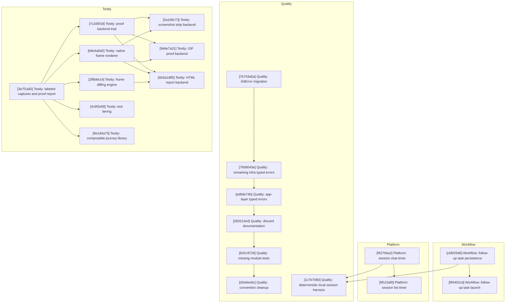

# Agentty Roadmap

Single-file roadmap for the active implementation backlog in `docs/plan/roadmap.md`. This document keeps one shared execution diagram and one shared implementation step list, with parallel work expressed as streams rather than as separate plan files.

## Current State Snapshot

| Area | Current state in codebase | Status |
|------|---------------------------|--------|
| Follow-up task workflow | Structured follow-up tasks do not exist in the protocol, persistence, or session UI. | Not Started |
| Session activity timing | `session` has no cumulative `InProgress` timing fields, chat shows no timer, and the session list has no time column. | Not Started |
| Deterministic scenario coverage | Local git tests exist, but there is no shared app-level scenario harness for a full local session workflow. | Partial |
| Typed errors and hygiene | `DbError` is landed, but git, app-server, remaining infra surfaces, and the app layer still expose string errors; discard comments, missing module tests, and convention cleanup remain open. | Partial |
| Testty proof pipeline | PTY-driven sessions, VT100 frame parsing, VHS tape compilation, snapshot baselines, overlay renderer, and recipe layer exist. No labeled captures, proof reports, native frame rendering, or swappable proof backends. | Partial |

## Active Streams

- `Workflow`: follow-up task persistence and sibling-session launch behavior.
- `Platform`: session timing surfaces.
- `Quality`: deterministic local session coverage, typed-error migration, and hygiene follow-up.
- `Testty`: proof-driven TUI testing framework — labeled captures, swappable proof backends, native rendering, frame diffing, and scale features for `crates/testty/`.

## Implementation Approach

- Keep one shared backlog and one step list for the whole roadmap instead of splitting work into per-feature mini-plans.
- Use `[UUID] Stream: Title` step headings so each slice stays identifiable in the roadmap while still showing stream ownership at a glance.
- Group adjacent steps by stream where dependencies allow, and only interleave streams when one stream needs a baseline from another.
- Start each stream with the smallest usable slice, then extend that stream only after the baseline slice lands.
- Reflect already-landed behavior only in the snapshot above; do not keep implemented steps in the plan below.
- Keep tests and documentation in the same step that changes behavior so each step stays mergeable on its own.
- In the current direct-to-`main` workflow, engineers claim roadmap ownership by landing and pushing a dedicated assignee-only commit before any implementation commits.
- The `Testty` stream designs `crates/testty/` as a standalone, framework-agnostic TUI testing crate. Proof output flows through a `ProofBackend` trait so visual formats (text, strip, GIF, HTML) are swappable without modifying `ProofReport` or scenario code.

## Suggested Execution Order

## Implementation Steps

### [cbf025d6-2d29-4be7-b393-4ed3092ae66d] Workflow: Persist and render emitted follow-up tasks

#### Assignee

`No assignee`

#### Why now

The follow-up-task stream needs a durable response contract and visible session-level output before launch behavior can be layered on top.

#### Usable outcome

After a turn completes, the session shows a persisted list of low-severity follow-up tasks, and that list survives refresh and reopen.

#### Substeps

- [ ] **Extend the structured response protocol.** Add `follow_up_tasks` to the protocol model, schema, parser, prompt instructions, and wire type definitions in `crates/agentty/src/infra/agent/protocol/`.
- [ ] **Add durable follow-up task storage.** Create the singular `session_follow_up_task` table and thread task loading and replacement through `crates/agentty/src/infra/db.rs` and the session domain model.
- [ ] **Persist tasks during the existing turn-finalization path.** Update the current session completion flow so parsed follow-up tasks persist alongside summary and question state without introducing a second task-specific write path.
- [ ] **Render a read-only follow-up task section.** Update session chat and output components so follow-up tasks are visible without being merged into transcript markdown.

#### Tests

- [ ] Add protocol tests, DB round-trip tests, and session workflow/UI tests proving follow-up tasks persist and render without altering transcript output.

#### Docs

- [ ] Update `docs/site/content/docs/architecture/runtime-flow.md` and `docs/site/content/docs/architecture/module-map.md`.

### [8f4402cd-beff-4b4d-b9f7-00efd834249b] Workflow: Launch sibling sessions from follow-up tasks and retain task state

#### Assignee

`No assignee`

#### Why now

Once follow-up tasks are visible, the next usable slice is launching them into independent work without losing track of which tasks were already acted on.

#### Usable outcome

A user can launch a follow-up task into a normal sibling session, keep the source session open, and reopen later without duplicate launch noise.

#### Substeps

- [ ] **Add follow-up task selection and launch actions.** Extend session-view and app state so emitted follow-up tasks can be focused and launched through the normal session creation flow, seeding the new session's first prompt from the selected task content.
- [ ] **Mark launched tasks locally without parent links.** Persist launched/open task state on the source session without storing a parent-child session relationship.
- [ ] **Replace only open tasks on later turns.** Refresh open follow-up tasks on new turn results while retaining launched rows as local history.
- [ ] **Keep reopen and refresh behavior consistent.** Rehydrate follow-up task state through load and refresh paths so launched/open state survives session reloads.

#### Tests

- [ ] Add reducer, key-handler, workflow, worker, and reload tests for task launch, replacement rules, and reopen-time hydration.

#### Docs

- [ ] Update `docs/site/content/docs/usage/workflow.md`, `docs/site/content/docs/usage/keybindings.md`, and `docs/site/content/docs/architecture/runtime-flow.md` if the final lifecycle rules introduce visible launched/open task states.

### [f9270ba2-0905-4871-9cc9-9f02e041c88d] Platform: Persist cumulative `InProgress` time and render it in session chat

#### Assignee

`No assignee`

#### Why now

The timer stream needs a persistence baseline before the session list can add another column. Chat is the smallest end-to-end surface that proves the timing model.

#### Usable outcome

Session chat shows a compact cumulative active-work timer once a session has entered `InProgress`, the value ticks while work is active, and it freezes when the session leaves `InProgress`.

#### Substeps

- [ ] **Persist session timing fields.** Add `in_progress_total_seconds` and `in_progress_started_at` to `session` via a new migration and thread the fields through the DB and domain models.
- [ ] **Make status transitions timing-aware.** Update production status transitions and interrupted-work cleanup so entering and leaving `InProgress` opens and closes the persisted timing window consistently.
- [ ] **Render the timer in session chat.** Thread a deterministic wall-clock value into session chat rendering and reuse `format_duration_compact()` instead of inventing a second formatting path.
- [ ] **Document timing semantics in code.** Refresh or add `///` doc comments around the timing fields and helper behavior in the touched Rust files.

#### Tests

- [ ] Add DB tests for timing accumulation, workflow tests for repeated `InProgress` intervals, and session-chat tests for live ticking and truncation.

#### Docs

- [ ] Update `docs/site/content/docs/usage/workflow.md` to distinguish cumulative active-work timing from `/stats` lifetime duration.

### [9f115af0-a382-46f4-8bf9-25886936e252] Platform: Add the timer to the grouped session list

#### Assignee

`No assignee`

#### Why now

Chat proves the timing model first; the list should extend that settled behavior rather than inventing separate timer math.

#### Usable outcome

The Sessions tab shows a compact cumulative active-work timer for active and completed sessions using the same semantics as session chat.

#### Substeps

- [ ] **Add a dedicated time column to `session_list.rs`.** Render the compact `Time` column and keep grouped headers and placeholders aligned with the new layout.
- [ ] **Reuse the shared timer-label path.** Keep list rendering on the same session timing helper and `format_duration_compact()` output used by chat.
- [ ] **Thread the current timestamp into list rendering.** Extend render context and page constructors so active rows can tick without extra DB churn.

#### Tests

- [ ] Add session-list tests for the new column, row layout, and timer text for active, archived, and never-started sessions.

#### Docs

- [ ] Extend the same `docs/site/content/docs/usage/workflow.md` update with a short note about the session-list timer column.

### [1c7b7080-deaf-4e2c-8e3c-df24e01d9251] Quality: Ship one deterministic local session workflow slice

#### Assignee

`No assignee`

#### Why now

The quality stream needs one full app-level scenario that exercises the default local path before the remaining cleanup work keeps landing around it.

#### Usable outcome

A deterministic scenario test can create a disposable repo, run one scripted local agent turn through the app-facing workflow, and verify the resulting commit, worktree, transcript output, and terminal session state.

#### Substeps

- [ ] **Add the minimal local-session harness.** Create the smallest reusable harness under `crates/agentty/tests/support/` for temp repos, fake CLIs, and workflow assertions.
- [ ] **Add one deterministic local-session scenario.** Add `crates/agentty/tests/local_session_workflow.rs` to exercise a full local session journey without live credentials.
- [ ] **Refactor only the boundaries the scenario needs.** Keep any workflow refactors constrained to explicit boundaries rather than shell-heavy test-only helpers.

#### Tests

- [ ] Run the new local-session scenario and the touched workflow-module tests to confirm the harness covers the full local path.

#### Docs

- [ ] Update `CONTRIBUTING.md` with the deterministic local-session scenario command and the expectation that fake CLIs cover the default workflow path.

### [7b743a5a-ee48-48ed-a9d6-689a50440a87] Quality: Introduce `GitError` for `infra/git/` and `GitClient`

#### Assignee

`@andagaev`

#### Why now

The git boundary is the largest remaining source of `Result<..., String>` signatures and should set the typed-error pattern for the rest of the pending infra work.

#### Usable outcome

The git modules and `GitClient` return typed `GitError` variants instead of strings, while app-layer bridges remain only where later steps still need them.

#### Substeps

- [ ] **Define and re-export `GitError`.** Add `crates/agentty/src/infra/git/error.rs` and re-export the enum from `crates/agentty/src/infra/git.rs`.
- [ ] **Migrate the git modules.** Convert `sync.rs`, `rebase.rs`, `repo.rs`, `merge.rs`, and `worktree.rs` to return `GitError`.
- [ ] **Update `GitClient` and `RealGitClient`.** Move the trait and production implementation to typed git errors and keep temporary app bridges only where still required.
- [ ] **Maintain touched docs and semantic guides.** Add `///` doc comments for the new error type and refresh the nearest semantic `AGENTS.md` guidance when the module boundary changes.

#### Tests

- [ ] Run the existing git tests with `GitError` return types and add at least one assertion for a simulated `GitError::CommandFailed` path.

#### Docs

- [ ] Keep the new error type documented in code and the touched semantic guidance aligned with the new file layout.

### [3e7f1a92-4b8d-4c6e-9a15-d2f8e0b71c34] Testty: Labeled captures and proof report core

#### Assignee

`andagaev`

#### Why now

The proof pipeline starts here. Without labeled captures and a `ProofReport` collector, no proof artifact can be generated. This is the smallest slice that makes testty produce a self-documenting test output.

#### Usable outcome

A testty scenario can collect labeled captures into a `ProofReport` and output an annotated frame-text proof file showing step-by-step terminal state with assertion markers.

#### Substeps

- [ ] **Add labeled capture variant.** Extend `Step` enum in `crates/testty/src/step.rs` with `CaptureLabeled { label: String, description: String }` and add `Scenario::capture_labeled()` builder method in `crates/testty/src/scenario.rs`.
- [ ] **Create proof report module.** Add `crates/testty/src/proof.rs` as a router module and `crates/testty/src/proof/report.rs` containing `ProofReport` (collects `ProofCapture` entries during execution), `ProofCapture` (frame text, label, description, dimensions, optional assertion results), and `ProofError`.
- [ ] **Wire proof collection into scenario execution.** Extend `PtySession::execute_steps()` in `crates/testty/src/session.rs` to populate a `ProofReport` when labeled captures are encountered, and add `Scenario::run_with_proof()` in `crates/testty/src/scenario.rs` that returns `ProofReport` alongside the final frame.
- [ ] **Implement annotated frame-text output.** Add `ProofReport::to_annotated_text()` in `crates/testty/src/proof/report.rs` that renders each capture as a bordered frame dump with step number, label, description, and assertion markers as viewable plain text.
- [ ] **Export the proof module.** Add `pub mod proof;` to `crates/testty/src/lib.rs` and re-export `ProofReport`, `ProofCapture`, and `ProofError`.

#### Tests

- [ ] Test `CaptureLabeled` step construction, `ProofReport` collection from a multi-step scenario, and annotated text output format in `crates/testty/src/proof/report.rs` and `crates/testty/src/step.rs`.

#### Docs

- [ ] Update `crates/testty/README.md` with proof report usage examples and refresh `crates/testty/AGENTS.md` with the new proof-module guidance.

### [7c2d5f18-9e3a-4b7c-8d61-a4f9c3e2b508] Testty: Proof backend trait and frame-text backend

#### Assignee

`andagaev`

#### Why now

The trait abstraction must land before any visual backend (strip, GIF, HTML) so all proof formats share one dispatch surface. Extracting the frame-text output behind the trait proves the pattern works.

#### Usable outcome

New proof output formats can be added as `ProofBackend` trait implementations without modifying `ProofReport` or scenario code. The existing annotated frame-text output is the first concrete backend.

#### Substeps

- [ ] **Define the `ProofBackend` trait.** Add `crates/testty/src/proof/backend.rs` with `trait ProofBackend { fn render(&self, report: &ProofReport, output: &Path) -> Result<(), ProofError>; }` and a `ProofFormat` enum for backend selection.
- [ ] **Extract `FrameTextBackend`.** Move the annotated-text rendering logic from `ProofReport::to_annotated_text()` into `crates/testty/src/proof/frame_text.rs` as `FrameTextBackend` implementing `ProofBackend`.
- [ ] **Add backend dispatch to `ProofReport`.** Add `ProofReport::save(&self, backend: &dyn ProofBackend, path: &Path)` as the primary proof output method in `crates/testty/src/proof/report.rs`, keeping `to_annotated_text()` as a convenience wrapper.
- [ ] **Re-export backend types.** Update `crates/testty/src/proof.rs` to declare and re-export `backend` and `frame_text` child modules.

#### Tests

- [ ] Test `FrameTextBackend` produces identical output to the original `to_annotated_text()` method, and verify `ProofReport::save()` dispatches correctly through the trait in `crates/testty/src/proof/frame_text.rs`.

#### Docs

- [ ] Update `crates/testty/README.md` with the backend trait pattern and how to implement a custom `ProofBackend`.

### [b8e4a6d2-1f3c-4d7e-a952-c6b0d8e3f419] Testty: Native frame renderer

#### Assignee

`andagaev`

#### Why now

All visual proof backends (strip, GIF, HTML) need a way to convert `TerminalFrame` to an `RgbaImage` without external tools. The native renderer removes the VHS dependency for core proof generation and is ~100x faster.

#### Usable outcome

`TerminalFrame::render_to_image()` produces a color-accurate PNG of the terminal state using an embedded bitmap font, with no external tool dependencies.

#### Substeps

- [ ] **Embed a bitmap font.** Add `crates/testty/src/renderer.rs` with a compile-time 8x16 monospace bitmap font covering ASCII printable characters (0x20-0x7E) and Unicode box-drawing block (U+2500-U+257F), stored as a static byte array.
- [ ] **Render individual cells.** Implement `render_cell()` that draws one terminal cell as a filled background rectangle with a foreground character glyph from the bitmap font, handling fg/bg color mapping from `CellColor`.
- [ ] **Render full frames.** Implement `pub fn render_to_image(frame: &TerminalFrame) -> RgbaImage` that iterates the cell grid left-to-right top-to-bottom, calling `render_cell()` for each position, and returns the composed image.
- [ ] **Handle style modifiers.** Support bold (increase brightness), inverse (swap fg/bg), underline (draw 1px bottom-edge line), and dim (decrease brightness) in the cell renderer.
- [ ] **Export the renderer module.** Add `pub mod renderer;` to `crates/testty/src/lib.rs`.

#### Tests

- [ ] Test single-cell rendering (plain, bold, inverse, colored), full-frame rendering dimensions (80x24 at 8x16 = 640x384), and color accuracy against known `CellColor` values in `crates/testty/src/renderer.rs`.

#### Docs

- [ ] Update `crates/testty/README.md` with native rendering usage and `crates/testty/AGENTS.md` with the `renderer.rs` file entry.

### [5a1d9c73-e4b2-4f8a-b396-d7e0f2a5c814] Testty: Screenshot strip backend

#### Assignee

`andagaev`

#### Why now

The screenshot strip is the first visual proof format. It combines the native renderer with the `ProofBackend` trait to produce a single reviewable image showing the entire test journey.

#### Usable outcome

A testty scenario produces a single vertical PNG strip with labeled, rendered frame screenshots for each capture step, suitable for quick visual review.

#### Substeps

- [ ] **Implement vertical stitching.** Add `crates/testty/src/proof/strip.rs` with `ScreenshotStripBackend` that renders each `ProofCapture` frame using the native renderer and composes them vertically into a single tall image.
- [ ] **Render step labels between frames.** Use the bitmap font from the renderer module to draw step number, label text, and description as header rows between each frame image, with a contrasting background color for readability.
- [ ] **Implement the `ProofBackend` trait.** Make `ScreenshotStripBackend` implement `ProofBackend`, writing the final stitched PNG to the output path.
- [ ] **Re-export from proof module.** Update `crates/testty/src/proof.rs` to declare and re-export the `strip` child module.

#### Tests

- [ ] Test that a two-capture scenario produces a strip image taller than a single frame, that step labels appear in the output, and that the backend writes a valid PNG file in `crates/testty/src/proof/strip.rs`.

#### Docs

- [ ] Update `crates/testty/README.md` with screenshot strip usage and output examples.

### [2f8b6e14-a3d7-4c9e-b581-e6f0d2a4c937] Testty: Frame diffing engine

#### Assignee

`andagaev`

#### Why now

Frame diffs answer "what changed?" between captures. Without them, proof reviewers must visually compare two frames manually. Diffs make every proof backend more informative.

#### Usable outcome

`FrameDiff::compute()` produces cell-level diffs between consecutive captures, grouped into readable change regions with auto-generated summaries, available to all proof backends.

#### Substeps

- [ ] **Compute cell-level diffs.** Add `crates/testty/src/diff.rs` with `FrameDiff::compute(before: &TerminalFrame, after: &TerminalFrame)` that compares text, fg color, bg color, and style for each cell and produces a grid of `CellChange` entries (unchanged, text changed, style changed, both changed).
- [ ] **Group changed cells into regions.** Implement `FrameDiff::changed_regions()` that clusters adjacent changed cells on the same row into `ChangedRegion` spans, each with a bounding `Region` and a categorized change type.
- [ ] **Generate change summaries.** Implement `FrameDiff::summary()` returning a `Vec<String>` of human-readable change descriptions (e.g., "row 0, cols 1-9: text and style changed").
- [ ] **Wire diffs into `ProofReport`.** Extend `ProofReport` to compute and store a `FrameDiff` between each consecutive pair of captures automatically during collection, making diffs available to all `ProofBackend` implementations.
- [ ] **Export the diff module.** Add `pub mod diff;` to `crates/testty/src/lib.rs`.

#### Tests

- [ ] Test cell-level comparison (identical frames produce no changes, single-cell text change detected), region grouping (adjacent changes merge), summary text format, and `ProofReport` auto-diff population in `crates/testty/src/diff.rs`.

#### Docs

- [ ] Update `crates/testty/README.md` with frame diffing usage and `crates/testty/AGENTS.md` with the `diff.rs` file entry.

### [9d4e7a31-b5c2-4f6d-a823-c1f9e0b8d546] Testty: GIF proof backend

#### Assignee

`andagaev`

#### Why now

Animated GIFs are the most shareable proof format. With the native renderer landed, GIF encoding adds a second visual backend using the same rendering pipeline as the screenshot strip.

#### Usable outcome

A testty scenario produces an animated GIF showing each capture step with configurable frame timing, suitable for PR comments and documentation.

#### Substeps

- [ ] **Implement GIF encoding.** Add `crates/testty/src/proof/gif.rs` with `GifBackend` that renders each `ProofCapture` frame using the native renderer and encodes them into an animated GIF using the `image` crate's GIF encoder with configurable delay between frames.
- [ ] **Calculate frame timing.** Derive inter-frame delays from step durations between captures (summing `Sleep` and `WaitForStableFrame` step timings) with a configurable minimum and maximum frame duration to keep GIFs watchable.
- [ ] **Implement the `ProofBackend` trait.** Make `GifBackend` implement `ProofBackend`, writing the animated GIF to the output path.
- [ ] **Re-export from proof module.** Update `crates/testty/src/proof.rs` to declare and re-export the `gif` child module.

#### Tests

- [ ] Test that a multi-capture scenario produces a valid GIF file with the expected number of frames, and that frame delays respect the configured minimum in `crates/testty/src/proof/gif.rs`.

#### Docs

- [ ] Update `crates/testty/README.md` with GIF proof backend usage examples.

### [6b3a1d85-c7e4-4f2a-9d60-f8e2b4a7c153] Testty: HTML report backend

#### Assignee

`andagaev`

#### Why now

The HTML report is the richest proof format, combining rendered screenshots, frame diffs, assertion results, and step narratives in one browsable file. It builds on the renderer and diff engine to provide the most complete proof artifact.

#### Usable outcome

A testty scenario produces a self-contained HTML file with embedded images, step-by-step narrative, diff summaries, and assertion results that can be opened in any browser or uploaded as a CI artifact.

#### Substeps

- [ ] **Build HTML template.** Add `crates/testty/src/proof/html.rs` with `HtmlBackend` that generates a self-contained HTML file with inline CSS for step cards, pass/fail badges, and responsive layout.
- [ ] **Embed frame images.** Render each `ProofCapture` frame via the native renderer, encode as base64 PNG, and inline into `` tags within each step card.
- [ ] **Include diff summaries and assertions.** Display `FrameDiff` change summaries between consecutive steps and per-step assertion results (pass/fail markers with assertion text) when available.
- [ ] **Implement the `ProofBackend` trait.** Make `HtmlBackend` implement `ProofBackend`, writing the self-contained HTML to the output path.
- [ ] **Re-export from proof module.** Update `crates/testty/src/proof.rs` to declare and re-export the `html` child module.

#### Tests

- [ ] Test that the HTML output contains expected structural elements (step cards, embedded images, diff sections), is valid self-contained HTML, and renders assertion results correctly in `crates/testty/src/proof/html.rs`.

#### Docs

- [ ] Update `crates/testty/README.md` with HTML report backend usage and example output structure.

### [4c9f2e68-d1a5-4b7c-8e34-a6b0c3d9e271] Testty: Test tiering and scenario tagging

#### Assignee

`andagaev`

#### Why now

At scale (hundreds of scenarios), running every test on every push is wasteful. Tiering lets CI select which tests to run based on the trigger context, keeping inner-loop feedback fast while full regression runs at merge.

#### Usable outcome

Scenarios can be tagged with `Tier::Smoke`, `Tier::Feature`, or `Tier::Regression` and filtered at runtime so CI pipelines select the appropriate test scope per trigger.

#### Substeps

- [ ] **Add tier and tag types.** Add `crates/testty/src/tier.rs` with `Tier` enum (`Smoke`, `Feature`, `Regression`) and extend `Scenario` with `tier: Option<Tier>` and `tags: Vec<String>` fields plus `Scenario::tag()` and `Scenario::tier()` builder methods in `crates/testty/src/scenario.rs`.
- [ ] **Add filter API.** Implement `Scenario::matches_tier()` and `Scenario::has_tag()` query methods for runner integration, plus a `TierFilter` helper that accepts an environment variable (`TESTTY_TIER`) to filter scenarios by tier at runtime.
- [ ] **Export the tier module.** Add `pub mod tier;` to `crates/testty/src/lib.rs` and re-export `Tier` and `TierFilter`.

#### Tests

- [ ] Test tier assignment, tag matching, filter logic, and environment-variable-driven filtering in `crates/testty/src/tier.rs`.

#### Docs

- [ ] Update `crates/testty/README.md` with tiering usage, CI pipeline examples, and `crates/testty/AGENTS.md` with the `tier.rs` file entry.

### [8e1d4a73-f6b2-4c8d-a947-d3e5c0f2b618] Testty: Composable journey library

#### Assignee

`andagaev`

#### Why now

AI agents writing testty scenarios need high-level building blocks instead of figuring out exact keystrokes. Composable journeys make test authoring declarative and reduce duplication across scenarios.

#### Usable outcome

Agents and contributors compose test scenarios from reusable `Journey` building blocks (e.g., `wait_for_startup()`, `navigate_with_key()`, `type_and_confirm()`) instead of manually sequencing low-level steps.

#### Substeps

- [ ] **Add journey module.** Add `crates/testty/src/journey.rs` with `Journey` struct representing a named, reusable sequence of steps with an optional description.
- [ ] **Implement scenario composition.** Add `Scenario::compose(journey: &Journey)` in `crates/testty/src/scenario.rs` that appends a journey's steps to the scenario, enabling declarative test building from pre-built blocks.
- [ ] **Add foundational journey helpers.** Implement `Journey::wait_for_startup(stable_ms, timeout_ms)`, `Journey::navigate_with_key(key, expected_text, timeout_ms)`, and `Journey::type_and_confirm(text)` as starting building blocks in `crates/testty/src/journey.rs`.
- [ ] **Export the journey module.** Add `pub mod journey;` to `crates/testty/src/lib.rs` and re-export `Journey`.

#### Tests

- [ ] Test journey construction, scenario composition (steps append correctly, names compose), and that built-in journey helpers produce the expected step sequences in `crates/testty/src/journey.rs`.

#### Docs

- [ ] Update `crates/testty/README.md` with journey composition examples and refresh `crates/testty/AGENTS.md` with the new journey-module guidance.

## Cross-Stream Notes

- The `Workflow` follow-up-task launch flow depends on the persisted task storage from step 1. Step 2 should reuse the same stored task content instead of adding a second prompt source.
- The `Platform` timer stream should keep `session` timing math shared between step 3 and step 4 so chat and list views cannot drift.
- The `Quality` deterministic local scenario from step 5 should exercise the default in-process session flow that steps 1 through 4 rely on.
- The typed-error stream must keep the nearest semantic `AGENTS.md` guidance and `///` doc comments synchronized whenever it adds files such as `error.rs`.
- The `Testty` stream is fully independent of `Workflow`, `Platform`, and `Quality`. It operates on `crates/testty/` only and does not touch `crates/agentty/` internals.
- Within `Testty`, the native frame renderer (T3) and frame diffing engine (T5) can proceed in parallel after the proof report core (T1) lands. The three visual backends (strip T4, GIF T6, HTML T7) each need the renderer (T3) and trait (T2) but are independent of each other.
- Test tiering (T8) and composable journeys (T9) only depend on T1 and can proceed in parallel with the visual backend work.
- The `Testty` stream keeps `crates/testty/` as a standalone crate. Agentty-specific journeys (e.g., "navigate to Sessions tab") belong in `crates/agentty/tests/`, not in testty itself. The `journey` module provides framework-agnostic building blocks only.

## Status Maintenance Rule

- Keep only not-yet-implemented work in `## Implementation Steps`. Do not preserve completed steps in the roadmap.
- In the current direct-to-`main` workflow, claim a step by landing and pushing a dedicated commit that updates only that step's exact `#### Assignee` field before implementation work begins.
- After implementing a step, remove it from `## Implementation Steps`, refresh the snapshot rows that changed, and update the execution diagram only if the dependency graph changed materially.
- When a step changes behavior, complete its `#### Tests` and `#### Docs` work in that same step before removing it from the roadmap.
- If follow-up work remains after a step is otherwise complete, add a new pending step instead of keeping completed detail in place.
