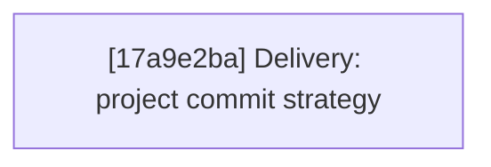

# Agentty Roadmap

Single-file roadmap for the active user-facing project backlog. Humans keep priorities and guardrails here, while only `Ready Now` work carries full execution detail and everything else stays intentionally lighter.

## Current State Snapshot

| Area | Current state in codebase | Status |
|------|---------------------------|--------|
| Follow-up task workflow | Persisted follow-up tasks now launch sibling sessions from session view, and launched/open state survives refresh, reopen, and restart flows. | Landed |
| Review request publish flow | Session chat keeps `p` for generic branch publishing, and `Shift+P` now creates or refreshes the linked GitHub pull request or GitLab merge request while preserving the same publish popup flow. | Landed |
| Model availability scoping | Agentty now requires at least one locally runnable backend CLI at startup, `/model` and Settings filter model choices to runnable backends, and unavailable stored defaults fall back to the first available backend default. | Landed |
| Draft session workflow | `Shift+A` now creates explicit draft sessions that persist ordered staged draft messages, while `a` keeps the immediate-start first-prompt flow. | Landed |
| Session activity timing | `session` persists cumulative `InProgress` timing fields, and both chat and the grouped session list now show the same cumulative active-work timer. | Landed |
| Project delivery strategy | Review-ready sessions can already merge into the base branch or publish a session branch, but projects configured in Agentty still cannot declare whether their normal landing path should be direct merge to `main` or a pull-request flow. | Missing |
| Session resume efficiency | Codex and Gemini app-server turns already reuse a compact reminder after the first bootstrap, but Claude sessions still resend the full wrapper because session identity is not yet explicit. | Partial |

## Active Streams

- `Delivery`: project-level landing strategy plus forge-aware review-request publishing for review-ready sessions, including direct-merge vs. review-request expectations.
- `Protocol`: provider session continuity and compact context replay so resumed chats stay responsive without losing guidance.

## Planning Model

- Keep no more than `5` fully expanded steps in `Ready Now`.
- Keep `Queued Next` as the compact promotion queue for the next few outcomes, not as a second fully detailed backlog.
- Keep `Parked` for strategic work that matters, but should not consume active planning attention yet.
- Treat `500` changed lines as the hard implementation ceiling and keep `Ready Now` slices estimated at `350` changed lines or less so normal implementation drift still stays reviewable.
- Run `cargo run -q -p ag-xtask -- roadmap context-digest` before promoting queued or parked work so the decision uses fresh repository context.
- When a `Ready Now` step lands and queued work remains, promote the next queued card into `Ready Now` instead of leaving the execution window short.
- Until lease automation exists, only `Ready Now` items can carry an assignee, and every promoted `Ready Now` step must set that assignee in the promotion edit.
- When promoting queued or parked work into `Ready Now`, either name an explicit `@username` or default to the current promoter resolved with `gh api user --jq .login`; do not use a separate claim-only edit.
- Keep roadmap items focused on user-facing outcomes; validation and documentation stay in the same roadmap item through its `#### Tests` and `#### Docs` sections instead of becoming standalone cards.
- Keep `Ready Now` implementation scopes to `1..=3` bullets under `#### Substeps`; when a step needs broader adoption, copy polish, or a second peer surface, queue the follow-up instead of widening the current slice.

## Ready Now

### [17a9e2ba-0b7d-407d-9cd4-72807ef7bc1f] Delivery: Add project commit strategy selection

#### Assignee

`@minev-dev`

#### Why now

The GitHub-specific `Shift+P` pull-request publish shortcut is now landed, so the next delivery gap is deciding which repositories should default to that review-request flow versus direct merge to `main`.

#### Usable outcome

Each Agentty project can declare its expected landing path, and review-ready sessions can use that policy to present the right default delivery path instead of treating merge and pull-request workflows as interchangeable.

#### Substeps

- [ ] **Persist the per-project landing strategy setting.** Update the project and settings domain models plus the backing persistence in `crates/agentty/src/domain/project.rs`, `crates/agentty/src/domain/setting.rs`, `crates/agentty/src/infra/db.rs`, and `crates/agentty/src/app/setting.rs` so each project stores a canonical delivery strategy such as direct merge versus pull request, with coverage for persisted strategy round-trips.
- [ ] **Expose the landing strategy in project settings UI.** Update the settings runtime and UI flow in `crates/agentty/src/runtime/mode/list.rs`, `crates/agentty/src/ui/page/setting.rs`, and related settings state/helpers so users can view and change the active project's landing strategy without leaving Agentty, and cover the editing flow in the touched runtime and UI tests.
- [ ] **Apply the landing strategy in review-ready session actions.** Update `crates/agentty/src/app/core.rs`, `crates/agentty/src/runtime/mode/session_view.rs`, `crates/agentty/src/ui/state/help_action.rs`, and `docs/site/content/docs/usage/workflow.md`, `docs/site/content/docs/usage/keybindings.md`, and `docs/site/content/docs/getting-started/overview.md` so session-chat defaults, help copy, and end-user docs all reflect whether the active project expects direct merge or pull-request publishing.

#### Tests

- [ ] Add or extend coverage in `crates/agentty/src/app/setting.rs`, `crates/agentty/src/infra/db.rs`, `crates/agentty/src/runtime/mode/list.rs`, `crates/agentty/src/runtime/mode/session_view.rs`, and `crates/agentty/src/ui/page/setting.rs` for persisted strategy round-trips, settings editing, and delivery-action selection in session view.

#### Docs

- [ ] Update `docs/site/content/docs/usage/workflow.md`, `docs/site/content/docs/usage/keybindings.md`, and `docs/site/content/docs/getting-started/overview.md` to explain the new per-project delivery strategy setting and how it affects review-ready session actions.

## Ready Now Execution Order

## Queued Next

### [8d03ed45-0f91-4d1d-b761-2d74f7027ef7] Protocol: Track explicit Claude session identity for one-time bootstrap reuse

#### Outcome

Give Claude-backed sessions an explicit provider session identifier so Agentty can safely reuse the same bootstrap-once instruction delivery strategy instead of relying on implicit `claude -c` continuation behavior.

#### Promote when

Promote when maintainers want Claude sessions to reuse the bootstrap-once flow now that Codex and Gemini app-server contexts have the baseline delivery planner.

#### Depends on

`[d9307a06] Protocol: Bootstrap direct agent instructions once per app-server session` (landed)

### [84aa58cc-8cd0-41cb-a6fc-a97016e85f0d] Protocol: Replace reset replay with compact session memory

#### Outcome

Restarted provider sessions resend a structured session-memory summary of constraints, open questions, and touched files instead of replaying the full transcript whenever a runtime loses native context.

#### Promote when

Promote when the compact app-server follow-up path proves stable enough that restart-specific replay size becomes the next protocol bottleneck.

#### Depends on

`[d9307a06] Protocol: Bootstrap direct agent instructions once per app-server session` (landed)

## Parked

No parked user-facing cards right now.

## Context Notes

- `Delivery: Add project commit strategy selection` should define the landing policy at the Agentty project level so merge and publish actions can present the right default path for each managed repository.
- `Protocol: Track explicit Claude session identity for one-time bootstrap reuse` should land before the broader compact-resume follow-up so Claude sessions stop paying the full bootstrap cost on every turn.
- Roadmap entries stay user-facing; implementation validation and documentation belong in each step's `#### Tests` and `#### Docs` sections instead of as standalone backlog cards.
- Run `cargo run -q -p ag-xtask -- roadmap context-digest` before promoting queued or parked work to `Ready Now`.

## Status Maintenance Rule

- Keep no more than `5` items in `## Ready Now`.
- Keep only `Ready Now` items fully expanded with `#### Assignee`, `#### Why now`, `#### Usable outcome`, `#### Substeps`, `#### Tests`, and `#### Docs`.
- Keep `## Queued Next` and `## Parked` as compact promotion cards with `#### Outcome`, `#### Promote when`, and `#### Depends on`.
- Promote queued or parked work into `## Ready Now` by assigning that step in the same roadmap edit, either to an explicit `@username` or to the current promoter resolved through `gh api user --jq .login`.
- Keep each `Ready Now` step estimated at `350` changed lines or less so implementation remains below the `500`-line hard ceiling, and split any wider follow-up into `## Queued Next`.
- Keep the roadmap focused on user-facing outcomes; do not add standalone test-only, docs-only, cleanup-only, or other internal-only cards.
- After a `Ready Now` step lands, remove it from `## Ready Now`, refresh any changed snapshot rows, and promote the next queued card whenever `## Queued Next` still has work.
- If follow-up work remains after a step lands, add or update a compact queued or parked card instead of preserving the completed step.
