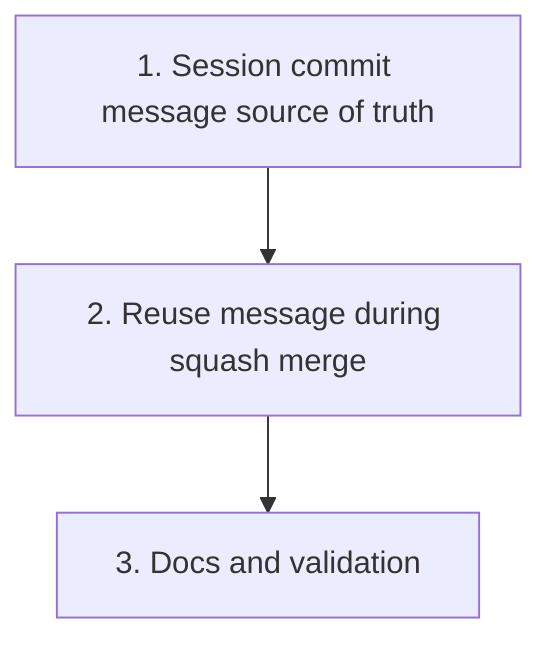

# Maintain Session Commit Messages Through Merge

Plan for changing `crates/agentty/src/app/session`, `crates/agentty/src/infra/git`, and `crates/agentty/resources/` so each session worktree keeps one high-quality commit title/body during the session and merge reuses that message instead of generating a new squash-merge message.

## Priorities

## 1) Make the session worktree commit message the source of truth

### Why now

The current placeholder session commit hides useful history inside the worktree and forces Agentty to invent the real title and summary only at merge time. The first landed slice should make the single session commit itself accurate so later merge changes can reuse it directly.

### Usable outcome

After each turn finishes auto-commit, the session branch still has exactly one commit, but that commit now carries a readable title/body that reflects the current branch state instead of the `Beautiful commit (made by Agentty)` placeholder.

- [x] Replace the fixed `COMMIT_MESSAGE` placeholder path in `crates/agentty/src/app/session/core.rs`, `crates/agentty/src/app/session/workflow/task.rs`, and `crates/agentty/src/app/session/workflow/merge.rs` with a session commit-message flow that can evolve as the branch changes.
- [x] Add a dedicated prompt resource for session commit-message generation or rename/generalize `crates/agentty/resources/merge_commit_message_prompt.md` so the prompt is explicitly session-scoped instead of merge-scoped.
- [x] Generate the session commit title/body from the session diff after each successful turn, using the current `HEAD` commit message as continuity input when amending so the model can refine the same message instead of starting from scratch every time.
- [x] Extend `crates/agentty/src/infra/git/client.rs` and `crates/agentty/src/infra/git/sync.rs` so the single-commit path can amend `HEAD` with an updated message (`git commit --amend -m ...`) instead of only using `--no-edit` when the existing commit should stay in place.
- [x] Persist the generated commit title/body into session metadata during the turn so `session.title` and `session.summary` stay aligned with the branch commit before merge begins.
- [x] Add focused tests that cover first commit creation, later message-changing amend behavior, and session title/summary synchronization from the generated commit message.

Primary files:

- `crates/agentty/src/app/session/core.rs`
- `crates/agentty/src/app/session/workflow/task.rs`
- `crates/agentty/src/app/session/workflow/merge.rs`
- `crates/agentty/src/infra/git/client.rs`
- `crates/agentty/src/infra/git/sync.rs`
- `crates/agentty/resources/`

## 2) Reuse the session commit message during merge and keep squash merge

### Why now

Once the session branch commit message is authoritative, merge should stop generating a second message. Keeping squash merge is the smaller and safer change because the current workflow already relies on squash-diff inspection, already-present detection, merge-queue behavior, and worktree cleanup around that strategy.

### Usable outcome

Merging still rebases the session branch and lands one commit on the base branch, but Agentty now reuses the session branch `HEAD` commit message for that final commit instead of asking the model to generate a new merge-only message.

- [ ] Remove the merge-time one-shot commit-message generation path from `crates/agentty/src/app/session/workflow/merge.rs` and replace it with loading the session branch `HEAD` commit message after the pre-merge auto-commit/rebase step.
- [ ] Add the minimal git-client support needed to read the authoritative session commit message from the worktree and pass it through to `squash_merge`.
- [ ] Keep `git merge --squash` as the merge mechanism unless implementation work reveals a concrete blocker; do not switch to rebase/fast-forward merge in this pass.
- [ ] Delete any now-obsolete merge-message prompt/template code and parsing-only tests once merge no longer calls that utility path.
- [ ] Add merge-focused tests that verify the base-branch squash commit reuses the session commit title/body and that the empty-diff/already-present branch still skips commit creation cleanly.

Primary files:

- `crates/agentty/src/app/session/workflow/merge.rs`
- `crates/agentty/src/infra/git/client.rs`
- `crates/agentty/src/infra/git/merge.rs`
- `crates/agentty/resources/`

## 3) Sync docs and validation with the new single-message flow

### Why now

The repository docs currently describe merge-time commit-message generation and one-shot utility prompts that will no longer exist in that form, so the documentation needs to move with the code rather than lag behind it.

### Usable outcome

Contributor and user docs describe the session commit message as the canonical source, merge no longer claims to generate a fresh message, and validation covers the new behavior end to end.

- [ ] Update `docs/site/content/docs/usage/workflow.md` so review/merge behavior explains that session turns keep one evolving commit message and merge reuses it.
- [ ] Update `docs/site/content/docs/architecture/runtime-flow.md` and `docs/site/content/docs/architecture/module-map.md` so the one-shot utility list and merge-task description no longer claim merge-time commit-message generation.
- [ ] Update `docs/site/content/docs/agents/backends.md` to remove merge-message generation from the examples of one-shot internal prompts if that utility path is removed.
- [ ] Run focused tests while iterating, then finish with the repository validation gates once implementation lands.

Primary files:

- `docs/site/content/docs/usage/workflow.md`
- `docs/site/content/docs/architecture/runtime-flow.md`
- `docs/site/content/docs/architecture/module-map.md`
- `docs/site/content/docs/agents/backends.md`
- `crates/agentty/src/app/session/core.rs`
- `crates/agentty/src/app/session/workflow/merge.rs`
- `crates/agentty/src/infra/git/client.rs`
- `crates/agentty/src/infra/git/sync.rs`

## Cross-Plan Notes

- `docs/plan/continue_in_progress_sessions_after_exit.md` also touches session worker and merge workflow files, but it owns detached execution and restart recovery. This plan owns commit-message generation and merge-message reuse.
- No other active plan under `docs/plan/` currently claims session commit-message flow.

## Status Maintenance Rule

- After implementing any step in this plan, immediately update its checklist status and refresh the snapshot rows that changed.
- When a step changes user-visible merge or session-title behavior, update the corresponding docs in the same step before marking it complete.

## Current State Snapshot

| Area | Current state in codebase | Status |
|------|---------------------------|--------|
| Session worktree commits | Auto-commit now derives one evolving session commit message from the cumulative session diff and rewrites `HEAD` with that title/body while keeping the branch to one session commit. | Completed |
| Session metadata | Session `title` and `summary` now refresh from the current session commit message after turn auto-commit and pre-merge rebase auto-commit work. | Completed |
| Merge message source | `SessionMergeService` renders `merge_commit_message_prompt.md` and asks the model for a squash-merge commit message right before `git merge --squash`. | Not Started |
| Merge strategy | The current merge path already does rebase-first, squash-merge second, then worktree cleanup, and it has tests around empty-diff and already-present cases. | In Progress |
| Documentation | User and architecture docs still describe merge-time commit-message generation as part of the `Merging` state. | Not Started |

## Design Decisions

### Canonical commit message source

Treat the session branch `HEAD` commit message as the canonical title/body for the work in progress. Session metadata shown in the UI should derive from that same message so the worktree, database, and final merged commit stay aligned.

### Merge strategy

Keep squash merge for this pass. The branch already stays at one evolving commit, but squash merge still preserves the existing merge queue orchestration, already-present detection, and cleanup path with less churn than replacing it with a different merge primitive.

### Amend behavior

A single-commit session still needs message evolution, so the git layer must distinguish between "reuse existing message" and "rewrite the same commit with an updated message". That change belongs in the git boundary rather than in ad hoc shell handling inside app workflows.

## Implementation Approach

- Start by making the session commit message authoritative inside the worktree and in persisted session metadata; that yields immediate user value even before merge behavior changes.
- Once the branch commit message is reliable, simplify merge by reading that message directly instead of running a merge-specific one-shot generation prompt.
- Fold docs and cleanup into the same change path that removes merge-time generation so obsolete prompt/template code does not linger.

## Suggested Execution Order

1. Start with `1) Make the session worktree commit message the source of truth`; merge reuse depends on that message becoming stable and persisted.
1. Continue with `2) Reuse the session commit message during merge and keep squash merge`; this can delete the merge-specific generation path only after priority 1 exists.
1. Finish with `3) Sync docs and validation with the new single-message flow` once behavior and obsolete prompt/template paths are settled.
1. No top-level priorities should run in parallel because each later step depends on the message ownership decision finalized in the previous one.

## Out of Scope for This Pass

- Switching the final merge path from squash merge to rebase/fast-forward merge unless implementation uncovers a blocker severe enough to revisit that decision with the user.
- Changing review generation, branch publish flow, or detached session execution beyond the parts that consume session title/summary or merge messaging.
- Expanding session history from one evolving commit to a multi-commit branch model.
