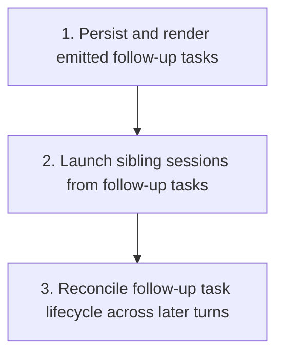

# Session Follow-Up Task Plan

Plan for extending `crates/agentty/src/infra`, `crates/agentty/src/app`, `crates/agentty/src/runtime`, and `crates/agentty/src/ui` so session turns can emit low-severity nitpick follow-up tasks that are unrelated to the current turn and can be launched immediately as new sessions while the source session stays active.

## Steps

## 1) Persist and render emitted follow-up tasks

### Why now

The first slice needs a durable contract and visible session-level output before Agentty can safely launch sibling sessions from emitted tasks.

### Usable outcome

After a session turn completes, the session can show a persisted list of low-severity nitpick follow-up tasks and that list survives refresh and reopen.

### Substeps

- [ ] **Add a structured follow-up task wire type.** Extend `crates/agentty/src/infra/agent/protocol/model.rs`, `crates/agentty/src/infra/agent/protocol/schema.rs`, `crates/agentty/src/infra/agent/protocol/parse.rs`, `crates/agentty/src/infra/agent/prompt.rs`, and `crates/agentty/src/infra/agent/template/protocol_instruction_prompt.md` with a `FollowUpTaskItem` shape and `follow_up_tasks` top-level response field. Keep the first pass narrow by documenting and validating only low-severity nitpick tasks that are unrelated to the just-finished turn and are actionable in a fresh session.
- [ ] **Add durable follow-up task storage.** Add a new migration in `crates/agentty/migrations/` that creates a singular `session_follow_up_task` table with session ownership, display order, launch status, prompt/title/body fields, and timestamps. Extend `crates/agentty/src/infra/db.rs` with load and replace helpers, and extend `crates/agentty/src/domain/session.rs` so loaded session snapshots carry emitted follow-up tasks alongside existing `questions` and `summary`.
- [ ] **Persist follow-up tasks in the turn worker flow.** Update `crates/agentty/src/app/session/workflow/worker.rs` so successful turns replace the session’s open follow-up task set with the latest emitted list while preserving future room for launched-task history. Keep this persistence adjacent to existing summary and question updates so one parsed response drives all structured session-side state.
- [ ] **Render a read-only follow-up task list in session view.** Update `crates/agentty/src/ui/page/session_chat.rs`, `crates/agentty/src/ui/component/session_output.rs`, and any supporting view-state code so sessions in `Review`, `Question`, and `Done` can display emitted follow-up tasks without mixing them into transcript text or clarification-question UI.

### Tests

- [ ] Add protocol-model and schema tests for `follow_up_tasks` in `crates/agentty/src/infra/agent/protocol/`.
- [ ] Add database round-trip tests in `crates/agentty/src/infra/db.rs` for storing, replacing, and loading `session_follow_up_task` rows.
- [ ] Add worker and UI tests in `crates/agentty/src/app/session/workflow/worker.rs` and `crates/agentty/src/ui/page/session_chat.rs` that verify emitted tasks persist and render without altering transcript output.

### Docs

- [ ] Update `docs/site/content/docs/architecture/runtime-flow.md` and `docs/site/content/docs/architecture/module-map.md` to describe the new structured response field, task persistence path, and session-view rendering boundary.

## 2) Launch sibling sessions from follow-up tasks

### Why now

Once tasks are visible and durable, the next slice should make them immediately useful by turning one emitted task into a new session without disturbing the source session.

### Usable outcome

A user can select one emitted follow-up task in session view, create a new sibling session seeded from that task, and keep working with both sessions independently.

### Substeps

- [ ] **Add follow-up task selection state and actions.** Extend the relevant session-view and app state in `crates/agentty/src/app/core.rs`, `crates/agentty/src/app/session/core.rs`, `crates/agentty/src/runtime/key_handler.rs`, and `crates/agentty/src/ui/state/app_mode.rs` so the user can focus emitted follow-up tasks separately from transcript output and clarification questions.
- [ ] **Create sessions from follow-up tasks through existing session creation flow.** Reuse the normal `create_session()` and prompt-submission path in `crates/agentty/src/app/session/workflow/lifecycle.rs`, `crates/agentty/src/app/session/core.rs`, and `crates/agentty/src/runtime/mode/session_view.rs` so launching a follow-up task behaves exactly like starting any other new session, seeded from the task prompt/body without introducing a special-case backend path.
- [ ] **Mark launched tasks locally without parent-child session links.** Extend `crates/agentty/src/infra/db.rs`, `crates/agentty/src/domain/session.rs`, and the relevant reducer/update flow in `crates/agentty/src/app/core.rs` so launching a task marks only the task row as launched and prevents accidental duplicate launches, without storing a spawned session id or any parent linkage requirement.
- [ ] **Add a session-view affordance for immediate launch.** Update `crates/agentty/src/ui/page/session_chat.rs` and any supporting help/footer rendering so emitted tasks expose a clear launch action and status text without competing with existing `Review` and `Question` actions.

### Tests

- [ ] Add reducer and key-handler tests in `crates/agentty/src/app/core.rs` and `crates/agentty/src/runtime/key_handler.rs` for task selection, launch, and status updates.
- [ ] Add workflow tests in `crates/agentty/src/app/session/workflow/lifecycle.rs` or `crates/agentty/src/app/session/core.rs` that verify launched follow-up tasks create normal sibling sessions with seeded prompts and keep the source session unchanged.

### Docs

- [ ] Update `docs/site/content/docs/usage/workflow.md` and `docs/site/content/docs/usage/keybindings.md` to explain how emitted follow-up tasks appear in session view and how to launch them into new sessions.

## 3) Reconcile follow-up task lifecycle across later turns

### Why now

Launching one task is not enough if later turns resurrect stale nitpicks or wipe out already-launched items. The lifecycle rules need to settle before the feature is considered coherent.

### Usable outcome

Later turns refresh only the still-open follow-up task list, launched tasks remain identifiable, and reopened sessions continue to show the correct task state without duplicate noise.

### Substeps

- [ ] **Define open-versus-launched replacement rules.** Update `crates/agentty/src/app/session/workflow/worker.rs` and `crates/agentty/src/infra/db.rs` so each successful turn replaces only open follow-up tasks for the source session while retaining launched rows as local history without any linked-session metadata.
- [ ] **Normalize and cap emitted tasks before persistence.** Add a focused normalization helper near `crates/agentty/src/infra/agent/protocol/` or `crates/agentty/src/app/session/workflow/worker.rs` that drops empty entries, enforces stable ordering, caps the number of tasks persisted per turn, and keeps the first pass constrained to low-severity nitpicks.
- [ ] **Keep refresh and reopen behavior aligned with persisted task state.** Update `crates/agentty/src/app/session/workflow/load.rs`, `crates/agentty/src/app/session/workflow/refresh.rs`, and related session reload paths so reopened sessions, refreshed list views, and session-mode transitions do not lose or duplicate follow-up task state.
- [ ] **Show lifecycle state without bloating transcript output.** Refine session-view rendering in `crates/agentty/src/ui/page/session_chat.rs` and `crates/agentty/src/ui/component/session_output.rs` so open and launched tasks remain understandable without being appended into the main transcript or summary markdown.

### Tests

- [ ] Add worker/database tests that verify later turns replace only open tasks and preserve launched tasks.
- [ ] Add reload tests in `crates/agentty/src/app/core.rs`, `crates/agentty/src/app/session/workflow/load.rs`, or `crates/agentty/src/app/session/workflow/refresh.rs` for reopen-time task hydration and de-duplication.

### Docs

- [ ] Refresh `docs/site/content/docs/usage/workflow.md` and `docs/site/content/docs/architecture/runtime-flow.md` if the final lifecycle rules add visible launched/open task states or refresh-time behavior beyond step 2.

## Cross-Plan Notes

- `docs/plan/draft_session_prompt_collection.md` also touches how new sessions are seeded. This plan should reuse the current normal session-creation flow first; if draft-session collection lands before step 2, launching a follow-up task should seed a draft session through that shared flow instead of inventing a separate prompt-entry path.
- `docs/plan/session_execution_backends.md` also changes session creation and reply lifetime, but it owns backend execution semantics. This plan owns emitted follow-up task modeling, persistence, and sibling-session launch behavior.
- If another active plan conflicts with this plan and the correct resolution is not explicit, stop and ask the user which plan should control the work.

## Status Maintenance Rule

- After implementing any step in this plan, immediately update its checklist status in this document and refresh any current-state snapshot rows that changed.
- When a step changes behavior, complete its `### Tests` and `### Docs` work in that same step before marking it complete.
- When the full plan is complete, remove this file and move any remaining expansion work into a new follow-up plan instead of extending a finished plan indefinitely.

## Current State Snapshot

| Area | Current state in codebase | Status |
|------|---------------------------|--------|
| Protocol contract | `AgentResponse` currently carries `answer`, `questions`, and `summary`, but no structured follow-up task field. | Not started |
| Session persistence | Session storage persists `questions` and `summary` on `session`, but no table or field stores per-session emitted follow-up tasks or local launch state. | Not started |
| Turn finalization | `crates/agentty/src/app/session/workflow/worker.rs` persists summary/questions after successful turns and ignores any concept of task backlog. | Not started |
| Session reload | Loaded `Session` snapshots include summary and questions, but no emitted task list is rehydrated into app state. | Not started |
| Session view UI | Session chat supports transcript output, review text, and clarification questions, but no read-only or actionable follow-up task section exists. | Not started |
| New-session launch path | Agentty can already create normal sessions through `create_session()`, but there is no way to seed that flow from an emitted task on another session. | Partial |
| User docs | Workflow, keybinding, and runtime-flow docs do not mention follow-up tasks. | Not started |

## Implementation Approach

- Use a dedicated persisted task record shape instead of stuffing emitted tasks into transcript text or the existing session `summary` field.
- Keep the first pass intentionally narrow: emitted tasks are low-severity nitpicks, unrelated to the just-finished turn, and immediately actionable as separate sessions.
- Reuse existing session creation and loading flows wherever possible so follow-up tasks become a thin layer over normal session behavior, not a second orchestration system.
- Treat launched follow-up tasks as local source-session bookkeeping only; the new session stands alone and does not need a persisted parent/child relationship.
- Keep task rendering separate from transcript output and clarification questions so each structured response channel has one clear job.

## Suggested Execution Order

1. Start with `1) Persist and render emitted follow-up tasks`; it establishes the protocol, storage, and visible baseline the rest of the feature depends on.
1. Start `2) Launch sibling sessions from follow-up tasks` only after step 1 lands, because launch behavior needs durable task ids and visible session-state affordances.
1. Start `3) Reconcile follow-up task lifecycle across later turns` after step 2 lands, because replacement and launched-task retention rules depend on the final launch semantics.
1. No top-level steps are safe to run in parallel right now because each slice depends on the persisted task model introduced by the previous step.

## Out of Scope for This Pass

- High-severity, blocking, or current-turn-dependent follow-up work items.
- Automatic background spawning of new sessions without explicit user action.
- Cross-session completion syncing that marks a follow-up task done based on progress inside the spawned sibling session.
- General plan-mode or sub-agent orchestration beyond the low-severity nitpick follow-up task flow described here.
