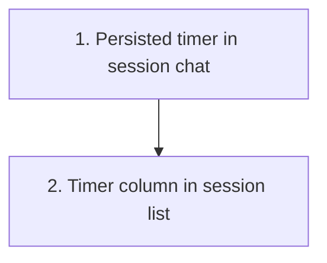

# Session In-Progress Timer Plan

Plan for changing `crates/agentty/src/app`, `crates/agentty/src/domain`, `crates/agentty/src/infra`, and `crates/agentty/src/ui` so each session records cumulative time spent in `InProgress` and displays that timer in session chat and the session list.

## Steps

## 1) Ship persisted `InProgress` timing in session chat

### Why now

The first slice needs to make the timer real end to end in one user-facing place, so the persistence model and status-transition math are proven before the list grows another column.

### Usable outcome

Opening a session chat shows a compact cumulative active-work timer in the header once the session has entered `InProgress`, and the value keeps ticking while the turn is running before freezing when the session leaves `InProgress`.

### Substeps

- [ ] **Persist session timing fields on `session`.** Add a new migration in `crates/agentty/migrations/` that extends `session` with `in_progress_total_seconds INTEGER NOT NULL DEFAULT 0` and `in_progress_started_at INTEGER`, backfilling existing rows to zero or `NULL` without editing older migrations.
- [ ] **Load timing state through the domain model.** Extend `crates/agentty/src/infra/db.rs`, `crates/agentty/src/domain/session.rs`, and `crates/agentty/src/app/session/workflow/load.rs` so `SessionRow` and `Session` carry the new timing fields, and add documented domain helpers that compute elapsed `InProgress` seconds from persisted totals plus a live start timestamp.
- [ ] **Make status transitions timing-aware.** Update `crates/agentty/src/app/session/workflow/task.rs` so production status changes open the timing window when entering `Status::InProgress` and fold elapsed seconds back into `in_progress_total_seconds` when leaving it, and update `crates/agentty/src/app/session/workflow/worker.rs` startup recovery so forced `InProgress` -> `Review` cleanup also closes any open timer window.
- [ ] **Thread wall-clock render time into chat rendering.** Pass the current Unix timestamp from `crates/agentty/src/app/core.rs` through `crates/agentty/src/ui/render.rs`, `crates/agentty/src/ui/router.rs`, and `crates/agentty/src/ui/overlay.rs` into `crates/agentty/src/ui/page/session_chat.rs`, then reuse `crates/agentty/src/ui/text_util.rs::format_duration_compact()` to append a compact timer label to the session header without introducing a second formatting path.
- [ ] **Refresh doc comments alongside the timing code.** Refresh or add `///` doc comments for the new `Session` timing fields, timing helper methods, and any updated DB/status-transition functions so the persistence semantics are explicit in code.

### Tests

- [ ] Add database tests in `crates/agentty/src/infra/db.rs` covering migration defaults plus timing accumulation for `InProgress` -> `Review`, `InProgress` -> `Question`, and startup-recovery `InProgress` -> `Review` flows.
- [ ] Add session workflow tests in `crates/agentty/src/app/session/core.rs` or `crates/agentty/src/app/session/workflow/worker.rs` that exercise first-prompt and reply turns and assert the stored timer survives multiple `InProgress` intervals.
- [ ] Add chat-header tests in `crates/agentty/src/ui/page/session_chat.rs` that verify timer rendering, truncation, and live ticking with deterministic timestamps.

### Docs

- [ ] Update `docs/site/content/docs/usage/workflow.md` to note that session chat now shows cumulative active `InProgress` time and that it is distinct from the existing session lifetime shown by `/stats`.

## 2) Add the timer to the grouped session list

### Why now

Once chat proves the persistence and live-rendering path, the list view can reuse the same snapshot data with much lower risk and without inventing separate timer logic.

### Usable outcome

The Sessions tab shows a compact timer value for each row, including live ticking for active sessions and frozen totals for review, question, done, and canceled sessions that already spent time in `InProgress`.

### Substeps

- [ ] **Add a dedicated time column to `session_list.rs`.** Update `crates/agentty/src/ui/page/session_list.rs` to render a compact `Time` column, adjust grouped header and placeholder rows to the new column count, and size the column from actual rendered timer labels plus the header text.
- [ ] **Reuse one shared timer-label path in list and chat.** Keep the list on the same session timing helper and `format_duration_compact()` output used by chat so active and completed sessions render identical duration semantics instead of duplicating timer math in page-local helpers.
- [ ] **Thread the current timestamp into list rendering.** Extend the relevant render context and `SessionListPage::new(...)` call sites so the list can show live ticking `InProgress` rows without forcing high-frequency DB refreshes.
- [ ] **Keep constructor and fixture updates localized.** Update the affected UI constructor call sites and page test fixtures so the timer-aware render inputs compile cleanly without broad unrelated refactors.

### Tests

- [ ] Add list-page tests in `crates/agentty/src/ui/page/session_list.rs` for the new column width, grouped row cell count, and rendered timer text for active, archived, and never-started sessions.
- [ ] Add or refresh any render-context tests touched by the new timestamp field so list/chat overlays keep building the correct page constructors.

### Docs

- [ ] Extend the same `docs/site/content/docs/usage/workflow.md` update with a short note that the Sessions tab includes the cumulative active-work timer column.

## Cross-Plan Notes

- `docs/plan/continue_in_progress_sessions_after_exit.md` also touches persisted `InProgress` semantics. This timer plan owns cumulative session timing fields and UI display, while the detached-session plan should reuse those fields if reopened sessions later remain `InProgress` across app restarts.
- No other active plan currently owns `session_list.rs` or `session_chat.rs` timer display behavior.

## Status Maintenance Rule

- After implementing any step in this plan, immediately update its checklist status and refresh the snapshot rows that changed.
- When a step changes behavior, complete its `### Tests` and `### Docs` work in that same step before marking it complete.
- When the full plan is complete, remove this file and keep any follow-up work in a new plan file instead of extending a finished plan indefinitely.

## Current State Snapshot

| Area | Current state in codebase | Status |
|------|---------------------------|--------|
| Session persistence | `session` stores `created_at` and `updated_at`, but it has no dedicated fields for cumulative `InProgress` timing. | Not Started |
| Status transition wiring | `SessionTaskService::update_status()` centralizes status updates and emits refresh events, but it does not open or close timed `InProgress` windows. | Partial |
| Startup recovery | `fail_unfinished_operations_from_previous_run()` forces interrupted sessions back to `Review`, but it does not preserve or finalize any active-work duration. | Not Started |
| Chat header | `crates/agentty/src/ui/page/session_chat.rs` renders `Status - Title` only and already has header-focused tests. | Not Started |
| Session list | `crates/agentty/src/ui/page/session_list.rs` renders `Session`, `Model`, `Size`, and `Status` columns only. | Not Started |
| Duration formatting | `crates/agentty/src/ui/text_util.rs` already provides `format_duration_compact()` for compact elapsed-time labels. | Ready |
| Live redraw | The runtime redraw loop already ticks every 50 ms and `SessionState` already owns an injected clock boundary. | Ready |

## Design Decisions

### Timing source of truth

Persist cumulative `InProgress` timing on `session` itself instead of deriving it ad hoc from `created_at`/`updated_at` or from `session_operation`. The timer is a property of the session lifecycle state, so it should be available on every loaded session snapshot without having to re-interpret operation history at render time.

### Live timer rendering

Use the persisted `in_progress_started_at` plus the existing injected wall clock to compute the live increment during rendering. This keeps the timer accurate between status transitions without requiring extra DB writes every second.

### Formatting

Reuse `format_duration_compact()` everywhere the timer is shown so the list and chat stay visually aligned and tests only need one formatting contract.

## Implementation Approach

- Start with chat view because it is the smallest end-to-end slice that proves the timer math, persistence, and live ticking behavior on one focused session.
- Keep status-transition timing centralized around the existing production status-update path so later lifecycle states do not need to duplicate accumulation logic.
- Reuse the existing refresh events on `InProgress` and terminal transitions to resync persisted timing fields after status changes instead of adding new runtime channels.
- Treat `/stats` lifetime duration as out of scope for this pass and document the distinction rather than changing multiple time concepts at once.

## Suggested Execution Order

1. Start with `1) Ship persisted InProgress timing in session chat`; it is the smallest usable slice and establishes the storage and render contract the list will reuse.
1. Start `2) Add the timer to the grouped session list` only after step 1 is merged so the list can build on the settled session timing fields and shared formatting path.
1. No top-level steps are safe to run in parallel because the list view depends on the persistence and render-context changes introduced by the chat slice.

## Out of Scope for This Pass

- Replacing the existing `/stats` session lifetime calculation with the new cumulative `InProgress` timer.
- Tracking time spent in `Queued`, `Rebasing`, or `Merging`; this plan covers `Status::InProgress` only.
- Adding historical charts, sort orders, or filters based on the new timer beyond displaying it in `session_list.rs` and `session_chat.rs`.
