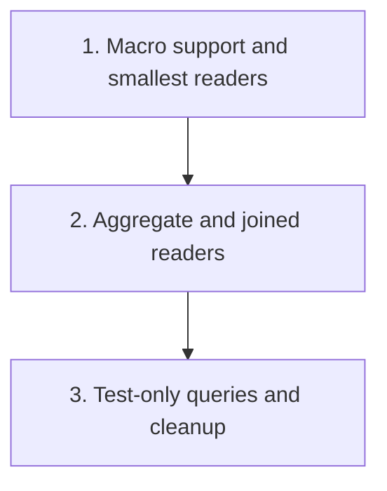

# SQLx `query_as!` Migration Plan For `db.rs`

Plan for replacing row-returning `sqlx::query(...)` usage in `crates/agentty/src/infra/db.rs` with compile-time checked `sqlx::query_as!` mappings while preserving the existing `Database` API and test coverage.

## Steps

## 1) Establish SQLx macro support and convert the smallest reader slice

### Why now

`query_as!` cannot land incrementally until the workspace can compile SQLx macros and the repository has an agreed offline metadata workflow for the `agentty` database schema.

### Usable outcome

The repository builds with SQLx macros enabled, `.sqlx` metadata is generated for the current SQLite schema, and the simplest `db.rs` read paths stop depending on ad hoc `row.get(...)` extraction.

### Substeps

- [x] **Enable macro-backed SQLx compilation.** Updated workspace `sqlx` features in `Cargo.toml` to include `macros` and added a local contributor command in `CONTRIBUTING.md` for query-metadata preparation.
- [x] **Commit the initial offline query metadata.** Generated and checked in `crates/agentty/.sqlx/` for the current `agentty` schema so the step-1 `query_as!` conversions build cleanly with `SQLX_OFFLINE=true`.
- [x] **Convert single-table reader methods first.** Replaced manual row extraction in smallest reader methods in `crates/agentty/src/infra/db.rs` (`get_project()`, `load_sessions_metadata()`, `get_session_base_branch()`, `get_session_provider_conversation_id()`, `get_setting()`, `get_project_setting()`, `load_session_project_id()`, `load_active_project_id()`) using `query_as!`.
- [x] **Keep write-only paths unchanged in this slice.** Leave `INSERT`, `UPDATE`, and `DELETE` calls that only use `.execute()` on `sqlx::query(...)` untouched so the first slice only establishes the read-path migration pattern.

### Tests

- [x] Run focused `db.rs` tests that cover the converted reader methods, then run `cargo check -q --all-targets --all-features` to confirm the macro feature and `.sqlx` metadata compile cleanly. Validated with `cargo test -q infra::db::tests -- --test-threads=1` and `SQLX_OFFLINE=true cargo check -q --all-targets --all-features`.

### Docs

- [x] Update `CONTRIBUTING.md` with the required SQLx query-preparation command and any `DATABASE_URL` expectations if the new `.sqlx` workflow is not already documented.

## 2) Convert aggregate and joined readers to typed macro mappings

### Why now

After the macro toolchain is proven on small readers, the highest-value safety gain comes from removing the large manual mapping blocks that currently translate joined and aggregate query rows into domain-facing structs.

### Usable outcome

Project lists, session lists, session-operation readers, and usage readers are all backed by compile-time checked `query_as!` mappings instead of hand-written `row.get(...)` code.

### Substeps

- [x] **Replace project and usage aggregate mappings.** Convert `load_projects_with_stats()`, `load_session_activity_timestamps()`, `load_unfinished_session_operations()`, and `load_session_usage()` in `crates/agentty/src/infra/db.rs` to `query_as!`-backed row types, handling SQLite boolean and nullable-column behavior explicitly in the selected field types.
- [x] **Refactor joined session loading away from `SqliteRow`.** Replace `parse_session_row()` and `parse_session_review_request_row()` in `crates/agentty/src/infra/db.rs` with macro-checked intermediate structs for the `session` plus `session_review_request` join, including the aliased review-request columns and the “partial join means no `SessionReviewRequestRow`” rule.
- [x] **Remove obsolete row-trait plumbing.** Drop `SqliteRow`, `Row`, and any helper code that only existed to support manual extraction once the remaining row-returning methods in `crates/agentty/src/infra/db.rs` have moved to typed macro mappings.

### Tests

- [x] Run the `db.rs` tests that cover project loading, session loading, session-operation loading, and usage aggregation, then run `cargo test -q -- --test-threads=1` once this slice is complete. Validated with `cargo test -q infra::db::tests -- --test-threads=1`, `SQLX_OFFLINE=true cargo check -q --all-targets --all-features`, and `cargo test -q -- --test-threads=1`.

### Docs

- [x] Refresh any contributor-facing notes added in step 1 if the final macro pattern introduces additional guidance around aliased columns, nullable joins, or `.sqlx` regeneration. No additional contributor-facing guidance was needed beyond the existing SQLx preparation workflow.

## 3) Convert test-only raw queries and finish the migration cleanup

### Why now

The production code migration is not complete while the `db.rs` test module still depends on raw `sqlx::query(...)` row inspection to validate the same tables and joins.

### Usable outcome

`crates/agentty/src/infra/db.rs` no longer relies on raw row extraction for row-returning queries in either production code or its co-located tests, and the checked-in SQLx metadata reflects the final query set.

### Substeps

- [ ] **Migrate test helpers to typed rows.** Replace test-only helpers such as `load_session_operation_row()` and the retention checks near the `delete_session()` coverage in `crates/agentty/src/infra/db.rs` with `query_as!`-backed fixtures or helper structs instead of raw rows plus `row.get(...)`.
- [x] **Rewrite parser-specific tests around observable behavior.** Update the tests that currently target `parse_session_row()` directly in `crates/agentty/src/infra/db.rs` so they validate the remaining public behavior after the parser helpers are removed or collapsed into typed conversions.
- [ ] **Regenerate final SQLx metadata and trim leftovers.** Refresh `.sqlx/` after the last query changes and remove any dead helper code, imports, or documentation that still assumes manual `sqlx::query(...)` row mapping.

### Tests

- [ ] Run `pre-commit run rustfmt-fix --all-files --hook-stage manual`, `cargo check -q --all-targets --all-features`, `pre-commit run --all-files`, `pre-commit run clippy --all-files --hook-stage manual`, and `cargo test -q -- --test-threads=1`.

### Docs

- [ ] Confirm `CONTRIBUTING.md` fully reflects the final SQLx preparation workflow and that no additional user-facing docs need updates for this internal database-safety refactor.

## Cross-Plan Notes

- No active file in `docs/plan/` currently owns `crates/agentty/src/infra/db.rs` or the SQLx query-macro workflow, so this plan can proceed independently.

## Status Maintenance Rule

- After implementing any step in this plan, immediately update its checklist status in this document.
- When a step changes contributor workflow or validation commands, complete its `### Tests` and `### Docs` work in that same step before marking it complete.
- When the full plan is complete, delete this file and move any unfinished follow-up work into a new plan file instead of extending a completed plan indefinitely.

## Current State Snapshot

| Area | Current state in codebase | Status |
|------|---------------------------|--------|
| SQLx workspace setup | `Cargo.toml` enables `sqlx` with `runtime-tokio`, `sqlite`, and `macros`, and `CONTRIBUTING.md` documents the preparation workflow. | Complete |
| Offline query metadata | `crates/agentty/.sqlx/` has been refreshed for the current step-2 `query_as!` set, and the workflow is validated with `SQLX_OFFLINE=true`. | Complete |
| `db.rs` row-returning readers | Production row-returning readers in `crates/agentty/src/infra/db.rs` now use `query_as!` for the initial scalar slice, aggregate readers, joined session readers, and unfinished-operation/usage readers. | Complete |
| Joined session mapping | `load_sessions()` and `load_sessions_for_project()` now deserialize through typed `SessionJoinRow` and `SessionReviewRequestJoinRow` conversions instead of `SqliteRow` parsing helpers. | Complete |
| Test coverage shape | The `db.rs` test module now validates the typed joined-session conversion path, but some test helpers still inspect raw query rows directly. | Partial |

## Implementation Approach

- Preserve `sqlx::query(...)` for write-only statements that only call `.execute()`, because the migration target is row-returning queries and their unchecked manual extraction.
- Prefer explicit intermediate row structs with field names that match SQL aliases so `query_as!` can own compile-time verification without forcing public `Database` return types to mirror SQL exactly.
- Convert the simplest read methods first to prove the macro workflow, then migrate the aggregate and join-heavy readers, and only then update the co-located tests to the final typed-row shape.
- Treat `.sqlx` generation as part of each migration slice so the offline metadata stays aligned with the checked-in query set throughout the refactor.

## Suggested Execution Order

1. Start with `1) Establish SQLx macro support and convert the smallest reader slice` because every later conversion depends on the macro feature and offline metadata being in place.
1. Start `2) Convert aggregate and joined readers to typed macro mappings` only after step 1 lands, because the larger conversions should reuse the proven macro and struct pattern from the smallest readers.
1. Start `3) Convert test-only raw queries and finish the migration cleanup` after step 2, because the final test rewrites depend on whichever typed row helpers remain in the production code.

## Out of Scope for This Pass

- Rewriting write-only `INSERT`, `UPDATE`, or `DELETE` calls that do not deserialize result rows.
- Changing the public `Database` API surface unless a return-type adjustment is strictly required to support compile-time checked row mapping.
- Bundling unrelated database-schema or migration changes into the `query_as!` refactor.
