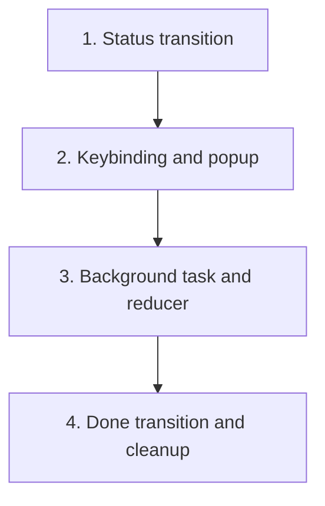

# Sync Review Request

Add an `s` keybinding in session view that checks the forge status of a session's published review request and transitions to `Done` with cleanup when merged.

## Steps

## 1) Allow `Review` and `Question` to Transition Directly to `Done`

### Why now

The status state machine currently only allows `Merging → Done`. The sync feature needs `Review → Done` and `Question → Done` so a session can complete when its review request is merged externally without going through the local merge queue.

### Usable outcome

`Status::can_transition_to(Status::Done)` returns `true` for `Review` and `Question`, enabling downstream workflows to mark externally merged sessions as complete.

### Substeps

- [x]**Extend `can_transition_to` match arms.** In `crates/agentty/src/domain/session.rs`, add `(Status::Review | Status::Question, Status::Done)` to the `can_transition_to` match expression alongside the existing `(Status::Merging, Status::Done | Status::Review)` arm.
- [x]**Update session status flow comment.** In `crates/agentty/src/AGENTS.md`, update the "Session status flow" bullet under "Local Conventions" to document that `Done` can also be entered from `Review` or `Question` when an external review request is merged.

### Tests

- [x]Add `test_status_transition_review_to_done` and `test_status_transition_question_to_done` unit tests in `crates/agentty/src/domain/session.rs` following the existing `test_status_transition_*` pattern with `// Arrange`, `// Act`, `// Assert` comments.

### Docs

- [x]Update `docs/site/content/docs/usage/workflow.md` to mention that sessions transition to `Done` when their review request is synced as merged.

## 2) Add `s` Keybinding in Session View to Start Sync

### Why now

With the status transition in place, the UI needs an entry point. The `s` key in session view is the user-facing trigger that initiates the review request sync flow.

### Usable outcome

Pressing `s` in session view (when the session is in `Review` status and has a linked review request) opens a `ViewInfoPopup` with a loading spinner and dispatches a background sync task.

### Substeps

- [x]**Add sync app event variants.** In `crates/agentty/src/app/core.rs`, add two new event variants: `AppEvent::SyncReviewRequestCompleted { session_id, restore_view, result: Result<ReviewRequestState, String> }` carries the forge refresh outcome, and `AppEvent::SyncCleanupCompleted { session_id, result: Result<(), String> }` carries the worktree cleanup outcome. Two events keep the reducer deterministic — the popup shows an intermediate "cleaning up…" message after the forge check, then updates to a final success or warning when cleanup finishes.
- [x]**Wire keybinding in session view mode handler.** In `crates/agentty/src/runtime/mode/session_view.rs`, handle `KeyCode::Char('s')` when the viewed session has status `Review` and has a `review_request`. Guard against re-entry: if the current `app.mode` is already a `ViewInfoPopup` with `is_loading: true`, ignore the keypress so duplicate sync tasks are not spawned. Otherwise set `app.mode` to `ViewInfoPopup` with `title: "Sync review request"`, `loading_label: "Checking review request status..."`, `is_loading: true`, then spawn the background task.
- [x]**Add footer hint for `s` keybinding.** In `crates/agentty/src/ui/state/help_action.rs`, add `s: sync` to the session view help actions, gated on session status being `Review` with a linked review request.

### Tests

- [x]Add a test in the session view mode handler that verifies pressing `s` transitions the `AppMode` to `ViewInfoPopup` with the expected loading state.
- [x]Add a test that verifies `s` is a no-op when the session has no review request.
- [x]Add a test that verifies pressing `s` while the `ViewInfoPopup` is already loading is a no-op (no duplicate task spawned).

### Docs

- [x]Update `docs/site/content/docs/usage/keybindings.md` to document the `s` keybinding in session view.

## 3) Implement Background Sync Task and Reducer

### Why now

The keybinding opens a loading popup but needs a background task to query the forge and a reducer to apply the outcome.

### Usable outcome

The background task refreshes the review request state from the forge, and the reducer updates the `ViewInfoPopup` message based on the result — showing merged, open, or closed status.

### Substeps

- [x]**Implement background sync task.** In `crates/agentty/src/app/core.rs`, add a method (similar to `start_publish_branch_action`) that spawns a `tokio::spawn` task calling `sessions.refresh_review_request(services, session_id)` and emitting `AppEvent::SyncReviewRequestCompleted` with the refreshed `ReviewRequestState`.
- [x]**Add reducer for `SyncReviewRequestCompleted`.** In `crates/agentty/src/app/core.rs`, batch and apply the event: update the `ViewInfoPopup` message and `is_loading` flag based on the `ReviewRequestState` result. Use success/warning/danger title text to signal outcome.
- [x]**Format outcome messages.** Map `ReviewRequestState::Merged` to a placeholder — the `SyncReviewRequestCompleted` reducer for `Merged` is handled in step 4 where it calls the lifecycle method and sets the intermediate "cleaning up…" message. For the remaining states handled here: map `Open` to warning (`"Review request is still open.\nNo changes made."`) with `is_loading: false`, `Closed` to danger (`"Review request was closed without merge.\nCancel the session to clean up."`) with `is_loading: false`, and errors to a failure message with `is_loading: false`.

### Tests

- [x]Add a reducer test that verifies `SyncReviewRequestCompleted` with `Ok(Merged)` is a no-op in this step (the merged branch is wired in step 4).
- [x]Add a reducer test for `Ok(Open)` showing the "still open" message with `is_loading: false`.
- [x]Add a reducer test for `Ok(Closed)` showing the "closed without merge" message.
- [x]Add a reducer test for `Err(...)` showing the error.

### Docs

- [x]No additional docs needed; workflow doc was updated in step 1.

## 4) Transition to `Done` and Clean Up Worktree on Merged State

### Why now

The reducer can display the outcome, but merged sessions need to actually transition to `Done` and have their worktree cleaned up — the same cleanup that happens through the merge queue path.

### Usable outcome

When the sync detects a merged review request, the session transitions to `Done`, its worktree and branch are removed, and the session list reflects the archived state.

### Substeps

- [x]**Add `complete_externally_merged_session` workflow method.** In `crates/agentty/src/app/session/workflow/lifecycle.rs`, add a method that transitions the session to `Status::Done`, persists the status, drops the session worker, emits `AppEvent::RefreshSessions`, and spawns background worktree cleanup via `cleanup_session_worktree_resources` (reusing the same cleanup path as `cleanup_merged_session_worktree` in `crates/agentty/src/app/session/workflow/merge.rs`). The background cleanup task emits `AppEvent::SyncCleanupCompleted { session_id, result }` when it finishes.
- [x]**Call lifecycle method from the `SyncReviewRequestCompleted` reducer on merged state.** In `crates/agentty/src/app/core.rs`, when the result is `Merged`, call `complete_externally_merged_session` (which synchronously transitions to `Done` and spawns background cleanup), then update the popup to an intermediate message (`"Review request has been merged.\nSession marked as Done.\nCleaning up worktree…"`) with `is_loading: true` so the spinner stays visible while cleanup runs.
- [x]**Add reducer for `SyncCleanupCompleted`.** In `crates/agentty/src/app/core.rs`, handle `SyncCleanupCompleted`: on `Ok(())` update the popup to a final success message (`"Review request has been merged.\nSession marked as Done.\nWorktree cleaned up."`) with `is_loading: false`; on `Err(error)` update the popup to a warning (`"Review request has been merged.\nSession marked as Done.\nWorktree cleanup failed: {error}\nRun manual cleanup or delete the session to retry."`) with `is_loading: false`. The session stays `Done` in both cases — only the worktree removal is deferred on failure.
- [x]**Emit `RefreshSessions` after `Done` transition.** Ensure `complete_externally_merged_session` emits `AppEvent::RefreshSessions` synchronously after persisting the `Done` status so the session list moves the session to the archive group immediately, before worktree cleanup completes.

### Tests

- [x]Add an integration test that verifies the full sync flow: session in `Review` with a linked merged review request → press `s` → `SyncReviewRequestCompleted` with `Merged` → session transitions to `Done` → `SyncCleanupCompleted` with `Ok(())` → popup shows final success message with `is_loading: false`.
- [x]Add a test that verifies the session appears in the archive group after `SyncReviewRequestCompleted` with `Merged` (before `SyncCleanupCompleted` arrives), confirming `RefreshSessions` fires synchronously with the `Done` transition.
- [x]Add a test where `SyncCleanupCompleted` returns `Err(...)`, verifying the popup shows a warning with the cleanup error, `is_loading` is `false`, and the session remains `Done`.

### Docs

- [x]Update `docs/site/content/docs/architecture/runtime-flow.md` if the new event and reducer path materially changes the documented flow.

## Cross-Plan Notes

- `docs/plan/forge_review_request_support.md` has a step for "Background Review-Request Status Reconciliation" which is an automatic polling approach. This plan implements a manual user-triggered sync instead. The automatic poller can be added later as an extension that reuses the same `complete_externally_merged_session` workflow method introduced here.
- If another active plan conflicts with this plan and the correct resolution is not explicit, stop and ask the user which plan should control the work.

## Status Maintenance Rule

- After implementing any step in this plan, immediately update its status in this document.
- When a step changes behavior, complete its `### Tests` and `### Docs` work in that same step before marking it complete.
- When the full plan is complete, remove the implemented plan file; if more work remains, move that work into a new follow-up plan file before deleting the completed one.

## Current State Snapshot

| Area | Current state in codebase | Status |
|------|---------------------------|--------|
| Status state machine | `Done` reachable from `Merging`, `Review`, and `Question`. | Done |
| Review request refresh | `sync_review_request_for_session()` in `refresh.rs` queries forge state. | Done |
| Worktree cleanup | `cleanup_merged_session_worktree()` reused for sync cleanup path. | Done |
| Session view keybindings | `s` syncs review request status in session view. | Done |
| `ViewInfoPopup` pattern | Sync flow uses loading → complete popup with `view_info_popup_mode()`. | Done |
| `AppEvent` reducer | `SyncReviewRequestCompleted` and `SyncCleanupCompleted` events wired. | Done |

## Implementation Approach

- Start by unblocking the `Review → Done` transition in the domain layer so all downstream steps can use it.
- Add the keybinding and popup as the next visible slice so the user can immediately see the loading state.
- Wire the background task and reducer to make the popup interactive.
- Finally, connect the merged-state path to actual `Done` transition and worktree cleanup.
- Each step extends the previous one and remains independently testable and mergeable.

## Suggested Execution Order

1. Start with `1) Allow Review and Question to Transition Directly to Done` — it is a prerequisite for all downstream steps.
1. Then `2) Add s Keybinding in Session View to Start Sync` — makes the feature visible to the user even before the background task is wired.
1. Then `3) Implement Background Sync Task and Reducer` — makes the popup functional.
1. Finally `4) Transition to Done and Clean Up Worktree on Merged State` — completes the end-to-end flow.
1. No steps can run in parallel; each extends the previous slice.

## Out of Scope for This Pass

- Automatic background polling of review request status (covered by `docs/plan/forge_review_request_support.md`).
- Session list badge or visual indicator for externally merged review requests.
- Bulk sync across multiple sessions.
- Auto-cancel on closed-without-merge review requests.
