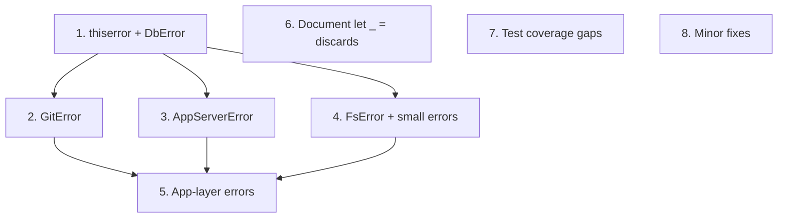

# Tech Debt: Structured Error Handling and Code Hygiene

Address the ~112 function signatures returning `Result<..., String>` across `crates/agentty/src/`, add justification comments to ~190 silent `let _ =` discards, fill test coverage gaps, and fix minor convention violations.

## Steps

## 1) Add `thiserror` and introduce `DbError` for `infra/db.rs`

### Why now

`infra/db.rs` has 36 public functions returning `Result<..., String>`. It is the most-called infra module from `app/` and establishes the pattern for all subsequent error enum migrations. Starting here gives the largest immediate payoff and validates the migration approach.

### Usable outcome

All database operations return typed `DbError` variants instead of opaque strings. Callers in `app/` temporarily bridge with `.map_err(|e| e.to_string())` until step 6 propagates typed errors upward.

### Substeps

- [x] **Add `thiserror` workspace dependency.** Add `thiserror = "2"` to `[workspace.dependencies]` in root `Cargo.toml` and `thiserror = { workspace = true }` to `crates/agentty/Cargo.toml` `[dependencies]`.
- [x] **Define `DbError` enum.** Add a `#[derive(Debug, thiserror::Error)]` enum in `crates/agentty/src/infra/db.rs` with `Query(#[from] sqlx::Error)`, `Migration(#[from] sqlx::migrate::MigrateError)`, and `Io(#[from] std::io::Error)` variants. Replace the manual `.map_err(|error| format!(...))` calls in each function with `?`.
- [x] **Migrate constructor and connection methods.** Convert `Database::open()` and `Database::open_in_memory()` to return `Result<Self, DbError>`.
- [x] **Migrate remaining CRUD methods.** Convert all session, project, settings, and activity functions (33 remaining `pub` methods) to return `Result<..., DbError>`.
- [x] **Add `.map_err(|e| e.to_string())` bridges at call sites.** In `crates/agentty/src/app/core.rs`, `crates/agentty/src/app/session/workflow/lifecycle.rs`, `crates/agentty/src/app/session/workflow/merge.rs`, `crates/agentty/src/app/session/workflow/task.rs`, `crates/agentty/src/app/session/workflow/worker.rs`, and `crates/agentty/src/main.rs`, add temporary `.map_err(|e| e.to_string())` on `?`-propagated `db.*` calls so the app layer continues to compile with `String` errors until step 5.

### Tests

- [x] Verify all existing `db.rs` tests pass with the new `DbError` return types.
- [x] Add at least one test asserting that a specific `DbError` variant is returned for a known failure mode (e.g., query on a dropped table returns `DbError::Query`).
- [x] Add test asserting `DbError::Io` variant when `Database::open()` hits an unwritable parent path. `DbError::Migration` is not directly testable because `open` runs migrations atomically after connecting with no injection point; the `#[from]` mapping is validated at compile time.

### Docs

- [x] Add `///` doc comment to the `DbError` enum and each variant.

## 2) Introduce `GitError` for `infra/git/` internals and `GitClient` trait

### Why now

The git module has 66 function signatures returning `Result<..., String>` across `sync.rs` (17), `rebase.rs` (7), `repo.rs` (5), `merge.rs` (2), `worktree.rs` (1), and the `GitClient` trait + `RealGitClient` (34). This is the largest single source of string errors and the second most-called infra boundary from `app/`.

### Usable outcome

All git operations — internal functions, trait methods, and the production `RealGitClient` — return typed `GitError` variants. App-layer callers bridge with `.map_err(|e| e.to_string())` until step 5.

### Substeps

- [ ] **Define `GitError` enum.** Create `crates/agentty/src/infra/git/error.rs` with a `#[derive(Debug, thiserror::Error)]` enum. Include at minimum `CommandFailed { command: String, stderr: String }`, `OutputParse(String)`, and `Io(#[from] std::io::Error)` variants. Re-export from `crates/agentty/src/infra/git.rs`.
- [ ] **Migrate `sync.rs` functions.** Convert all 17 public functions in `crates/agentty/src/infra/git/sync.rs` to return `GitError`.
- [ ] **Migrate `rebase.rs`, `repo.rs`, `merge.rs`, `worktree.rs`.** Convert remaining 15 functions across `crates/agentty/src/infra/git/rebase.rs` (7), `crates/agentty/src/infra/git/repo.rs` (5), `crates/agentty/src/infra/git/merge.rs` (2), and `crates/agentty/src/infra/git/worktree.rs` (1) to return `GitError`.
- [ ] **Update `GitClient` trait and `RealGitClient`.** Change all 34 method signatures in `crates/agentty/src/infra/git/client.rs` from `Result<..., String>` to `Result<..., GitError>`. The `RealGitClient` impl delegates to already-migrated internal functions. The `MockGitClient` is auto-generated by `mockall`.
- [ ] **Add `.map_err(|e| e.to_string())` bridges at call sites.** In `crates/agentty/src/app/session/core.rs`, `crates/agentty/src/app/session/workflow/merge.rs`, `crates/agentty/src/app/session/workflow/lifecycle.rs`, `crates/agentty/src/app/task.rs`, and `crates/agentty/src/app/core.rs`, add temporary bridges at all `git_client.*` call sites.

### Tests

- [ ] Verify all existing git module tests pass with `GitError` return types.
- [ ] Add at least one test asserting a specific `GitError::CommandFailed` variant for a simulated git failure.

### Docs

- [ ] Add `///` doc comment to `GitError` and each variant.
- [ ] Update `crates/agentty/src/infra/git/AGENTS.md` directory index to include `error.rs`.

## 3) Introduce `AppServerError` for Gemini and Codex clients

### Why now

The app-server clients (`gemini/client.rs` with 5 functions, `codex/client.rs` with 3 functions) form the second external integration boundary. Their string errors hide transport vs. protocol vs. initialization failures that callers need to distinguish.

### Usable outcome

Gemini and Codex client functions return typed `AppServerError` variants. The `AppServerClient` trait boundary and app-layer callers bridge with `.map_err(|e| e.to_string())` until step 5.

### Substeps

- [ ] **Define `AppServerError` enum.** Add a `#[derive(Debug, thiserror::Error)]` enum in `crates/agentty/src/infra/agent/app_server/error.rs` with variants like `Transport(String)`, `Protocol(String)`, and `Initialization(String)`. Re-export from `crates/agentty/src/infra/agent/app_server.rs`.
- [ ] **Migrate Gemini client.** Convert all 5 functions in `crates/agentty/src/infra/agent/app_server/gemini/client.rs` to return `AppServerError`.
- [ ] **Migrate Codex client.** Convert all 3 functions in `crates/agentty/src/infra/agent/app_server/codex/client.rs` to return `AppServerError`.
- [ ] **Bridge at trait and caller boundaries.** Add `.map_err(|e| e.to_string())` at the `AppServerClient` trait boundary in `crates/agentty/src/infra/app_server/contract.rs` implementations and at app-layer call sites.

### Tests

- [ ] Verify all existing Gemini and Codex client tests pass.
- [ ] Add at least one test per client asserting a specific error variant.

### Docs

- [ ] Add `///` doc comment to `AppServerError` and each variant.
- [ ] Update `crates/agentty/src/infra/agent/app_server/AGENTS.md` directory index to include `error.rs`.

## 4) Introduce `FsError`, `VersionError`, and `ClipboardError`

### Why now

These are the remaining infra-layer string-error surfaces: `FsClient` trait (4 fallible async methods), `version.rs` (3 functions), and `runtime/clipboard_image.rs` (3 functions). Completing these unblocks step 5 (app-layer propagation).

### Usable outcome

All infra-layer functions return typed errors. The entire infra → app boundary uses structured error types (with temporary `.to_string()` bridges at app call sites).

### Substeps

- [ ] **Define `FsError` and migrate `FsClient` trait.** Add `#[derive(Debug, thiserror::Error)]` enum in `crates/agentty/src/infra/fs.rs` wrapping `std::io::Error`. Update the 4 async trait methods (the sync `is_dir()` method returns `bool` and needs no migration) and `RealFsClient` impl. Bridge at call sites.
- [ ] **Define `VersionError` and migrate `version.rs`.** Add error enum in `crates/agentty/src/infra/version.rs`. Convert the `UpdateRunner` trait method and `run_npm_update_sync()`. Bridge at call sites.
- [ ] **Define `ClipboardError` and migrate `clipboard_image.rs`.** Add error enum in `crates/agentty/src/runtime/clipboard_image.rs`. Convert `clipboard_image_directory()`, `session_temp_directory_name()`, and `canonicalize_persisted_image_path()`. Route the `std::fs::canonicalize` call through `FsClient` trait to fix the boundary governance violation. Bridge at call sites.
- [ ] **Migrate remaining leaf functions.** Convert `infra/agent/provider.rs` `provider_kind_for_model()`, `infra/agent/submission.rs` `submit_one_shot()`, `infra/app_server/registry.rs` `take_session()` / `store_session()`, and `infra/app_server/prompt.rs` `turn_prompt_for_runtime()` to use existing or new error types.

### Tests

- [ ] Verify all existing tests pass after migrations.
- [ ] Add at least one test for `FsError` round-trip through `MockFsClient`.

### Docs

- [ ] Add `///` doc comments to all new error enums and their variants.

## 5) Migrate remaining app-layer `Result<..., String>` functions

### Why now

With `DbError`, `GitError`, `AppServerError`, `FsError`, and other infra error types in place, the ~23 functions in `app/core.rs`, `app/session/workflow/`, `app/task.rs`, and `app/assist.rs` still return `Result<..., String>`. The temporary `.to_string()` bridges from steps 1–4 add unnecessary noise.

### Usable outcome

`App` and `SessionManager` methods return domain-specific errors (`SessionError`, `AppError`), composing infra error types with `#[from]`. No `.to_string()` bridges remain anywhere in the codebase.

### Substeps

- [ ] **Define `SessionError` enum.** Add `#[derive(Debug, thiserror::Error)]` enum in `crates/agentty/src/app/session/error.rs` composing `DbError`, `GitError`, and `AppServerError` via `#[from]`. Re-export from `crates/agentty/src/app/session.rs`.
- [ ] **Migrate session workflow functions.** Convert functions in `crates/agentty/src/app/session/workflow/merge.rs` (6 fns), `lifecycle.rs` (1 fn), `task.rs` (2 fns), and `access.rs` (2 fns) to return `SessionError`. Remove `.map_err(|e| e.to_string())` bridges.
- [ ] **Migrate `app/task.rs` and `app/assist.rs`.** Convert `review_output_text()` in `crates/agentty/src/app/task.rs` (1 fn) and `run_agent_assist()` in `crates/agentty/src/app/assist.rs` (1 fn) to return `AppError` or `SessionError`. Remove bridges.
- [ ] **Define `AppError` and migrate `App` methods.** Add error enum in `crates/agentty/src/app/core.rs` composing `SessionError` and `DbError`. Convert the 9 `App` public methods. Remove remaining bridges.
- [ ] **Update `main.rs` error propagation.** Convert `run()` in `crates/agentty/src/main.rs` to return `Result<(), AppError>` or use `Box<dyn Error>`. Remove any remaining `.to_string()` calls.

### Tests

- [ ] Verify the full test suite passes with zero `.map_err(|e| e.to_string())` remaining.
- [ ] Add integration-style tests in `app/core.rs` asserting that specific `AppError` variants propagate from infra failures.

### Docs

- [ ] Add `///` doc comments to `SessionError`, `AppError`, and all variants.
- [ ] Update `crates/agentty/src/app/session/AGENTS.md` directory index to include `error.rs`.

## 6) Document silent `let _ =` result discards

### Why now

~190 instances of `let _ =` silently discard `Result` values with no explanation across 26 files. While most are intentional (channel sends, fire-and-forget cleanup), undocumented discards make it impossible to distinguish intentional from accidental swallowing.

### Usable outcome

Every `let _ =` that discards a `Result` has a justification comment explaining why the discard is safe.

### Substeps

- [ ] **Document channel-send discards.** Add `// Receiver may have disconnected; fire-and-forget.` or similar to `let _ =` lines in `crates/agentty/src/infra/channel/app_server.rs` (14), `crates/agentty/src/infra/channel/cli.rs` (5), and `crates/agentty/src/app/session/workflow/worker.rs` (21).
- [ ] **Document event-sender discards.** Add justification comments to `let _ =` lines in `crates/agentty/src/app/session/workflow/lifecycle.rs` (18), `crates/agentty/src/app/task.rs` (8), `crates/agentty/src/app/session/workflow/task.rs` (8), `crates/agentty/src/app/setting.rs` (7), and `crates/agentty/src/app/service.rs` (1).
- [ ] **Document cleanup and fallback discards.** Add comments to `crates/agentty/src/runtime/terminal.rs` (2, cleanup on panic path), `crates/agentty/src/infra/app_server_transport.rs` (2, best-effort child kill), `crates/agentty/src/infra/git/client.rs` (1, lock file removal), `crates/agentty/src/infra/tmux.rs` (1), and `crates/agentty/src/main.rs` (1).
- [ ] **Document remaining discards.** Add comments to `crates/agentty/src/runtime/mode/question.rs` (47), `crates/agentty/src/app/core.rs` (8), `crates/agentty/src/app/session/workflow/merge.rs` (17), `crates/agentty/src/app/session/core.rs` (8), `crates/agentty/src/infra/agent/app_server/codex/client.rs` (7), `crates/agentty/src/ui/state/prompt.rs` (4), `crates/agentty/src/infra/agent/app_server/gemini/client.rs` (2), `crates/agentty/src/app/assist.rs` (2), `crates/agentty/src/runtime/mode/prompt.rs` (2), `crates/agentty/src/runtime/mode/session_view.rs` (1), `crates/agentty/src/runtime/mode/list.rs` (1), `crates/agentty/src/runtime/mode/input_key.rs` (1), and `crates/agentty/src/runtime/key_handler.rs` (1).

### Tests

- [ ] No new tests required (comment-only changes). Verify `cargo check` passes.

### Docs

- [ ] No documentation updates required.

## 7) Add test modules for untested files

### Why now

Five non-trivial files with public functions lack `#[cfg(test)]` modules entirely. `infra/git/worktree.rs` (4 pub fns) and `infra/app_server/registry.rs` (4 pub methods) are the highest-priority gaps given their role in session lifecycle.

### Usable outcome

Every non-router file with public functions in `crates/agentty/src/` has at least a basic `#[cfg(test)]` module covering the happy path.

### Substeps

- [ ] **Add tests for `infra/git/worktree.rs`.** Test `detect_git_info()`, `find_git_repo_root()`, `create_worktree()`, and `remove_worktree()` using temp directories. Mock external git commands via the existing `GitClient` trait where possible.
- [ ] **Add tests for `infra/app_server/registry.rs`.** Test `take_session()`, `store_session()`, and `store_session_or_recover()` covering store-then-take round-trip and concurrent-access edge cases. `provider_name()` returns `&'static str` and is non-fallible.
- [ ] **Add tests for `infra/app_server/prompt.rs`.** Test `turn_prompt_for_runtime()` with representative `TurnPrompt` inputs.
- [ ] **Add tests for `infra/channel/factory.rs`.** Test `create_agent_channel()` returns the correct channel type for each `AgentKind`.
- [ ] **Add tests for `ui/style.rs`.** Test `status_color_by()` and related style functions return expected values for each `Status` variant.

### Tests

- [ ] All new tests follow Arrange/Act/Assert structure with explicit comments.
- [ ] Run `cargo test -q` with the shared-host validation budget from `AGENTS.md` (`half` of logical CPUs, capped at `4` test threads per agent) to verify the full suite passes.

### Docs

- [ ] No documentation updates required.

## 8) Fix minor convention violations

### Why now

Three small convention violations remain: single-letter variables, a clippy bypass in test code, and an untracked TODO. Fixing these closes out the tech-debt sweep cleanly.

### Usable outcome

All flagged convention violations from the tech-debt audit are resolved.

### Substeps

- [ ] **Rename single-letter variables in `ui/layout.rs`.** Rename `x` → `center_x` and `y` → `center_y` at `crates/agentty/src/ui/layout.rs:51-52`.
- [ ] **Remove clippy bypass in test code.** Restructure the test assertion at `crates/agentty/src/app/session/workflow/merge.rs:2184` to avoid needing `#[allow(clippy::clone_on_copy)]`.
- [ ] **Track deferred TODO.** Evaluate the TODO at `crates/agentty/src/infra/agent/prompt.rs:105` (`// TODO: Use profile to inject per-request-family protocol guidance once`) and either implement it in this step or create a follow-up plan file with clear scope.

### Tests

- [ ] Verify `pre-commit run clippy --all-files --hook-stage manual` passes with zero `#[allow()]` attributes in non-generated code.

### Docs

- [ ] No documentation updates required.

## Cross-Plan Notes

- No overlapping plans exist for error handling or code hygiene work. The `end_to_end_test_structure.md` plan covers E2E test infrastructure, not unit test gaps — no conflict.

## Status Maintenance Rule

- After implementing any step in this plan, immediately update its status in this document.
- When a step changes behavior, complete its `### Tests` and `### Docs` work in that same step before marking it complete.
- When the full plan is complete, remove the implemented plan file; if more work remains, move that work into a new follow-up plan file before deleting the completed one.

## Current State Snapshot

| Area | Current state in codebase | Status |
|------|---------------------------|--------|
| `thiserror` dependency | Added to workspace deps; `DbError` uses `thiserror::Error` derive | Done (step 1) |
| `infra/db.rs` errors | All functions return `Result<..., DbError>`; callers bridge with `.map_err(\|e\| e.to_string())` | Done (step 1) |
| `infra/git/` errors | 66 function signatures return `Result<..., String>` — `sync.rs` (17), `rebase.rs` (7), `repo.rs` (5), `merge.rs` (2), `worktree.rs` (1), `GitClient` trait (34) | Planned (step 2) |
| App-server client errors | 8 functions return `Result<..., String>` — `gemini/client.rs` (5), `codex/client.rs` (3) | Planned (step 3) |
| `FsClient`/version/clipboard/leaf errors | 15 function signatures — `FsClient` (4 async), `version.rs` (3), `clipboard_image.rs` (3), `provider.rs` (1), `submission.rs` (1), `registry.rs` (2), `app_server/prompt.rs` (1) | Planned (step 4) |
| App-layer errors | ~23 functions return `Result<..., String>` — `core.rs` (9), `merge.rs` (6), `access.rs` (2), `task.rs` (2), `lifecycle.rs` (1), `app/task.rs` (1), `assist.rs` (1), `main.rs` (1) | Planned (step 5) |
| `let _ =` discards | ~190 undocumented silent discards across 26 files | Planned (step 6) |
| Untested files | 5 non-router files with public functions lack test modules | Planned (step 7) |
| Minor violations | 1 single-letter var pair, 1 clippy bypass, 1 untracked TODO | Planned (step 8) |

## Implementation Approach

- Start with `thiserror` + `DbError` as the smallest infra boundary that validates the migration pattern.
- Each infra step introduces an error enum, migrates internal functions, updates the trait boundary, and adds temporary `.map_err(|e| e.to_string())` bridges at app-layer call sites.
- Step 5 removes all bridges by introducing app-layer error enums that compose infra types via `#[from]`.
- Steps 6–8 are independent hygiene work that can run in parallel with error migration.

## Suggested Execution Order

1. Start with step 1 (`thiserror` + `DbError`); it adds the shared dependency and validates the pattern.
1. Run steps 2, 3, and 4 in parallel after step 1 — they touch independent infra modules.
1. Start step 5 only after steps 1–4 are merged — it removes the temporary bridges they introduced.
1. Steps 6, 7, and 8 have no dependencies on error work and can run at any time, including in parallel with steps 1–5.

## Out of Scope for This Pass

- Replacing `anyhow` or adopting a global error crate — the project deliberately avoids generic error crates.
- Migrating the 4 existing manually-implemented error enums (`AgentBackendError`, `AgentError`, `AgentResponseParseError`, `SyncSessionStartError`) to `thiserror` — they work and are not string-based.
- Test code boundary violations (`Command::new`, `std::fs::*`, `Instant::now` in `#[cfg(test)]` modules) — test setup code legitimately uses direct calls.
- Coverage ratcheting or CI integration — tracked separately in `docs/plan/coverage_follow_up.md`.
