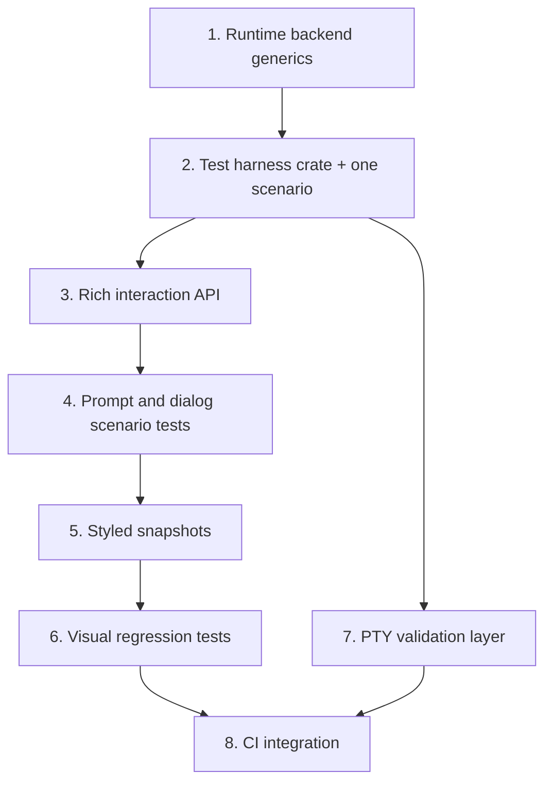

# TUI End-to-End Testing Framework

Plan for building a Rust-native, Playwright-inspired TUI testing framework that exercises full app flows through the ratatui rendering pipeline with scriptable input, auto-waiting locators, and snapshot assertions.

## How It Works — Simple Explanation

The framework introduces an `ag-tui-test` crate that provides four layered capabilities:

1. **In-process `TestBackend` harness** — Boots the full TUI app in memory using ratatui's `TestBackend`, injects key events through a scriptable `EventSource`, and reads the rendered terminal buffer directly. No real terminal needed. Tests run in sub-millisecond per frame, making them fast and deterministic.

1. **Playwright-style interaction API** — Rich primitives for simulating real user interaction: typing text, pressing key combos, navigating overlays, and driving multi-turn agent conversations with scripted `MockAgentChannel` responses. Locators find on-screen elements by text, regex, style, or region — similar to Playwright's `getByText`.

1. **Visual regression snapshots** — Captures the full styled terminal output (characters, colors, bold, borders) as stable text representations using `insta` snapshots. Region-scoped snapshots test individual components without full-screen fragility. Responsive layout helpers test the same screen at multiple terminal sizes.

1. **PTY-based true terminal validation** — A thin smoke layer that launches the actual `agentty` binary in a pseudo-terminal using `portable-pty`, parses real escape sequences with `vt100`, and asserts on the reconstructed screen. Catches issues that `TestBackend` cannot: raw mode handling, escape sequence bugs, platform-specific rendering.

## Steps

## 1) Make the runtime generic over backend

### Why now

The runtime hardcodes `TuiTerminal = Terminal<CrosstermBackend<io::Stdout>>` in `crates/agentty/src/runtime/core.rs:18`. The main loop (`run_main_loop`), `render_frame`, and `process_events` all use this concrete type. Mode handlers in `session_view.rs` and `prompt.rs` call `terminal.size()` through this concrete alias. The event loop reads from `mpsc::UnboundedReceiver<crossterm::event::Event>` fed by a background `EventSource` poller thread. Before the test harness crate can drive the app with `TestBackend`, the runtime must accept any `ratatui::backend::Backend` implementation and the event injection path must be decoupled from the crossterm poller.

### Usable outcome

The runtime functions (`run_main_loop`, `render_frame`, `process_events`, `handle_key_event`, and mode handlers) accept a generic `B: Backend` instead of the hardcoded `TuiTerminal` alias, and tests can construct a `Terminal<TestBackend>` that drives the same code paths as production.

### Substeps

- [x] **Parameterize the runtime core over `Backend`.** `MainLoopState`, `run_main_loop`, and `render_frame` in `crates/agentty/src/runtime/core.rs` now accept `Terminal<B>` where `B: Backend`. Added `backend_err` helper for converting `B::Error` into `io::Error`. The production entry point `run()` still instantiates `B = CrosstermBackend<io::Stdout>`.

- [x] **Propagate the generic through event processing and key handling.** Updated `process_events` and `process_event` in `crates/agentty/src/runtime/event.rs`, `handle_key_event` in `crates/agentty/src/runtime/key_handler.rs`, and the mode handlers in `crates/agentty/src/runtime/mode/session_view.rs` and `crates/agentty/src/runtime/mode/prompt.rs` to accept `&mut Terminal<B>`. Terminal `size()` calls use `.map_err(backend_err)` for error conversion.

- [x] **Decouple event injection from the crossterm poller.** Added `run_with_backend` in `crates/agentty/src/runtime/core.rs` that accepts an `mpsc::UnboundedReceiver<crossterm::event::Event>` and a `Terminal<B>` directly, bypassing `spawn_event_reader` and `terminal::setup_terminal`. Tests inject events through the sender side. The existing `EventSource` trait and poller thread remain unchanged for production.

### Tests

- [x] Ran all 308 existing runtime unit tests (`cargo test -p agentty -- runtime`); all pass after the generic refactor.
- [x] Added `run_with_backend_exits_on_quit_key` test in `crates/agentty/src/runtime/core.rs` that constructs a `Terminal<TestBackend>`, sends `q` + `y` quit key events, and verifies `run_with_backend` exits cleanly.

### Docs

- [x] Updated doc comments on `run_with_backend`, `run_main_loop`, `render_frame`, and `backend_err` to reflect the generic `B: Backend` parameter.
- [x] Updated `docs/site/content/docs/architecture/testability-boundaries.md` with the new `Backend`-generic runtime boundary.

## 2) Ship the in-process test harness crate with one scenario

### Why now

With the runtime accepting any backend, the `ag-tui-test` crate can construct a `Terminal<TestBackend>`, inject events, and read the rendered buffer — the foundation for all TUI E2E tests.

### Usable outcome

A developer can write a test that boots the full TUI app in-memory, sends a sequence of key events, and asserts on the rendered terminal buffer content — all without a real terminal, real agent, or real git repo.

### Substeps

- [ ] **Create the `ag-tui-test` crate and config surface.** Add `crates/ag-tui-test/` as a workspace member with shared dependencies declared in the root `Cargo.toml`, create the local `AGENTS.md` plus symlinks, and add `crates/ag-tui-test/src/config.rs` with the first `TuiTestConfig` builder fields for terminal size, timeout, tick rate, injected mocks, temp-dir setup, and preloaded project or session state.

- [ ] **Implement the in-process app harness.** Create `crates/ag-tui-test/src/context.rs` with `TuiTestContext` owning the `Terminal<TestBackend>`, the `mpsc::UnboundedSender<crossterm::event::Event>` for event injection, the running app-loop handle, and readable app state. The context uses the `run_with_backend` entry point from step 1 to drive the real runtime.

- [ ] **Add locator and auto-wait assertion primitives.** Create `crates/ag-tui-test/src/locator.rs` and `crates/ag-tui-test/src/assertion.rs` so tests can find exact text, substring matches, regex matches, and region-scoped content in a `Buffer`, then wait for visibility or mode changes through repeated `tick()`-driven rendering.

- [ ] **Add plain-text snapshot helpers with `insta` redactions.** Create `crates/ag-tui-test/src/snapshot.rs` with a plain-text buffer serializer (characters only, no style encoding) plus an `assert_snapshot!` helper. Configure `insta` redaction filters from the start using `insta::with_settings!({ filters => ... })` to replace non-deterministic content — timestamps, session UUIDs, file paths, elapsed time counters — with stable placeholders. Styled snapshot support (colors, modifiers) is deferred to step 4.

- [ ] **Write one full interactive scenario test.** Add `crates/agentty/tests/tui_session_list_navigation.rs` that:

  1. Boots the app with `TuiTestConfig` using mock agent and mock git, pre-populated with 3 sessions.
  1. Asserts the session list is visible (`expect_text(ctx, "Sessions").to_be_visible()`).
  1. Sends `Down` arrow key twice.
  1. Asserts the third session is highlighted.
  1. Sends `Enter` to open a session.
  1. Asserts the mode switched to `View` and the session content is rendered.
  1. Sends `Esc` to return to the list.
  1. Takes an `insta` snapshot of the final buffer state.

### Tests

- [ ] Run `cargo test -p ag-tui-test` for unit tests within the framework crate itself (locator matching, buffer-to-string conversion).
- [ ] Run the `tui_session_list_navigation` integration test and verify the `insta` snapshot is stable across runs.

### Docs

- [ ] Add `///` doc comments to all public types and methods in `ag-tui-test`.
- [ ] Update `CONTRIBUTING.md` with a "TUI E2E Tests" section explaining how to write and run TUI scenario tests.
- [ ] Update `docs/plan/AGENTS.md` directory index with this plan file.
- [ ] Add `ag-tui-test` to the module map at `docs/site/content/docs/architecture/module-map.md`.

## 3) Expand the interaction API for complex scenarios

### Why now

After the core harness works for simple navigation, the framework needs richer interaction primitives to test prompt input, slash commands, overlays, confirmation dialogs, and multi-turn agent conversations — the flows where most UI bugs occur.

### Usable outcome

Developers can write tests for prompt editing (typing, backspace, cursor movement), slash command completion, confirmation dialogs, and multi-turn agent sessions with scripted responses.

### Substeps

- [ ] **Add text input simulation helpers.** Extend `TuiTestContext` in `crates/ag-tui-test/src/context.rs` with:

  - `type_text(text: &str)` — sends each character as individual key events with realistic pacing.
  - `send_backspace(count)` — sends backspace key events.
  - `send_ctrl(char)` — sends Ctrl+key combos (`Ctrl+A`, `Ctrl+C`, etc.).
  - `send_key_sequence(keys: &[KeyEvent])` — sends a batch of key events with inter-key delay.
  - `clear_input()` — sends `Ctrl+U` to clear the current input line.

- [ ] **Add overlay and popup locator support.** Extend `Locator` in `crates/ag-tui-test/src/locator.rs` with:

  - `Locator::by_border(ctx, BorderType)` — detect bordered regions (popups, dialogs).
  - `Locator::by_style(ctx, Style)` — find cells with specific styling (selected item highlight, error text).
  - `Locator::focused_input(ctx)` — locate the active text input area by cursor position.

- [ ] **Add multi-turn session scenario support.** Create `crates/ag-tui-test/src/scenario.rs` with a `Scenario` builder that wraps the existing `MockAgentChannel` pattern (established in `crates/agentty/src/app/session/core.rs`) as a thin ergonomic layer:

  - `Scenario::new().on_prompt("write tests").reply("I'll write the tests now").on_prompt("looks good").reply("Done!").build()` — chainable mock agent turn definitions.
  - The builder configures a `MockAgentChannel` internally using the same `expect_run_turn().returning(...)` and `test_agent_channels.insert(...)` patterns the codebase already uses — it does not introduce a parallel mock abstraction.
  - Support for simulating `InProgress` → `Review` state transitions with realistic timing.

### Tests

- [ ] Run all new integration tests and verify snapshot stability.
- [ ] Run existing unit tests to ensure the `EventSource` trait changes are backward-compatible.

### Docs

- [ ] Add a `## Writing Complex Scenarios` section to `CONTRIBUTING.md` with examples of prompt, dialog, and multi-turn test patterns.
- [ ] Update `ag-tui-test` crate-level doc comment with a usage guide.

## 4) Write prompt and confirmation dialog scenario tests

### Why now

The interaction API from step 3 needs real scenario tests to validate it works end-to-end and to establish patterns for future test authors.

### Usable outcome

Developers have reference scenario tests for prompt input, slash command completion, and confirmation dialogs that serve as copy-paste templates for new TUI tests.

### Substeps

- [ ] **Write prompt input and slash command scenario tests.** Add `crates/agentty/tests/tui_prompt_interaction.rs`:

  1. Boot app, navigate to a session, enter prompt mode.
  1. Type a message, verify it appears in the input area.
  1. Use backspace, verify character deletion.
  1. Type `/` and verify slash command suggestions appear.
  1. Select a slash command and verify completion.
  1. Submit the prompt and verify the session transitions to `InProgress`.

- [ ] **Write confirmation dialog scenario test.** Add `crates/agentty/tests/tui_confirmation_dialog.rs`:

  1. Boot app with a session in `Review` state.
  1. Press the merge key, verify the confirmation dialog appears.
  1. Assert dialog text and button labels are visible.
  1. Press `y` to confirm, verify the dialog closes and merge proceeds.
  1. Repeat with `n` to verify cancellation.

### Tests

- [ ] Run `tui_prompt_interaction` and `tui_confirmation_dialog` integration tests and verify snapshot stability.

### Docs

- [ ] Add worked examples from these tests to the `## Writing Complex Scenarios` section in `CONTRIBUTING.md`.

## 5) Add styled snapshots with visual regression testing

### Why now

Plain-text assertions catch content bugs but miss styling regressions (wrong colors, missing bold, broken borders). After interaction coverage is solid, adding style-aware snapshots catches a broader class of visual regressions.

### Usable outcome

Developers can snapshot the full styled terminal output (including colors, bold, borders) and get clear, human-readable diffs when a visual regression occurs via `cargo insta review`.

### Substeps

- [ ] **Implement rich buffer serialization.** Enhance `crates/ag-tui-test/src/snapshot.rs` to produce a stable, human-readable text format that encodes:

  - Character content per cell.
  - Foreground and background colors (using named color tokens like `[fg:red]`, `[bg:blue]`).
  - Text modifiers (`[bold]`, `[dim]`, `[italic]`, `[underline]`).
  - A clean grid layout with row numbers for easy visual inspection.
  - Style annotations only emitted when they change from the previous cell (run-length encoding for readability).

- [ ] **Add region-scoped snapshots.** Add `snapshot_region(buffer, Rect) -> String` to `crates/ag-tui-test/src/snapshot.rs` to capture only a specific area of the screen. This is critical for testing individual components (status bar, footer, popup content) without full-screen snapshot fragility.

- [ ] **Add responsive layout testing.** Create `crates/ag-tui-test/src/responsive.rs` with helpers to test the same screen at multiple terminal sizes:

  - `assert_responsive(ctx, &[(80, 24), (120, 40), (200, 50)], |ctx| { ... })` — runs the same assertion block at each size.
  - Produces separate named snapshots per size (e.g., `session_list_80x24.snap`, `session_list_120x40.snap`).

### Tests

- [ ] Run `cargo insta test` to verify all snapshots are generated and stable.
- [ ] Run the full test suite to ensure no regressions from the snapshot serialization changes.

### Docs

- [ ] Add a `## Visual Regression Testing` section to `CONTRIBUTING.md` explaining the `cargo insta review` workflow for TUI snapshots.
- [ ] Document the snapshot format in `ag-tui-test` crate docs so contributors understand the encoding.

## 6) Write visual regression tests for key screens

### Why now

With styled snapshot infrastructure in place, capturing reference snapshots for the most important screens provides baseline coverage for visual regressions.

### Usable outcome

Key TUI screens have styled `insta` snapshots that break on any visual change, giving developers immediate feedback on unintended layout or styling regressions.

### Substeps

- [ ] **Write visual regression tests for key screens.** Add `crates/agentty/tests/tui_visual_regression.rs` with snapshot tests for:

  1. Empty session list (no sessions).
  1. Session list with multiple sessions (various states).
  1. Session view with agent output.
  1. Diff view with colored diff content.
  1. Help overlay.
  1. Status bar and footer bar.
     Test each at 80×24 (minimum) and 120×40 (default) sizes.

### Tests

- [ ] Run `cargo insta test` to verify all snapshots are generated and stable across runs.

### Docs

- [ ] Add the list of covered screens and sizes to the `## Visual Regression Testing` section in `CONTRIBUTING.md`.

## 7) Add PTY-based true terminal validation layer

### Why now

The in-process `TestBackend` layer validates app logic and rendering, but cannot catch issues in actual terminal escape sequence processing, raw mode handling, or platform-specific terminal behavior. A thin PTY layer on top provides confidence that the real binary works in a real terminal environment.

### Usable outcome

Developers can write tests that launch the actual `agentty` binary in a pseudo-terminal, send keystrokes, and assert on the real terminal output — catching escape sequence bugs, raw mode issues, and platform-specific rendering problems that `TestBackend` cannot detect.

### Substeps

- [ ] **Add `portable-pty` and `vt100` dependencies.** Add `portable-pty` and `vt100` to `[workspace.dependencies]` in the root `Cargo.toml` and as dev-dependencies of `ag-tui-test`. `portable-pty` provides cross-platform PTY creation (Linux, macOS). `vt100` is a complete terminal emulator crate that maintains screen state (cursor position, scrolling, SGR sequences) — no custom `ScreenParser` needed.

- [ ] **Implement `PtyTestContext`.** Create `crates/ag-tui-test/src/pty.rs` with a `PtyTestContext` struct that:

  - Spawns the `agentty` binary in a PTY with configurable size via `portable-pty`.
  - Feeds raw terminal output into `vt100::Parser` which maintains the full virtual screen state.
  - Provides `send_key()`, `send_text()` for input injection.
  - Provides `wait_for_text(text, timeout)` auto-waiting assertion by polling the `vt100` screen.
  - Provides `screenshot() -> String` for snapshot testing of the parsed screen.
  - Handles graceful shutdown (sends `Ctrl+C`, waits for exit, kills if needed).

- [ ] **Implement `Key` enum and encoding.** Create `crates/ag-tui-test/src/key.rs` with:

  - `Key` enum variants: `Char(char)`, `Enter`, `Esc`, `Tab`, `Backspace`, `Up`, `Down`, `Left`, `Right`, `Home`, `End`, `PageUp`, `PageDown`, `Delete`, `Ctrl(char)`, `Alt(char)`, `F(u8)`.
  - `fn encode(key: &Key) -> Vec<u8>` — converts a `Key` to the raw byte sequence the PTY master expects (ANSI escape sequences for special keys, raw bytes for characters).
  - Used by `PtyTestContext` for raw PTY I/O.

- [ ] **Write one PTY smoke test.** Add `crates/agentty/tests/tui_pty_smoke.rs` (marked `#[ignore]` by default since it requires a built binary) that:

  1. Builds `agentty` binary.
  1. Launches it in a PTY.
  1. Waits for the session list to render.
  1. Sends `?` to open help.
  1. Asserts help overlay is visible.
  1. Sends `Esc` to close help.
  1. Sends `Ctrl+C` to quit.
  1. Verifies clean exit.

### Tests

- [ ] Run the PTY smoke test with `cargo test -- --ignored tui_pty_smoke` and verify it passes on the local platform.
- [ ] Unit tests for `Key` encoding verifying correct ANSI escape sequences.
- [ ] Run the in-process test suite to ensure no regressions from shared API changes.

### Docs

- [ ] Add a `## PTY Tests` section to `CONTRIBUTING.md` explaining when to use PTY tests vs in-process tests, and the `--ignored` flag requirement.
- [ ] Document `PtyTestContext` API in the `ag-tui-test` crate docs.
- [ ] Update `docs/site/content/docs/architecture/testability-boundaries.md` with the new PTY testing boundary.

## 8) Add CI integration and snapshot artifact collection

### Why now

After both in-process and PTY testing layers are functional, CI needs to run the full suite and surface visual diff artifacts on failure so reviewers can assess snapshot changes without checking out the branch.

### Usable outcome

CI runs the full TUI E2E snapshot suite, fails on unexpected visual changes, and uploads diff artifacts for PR review.

### Substeps

- [ ] **Add CI snapshot artifact collection.** Create a CI helper in `crates/ag-tui-test/src/ci.rs` that:

  - On snapshot mismatch, writes the actual/expected/diff outputs to a `target/tui-test-artifacts/` directory.
  - Produces a summary report (markdown table) of all passed/failed snapshot comparisons.
  - Integrates with GitHub Actions artifact upload for visual review on PR failures.

- [ ] **Add CI workflow configuration.** Update `.github/workflows/` to:

  - Run in-process TUI tests as part of the default test suite.
  - Run PTY TUI tests in a dedicated job with proper PTY allocation.
  - Set `INSTA_UPDATE=no` to fail on snapshot mismatches.
  - Upload snapshot diff artifacts on failure for PR review.

### Tests

- [ ] Verify CI workflow runs TUI E2E tests successfully in a test PR.
- [ ] Verify `cargo insta review` works correctly for both `ag-tui-test` and `agentty` snapshot locations.

### Docs

- [ ] Document the tiered testing strategy in `CONTRIBUTING.md`: unit/mock tests → `TestBackend` snapshots → PTY E2E tests.
- [ ] Update `docs/site/content/docs/architecture/testability-boundaries.md` with the full TUI testing boundary map.

## Cross-Plan Notes

- `docs/plan/end_to_end_test_structure.md` owns the workflow-level harness (fake CLIs, session state assertions, deterministic scenario tests). This plan owns the *visual/interactive* TUI testing layer. The two are complementary: workflow tests validate business logic flows, TUI tests validate what the user sees and how input is handled.
- Both plans share the `CONTRIBUTING.md` testing documentation. Coordinate updates to avoid conflicting guidance. This plan adds TUI-specific sections; the workflow plan owns the deterministic-vs-live tiering guidance.
- `TuiTestContext` reuses the `MockAgentChannel` and `MockGitClient` patterns already established by the existing test infrastructure. No ownership conflict — this plan consumes those mocks, does not redefine them.

## Status Maintenance Rule

- After implementing any step in this plan, immediately update its checklist status in this document and refresh any snapshot rows that changed.
- When a step changes contributor workflow, test commands, or documentation, complete its `### Tests` and `### Docs` work in that same step before marking it complete.
- When the full plan is complete, remove the implemented plan file; if more work remains, move that work into a new follow-up plan file before deleting the completed one.

## Current State Snapshot

| Area | Current state in codebase | Status |
|------|---------------------------|--------|
| Runtime backend generics | Runtime functions accept `Terminal<B: Backend>` via `run_with_backend`. `TuiTerminal` kept as concrete alias for production. One `TestBackend` test verifies quit flow. | Complete |
| In-process TUI test harness | No framework for driving the app through `Terminal<TestBackend>` with injected events. | Not started |
| Locator / element finder API | No equivalent of Playwright's `getByText` for ratatui buffers. | Not started |
| Auto-waiting assertions | No timeout-based polling assertions for TUI state. | Not started |
| Plain-text snapshot testing | `insta` not used in the project; `TestBackend` not used for rendering assertions. | Not started |
| Styled snapshot testing | No style-aware buffer serialization or visual regression snapshots. | Not started |
| PTY-based terminal tests | No PTY test infrastructure; only unit tests with `mockall` and live provider tests (ignored). | Not started |
| CI TUI visual regression | No TUI snapshot comparison in CI pipeline. | Not started |

## Implementation Approach

- Build a Rust-native framework (`ag-tui-test` crate) rather than depending on external TypeScript/Go tools, keeping the test stack homogeneous and CI-simple.
- Start with the backend-generic refactor (step 1) because it is the prerequisite that unblocks all in-process testing. Keep it minimal — only parameterize existing functions, do not redesign the runtime.
- Start with the in-process `TestBackend` layer because it is fast (sub-millisecond per frame), deterministic, and requires no external dependencies beyond ratatui itself. This covers 90% of TUI testing needs.
- Add the PTY layer only after the in-process layer is proven, since PTY tests are slower and platform-dependent. Keep PTY tests as a thin smoke layer, not the primary coverage mechanism.
- Follow Playwright's API design philosophy — locators, auto-waiting, readable assertions — because it is proven to reduce test flakiness and improve developer experience.
- Use `insta` for snapshot management because its review workflow (`cargo insta review`) is the Rust ecosystem standard and integrates cleanly with CI. Rely on `insta`'s built-in diff output rather than building a custom diff renderer.
- Use `insta` redaction filters from step 2 onward to replace non-deterministic content (timestamps, UUIDs, paths) with stable placeholders, preventing flaky snapshots.
- Plain-text snapshots land first (step 2); styled snapshots with colors and modifiers are added later (step 5) once the interaction API is mature enough to set up meaningful screen states.

## Suggested Execution Order

1. Start with `1) Make the runtime generic over backend` — this is the prerequisite that unblocks all in-process testing.
1. Start `2) Ship the in-process test harness crate with one scenario` after step 1, as it depends on the generic runtime entry point.
1. Start `3) Expand the interaction API` after step 2, extending the proven harness with richer primitives.
1. Start `4) Write prompt and confirmation dialog scenario tests` after step 3, validating the interaction API with real scenarios.
1. Start `5) Add styled snapshots` after step 4, since styled snapshots require the full interaction API to set up meaningful screen states.
1. Start `6) Write visual regression tests` after step 5, capturing baseline snapshots for key screens.
1. Start `7) Add PTY-based true terminal validation` after step 2 (can run in parallel with steps 3–6), since it is architecturally independent from the in-process interaction API.
1. Start `8) Add CI integration` only after steps 6 and 7, as it ties together both layers.

## Out of Scope for This Pass

- Replacing existing `mockall`-based unit tests with TUI E2E tests — the two layers are complementary, not substitutes.
- Cross-platform Windows PTY testing (ConPTY) — start with macOS/Linux where development happens.
- GIF/video recording of test runs (VHS-style visual output generation for demos).
- Performance benchmarking of the test framework itself — focus on correctness and developer experience first.
- Visual test result dashboard or web UI for reviewing snapshots — rely on `cargo insta review` and CI artifacts.
- Testing third-party terminal emulator compatibility (iTerm2, Alacritty, WezTerm rendering differences).
- Accessibility testing (screen reader output, high-contrast mode) — valuable but separate concern.
- Declarative tape DSL for writing tests without Rust boilerplate — can be a future plan if Rust test functions prove insufficient for developer experience. The Rust harness API (`type_text`, `wait_for_text`, `snapshot`) is already concise and benefits from IDE autocomplete, type checking, and go-to-definition.
- Test recording and playback — deferred until the core framework proves its value and test authoring friction is better understood.

## Research References

| Tool | Type | Language | Key Takeaway |
|------|------|----------|-------------|
| [ratatui `TestBackend`](https://ratatui.rs/recipes/testing/snapshots/) | In-memory render | Rust | Foundation — built-in buffer-based testing, pairs with `insta` for snapshots. Ships with ratatui, zero extra deps. |
| [Microsoft `tui-test`](https://github.com/microsoft/tui-test) | PTY E2E | TypeScript | API inspiration — Playwright-style locators (`getByText`), auto-waiting, snapshot testing, test isolation. 130 stars. |
| [Charmbracelet VHS](https://github.com/charmbracelet/vhs) | Recording | Go | Tape DSL inspiration — declarative scripting syntax (`Type`, `Enter`, `Wait`, `Sleep`). 18.9k stars. Not a testing tool (no assertions). |
| [`insta`](https://github.com/mitsuhiko/insta) | Snapshot | Rust | Snapshot management — `cargo insta review` workflow, redactions for non-deterministic values, inline snapshots. 2.8k stars. De facto Rust standard. |
| [`portable-pty`](https://docs.rs/portable-pty) | PTY | Rust | Cross-platform PTY creation for true terminal testing (macOS, Linux). Part of WezTerm ecosystem. |
| [`vt100`](https://docs.rs/vt100) | Terminal emulator | Rust | Full terminal emulator that maintains screen state (cursor, scrolling, colors, styles). Higher-level than raw `vte` — eliminates the need for a custom `ScreenParser`. |
| [`ratatui-testlib`](https://github.com/raibid-labs/ratatui-testlib) | PTY E2E | Rust | Prior art — PTY harness for ratatui apps with `wait_for_text`, `send_key`. Very early stage (4 stars), Linux-focused. Validates the approach. |
