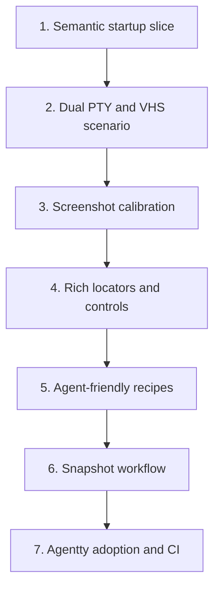

# TUI End-to-End Testing Framework

Research-backed plan for a Rust-native `ag-tui-test` workspace crate that runs a real TUI binary in a PTY, captures location-aware terminal state with `vt100`, captures reviewable screenshots with VHS, and gives both humans and AI agents an easy API for asserting that labeled UI elements appear in the expected region, style, and color.

## Steps

## 1) Ship one semantic startup slice in `ag-tui-test`

### Why now

The hardest technical risk is not screenshot capture; it is proving that a Rust test can drive the real binary and resolve visible text to stable terminal cells without OCR. That needs to land first as the smallest usable slice.

### Usable outcome

One consumer test runs a real TUI binary in a PTY and asserts that key labels appear in the expected terminal region with stable cell coordinates.

### Substeps

- [ ] **Create the new workspace crate.** Add `crates/ag-tui-test/` with `crates/ag-tui-test/Cargo.toml`, `crates/ag-tui-test/src/lib.rs`, `crates/ag-tui-test/src/session.rs`, `crates/ag-tui-test/src/frame.rs`, `crates/ag-tui-test/src/region.rs`, and `crates/ag-tui-test/src/locator.rs`, and register any new dependencies in the root `Cargo.toml` under `[workspace.dependencies]`.
- [ ] **Build the real PTY executor.** Implement a `PtySession` in `crates/ag-tui-test/src/session.rs` on top of `portable-pty` so tests can spawn the compiled binary, set deterministic rows and columns, write input, and read the raw ANSI byte stream from the PTY.
- [ ] **Parse the terminal into a stable grid.** Use `vt100::Parser` in `crates/ag-tui-test/src/frame.rs` to convert the PTY byte stream into a `TerminalFrame` with cells, cursor position, and visible rows that test code can inspect without scraping screenshots.
- [ ] **Add first location-aware assertions.** Implement text locators and region checks in `crates/ag-tui-test/src/locator.rs` and `crates/ag-tui-test/src/region.rs` so a first consumer test can assert that an expected label appears in the header region rather than merely anywhere in the buffer.

### Tests

- [ ] Add crate-level tests for `TerminalFrame` extraction and region math in `crates/ag-tui-test/src/frame.rs` and `crates/ag-tui-test/src/region.rs` with explicit `// Arrange`, `// Act`, and `// Assert` comments.
- [ ] Run a single consumer-owned startup scenario against a real binary using the new semantic executor and confirm the location assertion passes.

### Docs

- [ ] Add `crates/ag-tui-test/AGENTS.md` with a maintained directory index and update `docs/site/content/docs/architecture/module-map.md` plus `docs/site/content/docs/architecture/testability-boundaries.md` for the new workspace crate and its external PTY boundary.

## 2) Compile one Rust scenario into both PTY and VHS executions

### Why now

The project wants both semantic assertions and real screenshots. The clean way to keep those outputs aligned is to define one Rust scenario model and compile it into two executors instead of hand-maintaining one test in Rust and another in tape syntax.

### Usable outcome

A single test scenario written in Rust can drive the semantic PTY executor for assertions and also produce a VHS tape that captures a screenshot of the same user journey.

### Substeps

- [ ] **Define a scenario DSL.** Add `crates/ag-tui-test/src/scenario.rs` and `crates/ag-tui-test/src/step.rs` with steps such as `write_text`, `press_key`, `sleep`, `wait_for_text`, `wait_for_stable_frame`, and `capture`, keeping the API Rust-first instead of tape-first.
- [ ] **Keep the PTY executor on the scenario model.** Extend `crates/ag-tui-test/src/session.rs` so it can execute the scenario steps directly against the real PTY session and expose the resulting `TerminalFrame` checkpoints to tests.
- [ ] **Add a VHS tape compiler.** Implement `crates/ag-tui-test/src/vhs.rs` to compile the same scenario steps into a `.tape` file using official VHS commands such as `Hide`, `Show`, `Sleep`, `Wait+Screen`, `Wait+Line`, and `Screenshot`.
- [ ] **Keep consumer integration thin.** Expose crate APIs that let a consumer such as `agentty` replace an ad hoc screenshot harness with a thin test wrapper rather than owning the core VHS logic.

### Tests

- [ ] Add crate tests that compile one scenario into PTY steps and a VHS tape, then verify the generated tape contains the expected `Set`, `Wait`, and `Screenshot` commands.
- [ ] Run one shared scenario through both executors and confirm it produces a semantic frame plus a VHS screenshot in one test-owned artifact directory.

### Docs

- [ ] Update `README.md` and `CONTRIBUTING.md` with the new authoring model: tests are written in Rust scenarios, and VHS is generated by the framework rather than handwritten per test.

## 3) Calibrate screenshot geometry and map terminal cells back onto the PNG

### Why now

Semantic assertions alone can tell us where text lives in the terminal grid, but they do not yet show where that text lives on the screenshot. To make visual failures reviewable, the framework needs a repeatable way to transform cell coordinates into screenshot rectangles.

### Usable outcome

When a test matches text or a styled span in the terminal grid, the framework can draw the corresponding bounding box onto the VHS screenshot and report exactly where the match appeared.

### Substeps

- [ ] **Add a calibration model.** Implement `crates/ag-tui-test/src/calibration.rs` so the crate can derive a cell-to-pixel transform for the chosen VHS font, padding, margin, and viewport settings instead of guessing pixel positions from the final image size.
- [ ] **Use a calibration scenario rather than OCR.** Generate a dedicated VHS calibration capture that paints high-contrast background-colored cells at known terminal coordinates, then infer the screenshot origin and per-cell width and height from the resulting PNG in `crates/ag-tui-test/src/calibration.rs`.
- [ ] **Store the transform with each screenshot run.** Extend `crates/ag-tui-test/src/artifact.rs` so every capture stores the active calibration and can convert any matched `Rect { x, y, width, height }` from terminal space into screenshot space.
- [ ] **Expose screenshot overlays.** Add `crates/ag-tui-test/src/overlay.rs` to render boxes, labels, and color swatches onto copied screenshots so failures show the located element directly on the PNG artifact.

### Tests

- [ ] Add crate tests for the calibration math, including at least one known grid-to-pixel transform fixture and one overlay rendering test with explicit `// Arrange`, `// Act`, and `// Assert` sections.
- [ ] Validate the calibration flow against a deterministic VHS capture and confirm that a known cell rectangle maps back onto the expected screenshot area.

### Docs

- [ ] Update `CONTRIBUTING.md` so test authors understand that screenshot boxes come from calibrated terminal geometry, not OCR or brittle image heuristics.

## 4) Add richer locators for text, style, color, and TUI “buttons”

### Why now

The framework’s value depends on expressive assertions. In a TUI there are no DOM buttons, so the framework needs its own concept of a “button” or highlighted control based on text, style, and region rather than HTML roles.

### Usable outcome

Tests can assert that a label exists in the top-right corner, that a selected tab has the expected foreground and background colors, or that a button-like control is rendered as a contiguous styled text span in the expected region.

### Substeps

- [ ] **Model styled spans and control-like matches.** Extend `crates/ag-tui-test/src/frame.rs` and `crates/ag-tui-test/src/locator.rs` with matched spans that include text, rectangle, foreground color, background color, and style flags so “button” means a styled span plus placement rules rather than a fake DOM abstraction.
- [ ] **Add precise region primitives.** Implement reusable anchors in `crates/ag-tui-test/src/region.rs` such as `top_row`, `top_left`, `top_right`, `footer`, `left_panel`, `right_panel`, and percentage-based rectangles relative to the terminal grid.
- [ ] **Add matcher APIs.** Introduce crate assertions in `crates/ag-tui-test/src/assertion.rs` such as `assert_text_in_region`, `assert_text_has_color`, `assert_span_is_highlighted`, `assert_match_count`, and `assert_not_visible`.
- [ ] **Keep failure messages structured.** Ensure every matcher reports the matched rect, expected region, actual region, and any relevant colors so a failed assertion is understandable without opening the debugger.

### Tests

- [ ] Add focused tests for styled-span extraction, region containment, color equality, and negative assertions, all with explicit `// Arrange`, `// Act`, and `// Assert` sections.
- [ ] Add one neutral consumer fixture or sample-app test that proves a control-like element can be located by both text and style without depending on `agentty`-specific UI structure.

### Docs

- [ ] Update `README.md` or crate-level docs in `crates/ag-tui-test/src/lib.rs` to define the framework’s TUI vocabulary, especially what counts as a “button”, “highlight”, and “region”.

## 5) Add an agent-friendly recipe layer for common TUI assertions

### Why now

Raw locators and region math are necessary framework primitives, but they are not the surface AI agents should be writing by hand every time they add a tab, keybinding, instruction, or footer hint in a consumer application. The framework needs a higher-level test vocabulary that matches how contributors describe UI changes across TUI products, not just in one app.

### Usable outcome

An AI agent can add or update a regression test for a tab, button-like control, instruction, keybinding hint, footer action, or dialog title with a small number of obvious helper calls instead of rebuilding locator and color logic from scratch.

### Substeps

- [ ] **Add generic intent-level helpers.** Create a recipe layer inside `crates/ag-tui-test/src/recipe.rs` that wraps raw locators with generic helpers such as `expect_selected_tab`, `expect_instruction_visible`, `expect_keybinding_hint`, `expect_footer_action`, `expect_dialog_title`, and `expect_status_message`.
- [ ] **Keep recipes consumer-agnostic.** Define helpers in terms of common TUI concepts like tabs, dialogs, hints, banners, and footer actions rather than hard-coding `agentty` page names or product-specific labels into the framework.
- [ ] **Make failure output prescriptive.** Ensure recipe failures explain the missing text, expected region, expected colors, and the underlying matched spans so an AI agent can repair the test without reverse-engineering the low-level APIs.
- [ ] **Keep the recipe surface small and documented.** Prefer a short, stable set of composable helpers with consistent naming over a large grab bag of one-off convenience functions, so AI agents can infer usage from a few examples.

### Tests

- [ ] Add focused tests for each recipe helper with explicit `// Arrange`, `// Act`, and `// Assert` sections so the intended agent-facing usage stays stable.
- [ ] Add one consumer integration example where a feature-oriented test reads more like product intent than terminal geometry, proving the recipe layer removes boilerplate.

### Docs

- [ ] Add a concise recipe catalog to `CONTRIBUTING.md` and crate docs so AI agents can copy existing patterns for tabs, instructions, keybindings, dialog titles, and footer actions.
- [ ] Document the extension boundary so consumer projects can add their own thin wrappers on top of the generic recipes without forking the framework API.

## 6) Add paired snapshot workflow and failure artifacts

### Why now

The framework needs a disciplined review workflow. Visual snapshots without semantic sidecars are hard to debug, and semantic assertions without persistent visual baselines are hard to review when layout changes are intentional.

### Usable outcome

Each test owns a committed baseline consisting of a screenshot plus a structured frame sidecar, and failures emit actual images, overlays, and semantic diffs that are easy to inspect in code review.

### Substeps

- [ ] **Persist paired baselines.** Store reference artifacts in a consumer-owned screenshot directory and a matching semantic sidecar directory, with `crates/ag-tui-test/src/snapshot.rs` owning the layout and update logic without hard-coding a specific app's path structure.
- [ ] **Define explicit update mode.** Keep an environment-driven update path in `crates/ag-tui-test/src/snapshot.rs` so tests only rewrite baselines when the author intentionally requests it.
- [ ] **Emit semantic and visual diffs together.** On failure, save the actual screenshot, overlay PNG, semantic frame dump, and a human-readable locator diff through `crates/ag-tui-test/src/artifact.rs` and `crates/ag-tui-test/src/snapshot.rs`.
- [ ] **Keep image comparison configurable.** Retain tolerant image comparison for cursor blink or tiny raster noise while keeping semantic location and color assertions exact, so the right layer owns the right failure.

### Tests

- [ ] Add tests for initial snapshot creation, update mode, overlay artifact creation, and mismatched baseline handling with explicit `// Arrange`, `// Act`, and `// Assert` sections.
- [ ] Re-run the startup scenario twice to prove that the second run compares against the stored baseline instead of rewriting it.

### Docs

- [ ] Update `CONTRIBUTING.md` with the snapshot author workflow, including how to create a first baseline, how to update it intentionally, and which generated artifacts to inspect on failure.

## 7) Adopt the framework in `agentty` and integrate the suite into CI

### Why now

Once the framework has real locators, screenshots, and baselines, the remaining work is to prove it on meaningful `agentty` journeys and keep it running automatically in CI.

### Usable outcome

`agentty`, as the first consumer, has a small but high-value TUI E2E suite that checks startup, navigation, and one deterministic interaction flow, and CI runs that suite with reviewable artifacts on failure.

### Substeps

- [ ] **Migrate startup and tab coverage first.** Convert `crates/agentty/tests/e2e.rs` to the new framework and add at least startup plus one tab-switching scenario with region and style assertions.
- [ ] **Add one deterministic conversation flow.** Add a fake-backend-driven scenario under `crates/agentty/tests/e2e.rs` or a sibling integration test so the suite proves prompt and response rendering without live network credentials.
- [ ] **Install VHS in CI and keep the suite deterministic.** Update the repository workflow under `.github/workflows/` so CI installs VHS, runs only the stable TUI E2E subset by default, and uploads overlays, screenshots, and semantic dumps on failure.
- [ ] **Keep ownership boundaries clear.** Adopt the framework in `agentty` UI-facing tests without moving broader git, forge, or session workflow coverage out of `docs/plan/end_to_end_test_structure.md`.

### Tests

- [ ] Run the full targeted TUI E2E command locally, then verify the same command passes in CI and produces uploaded artifacts on an induced failure case.

### Docs

- [ ] Update `crates/agentty/tests/AGENTS.md`, `CONTRIBUTING.md`, and any affected architecture docs so contributors know which E2E tests run locally, which run in CI, and where artifacts are stored.

## Cross-Plan Notes

- `docs/plan/end_to_end_test_structure.md` owns broader workflow-scenario coverage across git, forge, and agent flows. This plan owns the reusable TUI-facing test framework, the terminal-grid locator model, and the visual artifact workflow.
- If a later workflow plan needs fake backends or scripted CLI helpers, keep the framework generic here and let workflow-specific data shaping stay with the workflow plan.

## Status Maintenance Rule

- After implementing any step in this plan, immediately update its status in this document.
- When a step changes behavior, complete its `### Tests` and `### Docs` work in that same step before marking it complete.
- When the full plan is complete, remove the implemented plan file; if more work remains, move that work into a new follow-up plan file before deleting the completed one.

## Current State Snapshot

| Area | Current state in codebase | Status |
|------|---------------------------|--------|
| Runtime backend groundwork | `crates/agentty/src/runtime/core.rs` already supports backend-generic terminal driving through `run_with_backend`. | Complete |
| Current screenshot harness | `crates/agentty/tests/e2e_support/harness.rs` launches the real binary through VHS and compares screenshots, but it has no reusable crate boundary or location-aware assertions. | Partial |
| PTY semantic capture | No shared crate currently runs the real binary in a PTY and exposes a structured terminal grid to tests. | Not started |
| Screenshot-to-grid mapping | No calibration or overlay system currently maps terminal cell matches back onto the VHS screenshot. | Not started |
| Styled control locators | No current API models TUI controls as styled text spans with region and color assertions. | Not started |
| Agent-friendly recipe layer | No current helper layer translates common TUI UI expectations into a small set of easy-to-author test helpers. | Not started |
| Snapshot workflow | Startup PNG references exist, but there is no paired visual-plus-semantic snapshot flow. | Partial |
| CI integration | No CI workflow currently owns this suite. | Not started |

## Research Findings

- [VHS](https://github.com/charmbracelet/vhs) is the right visual driver, not the semantic oracle. Official docs show it can script terminal interactions, hide setup commands, wait for screen or line patterns, and capture PNG screenshots, but it does not expose a stable locator API for text regions or styles.
- [`microsoft/tui-test`](https://github.com/microsoft/tui-test) validates the architecture pattern we should borrow: locators should operate on a terminal buffer, not on raw PNGs. Its public examples and source show `getByText(...)`, visibility checks, and snapshots backed by a headless terminal buffer with per-cell coordinates.
- The `microsoft/tui-test` API shape is also a usability signal: the surface area is small, direct, and readable enough that an automated agent can usually infer the right assertion from nearby examples. This plan should preserve that property instead of exposing only low-level geometry APIs.
- [`portable-pty`](https://docs.rs/portable-pty/latest/portable_pty/) is the right PTY boundary for a Rust implementation. Its docs show cross-platform PTY creation, command spawning, and reader and writer access for interactive programs.
- [`vt100`](https://docs.rs/vt100/latest/vt100/) is the right first parser for semantic assertions. Its docs show a parser that turns terminal bytes into an in-memory screen with cell access and foreground colors, which is sufficient for text, region, and color assertions.
- OCR should stay out of scope. It would make the “where is this text?” question depend on raster recognition, while the PTY plus parser path gives deterministic cell coordinates directly from the terminal protocol.

## Implementation Approach

- Use a dual-oracle model. The PTY plus `vt100` path is the semantic oracle for text, style, and location assertions; the VHS path is the visual oracle and review artifact generator.
- Write tests once in Rust. A scenario should compile to both the PTY executor and the VHS tape compiler so semantic assertions and screenshots stay aligned.
- Treat TUI “buttons” as styled spans, not DOM widgets. The framework should define controls in terms of label text, contiguous style, and expected region.
- Optimize for AI agent authorship. Most feature tests should read like product intent, using a small generic recipe layer for tabs, keybindings, instructions, dialog titles, and footer actions before reaching for raw locators.
- Calibrate screenshot geometry explicitly. Do not guess pixel bounds from the output image size; derive them from a calibration capture so overlays and highlight boxes are trustworthy.
- Keep `agentty` as the first consumer, but keep the crate generic enough that another Ratatui binary could adopt it without importing `agentty` internals or inheriting `agentty` terminology.

## Suggested Execution Order

1. Start with `1) Ship one semantic startup slice in ag-tui-test`; it proves the core non-OCR locator model against the real binary.
1. Start `2) Compile one Rust scenario into both PTY and VHS executions` next so visual and semantic outputs are produced from the same authored test.
1. Start `3) Calibrate screenshot geometry and map terminal cells back onto the PNG` after dual execution exists, because overlays need both a screenshot and a semantic rect source.
1. Start `4) Add richer locators for text, style, color, and TUI “buttons”` once the base rect model is working.
1. Start `5) Add an agent-friendly recipe layer for common TUI assertions` after the raw matcher layer exists, so most future tests can be written at the product-intent level instead of the geometry level.
1. Start `6) Add paired snapshot workflow and failure artifacts` after the agent-facing helper layer exists so baseline files and diffs align with the APIs most contributors will actually use.
1. Start `7) Adopt the framework in agentty and integrate the suite into CI` last so CI only adopts a deterministic, reviewable test slice.

## Out of Scope for This Pass

- OCR-based text detection from screenshots.
- HTML- or DOM-like accessibility roles for TUI controls.
- Replacing the broader workflow ownership in `docs/plan/end_to_end_test_structure.md`.
- Large live-provider or live-forge matrices in this suite.
