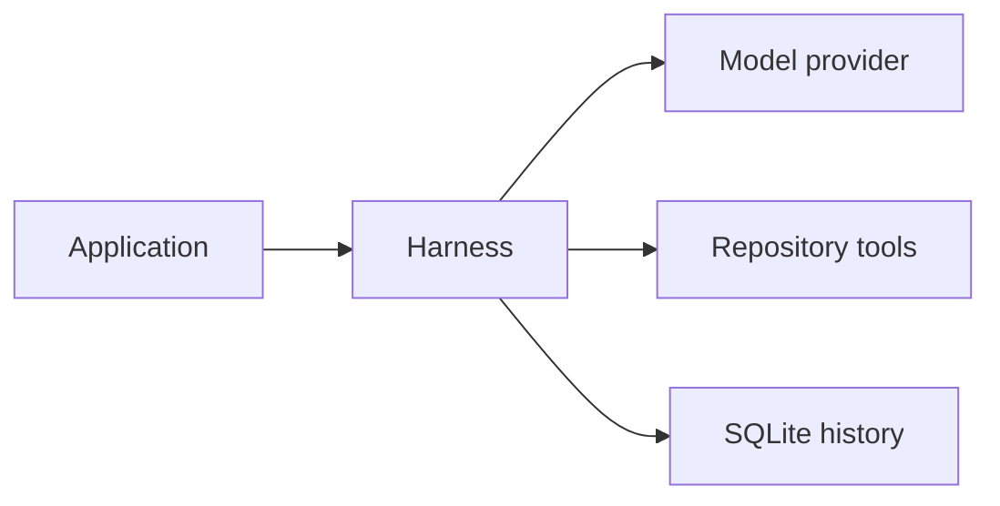
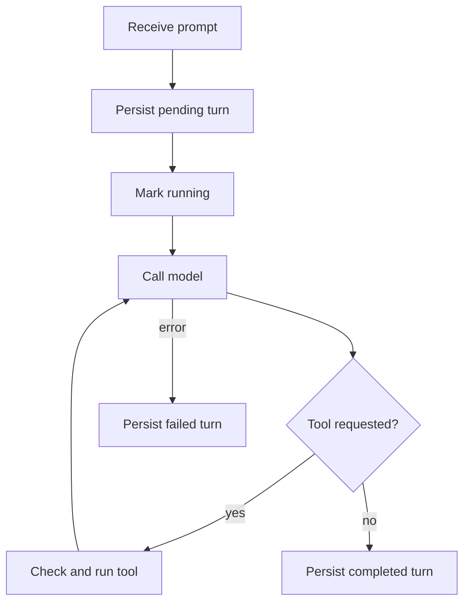

+++
title = "ag-harness Design"
description = "Model loop, durable sessions, and repository policy."
weight = 6
+++

# `ag-harness`

`ag-harness` is a Rust library for structured model turns. Applications select a model,
an output schema, a SQLite database, and the repository tools the model may use.

## Public boundary

- `Harness` owns the model, repository policy, lifecycle observers, and shared database
  pool.
- `Session` is the only multi-turn abstraction. It persists and restores bounded
  history.
- `Model` is the object-safe provider boundary. `ModelCompletion` carries the response,
  optional metadata, and an optional native continuation identifier.
- `run_once` executes a turn without durable history.

Repository tools are denied by default. `Tool::Read` and `Tool::Write` must be enabled
explicitly, and both receive a validated `Repository` configuration. The library host
selects an absolute Git executable whose configured location and canonical target are
outside the containing worktree. The companion CLI defaults to the first valid `git`
executable found in an absolute `PATH` entry and exposes `--git-executable` as an
override. `Repository` canonicalizes the selection once and never performs its own
`PATH` discovery. Unix hosts also verify effective execute access; other platforms defer
that check to process creation. Repository-relative tool arguments reject `.git`
components before filesystem access.

## Session lifecycle

SQLite is canonical. Provider-native continuation is an optional optimization, never the
only copy of conversation state.

Only completed turns are replayed. A process that disappears may leave a leased turn in
`pending` or `running`; the next open or turn start marks an expired lease as
`interrupted`. Failed and interrupted prompts remain available for diagnostics without
entering model context.

The database stores the output schema, system prompt, model identity, history budget,
provider continuation identifier, messages, and turn state. Oldest complete turns are
excluded from replay when the configured byte budget is exceeded.

Starting a turn loads bounded completed history in a read-only snapshot, then opens a
short writer transaction. The writer revalidates the snapshot and commits the turn as
`running` with a fresh lease. If the snapshot changed, acquisition retries before
persisting the prompt. This keeps cancellation before the commit side-effect free and
keeps history canonical when multiple session handles were opened before the latest turn
completed. Each active turn also has an opaque owner token. If cancellation races with a
successful SQLite commit acknowledgment, cleanup scoped to the canonical database
identity and owner token interrupts only that abandoned turn before another turn is
reserved. The owner guard renews the lease while provider or tool work remains active;
dropping the send future stops renewal and records the turn as interrupted by
cancellation. A failed renewal or lost owner token cancels the in-flight request before
it can continue model or tool work. If a turn fails and recording that failure also
fails, `SessionError` retains both errors instead of replacing the original turn
failure.

## Resume and provider fallback

On resume, the harness validates the stored model identity and restores completed
history. If a completion includes a provider session identifier, the next request also
offers it to the adapter. `ModelError::ResumeUnavailable` causes one retry with the
provider identifier removed and the same SQLite history retained. The rejected native
resume and the replay are reported as separate provider attempts. A successful replay
replaces the stored continuation identifier with the one it returns, or clears the
identifier when it returns none. Any failed turn clears the stored provider identifier
because the harness cannot know whether the remote conversation advanced before the
failure.

## Concurrency

The first create or resume initializes the harness's database pool and runs migrations.
Concurrent initialization is serialized, and failed initialization can be retried. All
sessions created or resumed through that harness share its four-connection limit.
Reconfiguring the database path resets the pool; separate harnesses own separate pools.

Different session IDs may run concurrently through the SQLite connection pool. A partial
unique index permits only one `pending` or `running` turn for a given session, so
concurrent writers receive `SessionError::Busy` instead of interleaving messages.

## Observability

Lifecycle observers receive content-free turn, model-request, and tool events. The host
chooses exporters. `LifecycleMetrics` and `LifecycleTraceObserver` project this stream
to OpenTelemetry without storing prompts or tool output in telemetry.

`run_once` owns terminal events for ephemeral turns. `Session::send` owns them for
durable turns and emits `TurnCompleted` only after committing messages and updating
session state. Durable turn durations include acquisition and persistence. Session
coordination or persistence failures emit `TurnFailed` with `session_error`; model or
tool failures retain their original classification even if recording the failure also
fails. Dropping either operation emits cancellation once.
