+++
title = "Architecture Diagrams"
description = "Comprehensive Mermaid diagrams for workspace crates, module layers, pipelines, state machines, and data flows."
weight = 6
+++

<a id="architecture-diagrams-introduction"></a>
Visual reference diagrams for every major architectural surface in the Agentty
workspace. Each section targets one crate, layer, or cross-cutting pipeline.

<!-- more -->

## 1. Workspace Crate Dependency Graph

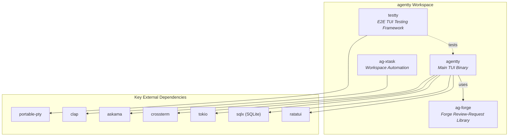

## 2. Main Crate Layered Architecture

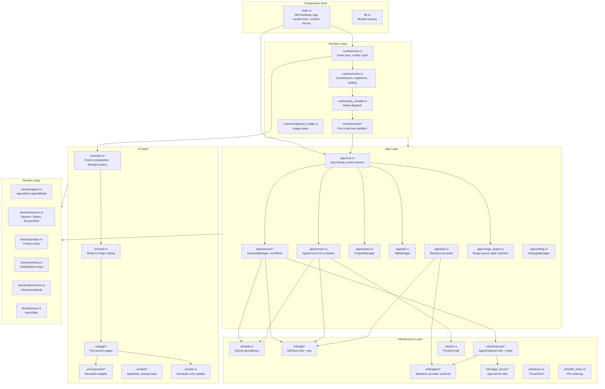

## 3. Session Status State Machine

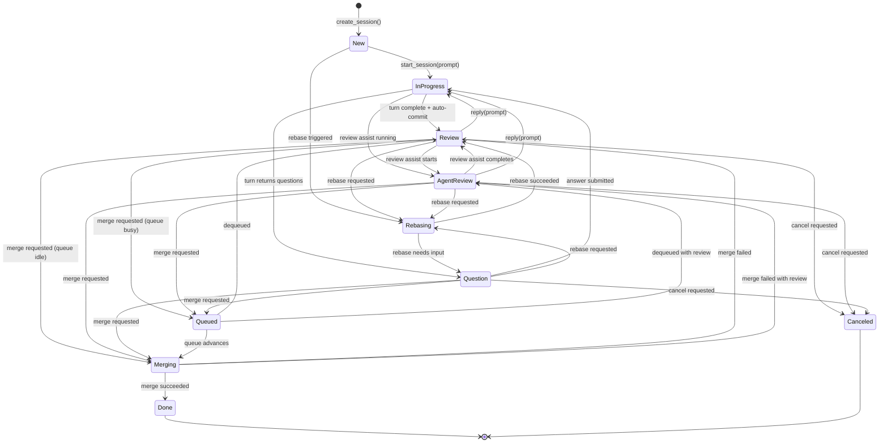

## 4. Runtime Event Loop

```mermaid
sequenceDiagram
    participant Main as main.rs
    participant Guard as TerminalGuard
    participant Terminal as Terminal (CrosstermBackend)
    participant EventReader as Event Reader Thread
    participant Loop as run_main_loop()
    participant App as App
    participant UI as ui::render()

    Main->>Guard: TerminalGuard::new()
    Main->>Terminal: setup_terminal()
    Main->>EventReader: spawn_event_reader(event_tx, shutdown)

    loop Every FRAME_INTERVAL tick
        Loop->>App: sessions.sync_from_handles()
        Loop->>Terminal: render_frame(app)
        Terminal->>App: app.draw(frame)
        App->>UI: build RenderContext + route_frame()

        Loop->>Loop: process_events()
        alt Terminal KeyEvent received
            EventReader-->>Loop: crossterm::Event via event_rx
            Loop->>App: key_handler::handle_key_event()
            App-->>Loop: EventResult::Continue or Quit
        else AppEvent received
            App-->>Loop: AppEvent via app.next_app_event()
            Loop->>App: apply_app_events()
        else Tick fires
            Loop->>App: apply_app_events()
        end
    end

    Loop-->>Main: EventResult::Quit
    Main->>EventReader: shutdown.store(true)
    Main->>Terminal: show_cursor()
```

## 5. AppMode Dispatch and UI Routing

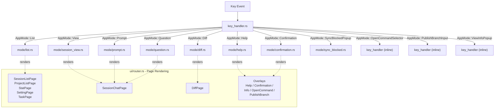

## 6. App Facade and Event Reducer

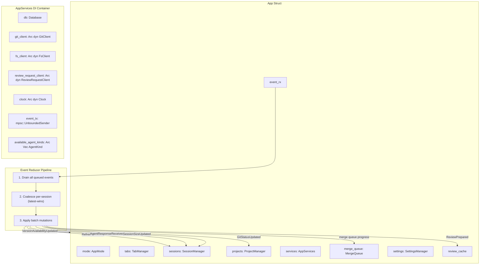

## 7. AppEvent Variants

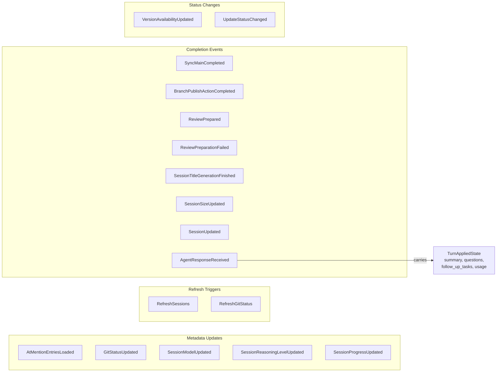

## 8. Turn Execution Pipeline

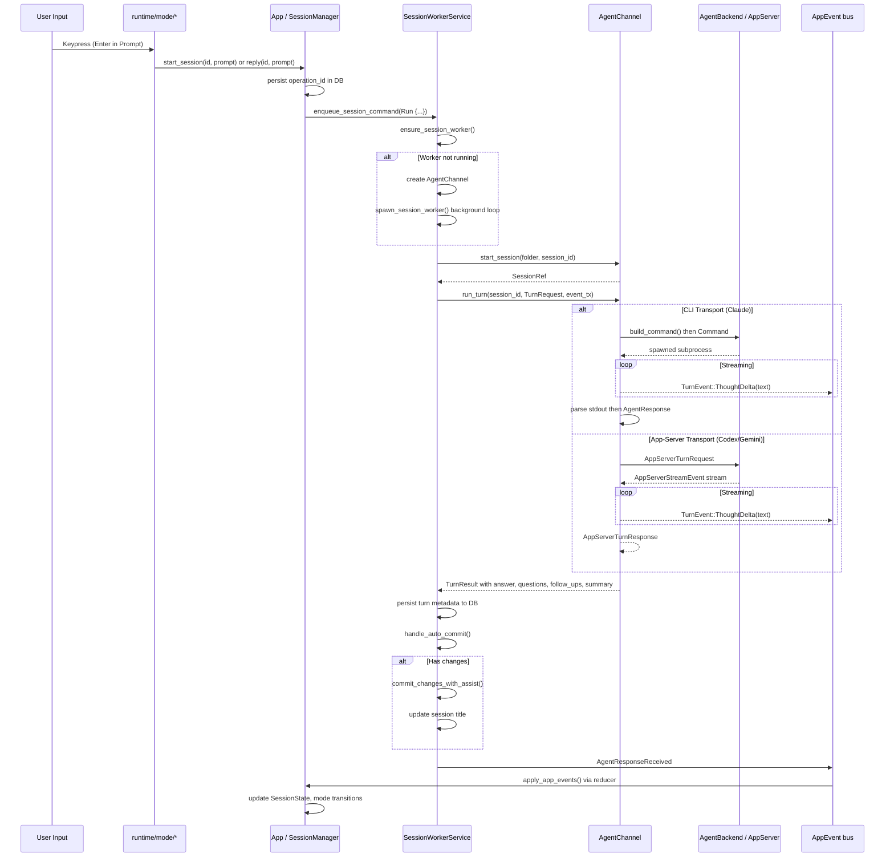

## 9. Infrastructure Trait Boundaries

```mermaid
graph TD
    subgraph Traits["Mockable Trait Boundaries"]
        T_GIT["GitClient<br/>30+ async methods<br/>worktree, merge, rebase,<br/>diff, commit, push"]
        T_FS["FsClient<br/>create_dir_all, remove_dir_all,<br/>read_file, write_file,<br/>remove_file, is_dir, is_file"]
        T_CH["AgentChannel<br/>start_session()<br/>run_turn()<br/>shutdown_session()"]
        T_AS["AppServerClient<br/>run_turn()<br/>shutdown_session()"]
        T_RR["ReviewRequestClient<br/>detect_remote, find_by_source_branch,<br/>create_review_request,<br/>refresh_review_request"]
        T_TMUX["TmuxClient<br/>open_window_for_folder()<br/>run_command_in_window()"]
        T_BACK["AgentBackend<br/>setup(folder)<br/>build_command(request)"]
        T_EVT["EventSource<br/>poll(timeout)<br/>read()"]
        T_CLK["Clock<br/>wall_clock_unix_seconds()<br/>monotonic_now()"]
        T_SLEEP["Sleeper<br/>sleep(duration)"]
    end

    subgraph Impls["Production Implementations"]
        I_GIT["RealGitClient"]
        I_FS["RealFsClient"]
        I_CLI["CliAgentChannel<br/>(Claude)"]
        I_APP["AppServerAgentChannel<br/>(Codex, Gemini)"]
        I_RR["RealReviewRequestClient"]
        I_TMUX["RealTmuxClient"]
        I_CLAUDE["ClaudeBackend"]
        I_CODEX["CodexBackend"]
        I_GEMINI["GeminiBackend"]
    end

    T_GIT --> I_GIT
    T_FS --> I_FS
    T_CH --> I_CLI
    T_CH --> I_APP
    T_RR --> I_RR
    T_TMUX --> I_TMUX
    T_BACK --> I_CLAUDE
    T_BACK --> I_CODEX
    T_BACK --> I_GEMINI
    I_APP --> T_AS
```

## 10. Agent Provider Routing

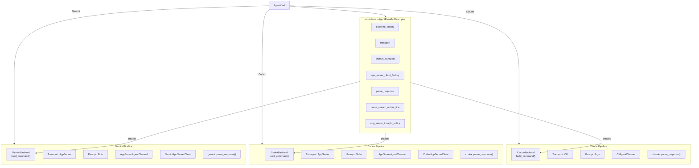

## 11. Domain Entity Relationships

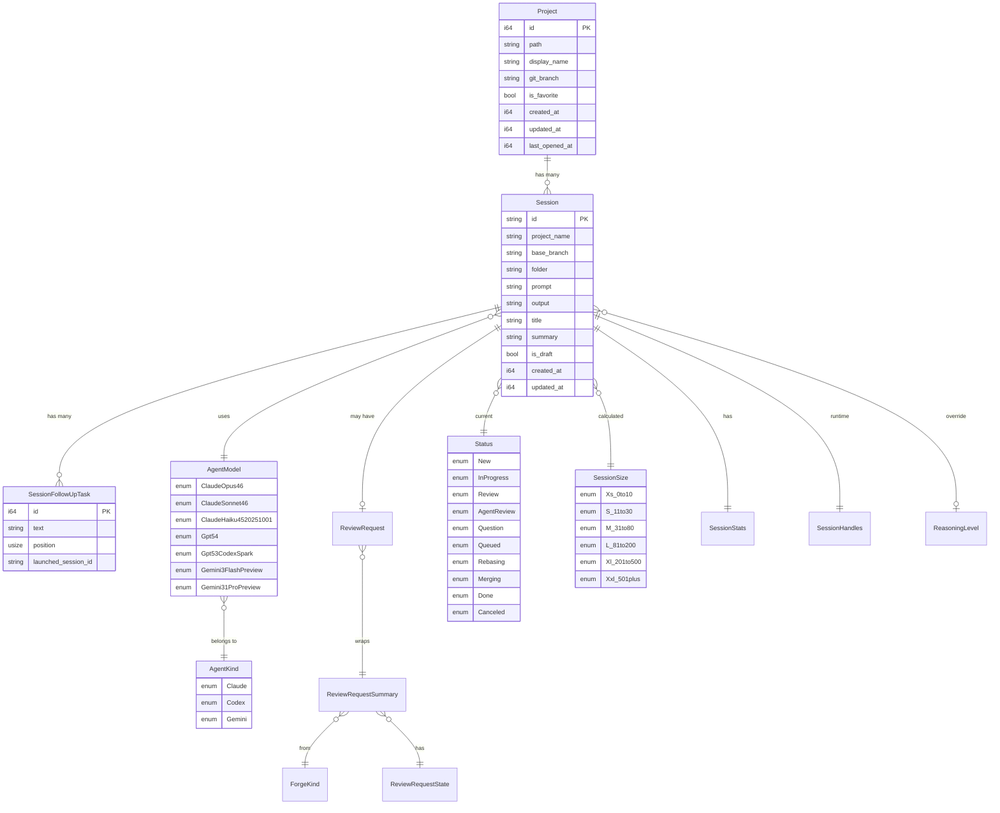

## 12. Session Manager and Worker Architecture

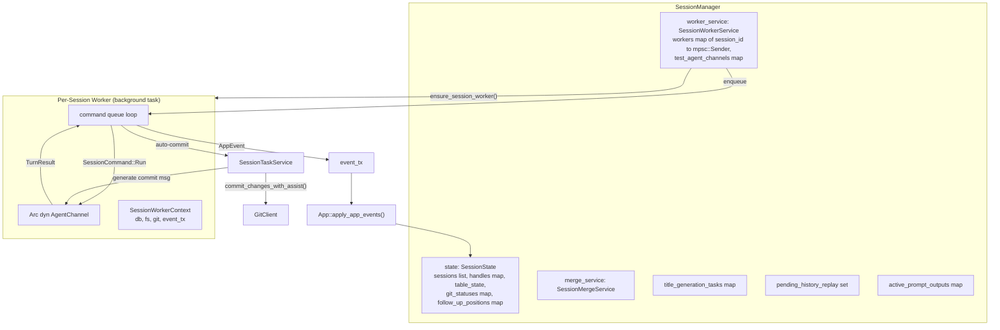

## 13. Merge Queue State Machine

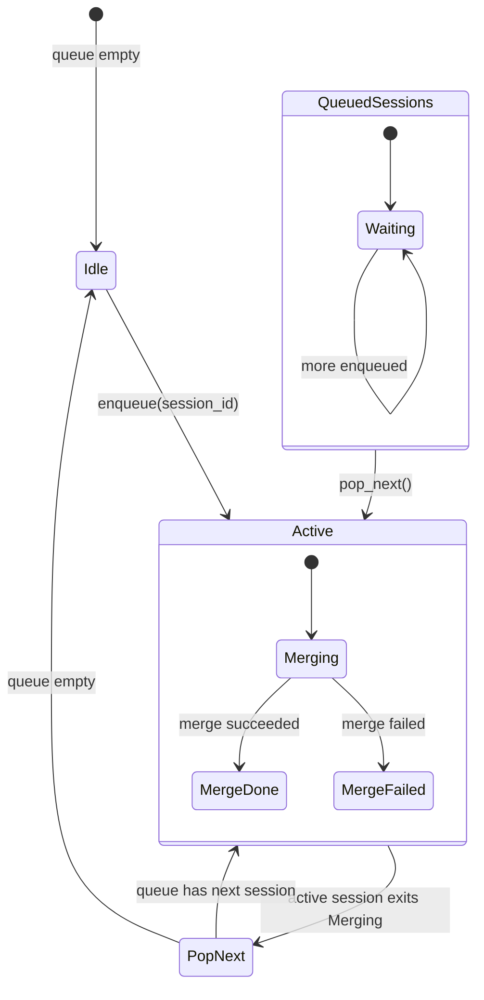

## 14. UI Frame Composition

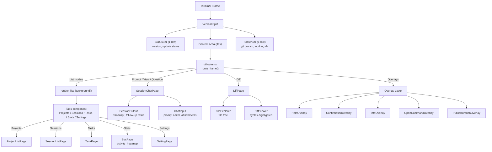

## 15. ag-forge Crate Internals

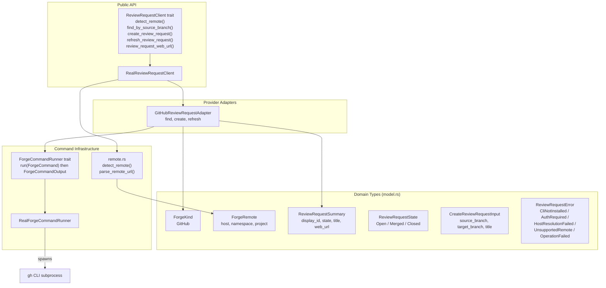

## 16. testty Crate Testing Pipeline

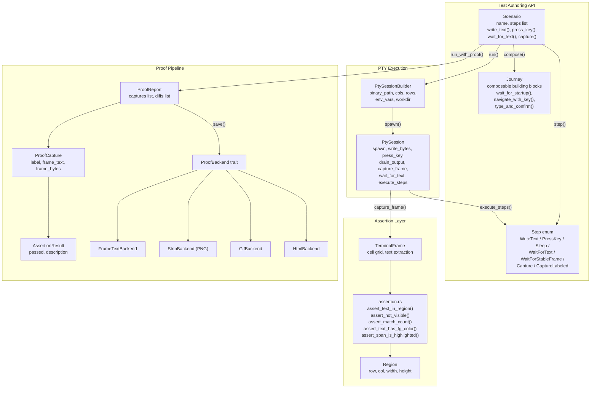

## 17. ag-xtask Commands

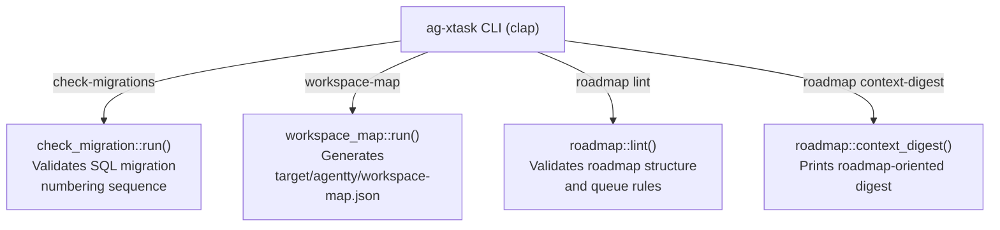

## 18. Git Operations Hierarchy

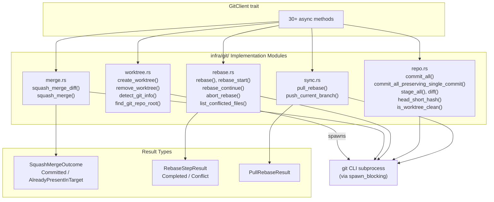

## 19. Database Schema (Logical)

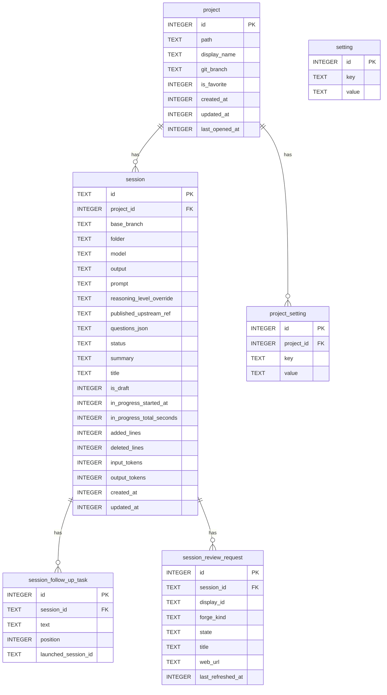

## 20. End-to-End Data Flow

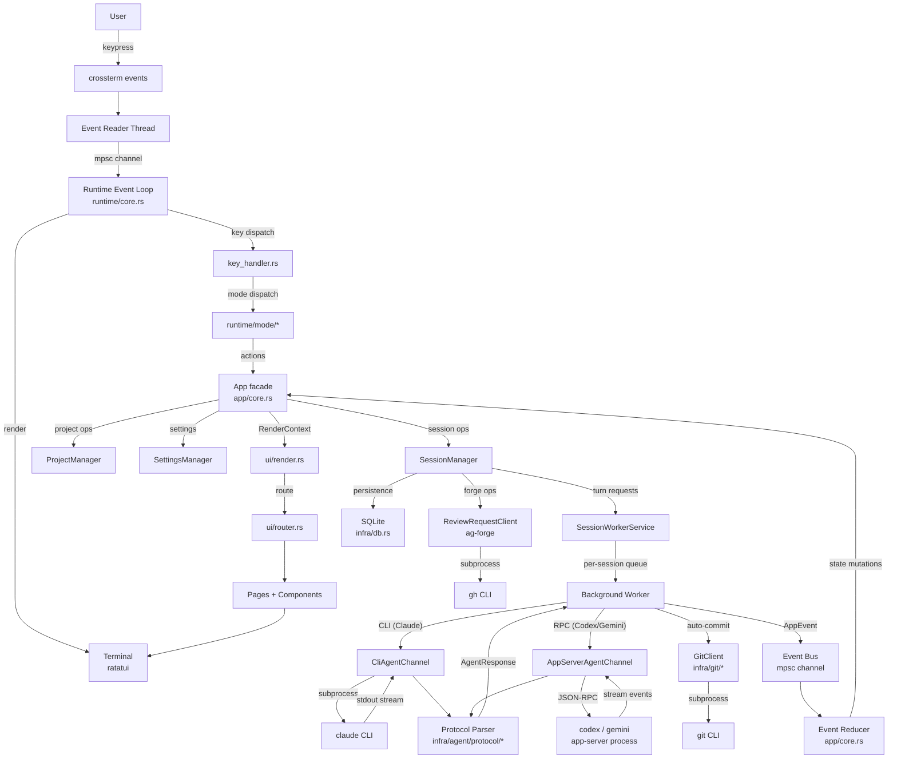
