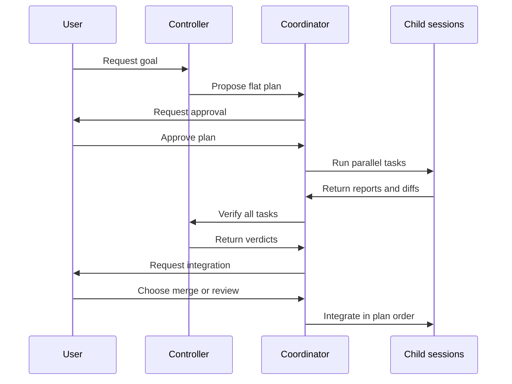
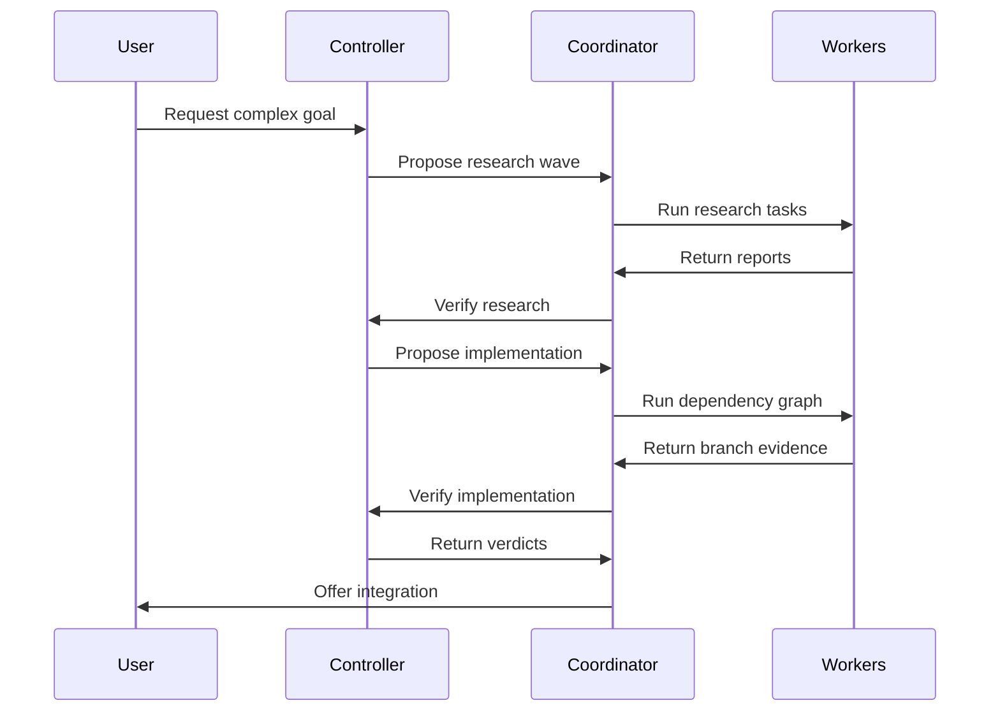
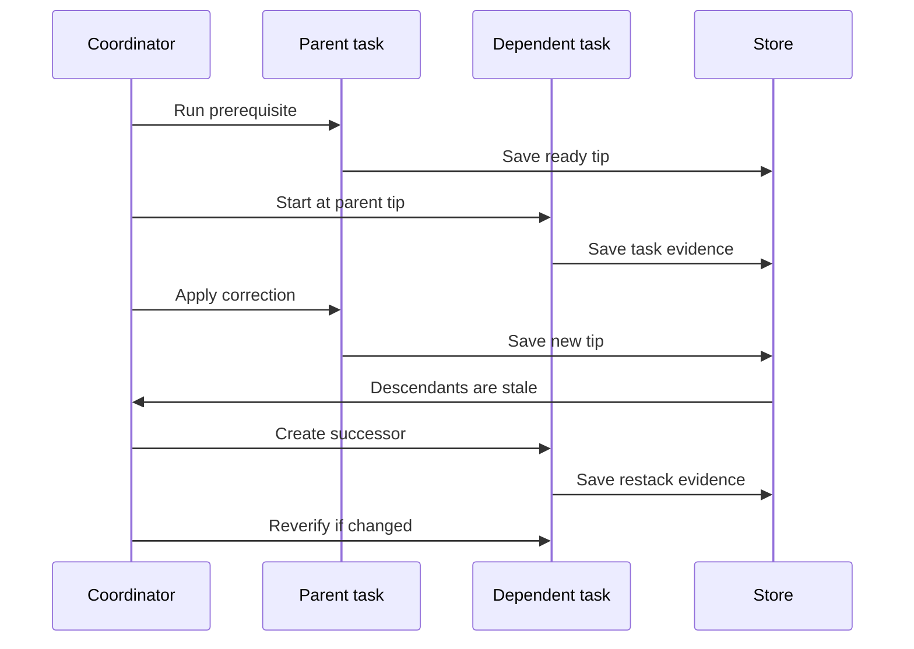

+++
title = "Orchestrator Design"
description = "Current orchestrator behavior and the target wave, dependency, and campaign design."
weight = 7
+++

Agentty currently runs one goal as a flat campaign of managed child sessions. The target
design adds independent waves, declared dependencies, and an interactive board for
multi-round research and dependent implementation.

<!-- more -->

## Design Status

**Current Model** and **Current Limits** describe the preview feature that ships today.
**Target Model**, **Rollout Phases**, and **Invariants to Preserve** are design targets,
not shipped behavior.

Three names appear throughout. The `Orchestrator` session role is the persisted
capability. The *controller* is the session holding that role: it plans, verifies, and
answers. The *coordinator* is the app-layer scheduler that claims tasks, creates
children, and applies controller responses; it is code, not a session.

See [Parallel Orchestration](@/docs/usage/workflow.md) for user-facing instructions.

## Current Model

### Roles and Ownership

| Role                      | Branch changes | Purpose                    |
| ------------------------- | -------------- | -------------------------- |
| `Worker`                  | Owns           | Ordinary user session      |
| `Orchestrator`            | Prompt: none   | Plans and verifies         |
| `OrchestrationWorker`     | Owns           | Implements one task        |
| `OrchestrationResearcher` | Read-only      | Returns a temporary report |

The hierarchy is two levels: one controller and its managed children. The controller's
structured response proposes model-authored plans, verdicts, and continuations; Agentty
validates and applies them. User actions directly approve plans, choose integration,
cancel campaigns, and detach children. Managed children otherwise hide mutation actions,
but users can still inspect transcripts, diffs, and worktrees.

The controller is instructed not to edit, but this is only a prompt policy. Researchers
alone receive enforced read-only permissions; controller edits would be uncommitted and
unobserved.

### Campaign Flow

One campaign-global status moves from approval through execution, verification, and
integration. Every task ever added belongs to that same phase.

The controller emits `subtasks` of one kind per response. Initial implementation plans
need at least two tasks; research waves and retries may contain one. Every task needs a
unique valid key, prompt, and acceptance criteria. Safe touched-area validation applies
only to implementation tasks. Valid tasks persist before approval. Research
auto-approves when **Auto-approve Research** is enabled, which is the default.

The coordinator claims tasks before creating children, links each child before sending
its prompt, and limits live children by **Orchestrator Parallelism**: three by default,
up to eight. Eight is a per-response fan-out limit, not a campaign limit. All children
start from the controller's base; plan order affects integration only.

Implementation workers receive up to three focused-review remediation passes. When all
tasks settle, the controller receives one bounded, inert verification envelope
containing acceptance criteria, reports or branch evidence, review outcomes, and changed
paths. The response accepts at most eight verdicts. Explicit `pass` verdicts advance;
flagged or missing verdicts park. Reusing a task key starts a correction or a fresh
researcher.

The user then makes one campaign-wide choice between local merge and forge review
requests. Local integration follows plan order. Research-only campaigns need no
integration choice and complete automatically.

### Controls and Recovery

The controller shows a non-scrolling status board above chat. `a` approves the parked
plan or integration gate, and `Enter` continues controller chat. To cancel the campaign,
return to the Sessions list and press `c` on the controller; the confirmation includes
its active children. One relay slot serializes blocking worker questions.

Campaign, task, child-link, and long-running operation state persist in SQLite. Claims
and stable operation identifiers let restart re-link children and retry interrupted
review, continuation, or roll-up work without duplicating it.

## Current Limits

- **Global barrier.** One status and one accumulating task list prevent waves from
  progressing independently.
- **Verification overflow.** Follow-up turns can grow a campaign beyond the
  eight-verdict response limit. Roll-up still enters integration; excess tasks remain
  `Ready`, block approval, and do not receive another automatic verification turn.
- **No dependencies.** Every child starts from the same base; merge order is not a task
  graph.
- **One task kind per response.** Research and implementation cannot be proposed
  together, even during follow-up.
- **Fragile research rounds.** A passing research campaign completes unless the same
  verification response proposes the next round.
- **No hierarchy depth.** Managed children cannot own sub-campaigns.
- **Weak control surface.** The board clips, hides task detail, cannot edit a plan, and
  exposes no per-task recovery actions.
- **Serialized questions.** Only one worker question can reach the controller at a time.
- **Unbounded cost.** Only the three-pass remediation cap bounds spend. Corrections,
  retries, and stalled children have no budget, cap, or deadline.
- **Late conflict discovery.** Touched areas are advisory, so overlapping work surfaces
  only as an integration conflict after every task has been paid for.
- **Leaky boundary.** Orchestration policy lives in the app layer, while child creation
  exposes persistence row identifiers through the session API.

## Target Model

### Capacity Targets

The design sizes one campaign at five waves of eight tasks, with a project-wide ceiling
on live managed sessions rather than a per-campaign one. Both numbers are enforced — the
wave count as a campaign budget and the session ceiling as a capacity lease — rather
than left as aspirations the scheduler can drift past. Cost scales with rounds, not with
the square of wave size: a wave costs one verification generation plus one per
correction round, and integrating a wave whose patches do not interact adds no
controller turns at all. Anything that would make verification cost grow per integrated
task is a design defect, not a tuning problem.

### Intended Workflow

A campaign becomes a durable conversation that can alternate research, implementation,
and review rounds while independent work continues.

### Waves and Controller Dispatch

A persisted wave owns its tasks, kind, phase, and verification generation. Waves
schedule and verify independently, so research and implementation can coexist in
different waves. The campaign status is their roll-up.

Wave membership freezes at approval. The scheduler caps it at the current
verdict-response limit of eight, but that limit is a policy constant, not a schema
invariant: persistence stores wave size unbounded, so raising the cap or paging verdicts
across generation-matched turns stays a policy change instead of a migration. The
initial design still never splits one verification generation across controller turns.
New scope creates another wave, subject to the campaign wave budget. One dispatch
verifies every `Ready` or `Reported` task in the wave, and its generation completes only
after each has a generation-matched verdict; only explicit passes advance.

Waves also introduce execution history. Each task execution row is unique by task and
generation, links one session and an optional predecessor, and the task points to its
active execution. This replaces the current single child-session link and lets stale
root work continue in a managed successor without reopening a terminal session.

The one controller session stays serialized because plan proposal, follow-up scope, and
correction routing share model-visible history. Verification does not: its envelope is
self-contained, so a later phase may dispatch verification generations as stateless
turns and narrow the campaign claim to the planning path. The serialization is a
deliberate simplification, not a requirement of the data flow.

The controller conversation is derived state, never the source of truth. Every dispatch
re-supplies a bounded snapshot from persisted campaign state, so a compacted, restarted,
or replaced controller session resumes without losing plan, verdict, or routing context.

Ready waves enter a durable dispatch queue keyed by wave, message kind, and generation.
A campaign claim allows one controller turn in flight; other waves keep running or wait
visibly.

The provider response is saved before application. Each dispatch records the expected
campaign and originating-wave lifecycle versions. User lifecycle actions advance the
relevant version. Cancel and close atomically advance the campaign version and
invalidate every queued or in-flight dispatch.

One compare-and-set transaction applies a response only while the campaign remains open
and both lifecycle versions match. It records verdicts, correction generations, at most
one follow-up wave, its approval state, and dispatch completion. A mismatch marks the
response superseded without mutating work. Replay cannot duplicate work. The dispatch
also captures the research auto-approval authorization so restart cannot change the
result.

A campaign closes only through a board action after every wave is settled. Closing
persists `Done` and releases the controller. Settled includes passed reports,
integrated, blocked, detached, failed, or canceled tasks, but not pending integration or
remediation. Cancel abandons open work; an ineligible close action shows the blocker.

### Budgets and Safety Limits

Every campaign carries a token budget, a controller-turn budget, and a wave budget. None
can read from the verification envelope, whose totals cover child input and output
tokens for the current tasks only: they omit controller usage, earlier execution
generations, and any notion of turn count. All three need their own persisted campaign
accounting, accumulating usage across the controller session and every execution
generation and counting dispatches and approved waves.

Enforcement is admission control, not interception. Usage becomes observable only when a
turn finishes, and the agent backends expose no per-request token cap, so nothing can
stop a single request mid-flight. The coordinator instead reserves a capped allocation
before every dispatch and every child spawn, admits the work only while the remaining
budget covers that reservation, and reconciles the reservation against actual usage when
the turn settles. An admitted turn can still exceed its reservation: the budget bounds
what a campaign starts, not what one in-flight request consumes, and the per-dispatch
reservation is what keeps that overshoot bounded. Crossing a budget parks the campaign
at a visible board gate where the user extends or cancels it; no budget fails or
silently truncates work.

The wave budget is enforced where scope is created rather than left as a sizing target.
A follow-up wave that would cross it is not created; the campaign parks at the same
gate, and the user either raises the budget or closes the campaign and starts a
follow-on seeded from its settled state. Excess scope never silently extends a campaign,
because the wave count bounds both controller context growth and how long one campaign
holds its claims.

Corrections are capped per task. Repeated verdict-less or flagged generations for one
key settle it as blocked with its evidence instead of looping, and the cap counts
successor executions so retries cannot launder it. Each execution also carries a stall
deadline; a child with no observed activity past that deadline parks with its transcript
as evidence rather than holding a parallelism slot forever.

Live managed sessions draw from one project-wide ceiling. **Orchestrator Parallelism**
remains the per-campaign cap, but concurrent and nested campaigns share the project
ceiling, so hierarchy depth cannot multiply worktrees.

That ceiling is a persisted capacity lease, not an in-memory count. A coordinator
acquires a lease row in one transaction against the project's live-lease total before it
creates a child session or its worktree, so two schedulers — including a sub-campaign
and its parent — can never both observe the same last free slot. Leases release from
observed terminal session state rather than from an in-process handler, so a crash
between spawn and settlement cannot leak capacity, and restart reconciles leases against
live sessions and reclaims the orphans.

### Dependency Graph

Implementation tasks gain `depends_on`. The initial version allows one same-wave
dependency, rejects cycles and unknown keys, and rejects multiple parents until a
materialized multi-parent base has defined conflict and cleanup semantics.

A prerequisite is dependency-ready only when it is `Ready`, still owns its managed
branch, and has a persisted branch-tip generation. Gating on a verdict would deadlock:
wave verification waits for all tasks, including the dependent.

Failure, cancellation, or detachment persists `DependencyBlocked` on every descendant
before cleanup. Each block records the root cause and the immediate prerequisite
generation it awaits.

When a retried prerequisite reaches a newer `Ready` generation, a unique recovery
transition keyed by blocked task, prerequisite task, and successful generation advances
the direct-child frontier. A child that never started returns to `Planned` against the
new tip. A child with prior work gets one successor execution and enters restack; its
last branch stays retained until that succeeds or the campaign is abandoned. Replays do
not create another execution, and deeper descendants remain blocked until their own
prerequisite becomes `Ready`. Graph-aware cancellation previews and stops descendants
without touching unrelated work.

### Managed Stacks and Generations

The user-facing `Stacked` mode cannot launch dependencies: `Ready` managed sessions are
terminal, while that mode requires an active parent and creates an unlinked draft.

The session API therefore adds `OrchestrationStackedChild`. A durable claim pins the
prerequisite tip, eagerly creates a managed worktree, persists both task and parent
links, assigns `OrchestrationWorker`, and submits the prompt automatically. A task uses
the execution history introduced with waves, preserving old terminal sessions as
evidence while naming one active generation.

Descendant synchronization is coalesced, not per-write. A prerequisite propagates only
once it reaches a `Ready` generation with no pending remediation, and consecutive tip
changes collapse into one restack per descendant. Three remediation passes on a
prerequisite therefore cost one chain synchronization, not three. A terminal dependent
is never reopened; a successor execution session restacks from its retained tip. Each
verdict records the task, prerequisite, branch, and base generations it verified.

A canonical patch fingerprint decides whether a clean restack preserved both the
child-owned patch and its dependency context. Only then may a new verdict explicitly
carry forward the old one. Corrections, changed context, conflicts, and failures forbid
carry-forward; they trigger re-verification or park the affected subtree.

Only the active execution keeps a worktree. A superseded execution archives its patch
and releases its worktree once the successor link and evidence are durable, so evidence
is the archived patch rather than a retained checkout. Retained branches survive only
until the successor restack succeeds or the campaign closes.

### Durable Operations

Stable, generation-qualified identities make every side effect restart-safe:

| Operation    | Durable identity       | Restart rule                         |
| ------------ | ---------------------- | ------------------------------------ |
| Dispatch     | Wave and generation    | Apply by lifecycle CAS or supersede  |
| Spawn        | Task execution         | Re-link or retry creation            |
| Restack      | Task branch generation | Inspect tips and patch fingerprints  |
| Base refresh | Task execution         | Resume, finalize, or park the rebase |
| Integration  | Task integration       | Reconcile Git or forge state         |

Transient events only wake reconciliation. Persisted operation state, expected commits,
fingerprints, and bounded conflict evidence decide the outcome. Newer generations
supersede older pending work; an unknown in-flight result is never duplicated.

### Campaign-Wide Integration

All waves target one campaign base. The campaign records the base commit, tree, and
monotonic generation; tasks and verdicts record which generation they used.

Campaign integration must not add a second serializer over the shared branch, but no
existing component provides the guarantee either: the merge queue is an in-memory
ordering for local merge sessions, and the sync orchestrator serializes its own sync
commands. Phase 3 therefore introduces one durable per-project integration claim that
both ordinary local merges and campaign queue entries acquire, so a user session merging
to the same base cannot interleave with a claimed campaign entry.

That claim covers short transactions only — one rebase, publish, or reconciliation pass
— and is released between them. Nothing that waits on a human or a forge holds it. The
campaign claim orders work inside one campaign; the project claim reserves the branch
for the duration of a single Git transaction.

A local merge is never split across that boundary. Reconciliation, generation
validation, and the merge run inside one claimed transaction, so nothing can advance the
base between the check and the merge. An entry reconciled under an earlier claim
revalidates against the current head on entry and re-reconciles in place when it has
moved, retrying under a bounded attempt count; it never merges work validated against a
head it no longer sits on.

The integration approach is persisted per implementation wave. At its integration gate,
the board offers `LocalMerge` or `ReviewRequest`. A compare-and-set against the open
campaign and wave lifecycle versions saves the choice and approval generation, then
enqueues its passed tasks. Research waves skip the gate, and one wave cannot mix
approaches.

Queue entries copy that approval generation and approach. A retry keeps the approach and
increments a durable task integration generation. The user may change the approach only
before the first entry is claimed; the replacement approval invalidates unclaimed
entries through the same lifecycle compare-and-set.

A wave drains as one train. The coordinator resolves the actual base once, restacks
every eligible entry against it, and requests at most one verification generation
covering only the tasks whose evidence actually changed. A stale root task gets a new
managed successor session and rebases from its retained tip; dependents use transitive
restacking. Conflicts park the queue entry with evidence and route into the same
assisted resolution the sync orchestrator already provides, instead of terminating it.

Queue eligibility follows the dependency graph. A prerequisite integrates before its
descendants. A descendant can claim the queue only after required ancestor restacks
finish and its verdict matches the resulting task, prerequisite, branch, and campaign
base generations.

Each accepted integration advances the base generation. Every queued entry still
reconciles onto the new base before it can merge or update a request; disjoint changed
paths never authorize skipping that operation, and they never prove semantic
non-interaction, since an API change, build configuration, lockfile, or generated
artifact can break a task without touching a path it wrote.

What the scoped rule saves is the controller turn, not the reconciliation. After the
rebase succeeds, an unchanged patch fingerprint and unchanged review evidence carry the
existing verdict forward, recorded against the new base generation. A conflict, a
changed fingerprint, changed dependency context, a failing check, or an advance that
touches the task's changed paths or any shared build input instead repeats focused
review and needs a new verification generation. Integration therefore costs one
verification round per interacting group rather than one per merged task, while every
commit Agentty merges is still built on a reconciled branch.

A review-request attempt records its head, target base commit and tree, request
identity, and integration generation. That durable, generation-qualified record — not a
held claim — survives from publication until terminal reconciliation, closure, or
detachment, because a human review can take days and must never block ordinary merges.
The attempt acquires the project claim only for its publish and reconciliation
transactions. Forge state only wakes reconciliation. Before the task can become
`Integrated`, the coordinator reacquires the claim and compares the actual target
history and tree with the recorded base and expected merge result. A match atomically
accepts the integration.

The merge point on this path belongs to the forge, not to Agentty, and no claim can span
an open request. Anyone may merge at any moment, including after the target branch has
advanced past the reconciliation Agentty last performed, and the comparison above then
runs against an irreversible merge. Agentty cannot supply the reconciled-base guarantee
here; the forge must. `ReviewRequest` therefore documents forge-side enforcement —
required-up-to-date branch protection or a merge queue — as the prerequisite for the
guarantee.

Agentty cannot infer whether a project has that enforcement. Current adapters read
request state only, never branch-protection or merge-queue configuration, so the
guarantee is a persisted per-project capability with three values: verified by an
adapter able to query the forge, confirmed by the user, or unknown. Unknown is treated
as best-effort, and the board shows which value applies before the approach is chosen. A
project is never marked guaranteed by inference.

An intervening base change makes the attempt stale. While the request is open, the task
reconciles its head onto the new base and updates the request or supersedes it with one
persisted replacement attempt; the same scoped rule then decides only whether that
reconciliation also repeats focused review and wave verification.

A request that merged against an advanced base falls to the post-merge contract, since
the change cannot be withheld any more. The task does not become `Integrated` on its
recorded expectation. The coordinator reconciles the landed tree against the actual base
and repeats the checks the merge bypassed; passing checks accept the integration and
record the base generation it actually landed on. Failing checks park the task as
`IntegrationFailed` with corrective or revert evidence, advance the campaign base to the
real head so later entries reconcile onto it, and keep the campaign active for
follow-up. A landed request is never silently accepted, and never rolled back without
the user choosing it. A request closed without merge retries under the wave's persisted
approach. Restart resumes the recorded attempt before any new side effect.

### Interactive Campaign Board

The board becomes a selectable, scrollable task table with a detail pane for prompts,
acceptance criteria, touched areas, evidence, verdicts, dependencies, questions, and
integration state.

Users can edit or drop tasks before approval; approve a plan wave; choose the
integration approach for a passed implementation wave; retry, cancel, or detach a task;
answer any queued worker question; extend a parked budget; and close or cancel a
campaign. Canceling a non-leaf task previews affected descendants.

Because touched areas stay advisory and never constrain workers, the approval gate flags
implementation tasks whose declared areas intersect, so predictable conflicts surface
before any model spend rather than at integration.

Every visible action requires an E2E feature test.

### Nested Campaigns and API Boundary

Orchestration policy moves into `ag-session` behind plan, wave, task, and graph
operations. The frontend-neutral API uses opaque handles instead of database row IDs;
the app layer supplies runtime, persistence, Git, and forge adapters.

Session roles then split into ownership (user or managed) and capability (worker or
orchestrator). A managed orchestrator may own a depth-capped sub-campaign after waves
and dependencies are proven, drawing its children from the project-wide session budget.

## Rollout Phases

These are product milestones, not individual PRs. They ship in order; each phase starts
after the previous phase is complete.

| Phase | Scope                      | Depends on | Outcome                                 |
| ----- | -------------------------- | ---------- | --------------------------------------- |
| 1     | Control surface and safety | —          | Usable, enforceable flat campaigns      |
| 2     | Durable waves and boundary | 1          | Multi-round research and explicit close |
| 3     | Safe independent work      | 2          | Concurrent implementation waves         |
| 4     | Dependency graphs          | 3          | Single-parent stacked DAG workflows     |
| 5     | Nested orchestration       | 4          | Depth-capped recursive campaigns        |

Phase 1 delivers the interactive board, plan and task actions, queued worker questions,
persisted campaign usage and dispatch accounting with pre-dispatch reservations and a
parked budget gate, the project capacity lease, and enforced controller read-only
permissions.

Phase 2 adds bounded wave persistence, execution generations, serialized
lifecycle-fenced dispatch, atomic follow-up creation, and campaign close. It also moves
plan, wave, task, and graph operations into `ag-session` behind opaque handles, because
later phases otherwise write the dispatch queue, restacking, and integration queue
against the app layer and migrate them afterwards. Existing campaigns migrate as wave
one.

Phase 3 adds wave-scoped integration approval, a new durable per-project integration
claim adopted by both ordinary local merges and campaign entries, the single claimed
reconcile-validate-merge transaction, base generations, scoped verdict carry-forward
over always-reconciled branches, successor refresh, focused review, re-verification,
restart reconciliation, the per-project forge-enforcement capability behind the
`ReviewRequest` guarantee, and the post-merge contract for requests that land outside
the claim. Implementation waves do not integrate independently before this phase. Phase
3 also lands one internal single-dependency pair covering restack, fingerprint
carry-forward, and re-verification end to end, validating the integration cost model
before Phase 4 builds the graph on it.

Phase 4 exposes managed stacked creation and `depends_on` only when validation,
dependency-ready scheduling, coalesced descendant synchronization, block recovery,
graph-aware cancellation, transitive restacking, and topological integration work end to
end.

Phase 5 splits ownership from capability and adds managed orchestrators, sub-campaign
roll-up, cancellation, recovery, and hierarchy rendering.

A phase may span several reviewable PRs, but incomplete workflow shapes stay internal.
Schema changes include migration and restart coverage; visible behavior includes usage
docs and an E2E feature test.

## Invariants to Preserve

- Plans persist before approval. **Auto-approve Research** is standing authorization for
  research only; implementation always requires explicit approval.
- Agentty, not model-authored text, owns lifecycle mutation. Execution permissions, not
  prompt policy, enforce controller read-only behavior.
- The controller conversation is derived state. Every dispatch re-supplies bounded
  persisted context, so a compacted or replaced controller session loses no campaign
  state.
- Claims, stable operation identities, and lifecycle and evidence generations prevent
  stale or duplicate work.
- Campaign cost is bounded at admission. Token, turn, wave, correction, and stall
  budgets reserve before dispatch and park work at a visible gate instead of failing or
  looping. One in-flight turn may exceed its reservation; nothing further is admitted
  after it.
- One durable project-wide claim owns the shared branch, held only for a single Git
  transaction and never across a human or forge wait; campaign claims only order work
  within a campaign, and a persisted capacity lease acquired before child creation and
  reclaimed from observed terminal state bounds live managed sessions.
- Every merge Agentty performs reconciles, validates, and merges inside one claimed
  transaction, so it lands on the base it was validated against. Carry-forward may skip
  re-verification after that reconciliation, never the reconciliation itself.
- Forge merges fall outside that claim, so the same guarantee needs forge-side
  up-to-date or merge-queue enforcement. A request that lands without it is reconciled
  after the fact and parks with corrective evidence rather than being accepted as
  `Integrated`.
- Controller inputs are bounded and model-authored reports are marked inert.
- Researchers are read-only and their temporary worktrees are reclaimed.
- Status and verdicts come from observed session state and generation-matched evidence.
- Only the active execution holds a worktree; superseded generations keep archived
  patches as evidence.
- Branch cleanup waits until required evidence and successor links are durable.
