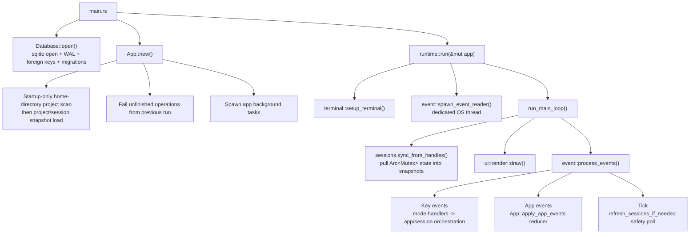
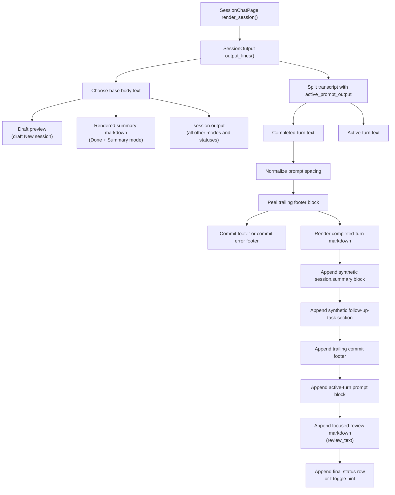
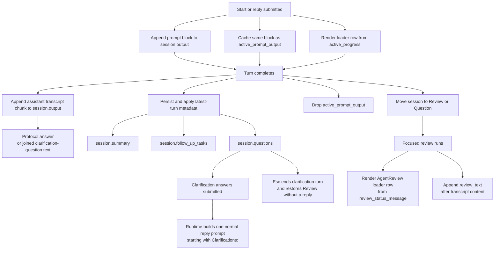
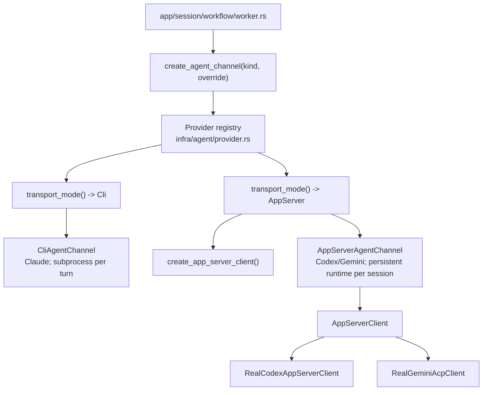

+++
title = "Runtime Flow"
description = "Goals, workspace map, runtime event flow, background tasks, and agent channel transport model."
weight = 2
+++

<a id="architecture-runtime-flow-introduction"></a>
This guide documents Agentty's runtime data flows end to end: the foreground event loop, reducer/event buses, session-worker turn execution, merge/rebase/sync orchestration, and every background task with trigger points and side effects.

<!-- more -->

## Architecture Goals

<a id="architecture-runtime-flow-goals"></a>
Agentty runtime design is built around these constraints:

- Keep domain logic independent from infrastructure and UI.
- Keep long-running or external operations behind trait boundaries for testability.
- Keep runtime event handling responsive by offloading background work to async tasks.
- Keep AI-session changes isolated in git worktrees and reviewable as diffs.
- Decouple agent transport (CLI subprocess vs app-server RPC) behind a unified channel abstraction.

## Workspace Map

| Path | Responsibility |
|------|----------------|
| `crates/ag-forge/` | Shared forge review-request library crate for normalized review-request types, GitHub remote detection, and `gh` adapter orchestration. |
| `crates/agentty/` | Main TUI application crate (`agentty`) with runtime, app orchestration, domain, infrastructure, and UI modules. |
| `crates/ag-xtask/` | Workspace maintenance commands (migration checks, workspace-map generation, automation helpers). |
| `docs/site/content/docs/` | End-user and contributor documentation published at `/docs/`. |

## Main Runtime Flow

<a id="architecture-runtime-flow-main"></a>
Primary foreground path from process start to one event-loop cycle:



<a id="architecture-runtime-flow-notes"></a>
Foreground loop details:

- `run_main_loop()` renders every cycle and applies snapshot sync before draw.
- `process_events()` waits on terminal events, app events, or tick (`tokio::select!`).
- After one event, it drains queued terminal events immediately to avoid one-key-per-frame lag.
- Tick interval is `50ms`; metadata-based session reload fallback is `5s` (`SESSION_REFRESH_INTERVAL`).

## Data Channels

<a id="architecture-runtime-flow-channels"></a>
Agentty uses four primary runtime data channels:

| Channel | Producer(s) | Consumer(s) | Payload | Purpose |
|---------|-------------|-------------|---------|---------|
| Terminal `Event` channel (`runtime/event.rs`) | Event-reader thread | `runtime::process_events()` | `crossterm::Event` | User input and terminal events. |
| App event bus (`AppEvent`) | App background tasks, workers, task helpers | `App::apply_app_events()` reducer | `AppEvent` variants | Safe cross-task app-state mutation. |
| Turn event stream (`TurnEvent`) | `AgentChannel` implementations | Session worker `consume_turn_events()` | Loader-thought/pid | Transient loader updates and PID updates while final transcript output waits for the completed turn result. |
| Session handles (`SessionHandles`) | Workers/session task helpers | `SessionState::sync_from_handles()` | Shared `Arc<Mutex<...>>` output/status/pid | Fast snapshot sync without full DB reload. |

## App Event Reducer Flow

<a id="architecture-runtime-flow-app-events"></a>
`App::apply_app_events()` is the single reducer path for async app events.

Flow:

1. Drain queued events (`first_event` + `try_recv` loop).
1. Reduce into `AppEventBatch` (coalesces refresh, git status, model, and loader-thinking updates).
1. Apply side effects in stable order.

Reducer behaviors that matter for data flow:

- `RefreshSessions` sets `should_force_reload`, which triggers `refresh_sessions_now()` and `reload_projects()`.
- `reload_projects()` now reloads only persisted project rows; the expensive home-directory repository discovery pass runs only during `App::new()`.
- `BranchPublishActionCompleted` swaps the session-view popup from loading to success or blocked/failure copy after a manual branch push finishes.
- `SessionUpdated` marks touched sessions so reducer can call `sync_session_from_handle()` selectively.
- `SessionProgressUpdated` refreshes transient loader text used by the session view.
- `AgentResponseReceived` routes question-mode transitions for active view sessions and applies the worker's reducer-ready turn projection (summary, follow-up tasks, questions, token deltas) to the currently loaded session.
- After touched-session sync, terminal statuses (`Done`, `Canceled`) drop per-session worker senders so workers can shut down runtimes.

## Session Chat Rendering Flow

<a id="architecture-runtime-flow-session-chat"></a>
The session chat panel is rendered by `crates/agentty/src/ui/page/session_chat.rs` and
`crates/agentty/src/ui/component/session_output.rs`. The page chooses which
session is visible and which auxiliary view state applies; the component turns
that state into the exact lines printed inside the bordered output panel.

### Data Origins

The printed session-chat data comes from these sources:

- `session.output`
  Loaded with the session row in `crates/agentty/src/app/session/workflow/load.rs`,
  then kept hot from the per-session handle via
  `crates/agentty/src/app/session_state.rs`.
  Runtime workers append new transcript text through
  `SessionTaskService::append_session_output()` in
  `crates/agentty/src/app/session/workflow/task.rs`, which updates both the
  in-memory handle buffer and the persisted database row.
- `active_prompt_output`
  Cached by `SessionManager::set_active_prompt_output()` in
  `crates/agentty/src/app/session/core.rs` when a start or reply prompt is
  submitted. This stores the exact prompt-shaped transcript block that was just
  appended to `session.output` so `SessionOutput` can split the transcript into
  completed-turn content and the currently active turn without reparsing
  generic prompt-looking lines from assistant output.
- `session.summary`
  Persisted by the turn worker in
  `crates/agentty/src/app/session/workflow/worker.rs` as the raw protocol
  `summary` payload. `App::apply_agent_response_received()` in
  `crates/agentty/src/app/core.rs` now applies that same raw payload to the
  in-memory session snapshot immediately, and
  `crates/agentty/src/ui/component/session_output.rs` renders the synthetic
  summary block from `session.summary` instead of storing a second markdown
  copy inside `session.output`. For merged/done flows, merge helpers can
  rewrite the stored value into a display-oriented markdown form before the
  next reload.
- `session.follow_up_tasks`
  Persisted as separate rows by the worker in
  `crates/agentty/src/app/session/workflow/worker.rs`, rehydrated into session
  snapshots in `crates/agentty/src/app/session/workflow/load.rs`, and also
  updated immediately in memory by the worker-provided `TurnAppliedState`
  projection in `App::apply_agent_response_received()` so the active session
  view reflects the latest persisted metadata without waiting for a full
  reload.
- `session.questions`
  Persisted by the worker alongside the latest turn metadata and applied
  immediately by the reducer, but these items do not render inside
  `SessionOutput`. Instead they drive `AppMode::Question`, where the bottom
  question panel renders the current question and its options/input while the
  transcript panel remains visible above it.
- `review_status_message` and `review_text`
  Stored on `AppMode::View` and its restore-view variants. Review mode is opened
  from `crates/agentty/src/runtime/mode/session_view.rs`, which either reuses a
  cached review, shows a loading message, or starts a review-assist task. That
  task emits `ReviewPrepared` / `ReviewPreparationFailed`, and
  `App::apply_review_update()` in `crates/agentty/src/app/core.rs` writes the
  resulting text or error/status message back into the active view mode.
- `active_progress`
  Sourced from `App::session_progress_message()` in
  `crates/agentty/src/app/core.rs`. Session task helpers emit
  `AppEvent::SessionProgressUpdated` from
  `crates/agentty/src/app/session/workflow/task.rs`, the reducer batches those
  updates, and session view mode reads the latest message before rendering.
- `done_session_output_mode`
  Stored on `AppMode::View` and related restore-view snapshots in
  `crates/agentty/src/ui/state/app_mode.rs`. This mode does not change what is
  persisted; it only changes whether the panel uses the summary as its primary
  body (`Summary`) or uses transcript output as the primary body (`Output` and
  `Review`).

### Output Assembly Diagram

`SessionOutput` does not render one flat stored message list. Instead it
assembles the panel from the persisted transcript plus synthetic metadata and
transient view state:



This means `session.output` stays the durable transcript, while summary,
follow-up tasks, and focused review are layered on during render instead of
being appended back into that transcript string.

### Render Path

The exact session-chat render path is:

1. `crates/agentty/src/runtime/mode/session_view.rs` calculates the visible
   output height by calling `SessionChatPage::rendered_output_line_count(...)`
   with the selected `Session`, the current `DoneSessionOutputMode`,
   `review_status_message`, `review_text`, and the latest `active_progress`.
1. `crates/agentty/src/ui/page/session_chat.rs` builds `SessionOutput` inside
   `render_session()`, forwarding the same render inputs plus scroll offset.
1. `SessionChatPage::render_session_header()` prints the single-line session
   header above the bordered output region.
1. `SessionOutput::output_text()` in
   `crates/agentty/src/ui/component/session_output.rs` selects the base text:
   staged draft preview for draft `New` sessions, rendered summary text for
   `Status::Done` summary mode, otherwise `session.output`.
1. `SessionOutput::output_lines()` converts that source text into final panel
   lines: it optionally splits the transcript using `active_prompt_output`,
   normalizes prompt spacing, splits any trailing commit footer, renders the
   completed-turn markdown, appends the synthetic summary block from
   `session.summary` when the current status/mode allows it, appends
   follow-up tasks, reattaches the trailing commit footer, appends the active
   prompt block, appends focused review markdown from `review_text`, and
   finally adds the loader row or `t` toggle hint when the current status
   requires it.
1. `SessionOutput::render()` writes the final `Line` list into a `ratatui`
   `Paragraph`, which is the exact widget printed in the session chat output
   area.

### Print Timing

The session output panel shows different data at different lifecycle points:



### What Prints, When It Prints, and When It Stops Showing

Use the artifact-by-artifact reference below instead of a wide comparison
table. Each item keeps the same four questions grouped vertically so the page
stays readable on narrow screens.

#### User prompt blocks

- Comes from: `session.output` and `active_prompt_output`
- Prints: immediately after start or reply submission. The same block stays in
  the transcript after the turn finishes.
- Hidden or removed: the transcript entry is durable. Only the transient
  `active_prompt_output` cache is removed after turn metadata is applied or
  when the session is no longer active.

#### Assistant answer

- Comes from: `session.output`
- Prints: after a successful turn when protocol `answer` is non-empty.
- Hidden or removed: durable transcript entry; not removed by
  `SessionOutput`. It can be hidden from view only when
  `DoneSessionOutputMode::Summary` replaces the base body with rendered summary
  text.

#### Clarification question text from the assistant

- Comes from: `session.output` fallback when no `answer` exists
- Prints: after a successful turn with questions but without top-level
  `answer` text.
- Hidden or removed: durable transcript entry once appended. Pending
  structured `session.questions` continue separately in question mode until
  answered.

#### Structured clarification questions

- Comes from: `session.questions`
- Prints: in `AppMode::Question`, inside the bottom question panel, not inside
  `SessionOutput`.
- Hidden or removed: cleared when the resumed turn starts. The output panel
  never renders these as synthetic transcript rows.

#### Clarification answers

- Comes from: a new reply prompt built by runtime and appended into
  `session.output`
- Prints: when the user finishes all questions and submits the generated
  `Clarifications:` reply turn.
- Hidden or removed: durable transcript entry. `SessionOutput` only adjusts
  spacing between numbered question groups for readability. If the user ends
  question mode with `Esc`, no clarification reply is built and the session
  returns to `Review`.

#### Summary block

- Comes from: `session.summary`
- Prints: appended after transcript content for most statuses. In `Done + Summary` mode it becomes the primary body instead.
- Hidden or removed: hidden for `Canceled` sessions. It is also not appended a
  second time when `Done + Summary` mode already uses the summary as the base
  body.

#### Follow-up tasks

- Comes from: `session.follow_up_tasks`
- Prints: always appended synthetically after the summary block when any tasks
  exist.
- Hidden or removed: replaced wholesale by the next completed turn's
  follow-up-task set. Not stored inside `session.output`.

#### Commit footer

- Comes from: trailing lines in `session.output` that begin with `[Commit]` or
  `[Commit Error]`
- Prints: reattached after summary and follow-up sections so commit notes stay
  tied to the completed turn footer.
- Hidden or removed: durable transcript content; only moved later in render
  order.

#### Focused review loader

- Comes from: `review_status_message` with `Status::AgentReview`
- Prints: while review assist is running or when the latest review attempt
  failed.
- Hidden or removed: removed when a review result arrives, when session view
  leaves review state, or when a new reply clears the review cache.

#### Focused review text

- Comes from: `review_text` from review cache or view state
- Prints: appended after transcript content once review assist succeeds.
- Hidden or removed: cleared when a new reply starts, when the session returns
  to `InProgress`, or when a later review result fails and replaces it with an
  error status message.

#### In-progress loader

- Comes from: `active_progress`
- Prints: while a turn is running in `InProgress`.
- Hidden or removed: removed when the turn finishes or the session leaves an
  active status.

### Mode Rules

- `DoneSessionOutputMode::Summary`
  Uses rendered summary text as the primary body for `Status::Done`. The panel
  still appends the `t` toggle hint and any follow-up-task block.
- `DoneSessionOutputMode::Output`
  Uses `session.output` as the primary body, then appends synthetic summary and
  follow-up-task sections.
- `DoneSessionOutputMode::Review`
  Still uses transcript output as the primary body. If focused review text is
  available, it is appended after the transcript; if not, the transcript
  remains visible. The mode mainly changes the view-state selection and the `t`
  toggle target back to summary.
- `Status::Question`
  Keeps the transcript panel visible above, while the question/options/input UI
  is rendered in the bottom panel rather than inside `SessionOutput`.
- `Status::Canceled`
  Uses raw transcript only. Synthetic summary rendering is intentionally
  suppressed so interrupted sessions do not show finalized metadata they never
  completed.

## Session Turn Data Flow

<a id="architecture-runtime-flow-turn"></a>
From prompt submit to persisted result:

1. Prompt mode submits:
1. `start_session()` for first prompt (`AgentRequestKind::SessionStart`) or `reply()` for follow-up (`AgentRequestKind::SessionResume`).
1. Shared prompt-composer helpers in `crates/agentty/src/domain/composer.rs` derive slash-menu options, attachment-aware deletion ranges, and the drained prompt submission payload before runtime hands the turn to the app layer.
1. Session command is persisted in `session_operation` before enqueue.
1. `SessionWorkerService` lazily creates or reuses a per-session worker queue.
1. Worker marks operation `running`, checks cancel flags, then runs channel turn.
1. Worker creates `TurnRequest` (reasoning level, model, prompt, `request_kind`, replay output, provider conversation id).
1. Worker spawns `consume_turn_events()`.
1. `AgentChannel::run_turn()` streams `TurnEvent` values and returns `TurnResult`.
1. Worker applies final result:
1. Append final assistant transcript output when no assistant chunks were already streamed (`answer` text, fallback `question` text).
1. `TurnPersistence::apply(...)` transactionally stores the canonical summary payload, question payload, follow-up-task rows, token-usage deltas, and provider conversation markers, then returns `TurnAppliedState`.
1. Emit `AppEvent::AgentResponseReceived` with that reducer projection so the active session updates without a forced reload.
1. If canonical metadata persistence fails, append a recovery error to the transcript, trigger `RefreshSessions`, and skip reducer projection emission so the UI falls back to durable state on reload.
1. Run auto-commit assistance path, which preserves a single evolving commit on the session branch: the first successful file-changing turn creates the commit, later turns regenerate the message from the cumulative diff with the active project's `Default Fast Model`, auto-commit recovery prompts use that same fast-model selection, and the session `title` is synced from the rewritten commit after success while the structured response `summary` payload remains unchanged.
1. Refresh persisted session size.
1. Update final status (`Review` or `Question`; on failure -> `Review`).

### Operation Lifecycle and Recovery

<a id="architecture-session-operation-lifecycle"></a>
Turn execution is durable and restart-safe:

- Before enqueue: insert `session_operation` row (`queued`).
- Worker transitions: `queued -> running -> done/failed/canceled`.
- Cancel requests are persisted and checked before command execution.
- On startup, unfinished operations are failed with reason `Interrupted by app restart`, and impacted sessions are reset to `Review`.

### Status Transition Rules

<a id="architecture-runtime-flow-status"></a>
Runtime status transitions enforced by `Status::can_transition_to()`:

- `New -> InProgress` (first prompt)
- `Review/Question -> InProgress` (reply)
- `Review -> Queued -> Merging -> Done` (merge queue path)
- `Review -> Rebasing -> Review/Question` (rebase path)
- `Review/Question -> Canceled`
- `InProgress/Rebasing -> Review/Question` (post-turn or post-rebase)

## Agent Channel Architecture

<a id="architecture-agent-channel"></a>
Session workers are transport-agnostic through `AgentChannel`:



<a id="architecture-key-types"></a>
Key types (`infra/channel/contract.rs`, re-exported by `infra/channel.rs`):

| Type | Purpose |
|------|---------|
| `TurnRequest` | Input payload: `reasoning_level`, folder, `live_session_output`, model, `request_kind`, prompt, and `provider_conversation_id`. |
| `TurnEvent` | Incremental stream events: `ThoughtDelta`, `Completed`, `Failed`, `PidUpdate`. |
| `TurnResult` | Normalized output: `assistant_message`, token counts, `provider_conversation_id`. |
| `AgentRequestKind` | `SessionStart`, `SessionResume` (with optional session output replay), or `UtilityPrompt`. |

<a id="architecture-provider-conversation-id-flow"></a>
Provider conversation id flow:

- App-server providers return `provider_conversation_id` in `TurnResult`.
- Worker persists it to DB (`update_session_provider_conversation_id`).
- Worker also persists the matching instruction-bootstrap marker so app-server
  follow-up turns know whether the active provider context already received
  Agentty's full prompt contract.
- Future `TurnRequest` loads and forwards both values so runtime restarts can
  resume native provider context and decide between a full bootstrap and a
  compact reminder.

## Agent Interaction Protocol Flow

<a id="architecture-agent-interaction-protocol"></a>
Provider output is normalized to one structured response protocol:

1. Prompt builders choose among `BootstrapFull`, `DeltaOnly`, and
   `BootstrapWithReplay`. CLI turns still use the full shared protocol
   preamble each turn, while persistent app-server turns reuse a compact
   reminder when the active provider context already matches the stored
   instruction bootstrap marker. `crates/agentty/src/infra/agent/template/protocol_instruction_prompt.md`
   owns the normal request wrapper, `crates/agentty/src/infra/agent/template/protocol_refresh_prompt.md`
   owns the compact reminder wrapper, the sibling profile-specific markdown
   templates supply the request-family instruction text, `crates/agentty/src/infra/agent/prompt.rs`
   owns shared prompt preparation, and `crates/agentty/src/infra/agent/protocol.rs`
   routes to the authoritative protocol model/schema/parse submodules.
1. `BootstrapFull` and `BootstrapWithReplay` still prepend the same
   self-descriptive `schemars` document, so every provider sees the same
   `answer`/`questions`/`follow_up_tasks`/optional-`summary` schema and
   transport-enforced `outputSchema` paths can normalize that same contract
   separately.
1. The caller selects one canonical `AgentRequestKind` before transport handoff, and the transport derives the matching `ProtocolRequestProfile` from it. Session turns use `SessionStart` or `SessionResume`, while isolated utility prompts use `UtilityPrompt`.
1. Session discussion turns typically populate `summary.turn` and `summary.session`, while one-shot prompts may leave `summary` unused.
1. Channels emit transient loader updates as `TurnEvent::ThoughtDelta` values when providers surface thought or tool-status text during the turn.
1. Final output is parsed to protocol `answer`, `questions`, `follow_up_tasks`, and the optional structured summary. The final assistant payload itself must match the shared protocol JSON object, while direct deserialization into the shared wire type still accepts summary-only or otherwise defaulted top-level fields. If a provider prepends prose before one final schema object, parsing now recovers that trailing payload as long as nothing except whitespace follows it. Rejected payloads now surface parse diagnostics including response sizing, JSON parser location/category, and discovered top-level keys.
1. Worker persists final display text, then `TurnPersistence::apply(...)` commits the canonical turn metadata and emits `AgentResponseReceived` with the matching reducer projection. If that transaction fails, the worker requests `RefreshSessions` and does not emit the projection.

<a id="architecture-agent-interaction-streaming"></a>
Streaming behavior differs by transport/provider:

- CLI channel (`CliAgentChannel`): parses stdout lines into loader-only
  `ThoughtDelta` updates for non-response progress/thought text and keeps raw
  output for final parse. Claude now uses its documented `stream-json` output
  path here so compaction/tool-use progress can surface without waiting for a
  single final JSON payload.
- CLI prompt submission can stream the fully rendered prompt through stdin for
  providers that would otherwise exceed argv limits on large diffs or one-shot
  utility prompts.
- Shared CLI subprocess helpers under `crates/agentty/src/infra/agent/cli/`
  now own stdin piping and provider-aware exit guidance so session turns and
  one-shot prompts use the same subprocess behavior.
- App-server channel (`AppServerAgentChannel`): routes provider thought phases
  and progress updates to transient loader text, while withholding assistant
  transcript chunks until the completed turn result is parsed.
- One-shot prompt submission asks the concrete backend for its transport path,
  so app-server providers (Codex and Gemini) resolve their own runtime client
  and Claude stays on direct CLI subprocess execution.
- Provider capabilities in `crates/agentty/src/infra/agent/provider.rs`
  centralize strict final protocol validation, CLI stream classification,
  app-server thought-phase handling, and provider app-server client
  construction.
- Gemini ACP still accumulates streamed assistant chunks internally for its
  final turn result, but the runtime now prefers the completed
  `session/prompt` payload whenever that payload parses as protocol JSON and
  the streamed accumulation does not.
- Worker persistence behavior: `ThoughtDelta` updates refresh the loader only,
  while assistant transcript output is appended once from the final parsed turn
  result.

<a id="architecture-agent-interaction-validation"></a>
Final-output validation:

- Claude, Gemini, and Codex use strict protocol parsing and return an error
  immediately when invalid.
- One-shot agent submissions still surface schema errors directly to the
  caller whenever the shared parser rejects the final output, including plain
  text, blank utility responses, non-utility prompts that miss the schema, or
  any output that leaves trailing non-whitespace text after the recovered
  protocol payload. Those surfaced errors now also include the shared protocol
  parser's debug report.
- App-server restart retries preserve the original protocol profile and now
  compare the persisted instruction state against the runtime's actual
  `provider_conversation_id` before choosing the prompt-delivery mode.

## Clarification Question Loop

<a id="architecture-agent-question-loop"></a>
Question-mode loop:

1. Worker receives final parsed response containing clarification questions in `questions`.
1. Worker persists question list and sets session status `Question`.
1. Reducer switches active view to `AppMode::Question` when that session is focused.
1. User answers each question. Submitting a blank free-text answer stores `no answer`.
1. Runtime builds one follow-up prompt:

```text
Clarifications:
1. Q: <question 1>
   A: <response 1>
2. Q: <question 2>
   A: <response 2>
```

6. Runtime submits this as a normal reply turn; flow returns to standard worker path.

Pressing `Esc` instead ends question mode immediately, restores the session to
`Review`, and does not send the generated clarification reply.

## Background Task Catalog

<a id="architecture-runtime-flow-background-tasks"></a>
Detached/background execution paths and their trigger conditions:

| Task | Trigger | Spawn site | Emits / Writes | What it does |
|------|---------|------------|----------------|--------------|
| Terminal event reader thread | Runtime startup | `runtime/event::spawn_event_reader` | Terminal `Event` channel | Polls crossterm and forwards terminal events into the runtime loop. |
| Git status poller loop | App startup (if project has git branch), project switch, and session refreshes that change active session branches | `TaskService::spawn_git_status_task` | `AppEvent::GitStatusUpdated` | Periodic fetch plus one repo-level upstream snapshot for the active project branch, then combines each active session branch's base-branch comparison with any tracked-remote snapshot before emitting one combined update (about every 30s). |
| Version check one-shot | App startup | `TaskService::spawn_version_check_task` | `AppEvent::VersionAvailabilityUpdated` | Checks npm latest version tag and reports update availability. |
| Per-session worker loop | First command enqueue for a session | `SessionWorkerService::spawn_session_worker` | DB `session_operation` updates, app/session updates | Serializes all turn commands per session and manages channel lifecycle. |
| Per-turn turn-event consumer | Every queued turn execution | `run_channel_turn` | Loader updates, pid slot updates | Consumes `TurnEvent` stream and applies immediate side effects. |
| CLI stdout/stderr readers | Every CLI-backed turn | `CliAgentChannel::run_turn` | `TurnEvent` stream + raw buffers | Reads subprocess streams and emits transient loader updates while buffering final output. |
| App-server stream bridge | Every app-server-backed turn | `AppServerAgentChannel::run_turn` | `TurnEvent` stream | Bridges `AppServerStreamEvent` to unified turn events. |
| Clipboard image persistence | Prompt input `Ctrl+V` or `Alt+V` | `runtime/mode/prompt::handle_prompt_image_paste` | Temp PNG under `AGENTTY_ROOT/tmp/<session-id>/images/`, prompt attachment state | Reads a clipboard image or PNG path via `spawn_blocking`, persists it, and inserts an inline `[Image #n]` placeholder. |
| Session title generation | First `Start` turn, before main turn execution | `spawn_start_turn_title_generation` | DB title + `AppEvent::RefreshSessions` | Runs one-shot title prompt in background and persists generated title if valid. |
| At-mention file indexing | Prompt input or question free-text input activates `@` mention mode | `runtime/mode/prompt::activate_at_mention`, `runtime/mode/question::activate_question_at_mention` | `AppEvent::AtMentionEntriesLoaded` | Lists session files (`spawn_blocking`) and updates mention picker entries for the active composer. |
| Background session-size refresh | Enter on session in list mode | `App::refresh_session_size_in_background` | DB size + `AppEvent::RefreshSessions` | Computes diff-size bucket without blocking key handling path. |
| Session-view branch-publish action | Session view `p` in `Review`, then publish popup `Enter` | `App::start_publish_branch_action` | `AppEvent::BranchPublishActionCompleted` | Collects an optional remote branch name before first publish, locks to the existing upstream after publish, then runs `git push --force-with-lease` for the session branch in the background and updates the session-view popup with success or recovery guidance. |
| Deferred session cleanup | Delete with deferred cleanup path | `delete_selected_session_deferred_cleanup` | Filesystem/git side effects | Removes worktree folder and branch asynchronously after DB deletion. |
| Focused review assist | View mode focused-review open when diff is reviewable | `TaskService::spawn_review_assist_task` | `ReviewPrepared` / `ReviewPreparationFailed` | Runs model review prompt and stores final review text or error. |
| Sync-main workflow task | List-mode sync action (`s`) | `TokioSyncMainRunner::start_sync_main` | `AppEvent::SyncMainCompleted` | Pull-rebase/push selected project branch, with assisted conflict flow. |
| Session merge task | Merge confirmation accepted | `SessionMergeService::merge_session` | Output append, status updates, session metadata updates | Runs rebase, reuses the single evolving session-branch `HEAD` commit message for squash merge, then cleans up the worktree in background. |
| Session rebase task | Rebase action in view mode | `SessionMergeService::rebase_session` | Output append, status updates | Runs assisted rebase and returns session to `Review`/`Question`. |

## Sync, Merge, and Rebase Flows

<a id="architecture-runtime-flow-git-workflows"></a>
Project and session git workflows use shared boundaries (`GitClient`, `FsClient`, assist helpers) but have distinct orchestration paths:

- `sync main`: selected project branch pull/rebase/push, optional assisted conflict resolution, popup result summary.
- session merge: queue-aware workflow, assisted rebase first, reuse the single evolving session-branch `HEAD` commit message for the squash commit into the base branch, then clean up the worktree and set status `Done`.
- session rebase: assisted rebase of session branch onto base branch, returns to `Review` after completion/failure reporting.
- session branch publish: review-ready sessions push the session branch through `GitClient` with `--force-with-lease`; pull request creation is left to the user's manual forge workflow.

## Persistence and Recovery Boundaries

<a id="architecture-runtime-flow-persistence"></a>
Persistence invariants that shape runtime flow:

- DB opens with SQLite WAL and `foreign_keys = ON`, then embedded migrations run at startup.
- Session snapshots in memory are authoritative for rendering; DB is authoritative for restart recovery.
- Shared session handles (`output`, `status`, `child_pid`) provide low-latency updates between DB reloads.
- Event-driven refresh is primary (`RefreshSessions`); metadata polling is fallback safety only.
- External integrations (`GitClient`, `ReviewRequestClient`, `AppServerClient`, `AgentChannel`, `EventSource`, `FsClient`, `TmuxClient`) isolate side effects and enable deterministic tests.
