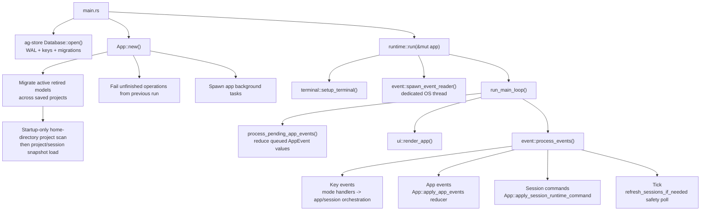
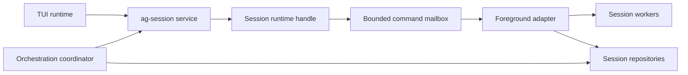
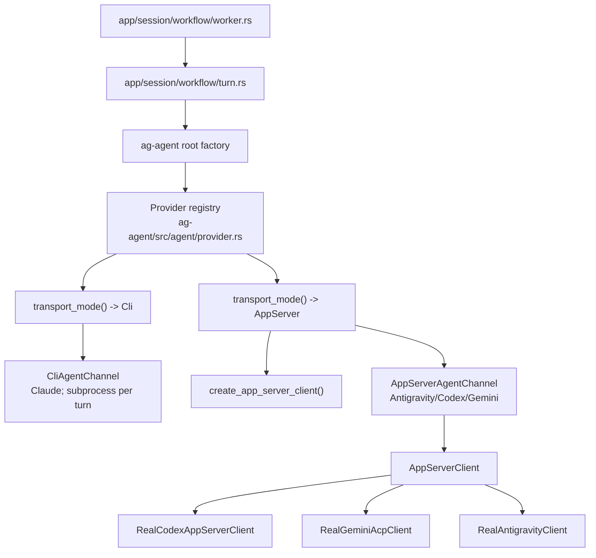

+++
title = "Runtime Flow"
description = "Goals, workspace map, runtime event flow, background tasks, and agent channel transport model."
weight = 2
+++

 This guide documents Agentty's
runtime data flows at a high level: the foreground event loop, reducer/event buses,
session-worker turn execution, merge/rebase/sync orchestration, and background tasks.
Implementation details live in the module docstrings; this page explains how the pieces
fit together.

<!-- more -->

## Architecture Goals

 Agentty runtime design is built around
these constraints:

- Keep domain logic independent from infrastructure and UI.
- Keep long-running or external operations behind trait boundaries for testability.
- Keep runtime event handling responsive by offloading background work to async tasks.
- Keep AI-session changes isolated in git worktrees and reviewable as diffs.
- Decouple agent transport (CLI subprocess vs app-server RPC) behind a unified channel
  abstraction.

## Workspace Map

| Path                      | Responsibility                                                       |
| ------------------------- | -------------------------------------------------------------------- |
| `crates/ag-forge/`        | Shared forge review-request library (`gh`/`glab` adapters).          |
| `crates/ag-git/`          | Shared git, worktree, sync, rebase, and merge library.               |
| `crates/ag-agent/`        | Shared agent provider models plus channel and transport boundaries.  |
| `crates/ag-protocol/`     | Shared structured response protocol and turn prompt payload library. |
| `crates/ag-session/`      | Shared session models, policies, and frontend-neutral lifecycle API. |
| `crates/ag-store/`        | Shared persistence contracts, SQLite adapters, and migrations.       |
| `crates/ag-tui-text/`     | Shared Markdown, HTML, mermaid, wrapping, and truncation helpers.    |
| `crates/agentty/`         | Main TUI application crate.                                          |
| `crates/testty/`          | TUI end-to-end testing framework.                                    |
| `crates/ag-xtask/`        | Workspace maintenance and automation commands.                       |
| `docs/site/content/docs/` | End-user and contributor documentation.                              |

## Main Runtime Flow

 Primary foreground path from process start
to one event-loop cycle:

```mermaid
flowchart TD
  main["main.rs"]
  db["ag-store Database::open()<br/>WAL + keys + migrations"]
  app_new["App::new()"]
  model_migration["Migrate active retired models<br/>across saved projects"]
  scan["Startup-only home-directory project scan<br/>then project/session snapshot load"]
  fail_ops["Fail unfinished operations from previous run"]
  background["Spawn app background tasks"]
  runtime["runtime::run(&mut app)"]
  terminal["terminal::setup_terminal()"]
  event_reader["event::spawn_event_reader()<br/>dedicated OS thread"]
  main_loop["run_main_loop()"]
  drain["process_pending_app_events()<br/>reduce queued AppEvent values"]
  draw["ui::render_app()"]
  process["event::process_events()"]
  key_events["Key events<br/>mode handlers -> app/session orchestration"]
  app_events["App events<br/>App::apply_app_events reducer"]
  session_commands["Session commands<br/>App::apply_session_runtime_command"]
  tick["Tick<br/>refresh_sessions_if_needed safety poll"]

  main --> db
  main --> app_new
  app_new --> model_migration
  model_migration --> scan
  app_new --> fail_ops
  app_new --> background
  main --> runtime
  runtime --> terminal
  runtime --> event_reader
  runtime --> main_loop
  main_loop --> drain
  main_loop --> draw
  main_loop --> process
  process --> key_events
  process --> app_events
  process --> session_commands
  process --> tick
```

Programmatic session creation uses the same foreground-owned runtime, but its response
is stricter than the asynchronous list refresh path: before returning a new session id,
the runtime directly reloads the active-project session snapshot. A backlog of unrelated
`AppEvent` values therefore cannot make an immediately following session command observe
the new session as missing. Structured question answers similarly claim the current
persisted question set before their continuation is queued directly on the per-session
worker, preventing cloned API clients from enqueueing the same answer set twice and
ensuring a turn entering `Question` cannot strand the accepted answer in the chat queue.
The clarification answer is appended to durable history only after the worker accepts
its continuation command; a rejected enqueue restores the claimed questions without
leaving a duplicate answer or reply-error notice for the next attempt. If the
post-create snapshot reload encounters a transient persistence failure, creation still
returns the already-durable session id and queues another `RefreshSessions` event
instead of returning an ambiguous error that could prompt duplicate creation.

 Foreground loop details:

- `run_main_loop()` drains one bounded batch of queued app events before draw so touched
  sessions sync from their live handles without a full list-wide sweep every frame. The
  batch then drains payload-bearing work into an `AppEventReductionPlan`: effects that
  must precede snapshot mutation run first, cached snapshot updates run next, and
  post-snapshot effects run last.
- `run_main_loop()` owns `PresentationState`; input measurement and `ui::render_app()`
  share its bounded `RenderCacheStore`. `App` neither constructs Ratatui frames nor owns
  render caches.
- `process_events()` waits on terminal events, app events, session-runtime commands, or
  tick, then drains a bounded batch of queued terminal events to avoid one-key-per-frame
  lag.
- Tick interval is `50ms`; metadata-based session reload fallback is `5s`.

## Data Channels

 Agentty uses five primary runtime data
channels:

- **Terminal `Event` channel** (`runtime/event.rs`): the event-reader thread forwards
  `crossterm` events into `runtime::process_events()`.
- **App event bus** (`AppEvent`): background tasks and workers send typed events into
  the `App::apply_app_events()` reducer for safe cross-task state mutation.
- **Session runtime mailbox** (`SessionRuntimeCommand`): cloneable
  `SessionRuntimeHandle` values submit commands through a bounded Tokio channel. The
  foreground runtime executes them against the live `SessionManager` and answers each
  caller through a one-shot response channel.
- **Turn event stream** (`TurnEvent`): `AgentChannel` implementations stream transient
  loader-thought and PID updates to the session turn consumer while the final transcript
  waits for the completed turn result.
- **Session runtime** (`SessionWorkerService` and `SessionHandles`): process-wide worker
  senders plus shared `Arc<Mutex<...>>` transcript, status, PID, queued-message state,
  and queued workflow-action rows. Project-scoped reloads replace only render snapshots;
  workers and handles remain available until their sessions terminate. The reducer
  re-projects live handles on `SessionUpdated` and project switches.

## App Event Reducer

 `App::apply_app_events()` is the
single reducer path for async app events. Each cycle drains queued events up to a
bounded budget, coalesces them into one `AppEventBatch` (refresh, git status, model, and
loader updates), then drains an explicit `AppEventReductionPlan`. The plan separates
ordered effects that must run before cached snapshot updates from effects that consume
the resulting snapshot afterward. Reload effects currently run before snapshot updates;
focused-review state application and persistence run afterward. Key behaviors:

- Refresh events set reload flags instead of reloading inline; the expensive
  home-directory project discovery runs only during `App::new()`.
- Git-status and review-request events carry a sync-context generation so stale
  completions are discarded after the active project or session changes.
- Diff markdown preview reads carry the selected session, path, and request generation
  in `AppEvent::DiffPreviewLoaded`; the reducer applies them only to the matching
  loading diff or help-overlay snapshot.
- Full session diffs used by Diff view, focused-review preparation, and `/apply`
  validation run in background tasks. `AppEvent::SessionDiffLoaded` carries the session
  and request generation; the reducer discards canceled or superseded completions, so
  Git work never blocks terminal redraw or input handling. Automatic review checks start
  only from completed-turn and session-status events, not unrelated per-session updates.
  A completed turn supersedes pending review and `/apply` diff continuations before
  queued diff results are reduced, and repeated `/apply` checks are deduplicated per
  session. Clearing or regenerating focused review also invalidates pending `/apply`
  continuations, whose completions revalidate the current review-ready cache generation
  before submitting an agent turn. Sessions in `Auto Edit + Auto Address Comments` reuse
  this continuation automatically when a ready review has actionable suggestions. Each
  resulting turn re-enters focused review, and an in-memory per-user-prompt counter
  stops automatic application after three turns.
- Externally merged review requests transition sessions to read-only `Merged`; only a
  successful user-triggered sync of the request's local target advances them to `Done`.
  Closed requests transition editable sessions to `Canceled`.
- Terminal statuses (`Done`, `Canceled`) drop per-session worker senders so workers can
  shut down their runtimes.

## Session Chat Rendering

The session manager schedules a bounded background process-table sample every two
seconds through `ResourceClient`. Foreground ticks reduce completed samples into a
session-keyed cache and bind each root to its first observed native creation identity
(microseconds on macOS, monotonic start ticks on Linux). The sampler checks that
identity before and after collecting accounting, discarding roots replaced during the
sample. Missing, exited (including zombie), or changed process identities invalidate
that root until the tracked PID is removed or replaced; failed samples leave the
identity intact while showing unavailable accounting. The immutable view carries those
totals to chat, whose resource row reserves the same height for painting and scroll
calculations. App-server transports announce their runtime PID before each turn attempt,
including retries and schema repair. Repair responses publish their retained PID or
clear it after shutdown. Runtime shutdown clears accounting before releasing the PID,
including during delayed retry startup. Every terminal turn error also clears the
tracked PID. Cancellation signals only CLI children; app-server cancellation uses
runtime-owned channel shutdown and never signals accounting PIDs, including during
rebase assistance. App-server one-shot assistance receives no session PID slot, so
auto-commit recovery preserves the retained chat runtime's accounting root. CLI
assistance still shares the cancellation slot.

 The session chat panel is rendered
by `crates/agentty/src/ui/page/session_chat.rs` and
`crates/agentty/src/ui/component/session_output.rs`. The durable transcript is the
ordered `session_message` rows (typed `UserPrompt`, `AssistantAnswer`, `WorkflowNotice`,
rows). Replaceable output lives in the session's typed transient-message slots instead
of render-time visibility predicates. Each slot has stable identity, typed content, an
output anchor, and an explicit lifecycle. Reducer paths upsert or retract
focused-review, workflow-feedback, queued-sync, manual-branch-publish, and
published-branch-sync slots; starting a later turn clears older turn-scoped slots in one
place. Transient bodies distinguish calm `Queued` rows from animated `Loading` rows. The
output assembler gathers every queued transient into the same block as the handle-backed
chat queue. Queued chat and worker commands reserve from one session-local submission
sequence; the output assembler sorts the combined rows by that sequence, and the worker
uses the same value to select the next runnable item.

Manual branch publishing and review-request creation return from the branch-name popup
to `AppMode::View`. Review-request creation is persisted on the per-session worker, so
an action accepted during an active turn renders at its submission position and executes
after earlier queued chat but before later queued chat. A worker-start event replaces
that row with animated publish progress; the terminal reducer event then replaces it
with inline success or failure output without changing whichever app mode is active at
completion. Successful review-request creation retracts the transient row and appends
its single-line URL result as a durable `WorkflowNotice` at the current transcript
position. If focused review already completed at the output tail, the reducer first
moves that result into completed-turn placement so the newer review-request notice
remains below it. An in-flight focused review stays at the tail and therefore appears
after the notice when it completes later. Later turns leave the durable result in its
original history position instead of reconstructing a transient between turns. The
manual task holds the same per-session branch-operation lock as completed-turn auto-push
for its full push and forge-metadata workflow. Queued review-request creation also
registers as unfinished branch work before the current turn can start automatic
publishing. Its UI and API handlers only attempt a non-blocking lock reservation while
persisting the command; when another branch action already owns the lock, they return
after queueing and let the worker wait without stalling the foreground event loop. If
turn cancellation marks a queued review-request operation canceled before it starts, the
worker emits a resolution event; the reducer retracts the `BranchPublish` slot so the
waiting row and its publish-action suppression cannot outlive the canceled command.

Queued sync uses its own replaceable slot instead of appending a waiting notice to the
transcript. Worktree validation runs while the slot remains queued. After a successful
`Rebasing` status transition, a resolution event retracts the slot as the existing
`Rebasing...` loader becomes active. Validation failures append a durable `[Sync Error]`
notice before sending the same resolution event, so waiting state never disappears
without an active state or visible result. If turn cancellation marks the queued rebase
operation canceled before execution, the worker's skip path sends that resolution event
without starting rebase work. Session-list refresh treats a failed primary row query as
non-authoritative: it keeps the current snapshots and worker senders instead of treating
the failure as an empty project and disconnecting an active queue.

Published-branch auto-push completion sends one terminal reducer event carrying its
`WorkflowNotice`. After accepting the current operation identifier, the reducer persists
the notice, retracts the matching loading slot, and projects the durable transcript
message in the same batch. Stale completions therefore cannot write a notice, and no
frame can contain both the progress row and completed notice. The in-progress auto-push
slot uses the session-output tail so a durable sync result that started the push remains
above it in chronological order; focused-review progress follows in the status tail. The
output-layout cache keys the transient-store version rather than maintaining a separate
fingerprint for every temporary channel. Assembly also records the first line of every
queued row; the paint path applies one deterministic two-second pulse to those leading
glyphs after paragraph rendering while the active Tachyon loader keeps its faster
warning sweep. Structured clarification questions render in the bottom question panel
(`AppMode::Question`), not inside the output component.

Runtime owns one shared `RenderCacheStore` for markdown, diff, and session-output layout
caches. The session-output cache keeps a bounded stable-body layer keyed by the typed
transcript's cached content hash, width, theme, queued input, and transient-message
version. Workflow-only status changes such as `Review` entering `Rebasing` reuse that
body and allocate only the dynamic status tail. Painting borrows visible slices across
that shared body and tail. Superseded entries for the same session and width are
dropped; measurement and painting share the cached scrollbar decision and resolved
layout. Mermaid parsing is cached independently of width and theme, while each preview
is painted with the current palette.

Transcript scroll keys bypass workflow action-availability checks. Consecutive scroll
keys reuse measurements within one input batch; other input events and the next runtime
cycle invalidate those measurements. The foreground drains at most 64 input events or 8
milliseconds before returning to painting, so held keys cannot indefinitely delay the
next frame. An individual render or handler still runs to completion.

## Session Turn Data Flow

 From prompt submit to persisted result:

`ag-session` provides the programmatic entry point used by terminal interactions and
future non-TUI callers. `SessionService` owns an `Arc<dyn SessionBackend>`, is
cloneable, and offers create, complete by-id lookup, send, structured question-answer,
cancellation, merge, and review-request operations. Its backend methods use shared
access, so a background coordinator does not borrow `App`.

`app/session_runtime.rs` implements that backend on `SessionRuntimeHandle`. Every call
enters a bounded mailbox and waits on its own response channel while a foreground
consumer is registered. Handles reject calls made without a registered driver and stop
waiting if its final consumer exits. The foreground event loop executes accepted
commands through `app/session_api.rs`, reusing the existing worker, cancellation, merge,
and review-request workflows without placing `App` behind an async mutex. User handles
and the coordinator handle carry distinct capabilities: the user path rejects every
managed-worker mutation, while the coordinator can relay answers, continue work, cancel,
merge, or publish through the same lifecycle workflows. Review-request commands snapshot
the session's existing branch-publish context, persist it on the per-session worker, and
resolve the API response from that command's terminal result; the foreground mailbox
remains available while publishing is queued or in flight. Lookup joins persisted
settings and ordered messages into one frontend-neutral aggregate; malformed persisted
permission modes fail lookup and inheritance instead of becoming writable defaults.
Creation is restricted to the active project while `SessionRuntime` owns a single
active-project `SessionManager`, and can copy the agent, model, permission mode,
reasoning, personality, and base-branch snapshot from another session in that project
without changing defaults for later ordinary sessions. The adapter deliberately contains
no orchestrator policy. `app/orchestration.rs` owns that sequencing: it persists typed
implementation or research task rows before approval, reads child status, report or
final answer, and token totals in one SQLite task snapshot during reconciliation, and
uses the session API mailbox only for child creation, mutation, cleanup, and a durable
roll-up submission. The terminal runtime injects the reconciliation schedule, keeping
direct timer APIs out of the coordinator. The database link from task to child makes
restart re-linking independent of branch-name parsing. Session-list refreshes load
controller progress and child adjacency in one project-wide orchestration query instead
of issuing queries for each saved session.

```mermaid
flowchart LR
  tui["TUI runtime"]
  coordinator["Orchestration coordinator"]
  api["ag-session service"]
  handle["Session runtime handle"]
  mailbox["Bounded command mailbox"]
  adapter["Foreground adapter"]
  workers["Session workers"]
  repos["Session repositories"]

  tui --> api
  coordinator --> api
  coordinator --> repos
  api --> handle
  handle --> mailbox
  mailbox --> adapter
  adapter --> workers
  adapter --> repos
```

1. Prompt mode drains presentation-owned composer state into a typed submission, or
   resolves a presentation-owned slash-menu selection. `app/prompt_intent.rs` executes
   the requested session workflow and returns typed composer/navigation effects; prompt
   mode applies those effects to `AppMode`.
1. `start_session()` (first prompt) or `reply()` (follow-up) persists the command in
   `session_operation` and enqueues it on the per-session worker.
1. The worker marks the operation `running`, checks cancel flags, verifies worktree
   isolation, and delegates to `workflow/turn.rs`, queued session sync, or queued
   review-request creation. An **InProgress** or **Rebasing** branch action can enqueue
   only through the sender already owned by that worker; it cannot lazily create another
   worker. The same in-memory chat queue accepts follow-up prompts while the worker is
   **InProgress** or **Rebasing**. Follow-up prompts and queued branch actions reserve
   one shared submission sequence, so after the active operation the worker always
   selects the earliest item across both queues. A command received during a queued chat
   turn waits for that turn, then runs before only the messages submitted after it.
1. Immediately before a chat turn, the worker resolves the persisted personality ID
   through `PersonalityCatalogClient`. The catalog scans only the session worktree's
   `.agents/agents` directory. The worker compares the resolved prompt fingerprint with
   the last successfully applied personality and prepares an active, updated, cleared,
   or unchanged personality payload.
1. `workflow/turn.rs` loads the session's permission, reasoning, response-style, and
   speed preferences, then builds a `TurnRequest`, including those settings and the
   personality payload. At the channel boundary, interactive session prompts receive
   provider-neutral style guidance; one-shot utility prompts bypass it. A pre-provider
   setup failure cleans prompt attachments, appends the error to the transcript, and
   runs the ordinary turn finalizer so resumed sessions do not remain `InProgress`.
   Otherwise it calls `AgentChannel::run_turn()`, which streams `TurnEvent` values
   (loader updates) and returns a `TurnResult`.
1. `workflow/post_turn.rs` appends the final assistant transcript output, then
   `TurnPersistence::apply(...)` transactionally stores the question payload,
   token-usage deltas, and provider conversation markers.
1. `AppEvent::AgentResponseReceived` carries the reducer projection so the active
   session updates without a forced reload. If persistence fails, the worker appends a
   recovery error and falls back to a durable-state reload. Focused-review startup
   excludes `Orchestrator` controller sessions because they do not own branch changes;
   ordinary sessions and managed implementation workers retain automatic review.
1. For orchestrator turns, validated independent subtasks, their execution kind,
   acceptance criteria, and optional implementation touched-area planning references are
   stored in `session_orchestration_task` before `AwaitingApproval`. Research and
   implementation are separate waves. Area references may overlap and do not constrain
   worker changes. The board owns plan approval; no synthetic clarification question
   represents approval. A research-only wave may atomically pass that gate when the
   global **Auto-approve Research** setting is enabled. The campaign snapshots its child
   cap from **Orchestrator Parallelism**. Approval moves proposed tasks to `Planned`,
   and the coordinator creates `OrchestrationWorker` or `OrchestrationResearcher`
   sessions up to that cap. Implementation workers retain branch ownership; research
   children skip auto-commit while still recording whether their temporary worktree
   changed. Both reject user-path mutations. Controller clarification prompts and
   deterministic plan or follow-up routing guards provide selectable options rather than
   requiring free-text recovery. A transaction claims `relayed_question_task_id` only
   when the controller has no question of its own, then mirrors that task's questions
   onto the controller. Answers resolve that exact task identity and route back through
   the privileged coordinator handle; other waiting children remain queued until the
   relay is cleared.
1. Reconciliation treats persisted child state as truth and writes live task snapshots
   to the campaign board, never to transient chat output. Interrupted creation and
   prompt-delivery failures increment a durable infrastructure retry counter and retry
   twice before settling as failed. Cascade cancellation moves the campaign to
   `Canceling` before inspection, so stale snapshots cannot fan out another worker.
   Review-ready workers with diffs park in `Reviewing` until their focused review is
   durably `Ready` or `Failed`. Actionable suggestions are atomically claimed as a
   `ReviewApplying` continuation using the same verification-gated prompt as `/apply`;
   operation IDs make delivery restart-safe, and the persisted iteration counter caps
   remediation at three worker turns. Focused-review persistence uses three stale-safe
   reducer retries with exponential backoff. If those writes remain unavailable, the
   durable managed-task and child-session state restarts an incomplete `Reviewing` task
   on the next launch. `ContinuationPending` and `ReviewApplying` tasks resume their
   outstanding continuation instead of reviewing the pre-continuation diff. Diff
   preparation failures persist `Failed` immediately. Each completed remediation
   re-enters focused review, including work continued after controller verification. A
   failed review or unresolved suggestions at the cap settle with explicit evidence for
   controller verification instead of blocking fan-in. A research child bypasses focused
   review: turn finalization archives its observed diff, then reconciliation captures
   its latest full assistant answer into a bounded `research_report`, cancels the
   managed child to reclaim its worktree and branch, and settles the task as `Reported`.
   Any observed diff becomes durable inspection evidence plus a discard warning and is
   never eligible for integration.
1. Once every task settles, the campaign claims `Verifying`, increments its verification
   generation, and submits one hidden, idempotent coordinator operation keyed by that
   generation. Its structured envelope carries the campaign goal, criteria, branch,
   final result, focused-review outcome, diffstat, token totals, integration order, and
   a persisted comparison of expected and changed paths computed through
   `GitClient::diff_changed_files()`. The comparison is review context rather than a
   pass/fail gate; tasks without area references persist an unchecked result even when
   their diff contains changed files. The controller emits typed per-task verdicts;
   persistence admits only explicit passes to `AwaitingIntegration`, while flags or
   missing verdicts remain parked. Research tasks instead contribute the bounded full
   report inside an inert-data boundary and remain `Reported`; only a pass verdict makes
   that status integration-settled. The same controller verification turn can propose a
   following implementation wave, which returns the campaign to `AwaitingApproval`.
   Re-emitting a settled implementation task key queues a visible continuation on the
   same child regardless of changed area references. The continuation transaction
   replaces the persisted area references, clears prior comparison evidence, and the
   coordinator includes the new references in the resumed worker prompt. It also resets
   the task's review iteration plus other unintegrated passes to `Ready` and returns the
   campaign to `Running`; newly keyed work is persisted as `Proposed` and parks on
   `AwaitingApproval`. Every controller turn receives a bounded, agent-only JSON
   snapshot with task keys for routing and touched areas for planning context, allowing
   review findings to reach completed workers without relying on remembered plan
   details. Re-emitting a reported research key clears the prior report and starts a new
   temporary child. The snapshot omits instruction-bearing titles and criteria, marks
   truncated metadata explicitly, and is treated as inert routing data.
1. Pressing `a` at `AwaitingIntegration` first opens a binary destination choice. The
   selected `integration_approach` and `Integrating` transition are persisted atomically
   so restart recovery cannot switch destinations. `Integrating` then serializes local
   merges or review-request publication through the coordinator session service.
   Successful managed merges persist the final patch as `session.archived_diff` before
   cleanup removes the worker worktree and local branch. Published tasks become
   `ReviewRequested`, retain the forge-linked branch, and keep the orchestration active
   until review sync moves the child session to `Merged`; reconciliation then advances
   the task to `Integrated`. A child moved to `Canceled` by closed-review sync advances
   to `IntegrationFailed` with a durable explanation, keeping the campaign active for
   follow-up. Other failures also remain durable and visible. Once every task is
   integration-settled, one transaction marks both the campaign and disposable
   controller `Done`; no second controller report turn is needed. A one-way detach
   transaction instead clears both task links and changes the worker role back to
   `Worker`.
1. When `a` requests the session-type selector, the app asks `GitClient` to verify the
   effective pre-commit hook whenever the project contains `.pre-commit-config.yaml` or
   `.pre-commit-config.yml`. A missing executable hook opens a warning overlay with
   installation commands and future-enforcement guidance. `Enter` continues to the
   selector; `Esc` or `q` returns to the list without creating a session.
1. Auto-commit keeps one evolving commit on the session branch: the first file-changing
   turn creates it, later turns regenerate the message from the cumulative diff with the
   project's `Default Fast Model` and amend `HEAD`; an empty amend drops the reverted
   commit. After a successful normal commit, the app checks hook readiness again and
   persists the first copy of each distinct `[Commit Warning]` when configured
   validation did not run, avoiding repeated identical notices across later turns. Git
   commands and agent subprocesses inherit `GIT_OPTIONAL_LOCKS=0` so read-only
   inspection does not write the index or leave optional locks on interruption. Required
   index writes retry with up to five seconds of waiting for an active writer to finish.
   Persistent index-lock failures stop after the Git layer's bounded retries and persist
   recovery guidance without invoking commit assistance or deleting the lock.
   Installed-hook failures continue through normal commit error handling. The session
   title is synced from the commit text. Orchestrator controllers skip diff refresh,
   commit, publish, sync, and merge work. Research children refresh diff evidence but
   skip commit and every branch-integration action; only implementation workers own
   branch changes.
1. If the session already tracks a published upstream branch and no chat message or sync
   operation is queued, a per-session branch-operation guard transfers to the detached
   auto-push until it finishes. A sync request tries to reserve an idle guard while it
   persists and queues the operation, but never waits for an existing owner on the
   foreground event loop. The session worker acquires the guard before rebase execution,
   so a request is observed before publish starts or waits behind an active publish
   while the terminal remains responsive. Post-rebase auto-push retains the same guard,
   preventing a subsequent sync from starting until that publish finishes. After a
   successful push, linked review-request and commit metadata are resolved and
   refreshed. Agentty reads the current remote title and description after each
   successful push and sends them with the generated commit metadata through one
   semantic reconciliation prompt. The prompt keeps the title byte-for-byte stable
   unless the primary objective changed materially and updates the description while
   retaining intentional user additions such as issue links, checklists, instructions,
   and context. No metadata baseline is persisted. A proposed description that omits any
   substantive current line is rejected. Before editing, the forge adapter reads the
   remote fields again and applies each changed field only if it still matches the value
   used during reconciliation. This is best-effort concurrent-edit protection: GitHub
   and GitLab metadata updates have no atomic version precondition, so a manual edit
   made after the final read can still be overwritten. Lookup or evaluation failures
   append the existing warning notice instead of being discarded. The push result is
   persisted as a durable transcript notice and atomically replaces the matching
   transient progress row when the reducer applies the terminal sync event.
1. Completed stacked-parent turns fan out `SessionCommand::Rebase` to review-ready
   materialized children so child branches replay onto the latest parent branch.
1. Diff metadata is refreshed before the final status becomes `Review` or `Question`
   (failures return to `Review`). Successful refreshes persist line totals, size, and
   explicit empty/present state so binary and metadata-only diffs remain discoverable.
   Failed refreshes persist unknown availability without erasing the last known totals,
   allowing the diff view to surface its Git diagnostic. A writable-worktree open first
   changes durable and loaded availability to unknown, since external edits can make a
   previously empty diff stale. A durable invalidation failure prevents the tmux window
   from opening, so restart cannot restore a stale empty state after external edits.
   When a turn completes while another project is active, the foreground reducer loads
   the persisted session target, atomically marks its focused review as pending, and
   starts diff preparation without adding that session to the active-project snapshot.
   Captured folder, review-agent, and diff-source inputs let preparation continue if a
   project switch unloads an already-started session. A late completion event for a
   deleted session therefore cannot recreate an orphaned trigger. The same marker is
   written when the response arrives before the loaded session's final `Review`
   transition. Transient write failures retain the in-memory trigger and retry through
   the event reducer with bounded backoff. Startup and project switching reload pending
   triggers for the active project after its session snapshots reload. An automatic
   review with no diff clears the durable marker, so switching projects or restarting
   cannot drop or endlessly replay the review.

### Operation Lifecycle and Recovery

 Turn execution is durable and
restart-safe:

- Before enqueue: insert `session_operation` row (`queued`).
- Idempotent coordinator turns claim a stable operation ID; an existing queued, running,
  or completed row is already accepted, while a failed or canceled attempt can be
  reclaimed after recovery.
- Worker transitions: `queued -> running -> done/failed/canceled`.
- Cancel requests are persisted and checked before command execution.
- On startup, active sessions across every saved project are migrated from retired model
  ids to their current provider/model replacements before project-scoped snapshots load.
- On startup, recovery loads unfinished operations, aborts stale interrupted-rebase
  metadata, resets impacted sessions to `Review`, then fails the operations with reason
  `Interrupted by app restart`. Each step must succeed before the next begins. A storage
  or Git failure stops startup before any sessions are admitted, preserving unfinished
  operation rows so the next startup can retry recovery. Pending post-merge
  stacked-child syncs are requeued only after this recovery completes.

### Status Transition Rules

 Runtime status transitions enforced by
`Status::can_transition_to()` or explicit cancellation paths:

- `Draft -> InProgress` (first prompt)
- Draft session in `Draft` status -> `Canceled` (list-mode cancel before first turn)
- `Review/Question -> InProgress` (reply)
- Root `Review/AgentReview -> Review` (forked session snapshot opens as a new
  review-ready session)
- `Review -> Queued -> Merging -> Done` (local merge queue path for sessions without a
  linked review request)
- `Review/AgentReview -> Rebasing -> Review/Question` (session sync path; starting from
  `AgentReview` cancels pending focused-review output)
- `InProgress -> Rebasing -> Review/Question` (session sync requested during a running
  turn is queued on the session worker and starts after the active turn)
- `Review/Question -> Canceled`
- `InProgress -> Review` (user stops the current turn)
- `InProgress -> Canceled` (list-mode cancel stops the running turn)
- `InProgress/Rebasing -> Review/Question` (post-turn or post-sync)

Stacked-session gates are enforced before branch work starts: a stacked draft
materializes only when its parent is review-ready and no stack member is busy; parent
merge-queue and slash-command branch work are blocked while a materialized child remains
linked; parent sync and replies are allowed when materialized children are idle. All
checks are computed from one stack snapshot so parent, child, and sibling decisions
share the same busy state.

## Agent Channel Architecture

 Session workers are transport-agnostic through
`AgentChannel`:

```mermaid
flowchart TD
  worker["app/session/workflow/worker.rs"]
  turn["app/session/workflow/turn.rs"]
  factory["ag-agent root factory"]
  provider["Provider registry<br/>ag-agent/src/agent/provider.rs"]
  cli_mode["transport_mode() -> Cli"]
  cli_channel["CliAgentChannel<br/>Claude; subprocess per turn"]
  app_server_mode["transport_mode() -> AppServer"]
  app_server_client["create_app_server_client()"]
  app_server_channel["AppServerAgentChannel<br/>Antigravity/Codex/Gemini"]
  client_trait["AppServerClient"]
  codex_client["RealCodexAppServerClient"]
  gemini_client["RealGeminiAcpClient"]
  antigravity_client["RealAntigravityClient"]

  worker --> turn
  turn --> factory
  factory --> provider
  provider --> cli_mode
  cli_mode --> cli_channel
  provider --> app_server_mode
  app_server_mode --> app_server_client
  app_server_mode --> app_server_channel
  app_server_channel --> client_trait
  client_trait --> codex_client
  client_trait --> gemini_client
  client_trait --> antigravity_client
```

 Key types
(`crates/ag-agent/src/channel/contract.rs`, re-exported by the `ag-agent` crate root,
with prompt payloads owned by `ag-protocol` and re-exported through
`domain/turn_prompt.rs`):

| Type               | Purpose                                                  |
| ------------------ | -------------------------------------------------------- |
| `TurnRequest`      | Turn inputs, permission mode, settings, and personality. |
| `TurnContinuation` | Fresh, replay, or provider-resume context.               |
| `TurnEvent`        | Thought, completion, failure, or PID event.              |
| `TurnResult`       | Assistant output, usage, and provider id.                |
| `AgentRequestKind` | Start, resume, account-read, or utility intent.          |

 Managed-runtime providers return
a `provider_conversation_id` in `TurnResult`. Post-turn application persists it, along
with an instruction-bootstrap marker. The next worker turn constructs one
`TurnContinuation`, so channels receive only valid combinations for a fresh request,
transcript replay, or native provider resume and can choose between resending the full
prompt contract and a compact reminder.

Bootstrap and replay requests include the active personality after the protocol
instructions. Delta-only requests include it only when the selection or prompt body
changed, and emit a clear marker when the personality was removed. Successful turn
persistence records the applied ID and prompt fingerprint so retries do not advance the
delivery state prematurely.

Codex keeps its app-server runtime resident between turns. Antigravity likewise keeps
one `agy --input-format stream-json` process resident, sends each prompt as an NDJSON
user event, and persists the native conversation ID for recovery. Gemini ACP shuts down
after each completed turn and replays the persisted transcript when a follow-up starts,
so review-ready sessions do not accumulate idle Gemini processes. All managed runtimes
run in isolated process groups; shutdown terminates the runtime and any tool or MCP
descendants it spawned.

 Session isolation guards:

- Before every worker-dispatched turn, `workflow/isolation.rs` verifies the session
  folder exists, is checked out on the expected `wt/<hash>` branch, and resolves to a
  linked worktree with a distinct main checkout.
- The worker snapshots the main checkout's tracked-file git status before each turn and
  inspects that status again after the turn. It appends a `[Main Checkout Warning]`
  transcript notice only when the status changed and remains dirty, so clean `HEAD`
  movement from parallel session merges and unchanged pre-existing dirt do not add
  transcript noise.
- Merge and `sync main` workflows require a clean target checkout before changing
  base-branch state.
- Provider permission policies are scoped per `TurnRequest`. Ordinary Codex turns run
  with a non-interactive approval policy and `dangerFullAccess` sandbox policy so their
  effective command permissions match Claude auto-edit, including tools that cannot run
  inside an OS sandbox. Agentty immediately declines MCP elicitations and grants no
  additional permission requests so an app-server request cannot leave the turn waiting
  for interactive input. Codex tool input requests receive an empty answer set for the
  same reason. Claude turns receive session-scoped settings that deny writes to the
  known main checkout while retaining Claude Code's unsandboxed command fallback, Gemini
  ACP requests prefer one-shot allow options, and CLI processes run from the session
  worktree process directory. Researcher requests instead carry
  `PermissionMode::ReadOnly` through CLI and app-server launch boundaries. Codex selects
  `readOnly` sandbox payloads and rejects command or file-change approvals; Claude
  exposes only inspection tools in plan mode; Gemini starts with sandboxed plan approval
  and cancels ACP permission requests; and Antigravity starts in sandboxed plan mode
  without its permission-bypass flag. The persistent runtime identity includes the
  permission mode, preventing an auto-edit process from being reused for research.

## Agent Interaction Protocol Flow

 Provider output is normalized to
one structured response protocol (`answer`, `questions`, `review_comment_outcomes`,
`subtasks`, and `verification_verdicts`):

1. Prompt builders in `crates/ag-agent/src/agent/` ask `crates/ag-protocol/src/` to
   prepend the shared protocol preamble with a self-descriptive JSON schema. Stateless
   CLI turns resend it every turn; persistent managed-runtime turns reuse a compact
   reminder when the provider context already received the full bootstrap, and replay
   the transcript when provider context was lost. Transcript replay frames the new
   prompt as a follow-up in the whole-session context, so rollback wording applies to
   changes made during the Agentty session unless the user explicitly says otherwise.
   `crates/ag-protocol/src/` owns the shared response model, schema, parser diagnostics,
   protocol prompt envelopes, repair prompts, and turn prompt payloads.
1. Session-title generation bounds the persisted original request, current title, and
   latest request independently at UTF-8 boundaries so utility prompts remain focused
   even when the durable session transcript is large.
1. Channels emit transient loader updates as `TurnEvent::ThoughtDelta` values while the
   turn runs; assistant transcript output is appended once from the final parsed result.
1. Transports that enforce the schema natively receive it through
   `SchemaRequiredPolicy`. Codex needs every property listed in `required`; validators
   that enforce `required` literally, such as the Antigravity and Claude `--json-schema`
   transports, receive `MinimumProtocolKeys` so only the protocol's minimum fields are
   mandatory and a reply that omits other optional fields still validates. Ordinary
   turns leave `review_comment_outcomes` empty; review-comment prompts provide the only
   accepted thread-ID allowlist.
1. Final output must parse as the shared protocol JSON object. Claude, Gemini, and Codex
   session turns fail closed on invalid output. Antigravity uses native bidirectional
   `stream-json` with the same schema enforcement and fail-closed protocol-repair
   behavior. Agentty writes one NDJSON user event per turn, extracts the final protocol
   object from `result.structured_output` or `result.response`, and persists the
   returned `conversation_id`. Completed-step usage supplies per-turn token counts
   because the terminal result counters are cumulative across the native conversation.
   Claude result events prefer the schema-validated `structured_output` value over the
   legacy string-valued `result` field before protocol parsing.
1. Turn errors are rendered into the session transcript, so no failure surface
   reproduces provider output. A rejected payload surfaces the parse reason plus
   *derived* diagnostics only (response sizing, parser location, visible top-level
   keys); the payload text itself is never quoted. Live `TurnEvent::ThoughtDelta`
   updates carry no provider output either. The transcript notice is length-capped as a
   backstop. The one deliberate exception is a CLI process that exits non-zero: its
   error keeps a bounded tail of the provider stream, because a crashed provider's own
   stderr (authentication failure, missing binary) is the only thing that explains the
   exit.
1. Provider-specific transport, stdin-vs-argv prompt delivery, strict parsing policy,
   and thought-phase handling are centralized in the provider registry
   (`crates/ag-agent/src/agent/provider.rs`).

## Clarification Question Loop

 Question-mode loop:

1. The worker receives a final parsed response containing clarification `questions`,
   persists them, and sets session status `Question`.
1. The reducer switches the active view to `AppMode::Question` when that session is
   focused.
1. The user answers each question (a blank free-text answer stores `no answer`).
1. Runtime builds one `Clarifications:` follow-up prompt listing each question and
   answer, and submits it as a normal reply turn.

Pressing `Ctrl+C` instead ends question mode immediately, restores the session to
`Review`, and does not send the generated clarification reply. The status transition
also wakes the session worker so branch actions that were queued before the question
continue in their original order.

## Background Task Catalog

 Background execution paths and
their triggers:

- **Terminal event reader thread** (runtime startup): polls crossterm and forwards
  terminal events into the runtime loop.

- **Project sync orchestrator** (startup, project switch, ticks, list-mode `s`): owns
  one application command queue that serializes read-only `git fetch`, ahead/behind
  snapshots, merge-conflict probes for divergent session branches, review-request
  refreshes, and manual pull/rebase/push commands. Conflict probes use
  `git merge-tree --write-tree` through `GitClient`, so they do not read or change the
  index or worktree. Git versions without `--write-tree` perform the same probe in a
  disposable local shared clone, leaving the managed repository untouched. Forge CLI
  calls are bounded to 30 seconds and cancel their subprocess on timeout so one
  unavailable provider cannot retain the queue indefinitely.

- **Version check** (startup and hourly): reports npm update availability and runs at
  most one automatic install for each successfully installed version during the current
  process. Version lookup and installation subprocesses are cancelled at bounded
  deadlines, and failed or timed-out installs remain eligible for the next hourly check.

- **Agent CLI discovery and refresh** (startup): runs bounded provider updates and
  version probes off the async runtime. Antigravity compatibility is cached with the
  validated executable's filesystem fingerprint. Turn construction reads that snapshot
  without launching `agy --version` and fails closed if the executable path or metadata
  changed, so the next discovery cycle or restart must revalidate it.

- **Per-session worker loop** (first command enqueue): serializes all turn commands per
  session and manages channel lifecycle.

- **Per-turn event consumer** (every turn): consumes the `TurnEvent` stream and
  coalesces loader updates.

- **CLI stdout/stderr readers** (every CLI-backed turn): stream subprocess output into
  loader updates and final buffers.

- **App-server stream bridge** (every app-server turn): bridges provider stream events
  into the unified turn event stream.

- **Clipboard image persistence** (prompt image paste): reads a copied PNG file,
  clipboard image, or PNG path from `ag-clipboard` via `spawn_blocking`, stores it under
  `AGENTTY_ROOT/tmp/<session-id>/images/`, and inserts an inline `[Image #n]`
  placeholder. The backend supports macOS pasteboard, X11 reads, and Wayland reads via
  `wl-paste`; missing or unsupported backends report an inline paste error.

- **Session title generation** (provisional start or resume title): claims an ordered
  candidate, loads the persisted original request, current title, and latest request,
  then runs a one-shot title prompt over that stable session context. The original
  request anchors the overall goal while later requests may establish or clarify it
  without turning narrow follow-ups into the whole title. The one-shot uses read-only
  permissions for every session role, including temporary orchestration researchers.
  Provider submission failures are logged and retried once. Candidates equivalent to
  persisted request text after case, punctuation, and line normalization are rejected.
  Issued and accepted candidate generations are tracked separately: empty responses
  leave older usable candidates eligible, newer accepted candidates supersede older
  ones, and draft edits or commit-derived titles invalidate every outstanding candidate.
  Session refreshes hydrate transcript-scale detail for the session identified by the
  active application mode, independently of the session-list table selection. Reply
  classification also requires `Draft` status before an empty prompt can be treated as
  the first message, so lightweight list rows cannot replace an existing title.

- **At-mention file indexing** (`@` in prompt or question input): lists session files
  for the mention picker, falling back to the project root for unstarted drafts.

- **Session-size refresh** (`Enter` on a session in list mode): recomputes the diff-size
  bucket off the key-handling path.

- **Branch-publish action** (session view `p`): returns to interactive session chat,
  then pushes with `--force-with-lease` and creates or refreshes the forge review
  request in the background; progress and completion render inline for that session,
  while the shared per-session branch-operation lock serializes it with auto-push.

- **Deferred session cleanup** (session delete): removes the worktree folder and branch
  after database deletion.

- **Session fork** (root session view `F`): creates a new worktree branch from the
  source session branch, copies `session_message` rows in one transaction, clears
  provider/review-request/stack linkage and source diff metadata, refreshes diff state
  directly from the new worktree, and marks the fork for one-time transcript replay
  before its first reply. Stacked child sessions do not expose this action.

- **Focused review assist** (entering review): runs the review prompt with the diff and
  saved user/agent chat history through the provider-enforced read-only permission mode,
  then stores the result or error. The provider receives the focused-review schema
  directly, and any protocol repair retries against that same schema before the result
  is normalized for storage. Gemini utility prompts use standard ACP startup and cancel
  every mutation permission request, avoiding plan-mode sandbox initialization;
  persistent read-only research sessions continue to use sandboxed plan mode.

- **Sync-main workflow** (list-mode `s`): captures an immutable project ID, operation
  ID, path, branch, and review-target snapshot before queueing pull/rebase/push through
  the sync orchestrator. Progress is rendered independently from `AppMode`, with
  assisted conflict resolution retaining the same operation identity.

- **Session merge task** (merge confirmation): rebase, squash merge with the session
  commit message, worktree cleanup.

- **Session sync task** (view-mode `r`, stacked-parent fan-out): queues without waiting
  for branch-operation ownership on the foreground event loop, then acquires that
  ownership in the session worker before assisted rebase of the session branch;
  post-merge stacked-child syncs use `git rebase --onto` with the recorded parent commit
  as the old base.

Title generation, focused review, commit-message generation, and conflict assistance
submit owned `OneShotRequest` values through `OneShotClient`. Its production
implementation owns provider routing, CLI/app-server selection, protocol repair, runtime
cleanup, and usage aggregation; app workflow tests inject `MockOneShotClient` without
constructing provider commands. Codex app-server turns ignore `commentary` assistant
items when selecting completed output and prefer a nonblank terminal agent message
carried by the matching `turn/completed` payload. A blank completion fallback cannot
replace valid final output received earlier in the turn.

## Sync, Merge, and Rebase Flows

 Project and session git workflows
use shared boundaries (`GitClient`, `FsClient`, assist helpers) with distinct
orchestration paths:

- `sync main`: selected project branch pull/rebase/push with optional assisted conflict
  resolution, serialized through the shared sync orchestrator and an app-owned
  base-checkout mutation scheduler. Same-project duplicates coalesce; requests captured
  for other projects enter a FIFO queue and retain their immutable path, branch, model,
  review targets, project ID, and operation ID. Existing active or queued merge work has
  priority and rejects a new sync with retryable guidance. Merge queue draining rechecks
  the active-project sync guard before mutating its base checkout, and sync completion
  resumes merge work before the next queued project sync. Every progress and completion
  event carries the captured project and operation IDs, so project switching cannot
  redirect Git work, and a stale completion cannot replace a newer status or reconcile
  superseded review and merged-session state. The lifecycle state is separate from
  `AppMode`; navigation and unrelated overlays therefore remain active. Terminal display
  state expires after ten seconds, independently of deferred project reconciliation.
  Base-checkout operations for the owning project—session creation or draft start,
  merge, and rebase—fail with retryable workflow guidance until the operation settles,
  while isolated session turns and other projects remain usable. If completion arrives
  while another project is active, project-scoped review and merged-session
  reconciliation is retained in memory and applied after switching back.
- Session merge: queue-aware workflow for sessions without a linked forge review request
  — assisted rebase first, squash commit into the base branch reusing the session-branch
  `HEAD` commit message, then worktree cleanup and status `Done`. Once a review request
  is linked, the shared merge-eligibility policy hides the local action and rejects
  direct queue attempts.
- Session sync: assisted rebase onto the local base branch (unpublished) or the
  published upstream's remote base ref (published). Rebase-conflict prompts run through
  the existing session channel so the provider keeps conversation context while Agentty
  owns staging, invokes the effective `pre-commit` hook against the resolved index, and
  runs `git rebase --continue`. Hook rejection enters the existing assisted-rebase abort
  path before any post-rebase auto-push can start.
- Review-request publish: push with `--force-with-lease`, then create or refresh the
  forge review request through `ReviewRequestClient`; a first publish to a custom branch
  rejects a currently existing remote ref. When the ref is absent, the push supplies an
  explicit empty lease so a stale local remote-tracking ref cannot block recreation and
  a concurrent remote creation still wins. Only open same-branch requests are reused.
  The task does not own the active app mode, so its completion cannot interrupt later
  navigation. It holds the same branch-operation lock as post-turn auto-push, so
  overlapping requests queue rather than running concurrent force-pushes.
- Background review-request sync: review-ready sessions with a published branch or
  linked request are polled; merged requests persist the reviewed session-head hash and
  move the session to read-only `Merged`, while closed requests move to `Canceled`.
  `Merged` remains in the Active group and background refresh never archives, cleans up,
  or restacks it. The manual target-branch sync path refreshes forge state before its
  git work and applies terminal review updates only after sync succeeds. It then
  finalizes matching `Merged` sessions by durably detaching stacked children, moving the
  parent to `Done`, emitting child-restack work, and scheduling tracked worktree
  cleanup. The successful `SyncMainOutcome` owns the exact synced branch, so the event
  model cannot represent success without a finalization target. Restack or archival
  persistence failures leave the parent safely in `Merged` and are counted in the
  non-modal sync completion status for retry. A failed sync or a successful sync of
  another branch leaves the merged stack unchanged. Cleanup-critical git subprocesses
  are cancellable and bounded to 30 seconds; confirmed shutdown shares a five-second
  grace period across all tracked cleanup tasks before canceling unfinished work.
  Session view also loads comments on demand for its linked review request:
  `AppMode::DiffLoading` renders a cancelable page while the full diff loads, then
  `AppMode::Diff` renders its Files and Comments sidebar immediately with a
  comment-loading state. The loading surface uses an explicit Files placeholder instead
  of parsing its status text as an empty diff. A failed interactive load restores its
  source mode with a transient workflow notice; completed file and inline comment drafts
  move into a per-session app-state cache when Diff mode closes, move back into
  `AppMode::Diff` when it reopens, and are discarded when that session starts a new
  turn. A queued comment batch remains cached until its worker dequeues it, so
  retracting the queued message with `Ctrl+C` preserves the comments; during managed
  merge cleanup, `TaskService` falls back from a repository-unavailable live diff to the
  archived diff already persisted for that session. Other Git failures remain visible
  diagnostics. `TaskService` resolves the session worktree remote through the injected
  git/forge boundaries, falls back to the persisted review-request URL after
  terminal-session worktree cleanup, and uses the matching `AppEvent` to update only the
  still-open Diff workspace or its help overlay. Inline code context is derived from the
  already loaded current diff. From a reply-capable session, `Space` toggles an
  actionable thread in the evaluation batch, and `Enter` renders every selected thread
  into one `TurnPrompt`; outdated threads include an explicit stale-anchor marker. The
  selected forge thread IDs are recorded in turn metadata. Post-turn handling requires
  exactly one allowlisted, nonblank outcome per selected thread and rejects an
  incomplete or duplicated batch before any forge mutation. Accepted outcomes, their
  original replies, and random per-thread reply tokens commit in the same SQLite
  transaction as the completed-turn metadata before auto-commit starts. A failed
  auto-commit prevents the published-branch push and discards the selected batch before
  a later turn can push unrelated changes. Successful auto-commit binds each newly
  inserted operation to the full fix commit SHA. After every successful push, the worker
  requires that commit to exactly match pushed `HEAD`; later descendants and rewritten
  commits are discarded before forge access. An operation whose commit binding was
  interrupted remains pending and is replaceable by a fresh agent turn, while a bound
  operation continues to retain its original reply. Immediately before a forge reply,
  the worker marks the durable operation as posting. Recovery trusts a matching
  tokenized reply only when that flag is set, which closes the reply-success/crash
  window without treating a collaborator-authored imitation as Agentty's audit reply.
  The row is deleted after the requested forge effects finish. Bound operations retain
  the first accepted reply when a later agent turn reports a different one. The worker
  resolves only `fixed` operations through `ReviewRequestClient`; `no_change_needed`
  operations remain open, and failed commits or pushes never mutate forge thread state.

## Persistence and Recovery Boundaries

 Persistence invariants that shape
runtime flow:

- DB opens with SQLite WAL and `foreign_keys = ON`, then embedded migrations run at
  startup.
- Review-comment resolution operations are durable, session-owned rows committed with
  their completed-turn metadata and later bound to the successful fix commit. A pre-post
  flag and unguessable reply token make post-push forge effects resumable across process
  shutdown without relying on in-memory agent output, while exact pushed-tip matching
  rejects outcomes after any later commit. Binding-pending rows remain durable until a
  fresh review turn replaces them.
- Session snapshots in memory are authoritative for rendering; DB is authoritative for
  restart recovery.
- Shared session handles provide low-latency updates between DB reloads.
- Event-driven refresh is primary; metadata polling is fallback safety only.
- External integrations (`GitClient`, `ReviewRequestClient`, `AppServerClient`,
  `AgentChannel`, `EventSource`, `FsClient`, `TmuxClient`) isolate side effects and
  enable deterministic tests.
