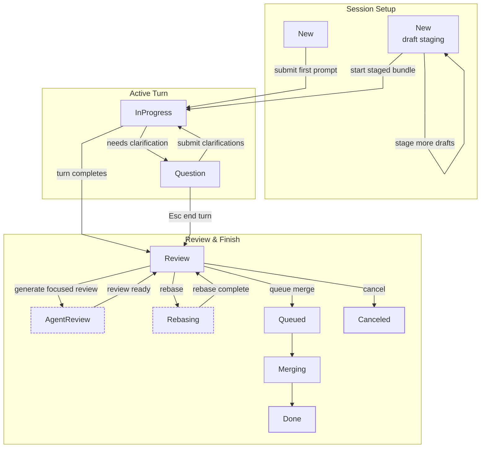

+++
title = "Workflow"
description = "Interface layout, session lifecycle, slash commands, and data location."
weight = 1
+++

<a id="usage-workflow-introduction"></a>
This page covers the Agentty interface layout, session lifecycle, session sizes,
slash commands, and data location.

For keyboard shortcuts by view, see [Keybindings](@/docs/usage/keybindings.md).

<!-- more -->

## Interface Layout

<a id="usage-interface-layout"></a>
Agentty organizes its interface into four tabs, accessible with `Tab`:

| Tab | Purpose |
|-----|---------|
| **Sessions** | List, create, and manage agent sessions. When a project is active, this tab appears as `Sessions (<project-name>)`. |
| **Projects** | Select between projects (git repositories) in a split view: Agentty info (ASCII art, version, short description) on top, project table below. Agentty skips stale entries whose project directories no longer exist. |
| **Stats** | View usage statistics. |
| **Settings** | Configure reasoning level, smart/fast/review model defaults, the optional `Last used model as default` smart-model mode, the session commit coauthor trailer, and `Open Commands` for the active project. |

In session chat view, the status and session title render in a dedicated
header row above the output panel. A second metadata row shows the persisted
size bucket, current `+added` / `-deleted` line totals, the cumulative
active-work timer, and token usage. The timer keeps ticking only while the
session is actively working and freezes between turns.

The grouped **Sessions** tab also shows that same cumulative active-work timer
in its own `Timer` column, so in-progress rows keep ticking live there while
completed sessions retain their frozen total.

The footer always shows the active directory. When the current branch tracks an
upstream, the footer branch badge renders `local -> remote`, for example
`main -> origin/main`. When you open an active session, the footer switches to
that session directory and shows the session branch's ahead/behind counts
relative to its base branch (for example `main`). If the session branch already
tracks a remote, the footer also shows a second ahead/behind segment using the
compact form `[stats] main | [stats] local -> remote`. Before first publish,
the same second segment still renders for the local branch as `[stats] local`.

## Session Lifecycle

<a id="usage-session-lifecycle"></a>
Session statuses and what you can do in each state:

| Status | Description | Available actions |
|--------|-------------|-------------------|
| **New** | Session created but not yet started. Regular sessions submit their first prompt immediately; draft sessions can stage multiple prompts locally first. | `Enter` compose first prompt or add draft, `/` open slash-command composer, `s` start staged draft session, `m` add to merge queue, `r` rebase, `o` open worktree, scroll, help |
| **InProgress** | Agent is actively working. | `o` open worktree, scroll, help |
| **Review** | Agent finished; changes are ready for review. | `Enter` reply, `/` open slash-command composer, `m` add to merge queue, `r` rebase, `o` open worktree, `p` publish branch, `d` diff, `f` focused review, `l` launch/open follow-up task, `[` / `]` select follow-up task, scroll, help |
| **AgentReview** | Agentty is generating the focused review output in the background. | `Enter` reply, `/` open slash-command composer, `m` add to merge queue, `o` open worktree, `p` publish branch, `d` diff, `f` focused review, `l` launch/open follow-up task, `[` / `]` select follow-up task, scroll, help |
| **Question** | Agent requested clarification before continuing. | question input mode (`Enter` submit, `Tab` toggle chat scroll, `Esc` end turn) |
| **Queued** | Session is waiting in the merge queue. | read-only view (`q`, scroll, help) |
| **Rebasing** | Worktree branch is rebasing onto the base branch. | `o` open worktree, scroll, help |
| **Merging** | Changes are being merged into the base branch. | read-only view (`q`, scroll, help) |
| **Done** | Session completed, merged, and its worktree checkout was removed. | `t` toggle summary/output, `l` open follow-up task, `[` / `]` select follow-up task, scroll, help |
| **Canceled** | Session was canceled by the user and its worktree checkout was removed. | read-only view (`q`, scroll, help) |

Settings values are stored per active project. Switching projects reloads that
project's `Reasoning Level`, `Default Smart Model` mode (explicit model or
`Last used model as default`), `Default Fast Model`, `Default Review Model`,
`Coauthored by Agentty` toggle, and `Open Commands`.

When a session enters **Review**, Agentty starts generating the focused review
in the background. While that review-assist job is running, the session
temporarily shows **AgentReview** and keeps the review-oriented shortcuts
available, except `r`, which stays hidden until the session returns to
**Review**.
Pressing `f` appends the cached review directly into the normal session output
panel when it is ready, or shows a loading message there while generation is
still running. That appended review remains visible when you leave and reopen
the session, including after round-tripping through `d` diff mode, and it is
cleared when you submit the next prompt.
Pressing `/` from an editable session view opens the same composer with a
prefilled `/` so you can pick a slash command without typing the leading
character first.

When a completed turn emits `follow_up_tasks`, the session view renders them as
a separate follow-up section. The selected task shows `[Launch]` until it has
started a sibling session, then switches to `[Open]` so you can jump back to
that linked sibling later. Use `l` to launch or open the selected task, and
use `[` / `]` to move between tasks when multiple follow-up tasks are present.

After each successful turn with file changes, Agentty keeps the session branch
at one evolving commit. It regenerates that commit message from the cumulative
session diff using the active project's `Default Fast Model`, applies the
active project's `Coauthored by Agentty` setting to the final commit trailer,
amends `HEAD`, and refreshes the session title from the same commit text
before merge begins. If the auto-commit needs agent assistance to recover from
a git failure, that recovery prompt also uses the `Default Fast Model`. Once
the session reaches **Done**, Agentty rewrites the persisted summary into
markdown with a `# Summary` section sourced from the final agent
`summary.session` value and a `# Commit` section sourced from the canonical
squash-merge commit message.

When a session enters **Merging**, Agentty reuses the session branch `HEAD`
commit message for the final squash commit on the base branch. Merge still
stops and returns the session to **Review** if rebase or squash-merge git steps
fail, but it no longer runs a separate merge-only commit-message prompt.

When `Open Commands` in Settings contains multiple entries (one command per
line), pressing `o` opens a selector popup (`j`/`k` to move, `Enter` to open,
`Esc` to cancel).

In prompt input, `Ctrl+V` and `Alt+V` paste one clipboard image into the
current draft or reply. Agentty stores the image under
`AGENTTY_ROOT/tmp/<session-id>/images/`, inserts a highlighted inline token
such as `[Image #1]`, and submits the ordered local attachments with the
prompt. Text paste remains unchanged on the normal terminal paste event path.
Codex turns serialize the local image items directly through the app-server,
Gemini turns send ordered ACP text-plus-image content blocks, and Claude turns
rewrite the inline placeholders to local image paths before the prompt is
streamed to `claude`. Draft image files are removed when you cancel the
composer, after a submitted turn finishes using them, and when a session is
deleted or canceled.

When you use `@` file lookups in prompt or clarification input, Agentty keeps
the raw `@path/to/file` text visible in the composer and transcript. The
agent-facing transport rewrites those lookups to quoted `looked/up/path`
tokens before the prompt is sent to the model.

## Branch Publish Flow

<a id="usage-review-request-flow"></a>
Session view exposes one manual branch-publish action on `p`:

- In **Review**, `p` opens a publish popup for the session branch.
- Leave the field empty to keep the default branch target for that session, or type a custom remote branch name before pressing `Enter`.
- After the session branch already tracks a remote branch, Agentty locks the popup to that same remote branch instead of allowing renames.
- Agentty publishes with `git push --force-with-lease` so rebased or amended session branches can update safely without overwriting unseen remote changes.
- After the push succeeds, Agentty shows the branch name and, for GitHub remotes, a forge-native link you can open to start the pull request.

Branch-publish actions stay inside session view by using a publish input popup
followed by informational popups for loading, success, and blocked states.

<a id="usage-review-request-prerequisites"></a>
Branch publishing on `p` uses regular Git authentication only:

- HTTPS remotes need a working credential helper or PAT.
- SSH remotes need a working SSH key.

From the **Sessions** tab, press `a` to create a regular session or `Shift+A`
to create a draft session. Regular sessions keep the fast path: type the first
prompt and press `Enter` to start the agent immediately. Draft sessions stage
each `Enter` as one ordered draft message, show the staged bundle in session
view, and start only after you press `s`.

### Typical Transitions

The lifecycle below groups session setup, active execution, and completion
states into separate lanes so the main path is easier to scan.



While a session is **InProgress**, Agentty keeps the `Thinking...` status badge
and may update its transient loader text from provider thought or tool-status
events until the turn completes. The chat transcript itself is updated only
after the final turn result is parsed and persisted.

The session-chat timer measures only cumulative **active work** across
`InProgress` intervals. That differs from `/stats`, whose `Session Time`
reflects the overall session lifetime between creation and the latest update.

<a id="usage-title-refinement"></a>
When the first prompt is submitted for a new session, Agentty stores that
prompt as the initial title and starts one background title-generation task
using the configured **Default Fast Model**. That generation runs only once
for session initiation; Agentty does not continuously refresh titles.

## Clarification Interaction Loop

<a id="usage-clarification-loop"></a>
If an agent emits structured clarification questions in the `questions`
array, the session moves to
**Question** status. You answer each question in sequence, and Agentty sends
one consolidated follow-up message back to the same session before returning
it to normal execution. Submitting a blank free-text answer stores
`no answer` for that question. Pressing `Esc` ends the clarification turn
immediately, restores the session to **Review**, and does not send the
follow-up message.

<a id="usage-question-options"></a>
Questions may include predefined answer options. Agentty displays them as an
optional numbered list under an "Options:" header with the first option
pre-selected when options exist. Use `j`/`k` or `Up`/`Down` to navigate
options and `Enter` to submit the highlighted choice. Moving above the first
option or below the last option switches into the free-text answer input shown
below the list. Questions without predefined options open directly in that
free-text input. Submitting a blank free-text answer stores `no answer` for
that question. Press `Esc` at any point to end the clarification turn
immediately and return the session to **Review** without sending a reply.

## Session Sizes

<a id="usage-session-size"></a>
Agentty classifies sessions by the number of changed lines in their diff:

| Size | Changed Lines |
|------|---------------|
| **XS** | 0-10 |
| **S** | 11-30 |
| **M** | 31-80 |
| **L** | 81-200 |
| **XL** | 201-500 |
| **XXL** | 501+ |

Session size is recalculated after each completed agent turn and persisted to
the session record.

## Slash Commands

<a id="usage-slash-commands"></a>
Type these in the prompt input to access special actions. From an editable
session view, press `/` to open the composer with the leading slash already
inserted:

| Command | Description |
|---------|-------------|
| `/model` | Switch the model for the current session using only locally available backend CLIs. |
| `/stats` | Show token usage statistics for the session. |

Agentty requires at least one supported backend CLI (`codex`, `claude`, or
`gemini`) on `PATH` at startup. Once launched, `/model` only offers runnable
backends, and stored default-model settings still fall back to the first
available backend default when the saved backend is missing locally.

## Auto-Update

<a id="usage-auto-update"></a>
When Agentty launches, it checks npmjs for a newer version in the background.
If a newer version is detected, it automatically runs `npm i -g agentty@latest`
without blocking the UI:

| Status bar text | Meaning |
|-----------------|---------|
| **Updating to vX.Y.Z...** | Background npm install is running. |
| **Updated to vX.Y.Z — restart to use new version** | Install succeeded; relaunch to use the new version. |
| **vX.Y.Z version available update with npm i -g agentty@latest** | Install failed; manual update hint shown as fallback. |

To disable automatic updates, launch with `--no-update`:

```bash
agentty --no-update
```

When `--no-update` is set, Agentty still checks for newer versions and shows the
manual update hint, but does not run `npm i -g agentty@latest` automatically.

## Data Location

<a id="usage-data-location"></a>
Agentty stores its data in `~/.agentty/` by default. This includes the
SQLite database, session logs, and worktree checkouts (under `~/.agentty/wt/`).

Per-session worktree folders are removed automatically after a session reaches
`Done` or `Canceled`, and when a session record is deleted.

You can override this location by setting the `AGENTTY_ROOT` environment
variable:

```bash
# Run agentty with a custom root directory
AGENTTY_ROOT=/tmp/agentty-test agentty
```
