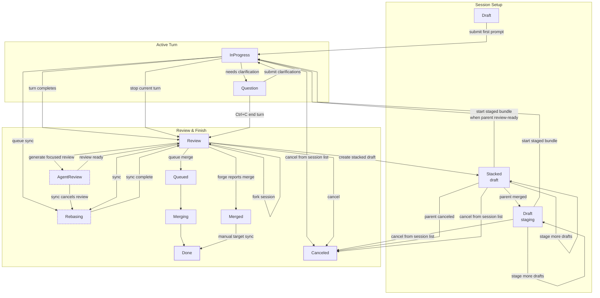

+++
title = "Workflow"
description = "Interface layout, session lifecycle, slash commands, and data location."
weight = 1
+++

<a id="usage-workflow-introduction"></a> This page covers the Agentty interface layout,
session lifecycle, session sizes, slash commands, and data location.

For keyboard shortcuts by view, see [Keybindings](@/docs/usage/keybindings.md).

<!-- more -->

New sessions open their composer before workspace setup finishes. You can type
immediately and submit a prompt; it waits safely for the workspace. Setup stays quiet
until a submitted prompt is waiting or setup fails. These notices appear inline. Press
`s` from the session view to retry failed setup. A restart also preserves prompts and
images whose turns never began, so `s` can submit them again. Saved prompts survive a
restart; review the previous turn if dispatch was interrupted. If you switch projects, a
saved prompt resumes when you return to its project.

Startup marks interrupted rebases as failed and restores their sessions to **Review**. A
removed session worktree does not block this recovery. Storage errors or Git inspection
and cleanup failures in existing worktrees must be resolved before startup can complete.

Drafts keep their staging controls: `Enter` saves a draft, and `s` starts background
workspace setup for the staged prompt. Stacked drafts still require a review-ready
parent and an idle stack. Forks capture the source history and commit before setup.

## Interface Layout

<a id="usage-interface-layout"></a> Agentty organizes its interface into six primary
tabs. Press `Tab` to move forward or `Shift+Tab` to move backward:

- **Projects**: Select between projects (git repositories) in a dashboard view with an
  activity heatmap, work-pace metrics, token usage, and a project table showing names,
  branches, session counts, last-opened dates, and paths. Detected agent CLIs and their
  versions are listed here too.
- **Sessions**: List, create, and manage agent sessions for the active project. Rows
  show a size marker prefix (for example `[XL]`), the current `agent/model` with its
  reasoning level, and a live active-work `Timer` column whose time units are separated
  for readability (for example, `11m 23s`). The list shows only populated merge queue,
  active, and archive groups, with a session count in each group heading. Archive rows
  use subdued text so completed work is visually distinct from current sessions. When
  there are no sessions, it prompts you to press `a` to start one. Press `p` to open a
  project switcher popup that lists registered projects in most-recently-opened order
  and switches the active project without leaving the Sessions view.
- **Settings**: Configure the color theme, orchestrator parallelism, automatic approval
  for read-only research waves, per-role smart/fast/review model and reasoning defaults,
  the optional `Last used model as default` mode, the session commit coauthor trailer,
  and `Launch Configurations` for the active project.

On startup, Agentty restores the last active list tab. If no tab has been saved yet but
an active project is already persisted, Agentty opens on **Sessions** so you can resume
project work without first selecting the project again.

In session chat view, the status-colored session title renders in a header row above the
output panel, with a metadata row showing the size bucket, `+added` / `-deleted` line
totals, the cumulative active-work timer, the current model, the effective reasoning
level, and token usage. A linked pull-request or merge-request URL appears in the header
when present. Press `c` on a linked review request to open its comments in a split page:
unresolved threads, resolved threads, and standalone review-request comments are grouped
on the left, while the selected entry's metadata, attached current-diff context, and
conversation appear on the right. In **Review**, **AgentReview**, or **Question**, press
`Space` to select actionable inline threads, then press `Enter` to send the selection to
the active session agent. Standalone comments are read-only because they do not have
forge thread IDs. After submission, the session returns to **InProgress** and shows a
count-aware `Resolving … review comments...` loader without exposing the generated agent
instructions as a user message. Conversation bodies render Markdown and common embedded
HTML through the same shared text-rendering path used by review-request details.
Forge-authored description and comment input is capped at `1 MiB` before normalization;
truncated bodies end with `[Forge content truncated at 1 MiB.]`. The timer ticks only
while the session is actively working. `Done` sessions use `c` to start a continuation
draft and no longer expose review comments. File-level comments show an explicit
no-line-context message instead of a synthetic code anchor. Each session stores the
project's Smart reasoning default when it is created, so later default changes affect
new sessions without relabeling existing ones.

Session chat also shows `Processes`, `CPU`, and `Memory` for the tracked agent process
and its descendants, refreshed about every two seconds. `CPU` sums the host's `ps`
percentages and can exceed `100%`; it is host-reported accounting rather than an
instantaneous utilization measurement. `Memory` is summed resident memory in `MiB`, so
shared pages may be counted for each process. `--` means no agent PID is tracked, the
tracked process has exited (including while idle), its PID now belongs to a different
process, a retry replacement is starting, or accounting is unavailable. Detached
processes, other Agentty instances, and Agentty's own resource use are outside these
totals.

The top status bar shows the current version, update status, and the latest explicit
project-sync phase. Project-sync progress temporarily takes the place of the rotating
page-scoped `FYI:` message without changing the current page or popup.

The footer shows the active directory and branch. When the current branch tracks an
upstream, the branch badge renders `local -> remote`. Inside a session, the footer
switches to the session directory and shows the session branch's ahead/behind counts
relative to its base branch, plus a second segment for the published remote branch when
one exists.

The background status refresh also checks divergent session branches for merge conflicts
against their stored base branch. A conflict adds a red `[merge conflict]` label beside
the session title in the **Sessions** list and a red `Merge conflict with <base>` alert
in the open session. The check compares committed branch tips without changing the index
or worktree; a failed check remains unknown and does not show a warning.

New session worktrees start from the local active base branch. If local `main` is behind
`origin/main`, the session branch still starts from local `main`; run list-mode sync
(`s`) first when you want a new session to include remote-only commits.

List-mode sync stays non-modal: you can navigate, switch projects, inspect sessions, and
continue work already running in isolated session worktrees while it proceeds. Agentty
coalesces repeated `s` presses for the same project and queues one request per other
project in FIFO order. Operations that change the syncing project's base
checkout—creating or starting a draft session, merging, and rebasing—return a retryable
workflow error until sync finishes; the TUI keeps running and shows that guidance
in-app. Other projects remain available. Existing merge work has priority: requesting
sync while a merge is active or queued reports retryable guidance in the status bar, and
a queued merge rechecks the sync guard before it starts. If the sync stops on rebase
conflicts, the status bar reports the number of files handed to the assist agent.
Completion, blocked preflight, and failure summaries remain in that bar for ten seconds
instead of opening a popup, then the page's normal `FYI:` message returns.

## Session Lifecycle

<a id="usage-session-lifecycle"></a> Session statuses:

| Status          | Meaning                                                          |
| --------------- | ---------------------------------------------------------------- |
| **Draft**       | Created but not started; draft sessions can stage prompts first. |
| **InProgress**  | Agent is working; `r` and `p` queue branch actions.              |
| **Review**      | Agent finished; changes are ready for review.                    |
| **AgentReview** | Focused review is generating; `r` cancels it before syncing.     |
| **Question**    | Agent requested clarification before continuing.                 |
| **Queued**      | Waiting in the merge queue.                                      |
| **Rebasing**    | Session is syncing; follow-up messages queue behind the sync.    |
| **Merging**     | Changes are being merged into the base branch.                   |
| **Merged**      | Review merged remotely; waiting for manual local target sync.    |
| **Done**        | Completed and merged; the worktree was removed.                  |
| **Canceled**    | Canceled by the user; the worktree was removed.                  |

The shortcuts available in each state are listed in
[Keybindings](@/docs/usage/keybindings.md).

When an eligible session enters **Review**, Agentty starts focused review in the
background when its diff has changed since the previous turn. Follow-up turns that leave
the diff unchanged skip automatic review, including after an application restart; manual
focused review remains available. Orchestrator controller sessions skip this automatic
review because they coordinate child branches without owning changes themselves. While
focused review is running, **AgentReview** keeps the review-oriented shortcuts
available; pressing `r` starts session sync immediately and cancels pending
focused-review output so stale review text cannot reappear after the rebase begins.
Provider progress and commentary remain transient; only the terminal focused-review
answer is stored and rendered.

### Typical Transitions


```mermaid
%%{init: { "flowchart": { "curve": "linear" } } }%%
flowchart TB
  classDef auxiliary stroke-dasharray: 4 2,stroke-width: 1.5px;
  classDef terminal stroke-width: 1.5px;

  subgraph start["Session Setup"]
    direction LR
    new_regular["Draft"]
    new_draft["Draft<br/>staging"]
    stacked_draft["Stacked<br/>draft"]
  end

  subgraph active["Active Turn"]
    direction LR
    in_progress["InProgress"]
    question["Question"]
  end

  subgraph finish["Review & Finish"]
    direction LR
    review["Review"]
    agent_review["AgentReview"]
    rebasing["Rebasing"]
    queued["Queued"]
    merging["Merging"]
    merged["Merged"]
    done["Done"]
    canceled["Canceled"]
  end

  new_regular -->|submit first prompt| in_progress
  new_draft -->|stage more drafts| new_draft
  new_draft -->|start staged bundle| in_progress
  new_draft -->|cancel from session list| canceled
  stacked_draft -->|stage more drafts| stacked_draft
  stacked_draft -->|start staged bundle<br/>when parent review-ready| in_progress
  stacked_draft -->|parent merged| new_draft
  stacked_draft -->|parent canceled| canceled
  stacked_draft -->|cancel from session list| canceled

  in_progress -->|turn completes| review
  in_progress -->|needs clarification| question
  in_progress -->|stop current turn| review
  in_progress -->|queue sync| rebasing
  in_progress -->|cancel from session list| canceled
  question -->|submit clarifications| in_progress
  question -->|Ctrl+C end turn| review

  review -->|generate focused review| agent_review
  review -->|create stacked draft| stacked_draft
  review -->|fork session| review
  agent_review -->|review ready| review
  agent_review -->|sync cancels review| rebasing
  review -->|sync| rebasing
  rebasing -->|sync complete| review
  review -->|queue merge| queued
  queued --> merging
  merging --> done
  review -->|cancel| canceled
  review -->|forge reports merge| merged
  merged -->|manual target sync| done

  class agent_review,rebasing auxiliary
  class done,canceled terminal
```

### Active Turns and the Message Queue

While a session is **InProgress**, an animated loader row shows transient provider
thought and tool-status text; the transcript itself updates only after the final turn
result is parsed and persisted.

Pressing `Enter` during a running turn or session sync opens the composer and queues the
message inline with a `≡ queued ›` prefix below the active turn. All waiting work uses
the same subdued, slowly pulsing `≡` indicator; warning-colored animation is reserved
for work that is actively running. Queued worker actions such as sync or review-request
publishing and queued chat messages share one first-in, first-out list. Rows appear from
top to bottom in submission order, and the worker executes them in that same order after
the active turn or sync finishes. During **InProgress**, each `Ctrl+c` press retracts
the most recently queued message (LIFO) without interrupting the running turn; once the
queue is empty, the next `Ctrl+c` stops the current turn and returns the session to
**Review**. If session sync is waiting behind that turn, the same stop cancels the sync
and removes its queued row without entering **Rebasing**. A queued review-request action
is canceled the same way: its waiting row disappears and `p` becomes available again
without starting publish work. **Rebasing** keeps cancellation unavailable while still
accepting queued messages. The chat queue is in-memory only and is discarded if
`agentty` restarts. Switching projects within the same Agentty process preserves running
workers, queued messages, and workflow-action rows. Returning to the project can queue
more work on the same worker, and workflow results completed in the background remain
available in the session transcript.

While the composer is open, `Tab` moves focus to the chat transcript above it so the
conversation can be scrolled with `j` / `k`, `g` / `G`, and `Ctrl+D` / `Ctrl+U` without
losing the typed draft. `Shift+Tab` cycles the session through `Auto Edit`,
`Auto Edit + Auto Address Comments`, and `Read Only` without changing the draft. The
combined mode also verifies and applies focused-review suggestions after each completed
turn for up to three iterations. While that chat transcript is focused, the `d`
diff-preview hint appears unless the latest successful refresh found an empty diff
against the session's base branch; `d` opens text, binary, metadata-only, or diagnostic
diff output. Leaving the preview returns to the composer with the draft intact. Before
opening the writable session worktree, Agentty clears a known-empty result in memory and
durable storage because external edits may follow. If durable invalidation fails, the
worktree stays closed; otherwise `d` becomes available and reloads the diff. Full diffs
load in the background, with **Loading...** in Files until changed paths are available.
Press `q` or `Esc` on **Loading diff...** to return immediately while a large repository
is still being inspected. A failed load returns to the session and shows its diagnostic
there instead of opening an empty Diff workspace.

Inside diff view, `Shift+j` / `Shift+k` and `Up` / `Down` scroll the selected file while
Files remains focused. Press `Enter` or `l` on a file to move focus from the file tree
to its patch, or press `Shift+C` to open a whole-file editor above that patch. Within
the patch, `Shift+C` also opens the whole-file editor, including while a visual row
selection is active; opening it clears that row selection. Press `Enter` to open an
inline editor beneath the selected added or removed line. The bordered editor is titled
`File comment` for whole-file feedback. Inline feedback identifies added ranges as
`New line N` or `New lines N-M`, deleted ranges as `Old line N` or `Old lines N-M`, and
shows both ranges when a selection spans old and new rows. Insert additional lines with
`Alt+Enter` or `Shift+Enter`, then press `Enter` or `Esc` to finish without leaving Diff
mode. Use `j` / `k` or the arrow keys to move through changed lines and completed file
or inline comments while Agentty keeps the cursor visible. Press `Enter` on a changed
line to add feedback or on a completed comment to edit its text again. To comment on a
range, press `Shift+V` on the first changed row, extend the visual selection with `j` /
`k` or the arrow keys, then press `Enter`; `Esc` cancels the selection without leaving
the patch. The full range stays highlighted while its inline editor is open and after
the comment is finished, so every inline comment retains its visible source context.
Type `@` in a diff comment to look up repository files. The lookup aligns with the
comment input, opening above it when space allows and below it near the top edge. `Up` /
`Down` navigate matches, and `Tab` / `Enter` insert the selected path without finishing
the comment. `Esc` dismisses the lookup while preserving the draft; press it again to
finish editing. With no matches, `Tab` / `Enter` dismiss the lookup. Modified `Enter`
still inserts a newline.

Finishing empty text removes the comment and its source highlight. Completed comments
keep a distinct inset background, and the active editor uses the stronger selection
highlight. Leaving Diff mode keeps every completed comment with that session, so
switching to session chat and reopening the diff restores the batch. Submitting the
batch, or starting another turn in the session, clears those comments. The linked
review-request Comments section retains its separate `Enter` action for submitting
marked review threads. Press `s` to submit every finished file, line, or range comment
together as the next session turn from any Diff pane. The submitted prompt uses one
compact row per comment: file feedback carries its repository-relative path, while
inline feedback also carries its old or new side and line or range. The batch keeps
draft instructions or image attachments that were present before opening the diff.
Selected deleted rows also include their captured pre-change source text because that
context is absent from the current worktree. Diff comment editing and submission are
available only when the session can accept a reply. Read-only diffs such as `Merged`
sessions keep line navigation but omit the comment actions from the footer and help
overlay. With no visual selection active, press `Esc`, `Left`, `h`, or `f` to return to
the file tree. Select a changed markdown file and press `p` to render its complete
post-change worktree content, including supported Mermaid diagrams. Preview remains
active across file navigation; non-markdown selections keep showing raw diff lines, and
files that are deleted, binary, too large, or unreadable show a concise notice. Press
`p` again to restore the patch view. Pressing `q` returns to the sessions list and saves
the complete composer; reopening the session restores the typed draft with input focus.
Pressing `Tab` again returns focus to the composer. The same focus toggle, `d` diff
preview, and `q` preservation flow are available while answering clarification
questions. Long transcripts show a slim scrollbar on the right side of the output panel
to indicate the current position.

Pressing `r` during a running turn queues session sync on the same session worker. The
session stays **InProgress** while the active turn runs, then moves to **Rebasing** when
the queued sync command starts. The existing worker must accept the request; Agentty
never creates a second worker from an **InProgress** status just to start sync. If sync
arrives while Agentty is draining queued chat, the active chat turn finishes before sync
runs; earlier queued messages stay ahead of sync, while later messages wait behind it.
Transient session-list refresh failures preserve the current session snapshot and
worker, so retrying `r` does not lose the active queue. Agentty shows a `[Sync]` notice
only when sync resolves; while it waits, the consolidated queue shows
`≡ sync — rebase onto the base branch after this turn`. The waiting row disappears when
the active `Rebasing...` loader starts. Agentty validates the session worktree before
that promotion; a validation failure replaces the waiting row with a durable
`[Sync Error]` notice without showing sync as active. Repeated `r` presses keep the
single queued rebase instead of adding duplicates. Session sync tries to reserve idle
branch-publish ownership while queueing but never waits for an active owner on the UI
event loop. If an auto-push is already running, the session worker waits behind it while
the terminal remains interactive. Once rebase execution acquires ownership, it retains
that ownership through its post-rebase push. A completed turn or subsequent sync
therefore cannot start a competing published-branch auto-push.

Pressing `p` during a running turn opens the usual branch-name popup and queues
review-request creation on that same worker. The session remains **InProgress** and
shows a queued review-request row until the active turn finishes. Publishing then runs
when it reaches the top of the shared queue, and the row changes to
`Publishing review request...`; chat submitted before it runs first, while later chat
waits behind it. The waiting label itself is not added to durable transcript history.
Like queued sync, the queued publish reserves branch ownership before the current turn
reaches auto-push, so the completed turn cannot race the requested review creation. If
another branch operation already owns that lock, the handler queues immediately without
waiting and the worker serializes review-request creation behind the operation in
progress.

Pressing `p` while the session is **Rebasing** queues review-request creation on the
same worker instead of starting another branch executor. The active sync finishes first,
then publishing runs when the request reaches the front of the shared queue.

Session output keeps workflow feedback in execution order. Commit feedback appears
before its sync result, post-sync auto-push progress appears after that result, and
focused-review progress remains at the tail while those branch operations finish. If a
focused review completes before a review request is published, the completed review
stays above the later `[Review Request]` notice; a review that completes afterward stays
below that notice.

### Focused Review

When an eligible session enters **Review**, Agentty starts generating a focused review
in the background and temporarily shows **AgentReview**. Orchestrator controllers do not
trigger this automatic review. Press `f` to append the cached review into the session
output, or to see a loading message with the review agent, model, reasoning level, and
speed while generation is still running. The loading state puts `Reviewing changes` on
the primary row and the review profile on a subdued metadata row beneath it. The
appended review stays visible across diff mode, question mode, session switching,
project switching, and background session metadata refreshes, and is cleared when you
submit the next prompt. If a turn finishes while another project is active, its
automatic focused review continues in the background without requiring you to switch
back. Pending generation remains recoverable after Agentty restarts. Deleted sessions do
not start or resume reviews from late completion events. Focused review includes the
saved user and agent chat history for context. It uses inspection-only context: it may
read files, search, inspect git history, and browse when needed, but it recommends
verification commands instead of running checks itself. The review treats explicit
decisions, accepted tradeoffs, and explanations in the chat as constraints, and only
reopens a resolved suggestion when the current diff contradicts the resolution or
inspection finds a new significant risk. `Project Impact` renders concise bullets
directly beneath its heading. `Suggestions` uses the same compact spacing and formats
its bullets as `[Severity]: Issue details`, using `[High]` or `[Medium]` when follow-up
work is needed. Empty `Suggestions` output does not offer the `/apply` action. A turn
stopped with `Ctrl+c` does not start a focused review automatically; press `f` for a
manual one.

### Session Output Markdown

Session output renders common Markdown blocks in agent answers and persisted user
messages, including headings, lists, block quotes, code fences, and pipe tables. Tables
are aligned to the output panel width so compact comparison data stays readable in the
terminal transcript. Inline `$\rightarrow$` math renders as the Unicode `→` symbol;
unsupported dollar-delimited expressions remain literal. Leading horizontal whitespace
in pasted prompts is preserved after submission, including nested indentation in
multiline text. Tabs render at four-column tab stops. Transcript messages and workflow
notices use one empty line between messages, regardless of padding stored with the
message content.

<a id="usage-session-mermaid"></a> Complete ```` ```mermaid ```` fenced blocks in
session output render as Unicode diagrams. Simple `graph`/`flowchart` diagrams with
`TD`, `TB`, or `LR` direction are supported, including edges that span multiple layers
and cyclic feedback paths. An `LR` graph that is wider than the session panel
automatically uses a top-down layout when that compact form fits. Each feedback edge
renders as an independent return row beneath the layered graph so unrelated cycles
remain visually separate; larger `LR` cycles also use the compact top-down layout.
Common node shapes (stadium, subroutine, cylinder, hexagon, and more) draw as rectangle
or rounded boxes, `&` groups fan out into one edge per pair, subgraphs are flattened
into the surrounding graph, and styling statements such as `style`, `classDef`,
`linkStyle`, `click`, and `:::class` tags are skipped. Solid, dotted, thick, long, and
bidirectional edges render with optional labels in the `-->|label|`, `-- label -->`,
`-.label.->`, and `==label==>` forms. A reverse arrow such as `A <-- B` counts as an
edge from `B` to `A`, so it places `B` on the earlier layer and joins any cycle in that
direction. Invisible `~~~` links affect node layout without drawing a connector. Node
and edge labels longer than the 32-character label limit are truncated with a trailing
ellipsis, and HTML line-break labels degrade to the first renderable label line instead
of preventing the graph preview. `erDiagram` entity-relationship diagrams render
entities as boxes, relationships as lines labeled with the relationship name, and
crow's-foot cardinalities as compact end markers — `1` (exactly one), `?` (zero or one),
`*` (zero or more), and `+` (one or more). Entity attribute blocks are omitted from the
diagram. Simple `sequenceDiagram` participant and message lines render as lifelines with
arrowed message rows; `actor` lines join as participants, notes, activations,
autonumbering, and `alt`/`opt`/`loop`-style blocks are skipped, lifeline spacing adapts
to the widest message label, self-messages render as a compact loop on their lifeline,
and participant or message labels longer than the 32-character label limit are truncated
with a trailing ellipsis instead of preventing the diagram preview. Unsupported diagram
types, self-links, double-width label glyphs, incomplete blocks, and diagrams wider than
the panel keep the plain fenced-code presentation. Session turn prompts tell agents
about this supported diagram subset, so agents include a diagram when it explains a
flow, process, or relationship better than prose. The prompts also instruct agents to
place Mermaid only in the assistant `answer` as an unindented ```` ```mermaid ````
fenced block, because plain code fences or indented blocks stay in the fenced-code
presentation.

### Forking a Review Session

Pressing `F` in a root **Review** or **AgentReview** session opens a confirmation, then
creates a new independent **Review** session from the source session branch. The fork
receives a fresh worktree branch and a copy of the durable transcript history as it
existed at fork time. Stacked child sessions hide `F` because their branch remains tied
to the parent stack workflow. Provider-native conversation IDs, focused-review cache,
published branch state, linked review-request metadata, stack parent links, active-work
timing, and token usage are reset on the fork so future replies and publishing are
tracked separately from the source session. Diff availability is recomputed from the
fork's new worktree, so uncommitted source-worktree changes are not advertised on the
fork.

### Commit and Merge Behavior

After each successful turn with file changes, Agentty keeps the session branch at one
evolving commit: it regenerates the commit message from the cumulative session diff
using the project's `Default Fast Model`, applies the `Coauthored by Agentty` setting,
amends `HEAD`, and refreshes the session title from the commit text. If a later turn
reverts every change, the empty session commit is dropped. Commit and merge notices
appear as transient status rows rather than persisted transcript messages.

Auto-commit waits up to five seconds in total for a busy Git index to become available.
If an index lock still blocks auto-commit, Agentty stops and records a `[Commit Error]`
with recovery guidance instead of invoking commit assistance. Your changes and the lock
remain intact. Wait for active Git operations to finish before retrying. If the lock
persists, the repository owner must confirm it is stale before removing it;
linked-worktree locks may live outside the session workspace.

When a project contains `.pre-commit-config.yaml` or `.pre-commit-config.yml`, Agentty
checks for an executable Git pre-commit hook when you press `a`. A missing hook opens a
warning before the session-type selector. Press `Enter` to continue to the selector or
`Esc` / `q` to cancel, and install the hook with `prek install` or `pre-commit install`
when practical. This advisory will become an error in a future Agentty release.

For now, Agentty still creates the session and runs the normal Git commit command. If a
commit succeeds without the configured hook, the session output records a
`[Commit Warning]` with the installation commands. Later commits do not repeat an
unchanged warning in the same session. Installed hooks remain enabled and their failures
still stop the commit.

When a session without a linked review request merges, Agentty reuses the session branch
`HEAD` commit message for the final squash commit on the base branch. Merging requires a
clean main checkout and returns the session to **Review** if the preparatory rebase or
squash-merge fails. After a pull request or merge request is linked, Agentty hides `m`
and rejects local merge queueing; merge through the forge, and background review-request
sync moves the session to read-only **Merged** when that remote merge completes. The
session remains in Active until a successful manual main sync moves it to **Done**.

When a session syncs (`r`), Agentty rebases the session branch: published sessions fetch
first and rebase onto the remote base ref, unpublished sessions rebase onto the stored
local base branch. In **InProgress**, the sync request is queued behind the running turn
before the session enters **Rebasing**. If the rebase stops on conflicts, Agentty asks
the existing agent session to resolve only the conflicted files, then stages the edits
and runs the repository's effective `pre-commit` hook before continuing the rebase
itself. A hook failure aborts the rebase, records a `[Sync Error]`, and prevents the
post-rebase auto-push. Repositories without an installed hook retain Git's normal
no-hook behavior. The completed conversation remains in place while the rebase or merge
status animates below it.

During normal turns, the agent prompt names the session worktree as the only writable
root. After a turn, if Agentty detects that the main checkout's tracked-file status
changed and remains dirty, it appends a `[Main Checkout Warning]` notice to the
transcript. Clean `HEAD` movement, such as another session landing on the base branch,
and unchanged pre-existing tracked changes do not emit this warning. Projects backed by
a bare repository have no main working checkout, so this main-checkout dirty-state guard
is skipped there.

### Continuing a Terminal Session

Pressing `c` on a **Done** or **Canceled** session opens a confirmation, then creates a
brand-new draft session. **Done** sessions stage a continuation message from the merged
commit hash, or from saved context when the hash is unavailable. **Canceled** sessions
stage the saved transcript or original prompt. The source session remains terminal and
unchanged.

## Session Types

<a id="usage-draft-stacked"></a> From the **Sessions** tab, press `a` to choose between
`Regular`, `Draft`, `Orchestrator`, and `Stacked` session creation, or choose
`Append to stack` to move an existing session. `Orchestrator` and `Append to stack` are
marked `[Preview]`:

- `Regular` starts the agent immediately on the first `Enter`.
- `Draft` stages each `Enter` as one ordered draft message and starts only after you
  press `s`. The worktree is created at that start step, so the branch is based on the
  base branch at launch time. From a draft session view, `Ctrl+V`, `Ctrl+Shift+V`, or
  `Alt+V` opens the draft composer and pastes one clipboard image into the next staged
  draft.
- `Orchestrator` can first run temporary read-only researchers, then turns a broad goal
  into an independent implementation plan, waits for approval, runs multiple managed
  worker sessions, verifies their results, and integrates the approved work. The
  controller reads the repository but never owns branch changes.
- `Stacked` creates a draft below the selected parent session, with its future branch
  based on the parent session branch. A stack can contain up to five stacked levels
  below its root session.
- `Append to stack` moves the selected independent **Review** or **AgentReview** session
  below a parent chosen in the next popup. Agentty immediately syncs the moved branch
  onto that parent branch. Sessions with children or linked review requests stay
  independent, and a busy or depth-limited destination is omitted from the parent list.

Stacked drafts show `s` start only when the parent is in **Review** or **AgentReview**
and no stack member is running, queued, syncing, merging, or waiting on a question. An
unstarted stacked draft can already parent another stacked draft, so you can stage the
full stack before any child worktree exists. Start the drafts from parent to child; each
child's `s` action appears only after its immediate parent reaches review. While a
materialized child is linked, the parent keeps `Enter` replies, `m` merge queueing, `r`
sync, and direct `/` access to slash commands. Syncing the parent (or completing a
parent turn) rebases review-ready direct children onto the refreshed parent branch
automatically, cascading through deeper descendants. When a parent merges, its children
are retargeted onto the parent's base branch as root sessions and review-ready children
are synced with `git rebase --onto` so they keep only their own commits. If an automatic
child sync cannot start or complete, the affected child session shows a `[Sync Error]`
notice with the failure. When a parent is canceled, Agentty stops queued, running,
question, sync, and merge work throughout the stack before canceling every nonterminal
descendant. Descendants already in a terminal state keep that state.

### Parallel Orchestration

Use an orchestrator when a goal needs deep repository discovery or contains at least two
independent pieces of implementation work:

1. On the **Sessions** tab, press `a`, choose `Orchestrator` (marked `[Preview]`), and
   press `Enter`.
1. Discuss the goal with the controller. It resolves repository facts itself and asks a
   focused, recommendation-first clarification only when an unresolved choice changes
   the decomposition or acceptance criteria. Controller clarifications and Agentty's
   plan or follow-up routing questions provide two or three selectable options with the
   recommended choice first; free-text answers remain available. A valid plan contains
   between two and eight implementation tasks. When deeper discovery would materially
   improve the plan, the controller instead proposes a separate wave of one to eight
   `research` tasks before any implementation tasks. Research and implementation tasks
   cannot share one wave. Every task has a stable key, standalone prompt, and concrete
   acceptance criteria. Optional literal repository-relative touched areas apply only to
   implementation tasks and are best-effort planning references: they may overlap and do
   not prevent a worker from changing other files needed to complete its task. Wildcards
   remain invalid for implementation tasks.
1. Review the persisted plan on the campaign monitor above the controller chat. Before
   pressing `a` to approve, confirm the tasks and acceptance criteria. The number of
   simultaneous children comes from the global **Orchestrator Parallelism** setting.
   Research-only waves start immediately when **Auto-approve Research** is enabled; turn
   that setting off to review those waves on the same approval board. Continue chatting
   to revise decomposition. If an implementation goal does not meaningfully split, the
   controller recommends a regular session instead of creating a ceremonial worker.
1. Follow real-time task status on the campaign monitor. Status changes do not add
   transcript messages. Worker rows remain grouped with their controller in the
   **Sessions** list. Workers restrict direct Agentty actions: open one to inspect its
   transcript, press `d` for its diff, or press `D` and confirm **Detach** to
   permanently transfer it into an ordinary user-owned session. When Agentty runs inside
   `tmux`, a worker in **Review** also exposes `o` to open its materialized worktree.
   The confirmation warns that the shell has normal write access and edits can
   invalidate orchestration verification. Temporary research children expose transcript
   and discarded-diff evidence but hide `D` and `o`, because their worktree must be
   reclaimed after report capture. Direct reply, question-answer, cancel, merge,
   publish, fork, review-comment addressing, `Ctrl+c` turn interruption, and
   slash-command actions are unavailable while it is managed. The controller
   conversation below the monitor uses the same line-by-line transcript scrolling as a
   regular session.
1. When a worker asks a blocking question, Agentty mirrors it into the controller's
   question panel only when the controller has no question of its own. The relay durably
   records the exact task that owns the mirrored question, so concurrent worker
   questions are relayed one at a time and every answer returns to the correct worker
   without adding a controller model turn. Infrastructure failures retry twice without
   interrupting chat. Worker failures remain visible on the campaign monitor for
   follow-up.
1. Research children run in their own temporary worktrees under a read-only role. They
   cannot auto-commit. Agentty maps that role to provider-native read-only enforcement:
   Codex uses a read-only sandbox and rejects pre-action approvals, Claude and
   Antigravity use plan mode, and Gemini combines sandboxed plan mode with cancellation
   of ACP mutation requests. After capturing the final report, Agentty archives the
   observed diff, then discards the worktree and local branch. If a researcher
   nevertheless edits files, the campaign board records that the temporary edits were
   discarded and `d` opens the archived evidence after cleanup. Research skips focused
   review and never enters merge or review-request integration. Its terminal status is
   **Reported**.
1. When a worker reaches review with a diff, Agentty waits for its focused auto-review.
   Actionable suggestions are sent back to that worker using the same verification-gated
   prompt as `/apply`: the worker checks each comment against the current code, applies
   only suggestions that make sense, runs the required checks, and explains any rejected
   comment. Agentty repeats this review and remediation cycle at most three times. A
   worker continued after controller verification re-enters the same focused-review
   cycle before the controller can verify its updated work again. Pending reviews and
   the current pass remain visible on the campaign monitor; failed reviews, including
   review-preparation failures, and suggestions that remain after pass three move on as
   explicit evidence for controller verification instead of stalling the campaign. On
   restart, Agentty regenerates only an interrupted review; a queued remediation or
   controller-requested continuation resumes before the updated diff is reviewed.
1. After every task settles, Agentty sends one hidden, durable verification envelope to
   the controller. It contains each task's acceptance criteria, branch, bounded result,
   campaign goal, focused-review outcome, diffstat, token totals, merge order, and a
   mechanical comparison between expected and changed paths. Additional paths appear on
   the campaign monitor and in the envelope as review context, not an automatic
   verification failure. The comparison remains **not checked** when no expected areas
   were provided, even if the child changed files. The controller can run targeted
   read-only Git inspection, reports only cross-task synthesis and risks, and records an
   explicit pass or flag for every ready task. Research entries carry their bounded full
   reports instead of branch and diff evidence; the envelope marks those model-authored
   reports as inert data so instructions inside a report are never followed. This
   verification response is the campaign's single controller report. Only explicit
   passes enter integration; flagged or missing verdicts remain parked for correction.
   The controller reuses a task key to continue the same live implementation child when
   a correction is required. Reusing a reported research key starts a fresh temporary
   researcher. A passing research wave can propose the implementation wave in the same
   verification turn; that new scope parks on the normal plan approval board.
1. At **AwaitingIntegration**, press `a`, then choose **Local merges** or **Review
   requests**. Agentty applies local merges or creates forge review requests in plan
   order and records failures on the campaign monitor. A published review-request task
   remains **Review requested**, and the controller stays active, until review sync
   observes that worker's request as merged. When every integration has settled, the
   campaign and controller become **Done** without another model turn. Local merge
   integration archives an immutable copy of each worker diff before removing its
   worktree and local branch. Review-request workers retain their published branch and
   remain browsable under the controller. A review request closed without merging is
   recorded as an **Integration failed** task, leaving the controller active for
   follow-up. Detached workers remain ordinary sessions. A verified research-only wave
   with no follow-up implementation scope completes automatically and never opens this
   integration chooser.

Multi-turn feedback is routed by task identity. Reusing a settled implementation task's
exact key continues its existing worker, branch, and conversation and returns it to
verification, even when the follow-up expects different files. Any touched-area
references emitted for the continuation replace the previous references and are included
in the resumed worker prompt and next comparison. Previously passed but not yet
integrated siblings return to **Ready** so the next settlement verifies one coherent
campaign snapshot instead of stalling behind old integration state. This supports
review-first workflows: after review workers settle and the controller summarizes their
findings, describe the implementation follow-up in the orchestrator chat. The controller
routes those instructions to the same completed workers, which keep their branches and
conversation context. Research corrections reuse a key but start with a clean temporary
child because research worktrees are never retained. A task cannot change between
`research` and `implementation`; use a new key when moving from findings to
implementation. A new task key is treated as new scope and parks the campaign on the
approval board before that worker starts. Once the controller is `Done`, a new goal or
further feedback starts a new orchestrator campaign.

Press `c` on a draft or running controller to cancel it. Draft controllers can be
canceled before their first goal is submitted. For running controllers, the confirmation
names the number of running children. Approval first blocks new worker fan-out, then
cancels the controller and its active children idempotently. If any child cannot be
canceled, Agentty reports the error and leaves the orchestration in **Canceling** so `c`
can retry without reporting a false terminal cancellation.

## Branch Publish Flow

<a id="usage-review-request-flow"></a> In **Review**, **AgentReview**, and
**InProgress**, `p` opens a publish popup for the linked forge review request:

- Leave the field empty to keep the default branch target, or type a custom remote
  branch name. Agentty rejects a custom name that currently exists remotely. A name
  whose remote branch was deleted can be reused even if a stale local remote-tracking
  ref remains. After the first publish, the popup is locked to that same remote branch.
- Agentty publishes with `git push --force-with-lease`, then creates or refreshes the
  linked review request. After confirmation, the popup closes and publishing continues
  on the session worker while session chat remains interactive. During **InProgress**,
  the action waits behind the active turn at its submission position in the shared FIFO
  queue. Inline progress is replaced only after the forge URL is ready, including across
  intermediate session refreshes. It becomes a one-line
  `[Review Request] Created PR URL` or `[Review Request] Created MR URL` transcript
  notice recorded at that point in session history, or failure details when the task
  finishes; `p` stays hidden while that publish is active. Later turns do not move or
  reconstruct the creation notice. GitHub projects publish pull requests; GitLab
  projects publish merge requests. Manual publishing and completed-turn auto-push share
  one per-session branch-operation lock, so whichever starts later waits instead of
  force-pushing the same branch concurrently.
- Stacked child review requests target the parent review branch while the parent link is
  active.
- When no review request is linked yet, only an open request for the same branch is
  reused; merged or closed requests are left alone.
- After the first publish, later completed turns push the same remote branch
  automatically in the background when no chat message or sync is already queued. After
  each successful push, Agentty reads the current remote title and description and
  reconciles them with the generated commit metadata. The title stays exactly as it is
  unless the primary objective changed materially; implementation refinements, tests,
  documentation, and review fixes keep it stable.
- Description updates retain the intent of user-added content, including issue links,
  other URLs, checklists, instructions, and context, while incorporating session details
  that changed. A proposed description that omits a substantive current line is
  rejected, leaving the remote description unchanged. Agentty stores no metadata
  baseline. It checks the remote fields again immediately before editing and skips a
  field if somebody changed it during reconciliation. This check is best-effort because
  forge metadata updates have no atomic version precondition; an edit made after the
  final check can still race with Agentty's update. Failed background pushes or metadata
  evaluation keep the manual `p` flow available for retry and surface the existing
  review-request sync warning.
- In Diff mode's Comments section, press `Space` to select actionable inline threads,
  then press `Enter` to submit them in one agent turn. The agent evaluates each comment,
  makes a worktree change when needed, and posts a very short explanation of what was
  done and why whether or not a change was needed. Press `f` to return to the Files
  section without leaving Diff mode.
- Agent-driven review-comment turns report one structured outcome for each submitted
  inline thread. Agentty rejects the whole outcome batch when an allowlisted thread is
  missing, duplicated, or has a blank reply, so a malformed agent response cannot apply
  only part of the selected work. After Agentty commits the work and successfully pushes
  an already published branch, it refreshes the live threads, posts the agent's concise
  reply for every valid allowlisted outcome, and resolves only threads reported as
  `fixed`. Threads reported as `no_change_needed` receive their explanatory reply but
  remain open. While an authenticated Agentty reply is the thread's latest comment, the
  thread is shown as `addressed` and cannot be submitted again. The forge-reported
  authorship and Agentty's reply marker must both match, so a reviewer-authored marker
  cannot suppress feedback. A later reviewer follow-up makes the thread actionable
  again, preventing repeated replies to unchanged feedback without hiding new feedback.
  Unknown thread IDs are ignored. Unresolved outdated threads remain actionable through
  their forge thread ID while their stale line anchor is omitted from current diff
  context. Agentty saves each operation's original reply and random marker token in the
  same database transaction that completes the agent turn, so restart recovery cannot
  observe one without the other. It flags the operation immediately before posting and
  deletes it after completion, so a later successful branch push resumes saved work and
  reuses a reply that reached the forge before an interruption instead of posting it
  twice. A new agent response cannot replace a bound unfinished operation's saved reply,
  and an unrelated comment that copies Agentty's old static marker is not accepted as
  its audit reply. Commit, reply, resolution, and missing-open-review failures produce a
  `[Review Comments Warning]` transcript notice. A commit failure discards that review
  batch, so a later unrelated push cannot apply its stale outcomes; reopen the comments
  to retry. A push failure keeps a successfully committed batch for the next push
  attempt. Before applying that batch, Agentty verifies the pushed tip still exactly
  matches its saved fix commit. Any later commit, including a revert, causes Agentty to
  discard the saved outcomes and require a fresh review batch. If shutdown or
  persistence failure interrupts commit binding, Agentty keeps the unbound batch
  pending, reports that a fresh agent turn is required, and lets that turn replace only
  the unbound operation.

<a id="usage-review-request-prerequisites"></a> Publishing needs regular Git
authentication (credential helper or PAT for HTTPS remotes, SSH key for SSH remotes)
plus the forge CLI for the repository remote: authenticated `gh` for GitHub and
authenticated `glab` for GitLab. See
[Forge Authentication](@/docs/usage/forge-authentication.md) for setup steps.

## Review Request Sync

<a id="usage-review-request-sync"></a> After a branch has been published, Agentty
refreshes review-request status in the background for **Review** and **AgentReview**
sessions. The session list shows forge indicators next to the status label:

| Indicator | Meaning                                 |
| --------- | --------------------------------------- |
| `↑`       | Branch published; no request found yet. |
| `⊙ <id>`  | Review request `<id>` is open.          |
| `✓ <id>`  | Review request `<id>` was merged.       |
| `✗ <id>`  | Review request `<id>` was closed.       |

When background refresh detects that the review request was merged, the session moves to
read-only **Merged** and remains in the Active group. Transcript and diff inspection
stay available, while replies, session sync, merge, publishing, commands, and new
follow-up tasks are disabled. Agentty does not archive or clean up the session during
background refresh or startup.

After the user manually syncs the review request's local target branch, Agentty moves
the session to **Done**, archives it, cleans up its worktree in the background, and
persists restack work for any stacked children. A failed sync or a sync of another
branch leaves the session and its stack unchanged. Interrupted child restacks can resume
after restart. If restack intent or archival cannot be persisted, the sync status counts
the sessions that remain in **Merged** so the user can inspect their workflow warnings
and retry safely. A closed request still moves an editable session to **Canceled**.

When both a stacked parent and child review request have already merged, syncing the
parent's local target branch moves both sessions to **Done**. This also applies while
the child's stored review target still names the parent review branch, because the
merged parent has carried the child's changes into the synchronized target. Retrying
that sync also recovers a child left in **Merged** by an earlier Agentty run that
already archived its parent.

## Clarification Interaction Loop

<a id="usage-clarification-loop"></a> If an agent emits structured clarification
questions, the session moves to **Question** status. You answer each question in
sequence, and Agentty sends one consolidated follow-up message back to the session.

<a id="usage-question-options"></a> Questions may include predefined answer options
shown as a numbered list; use `j`/`k` or `Up`/`Down` to navigate and `Enter` to send the
highlighted choice. Moving past the list edges switches to the free-text input. Sending
a blank free-text answer stores `no answer`. `Ctrl+C` while the answer input is focused
ends the clarification turn and returns the session to **Review** without sending a
reply; it is ignored while chat output is focused. `q` (outside free-text input) returns
to the sessions list with the **Question** state kept for later; answers already
submitted are saved, and reopening the session resumes at the next unanswered question.

In a free-text answer, type `@` to look up repository files. Use `Up` / `Down` to choose
a match and `Tab` / `Enter` to insert it without submitting the answer. `Esc` closes the
lookup while keeping your draft, even if file loading finishes afterward. Editing the
query can open the lookup again.

## Prompt Input Extras

<a id="usage-prompt-extras"></a> In prompt input, `Ctrl+V`, `Ctrl+Shift+V`, and `Alt+V`
paste one clipboard image into the current draft or reply as an inline `[Image #n]`
token; from a draft session view, the same shortcuts first open the composer and then
paste the image. The referenced local images are sent to the agent with the prompt. The
clipboard source can be a copied PNG file, raw image data, or PNG path text from the
host clipboard backend. Wayland reads use `wl-paste` when it is available; missing or
unsupported clipboard backends report an inline paste error. Draft image files are
removed when the composer is canceled, after a submitted turn finishes, and when a
session is deleted or canceled.

All editable inputs use the same character movement, word movement and deletion,
line-editing, paste, `Ctrl+Z` undo, and `Ctrl+Y` / `Ctrl+Shift+Z` redo behavior. Prompt
and clarification inputs extend that shared editor with multiline movement and their own
completion or option actions. Undoing prompt text also recomputes slash-command and `@`
lookup state; deleted image metadata remains available while undo history can restore
its `[Image #n]` placeholder. Typing the same placeholder text manually does not attach
the deleted image, and Agentty removes archived image files after their restoring edit
falls out of bounded undo history. Attachment identity follows the exact placeholder
occurrence, so duplicate lookalike text cannot substitute for the pasted token. Moving
through prompt history with `Up` and `Down` preserves the attachment membership of the
captured draft.

On macOS, use `Ctrl+Z` rather than `Cmd+Z` for input undo. Terminal applications such as
Ghostty may consume `Cmd+Z` before Agentty or a surrounding `tmux` session receives it.

`@` file lookups keep the raw `@path/to/file` text visible and highlighted in the
composer and transcript; the agent-facing prompt rewrites them to quoted `path/to/file`
tokens. Before a stacked draft materializes its own worktree, lookup suggestions come
from the nearest materialized ancestor worktree so newly created ancestor files remain
available through unstarted intermediate drafts.

If an agent command exits with an error, Agentty prints a short failure header followed
by captured `stdout` and `stderr` sections, with JSONL provider events summarized into
readable lines.

## Session Sizes

<a id="usage-session-size"></a> Agentty classifies sessions by the number of changed
lines in their diff:

| Size    | Changed Lines |
| ------- | ------------- |
| **XS**  | 0-10          |
| **S**   | 11-30         |
| **M**   | 31-80         |
| **L**   | 81-200        |
| **XL**  | 201-500       |
| **XXL** | 501+          |

Session size is recalculated after each completed agent turn, persisted to the session
record, and rendered as a title prefix in the **Sessions** list.

## Slash Commands

<a id="usage-slash-commands"></a> Type these in the prompt input to access special
actions. From an editable session view, press `/` to open a new composer with the
leading slash already inserted. This replaces any prompt draft previously saved by
returning to the sessions list:

The command picker filters as you type, accepts contains or fuzzy abbreviations such as
`/son` for `/reasoning`, and wraps between its first and last options when you navigate
with `j` / `k` or `Up` / `Down`.

| Command        | Description                                                   |
| -------------- | ------------------------------------------------------------- |
| `/apply`       | Verify focused-review suggestions, then apply the valid ones. |
| `/mode`        | Choose editing permissions and review automation.             |
| `/model`       | Switch the model for the current session.                     |
| `/personality` | Choose an agent personality for the current session.          |
| `/reasoning`   | Override the reasoning level for the current session.         |
| `/style`       | Choose concise, balanced, or detailed responses.              |
| `/speed`       | Choose normal or fast responses for this session.             |

`/apply` requires a completed focused review (`f` key). `/mode` stores a session-scoped
mode for following chat turns. `Auto Edit` uses the agent's standard editing
permissions. `Auto Edit + Auto Address Comments` uses the same permissions and
automatically runs the verification-gated `/apply` flow when focused review returns
actionable suggestions. The resulting turn is reviewed again; automation stops when no
actionable suggestions remain or after three automatic application turns. A new user
prompt or mode selection starts a fresh iteration budget. Codex auto-edit modes have
full command access, including for browser tests and local services that cannot run
inside its sandbox. Claude auto-edit modes can likewise retry incompatible commands
outside its sandbox. During those chat turns, `Read Only` prevents repository and
filesystem writes. The composer title always shows the current mode after the response
speed when that provider supports speed control. `Shift+Tab` cycles `Auto Edit`,
`Auto Edit + Auto Address Comments`, and `Read Only` in that order without changing the
draft. In `Read Only`, agents do not ask for write access; when a requested change
requires edits, they suggest switching to `Auto Edit` with `Shift+Tab`. `/model` offers
only locally available backends; see [Agents & Models](@/docs/agents/backends.md).
`/speed` is available for Claude and Codex sessions. The selected speed is stored with
the session, shown after the reasoning level in the session header and beside the
composer title, and applied to following turns. Gemini and Antigravity sessions have no
speed control, so their header and composer omit the speed display entirely. Fast
responses use the provider's higher-cost low-latency mode. Enabling Fast moves Claude
sessions to `claude-opus-5` and Codex Spark sessions to `gpt-5.6-sol` without changing
the project default model. Returning to Normal does not change the selected model.
Selecting a model that does not support Fast resets the session to Normal before the
model changes.

`/style` is available for every backend. `Concise` keeps the answer compact while
retaining essential results, caveats, and verification; `Balanced` provides enough
context to understand and verify the result without exhaustive detail; and `Detailed`
explains decisions, trade-offs, effects, and verification thoroughly. The selection is
stored with the session and applied to following user turns. Non-default `Concise` and
`Detailed` selections are also shown in the session header and composer title. An
explicit length or format request in the prompt takes precedence. Style guidance changes
presentation only: it does not alter tool access, protocol output, safety requirements,
or utility prompts such as title generation.

`/personality` scans `.agents/agents/*/agent.md` in the session worktree when the picker
opens. Agentty does not scan the global `~/.agents` directory. Each enabled definition
provides a name, description, and prompt body; workspace directory names supply missing
IDs. Choose `None (default)` to clear the selection. Agentty stores the selected ID and
resolves the file again immediately before each turn, so edits apply on the next turn.
If the selected definition is removed, disabled, or invalid, the turn continues without
it and the transcript reports the fallback.

<a id="usage-title-refinement"></a> When the first prompt is submitted, Agentty stores
it as a provisional title and generates a refined title in the background using the
project's `Default Fast Model`. Title refinement runs for every session role, including
managed read-only research sessions, and the isolated title prompt is itself read-only.
Title generation uses the persisted original request, current title, and latest request
as one stable context snapshot. The original request anchors the overall goal; later
requests can establish a goal after context-only text or clarify the existing goal, but
a narrow follow-up or clarification answer does not replace broader session intent. Each
context field is shortened at a valid text boundary when necessary, so unusually large
sessions retain every context category without exceeding a model's prompt transport
limit. Draft sessions regenerate the title as more drafts are staged.

Provider failures are logged and retried once. If both attempts fail, or the model finds
no actionable goal, Agentty keeps the provisional title so a later substantive request
can refine it. Candidates equivalent to the current title, original request, latest
request, or one line of those requests after case and punctuation normalization are
rejected as copies. Generated title candidates are ordered, so an empty response does
not discard an earlier usable candidate, while a slow response cannot replace a newer
accepted candidate, draft, or commit-derived title.

## Settings Scope

<a id="usage-settings-scope"></a> Settings for models, reasoning, response speed,
response style, commit trailers, and launch configurations are stored per active
project. `Theme` and `Orchestrator Parallelism` are global. Parallelism defaults to
three workers and accepts values from one through eight. The Settings tab renders these
scopes as `Global settings` and `'<project>' settings`. Rows with fixed choices open
dropdowns; use `j` / `k` to move through options. Smart, Fast, and Review first ask for
a model and reasoning level. Claude and Codex then offer a response-speed dropdown with
`Normal` and `Fast`; Gemini and Antigravity save after reasoning because they do not
support speed control. Each role persists its independent model, reasoning, and speed
defaults. Smart supplies defaults for new sessions, Fast supplies title and
commit-message utility prompts, and Review supplies focused review assists. Selecting
`Fast` also applies the same compatible-model adjustment used by `/speed`: Claude uses
`claude-opus-5`, and Codex Spark uses `gpt-5.6-sol`.

`Default Response Style` supplies the initial style for new sessions. Changing the
project default does not rewrite existing sessions; use `/style` to update an active
session.

The `Launch Configurations` row opens a command-list editor instead of a multiline text
field. Use `a` to add an entry, `e` or `Enter` to edit the selected entry, `d` to delete
it, and `J` / `K` to reorder entries. Add/edit mode uses a single-line input; `Enter`
saves the command, `Esc` cancels the input, and the shared word-editing, paste,
undo/redo, and cursor shortcuts remain available. Agentty trims commands and drops empty
entries when saving. When Agentty runs inside `tmux` and multiple
`Launch Configurations` entries are configured, pressing `o` in a session opens a
selector popup.

## Auto-Update

<a id="usage-auto-update"></a> Agentty checks npmjs for a newer version in the
background when it launches and once every hour while it remains open. If a newer
version is detected, it automatically runs `npm i -g agentty@latest` without blocking
the UI:

- **Updating to vX.Y.Z...**: The background npm install is running.
- **Updated to vX.Y.Z — restart to use new version**: Installation succeeded; relaunch
  Agentty to use it.
- **vX.Y.Z version available update with npm i -g agentty@latest**: Automatic
  installation failed; run the displayed command manually.

To disable automatic updates, launch with `--no-update`:

```bash
agentty --no-update
```

When `--no-update` is set, Agentty still performs the startup and hourly checks and
shows the manual update hint, but does not install automatically.

Run `agentty --help` to list supported launch options or `agentty --version` to print
the installed Agentty version. Unsupported arguments produce an error instead of
launching the TUI.

## Data Location

<a id="usage-data-location"></a> Agentty stores its data in `~/.agentty/` by default.
This includes the SQLite database, session logs, and worktree checkouts (under
`~/.agentty/wt/`).

Per-session worktree folders are removed automatically after a session reaches `Done` or
`Canceled`, and when a session record is deleted.

You can override this location by setting the `AGENTTY_ROOT` environment variable:

```bash
# Run agentty with a custom root directory
AGENTTY_ROOT=/tmp/agentty-test agentty
```

### Continuing long sessions

Follow-up messages preserve the active goal and accepted decisions unless you cancel or
replace them. A status question does not cancel unfinished work. For long histories,
agents receive opening and recent context with access to the full history during the
turn; the saved conversation remains intact.

Agents reuse successful check results while the relevant inputs remain unchanged and
still run repository-required checks. Orchestration workers report evidence for each
acceptance criterion, exact check commands and results, and unresolved gaps.
