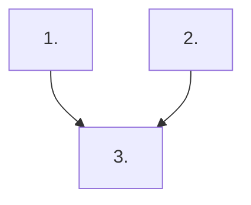

# Implementation Plan Workflow

Use this skill when producing or updating implementation plans in `docs/plan/`.

This skill is the source of truth for plan structure and execution-planning requirements.

## Workflow

1. **Clarify the plan request first**

   - Confirm the goal, intended outcome, scope boundaries, exclusions, and delivery constraints.
   - Ask focused follow-up questions only when missing information would change the plan structure or sequencing.

1. **Collect planning context**

   - Read `docs/plan/AGENTS.md`, related source files, and any overlapping plan documents before writing.
   - Capture only the constraints that materially affect scope, sequencing, validation, or exclusions.

1. **Draft a concise, current-state plan**

   - Use the plan skeleton below and keep each section focused on repository-observable facts.
   - Keep cross-plan notes short and include only active overlaps, ownership decisions, or unresolved conflicts.
   - Keep snapshot rows scannable: one short current-state sentence plus a status, without long file lists in the table cells.
   - Keep the `## Priorities` section near the top of the plan, immediately after the title and scope/context line.
   - In each priority, render `Why now` and `Usable outcome` as their own subtopics on separate lines instead of inline bold labels.

1. **Define execution sequence and guardrails**

   - Make the first priority the smallest usable iteration instead of standalone groundwork.
   - Ensure later priorities extend that working baseline and fold docs into the same step as the behavior change.
   - State which priorities can run in parallel and keep the dependency graph aligned with the execution notes.

1. **Quality check before handing off**

   - Remove duplicated or contradictory checklist items and trim stale completed detail when it no longer helps active execution.
   - Verify every priority can be executed, validated, and merged independently.
   - Verify overlapping plans are aligned or clearly marked for user resolution.
   - Verify the final plan reflects the clarified requirements the user provided.

## Plan Skeleton

Use this skeleton when creating a new file in `docs/plan/`:

```markdown
# <Plan Title>

<One-sentence scope/context line tied to the relevant code area.>

## Priorities

## 1) <Priority Title>

### Why now

<rationale>

### Usable outcome

<what the user can do after this iteration lands>

- [ ] <implementation task within this priority>
- [ ] <implementation task within this priority>

Primary files:

- `<path>`
- `<path>`

## Cross-Plan Notes

- List only active overlaps, ownership decisions, or unresolved conflicts with other files in `docs/plan/`.
- If another active plan conflicts with this plan and the correct resolution is not explicit, stop and ask the user which plan should control the work.

## Status Maintenance Rule

- After implementing any step in this plan, immediately update its status in this document.
- When a step changes behavior or guidance, update the corresponding documentation in that same step before marking it complete.

## Current State Snapshot

| Area | Current state in codebase | Status |
|------|---------------------------|--------|
| <area> | <short observable state> | <status> |

## Implementation Approach

- Start with the smallest working slice that a user can already exercise end to end.
- Make the first iteration intentionally basic if needed, but it must still be usable and demonstrable.
- Add later iterations only as extensions of the working slice so feedback can arrive before the full feature set is built.
- Document each iteration as it lands; do not reserve documentation for a separate large-scale cleanup iteration.

## Suggested Execution Order



1. Start with `<Priority 1>`; it is a prerequisite for `<Priority 3>`.
1. Run `<Priority 2>` in parallel with `<Priority 1>` because they touch independent files and validation paths.
1. Start `<Priority 3>` only after `<Priority 1>` and `<Priority 2>` are merged.

## Out of Scope for This Pass

- <non-goal>
- <non-goal>
```
