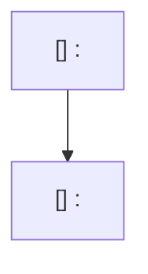

# Implementation Plan Workflow

Use this skill when producing or updating the consolidated roadmap in `docs/plan/roadmap.md`.

This skill is the source of truth for roadmap structure and execution-planning requirements.

## Workflow

1. **Clarify the plan request first**

   - Confirm the goal, intended outcome, scope boundaries, exclusions, and delivery constraints.
   - Ask focused follow-up questions only when missing information would change the plan structure or sequencing.

1. **Collect planning context**

   - Read `docs/plan/AGENTS.md`, `docs/plan/roadmap.md`, and the related source files before writing.
   - Run or inspect `cargo run -q -p ag-xtask -- roadmap context-digest` when the request involves promotion, reprioritization, queue balancing, or replacing a completed `Ready Now` step so the roadmap work uses fresh repository context.
   - Capture only the constraints that materially affect scope, sequencing, validation, or exclusions.

1. **Choose the roadmap operation**

   - For claiming an existing `Ready Now` step before implementation, read `references/claim-step.md`, set only that step's `#### Assignee` field to the current user, and land that claim before implementation starts.
   - For starting implementation on an already-claimed `Ready Now` step, read `references/start-step.md` and execute the step exactly as written before reshaping the roadmap.
   - For revising an existing step or promotion card, read `references/update-step.md` and update only the named roadmap sections that need to change while preserving the canonical structure for that queue.
   - For inserting a new backlog item, read `references/add-step.md` and decide first whether it belongs in `Ready Now`, `Queued Next`, or `Parked`.

1. **Sync the roadmap when the skill changes**

   - When updating this `SKILL.md`, review `docs/plan/roadmap.md` and `docs/plan/AGENTS.md` in the same turn and sync them so they match the updated rules.
   - Respect explicit user exclusions when deciding which existing roadmap content to leave untouched.

1. **Draft or revise the consolidated roadmap**

   - Keep all active planning in `docs/plan/roadmap.md`. Do not create a new per-feature plan file unless the user explicitly asks for a temporary migration artifact.
   - Keep `## Ready Now`, `## Queued Next`, and `## Parked` as the three planning horizons for the whole roadmap.
   - Keep one shared execution diagram for `## Ready Now`; queued and parked items do not need a second diagram.
   - Keep already-landed behavior in `## Current State Snapshot`; do not retain implemented steps in `## Ready Now`.
   - Keep snapshot rows scannable: one short current-state sentence plus a status, without long file lists in the table cells.
   - Use the exact heading format `[UUID] Stream: Title` for all `Ready Now`, `Queued Next`, and `Parked` items so every outcome keeps a stable identifier.
   - Keep `Ready Now` detailed. Render `Assignee`, `Why now`, `Usable outcome`, `Substeps`, `Tests`, and `Docs` as their own subtopics on separate lines instead of inline bold labels.
   - Keep `Queued Next` and `Parked` intentionally compact. Render `Outcome`, `Promote when`, and `Depends on` as their only subtopics.
   - Render `#### Assignee` as the first subsection in every `Ready Now` step and store the owner there in `@username` format or the exact text `No assignee`.
   - When claiming a step for the current user, resolve the GitHub login with `gh api user --jq .login` first and write that value as `@<login>` instead of guessing from local git config or the OS username.
   - Until lease automation exists, claim work only from `Ready Now`, keep claim edits scoped to the `#### Assignee` field, and land the claim as a dedicated commit before implementation begins.
   - Use size budgeting during roadmap creation, not after the fact. Before finalizing the roadmap, estimate the changed-line scope for each step, split oversized work into additional steps, and keep those size estimates in planning notes or reviewer reasoning rather than rendering a `#### Size` block in `docs/plan/` files.
   - Treat `500` changed lines as the hard implementation ceiling, not the planning target. Plan each `Ready Now` step with headroom and split it before handoff when the estimate is above `350` changed lines so routine implementation drift does not push the real diff over `500`.
   - Estimate size by summing the likely changes across production code, tests, and docs instead of counting only the main behavior edit. Use the higher-risk estimate when one slice spans multiple module families or introduces a new boundary plus its first consumer.
   - Treat each `Ready Now` step as one mergeable planned slice. Keep every ready step at `XL` or smaller, and split any step that would be `XXL` before handing off the plan.
   - Define `atomic` as one mergeable acceptance story: the step can land, be tested, documented, and reverted independently without needing a follow-up step just to become coherent or usable.
   - Prefer one primary usable outcome per `Ready Now` step. If the `#### Usable outcome` sentence describes two sibling capabilities, split the step.
   - Prefer one primary code path plus its required validation/docs per `Ready Now` step. If a slice changes two peer surfaces such as settings plus prompt switching, or persistence plus editor affordances, split those into separate steps unless one surface is only a trivial adoption of an already-landed boundary.
   - Target `1..=3` checklist items under `#### Substeps`. If a `Ready Now` step needs more than `3` implementation items, split it into additional steps or demote part of the work back into `Queued Next`.
   - Split by executable outcome, not by architecture layer. Prefer steps such as `persist X`, `render X`, `edit X`, or `reconcile X` when they each form their own usable slice, rather than bundling multiple outcomes into one cross-layer bucket.
   - Use follow-up cards aggressively. When one stream needs a later polish pass, broader UI copy sweep, or secondary adoption path, keep the first usable slice in `Ready Now` and queue the follow-up instead of expanding the current step until it becomes risky.
   - Use titles that name one outcome. If a title needs `and`, `plus`, or multiple verbs to describe separate deliverables, split the work unless those words only clarify one tightly coupled result.
   - Use this size table when labeling a planned step:

     | Size | Changed lines |
     |------|---------------|
     | `XS` | `0..=10` |
     | `S` | `11..=30` |
     | `M` | `31..=80` |
     | `L` | `81..=200` |
     | `XL` | `201..=350` |
     | `XXL` | `351+` |
   - Write each checklist item under `#### Substeps` as a short human-readable title followed by the detailed implementation guidance for that item, preserving the concrete file and constraint details instead of collapsing them into the title alone.
   - Structure `Ready Now` steps as evolving usable slices. Each ready step must include the implementation work plus the tests and documentation needed for that slice before it can be considered complete.
   - Keep implementation checklist items under `#### Substeps`, then extract validation work into `#### Tests` and documentation work into `#### Docs` immediately after `#### Substeps`.
   - Mention every required file directly in the checklist text for the relevant `Ready Now` substep instead of adding a trailing `Primary files` block.
   - Apply these split heuristics before accepting a large step:
     - If one step introduces a new boundary and then adopts it in two separate callers, keep the boundary plus first caller in `Ready Now` and queue the second caller.
     - If one step changes storage shape and interaction polish, land the storage-backed behavior first and queue the editing or copy refinements.
     - If one step touches runtime orchestration plus multiple UI surfaces, land the smallest working UI surface first and queue the broader copy or affordance sweep.
   - Use the `Stream: Title` portion of each heading to help readers understand what can proceed in parallel.

1. **Define execution sequence and guardrails**

   - Make `Ready Now` the smallest credible execution window for the next planning cycle, not a dump of every open outcome.
   - Make the first `Ready Now` step in each stream the smallest usable iteration instead of standalone groundwork.
   - Ensure later promotions extend that working baseline and keep tests/docs in the same ready step as the behavior change.
   - When a `Ready Now` step is completed and `Queued Next` is not empty, promote the highest-priority queued card into `Ready Now` instead of leaving the execution window short.
   - Do not reserve testing or documentation for a final catch-all step; if a ready step changes behavior, it owns the validation and docs updates for that change.
   - Keep the single roadmap diagram aligned with `Ready Now` and use it to show which active streams can run in parallel.

1. **Quality check before handing off**

   - Remove duplicated or contradictory checklist items and trim stale completed detail when it no longer helps active execution.
   - Verify every `Ready Now` step can be executed, validated, and merged independently.
   - Verify every `Ready Now` step answers `What becomes newly possible after only this step lands?` in one sentence.
   - Verify every `Ready Now` step was split using the size table below before handoff, even though the resulting plan should not render a `#### Size` section.
   - Verify every `Ready Now` step has at least `150` changed lines of buffer beneath the `500`-line hard ceiling; split anything estimated above `350`.
   - Verify no `Ready Now` step is larger than `XL`; split oversized work before handoff.
   - Verify no `Ready Now` step has more than `3` implementation checklist items under `#### Substeps`; split crowded steps before handoff.
   - Verify every item heading uses the exact `[UUID] Stream: Title` format and that the UUID value is valid.
   - Verify every `Ready Now` step starts with explicit `#### Assignee` before `#### Why now`.
   - Verify every `#### Assignee` value uses `@username` or the exact text `No assignee`.
   - Verify any newly claimed assignee was derived from `gh api user --jq .login` so the roadmap matches the authenticated GitHub identity.
   - Verify every `Ready Now` step has explicit `#### Tests` and `#### Docs` sections.
   - Verify every `Queued Next` or `Parked` card uses only `#### Outcome`, `#### Promote when`, and `#### Depends on`.
   - Verify every `#### Substeps` checklist item starts with a human-readable title while keeping the detailed implementation guidance in the same item.
   - Reject ready steps that bundle multiple acceptance stories behind one title, one `#### Usable outcome`, or one combined validation block.
   - Reject ready steps whose estimated size assumes best-case edits across several module families without contingency for test churn, router wiring, or docs updates.
   - Reject plans that save most tests/docs for the last step instead of keeping them attached to the relevant behavior changes.
   - Verify the roadmap uses one shared diagram for `Ready Now`.
   - Verify no implemented step remains in `Ready Now`; completed work belongs in snapshot context or should disappear entirely.
   - Verify that completing a `Ready Now` step would trigger promotion of another queued card whenever `Queued Next` still has work.
   - When this skill changed, verify the roadmap and active planning inventory in `docs/plan/` were reviewed and updated to match the new rules unless the user explicitly excluded them.
   - Verify cross-stream dependencies are aligned or clearly marked for user resolution.
   - Verify the final roadmap reflects the clarified requirements the user provided.

1. **Maintain roadmap hygiene**

   - When a `Ready Now` step is fully implemented and no further tracked work remains for it, remove that step from `docs/plan/roadmap.md` instead of keeping completed work as permanent active inventory.
   - After removing a completed `Ready Now` step, promote the next queued card into `Ready Now` whenever `Queued Next` still contains work.
   - If follow-up work is still needed after a step is otherwise complete, add or update a compact queued or parked card with its own outcome and promotion trigger instead of extending the completed step indefinitely.
   - Keep the roadmap concise by collapsing shipped context into snapshot rows rather than preserving completed implementation detail.

## Roadmap Skeleton

Use this skeleton when adding or revising `docs/plan/roadmap.md`:

````markdown
# Agentty Roadmap

<One-sentence summary of how this file tracks the active project roadmap.>

## Current State Snapshot

| Area | Current state in codebase | Status |
|------|---------------------------|--------|
| <area> | <short observable state> | <status> |

## Active Streams

- `<stream>`: <what this stream owns>

## Planning Model

- <how `Ready Now`, `Queued Next`, and `Parked` are used>

## Ready Now

### [<uuid>] <Stream>: <Step Title>

#### Assignee

`No assignee`

#### Why now

<rationale>

#### Usable outcome

<what the user can do after this iteration lands>

#### Substeps

- [ ] **<Human-readable substep title>.** <Detailed implementation task within this step, including files and constraints>

#### Tests

- [ ] <tests/validation needed for this step>

#### Docs

- [ ] <documentation updates needed for this step>

## Ready Now Execution Order



## Queued Next

### [<uuid>] <Stream>: <Step Title>

#### Outcome

<what this outcome would unlock when promoted>

#### Promote when

<what must be true before this becomes Ready Now>

#### Depends on

<what this card depends on, or `None`>

## Parked

### [<uuid>] <Stream>: <Step Title>

#### Outcome

<what this outcome would unlock when promoted>

#### Promote when

<what strategic trigger should bring this back into active planning>

#### Depends on

<what this card depends on, or `None`>

## Context Notes

- <active overlap, ownership decision, or dependency note>

## Status Maintenance Rule

- Keep no more than `5` items in `## Ready Now`.
- Keep only `Ready Now` items fully expanded.
- Keep `## Queued Next` and `## Parked` intentionally compact.
- Claim work only from `## Ready Now`.
- After implementing a `Ready Now` step, remove it from the roadmap, refresh the snapshot rows that changed, and promote the next queued card into `## Ready Now` when one is available.
- If more work remains after a completed step, add or update a queued or parked card instead of preserving completed detail.
````
