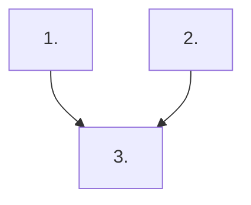

# Implementation Plan Workflow

Use this skill when producing or updating implementation plans in `docs/plan/`.

This skill is the source of truth for plan structure and execution-planning requirements.

## Workflow

1. **Clarify the plan request first**

   - Check whether the user has specified the plan goal, intended outcome, scope boundaries, exclusions, and any delivery constraints.
   - Clarify dependency, sequencing, or rollout constraints when they affect whether steps can land as separate commits or pull requests.
   - If any of those requirements are unclear, ask focused follow-up questions before drafting or revising the plan.
   - Prefer the smallest useful set of questions. Ask about missing scope, success criteria, priority, deadlines, ownership, or non-goals only when they materially affect the plan.
   - Wait for the user response before continuing when the missing information would change the plan structure or contents.

1. **Collect planning context**

   - Read `docs/plan/AGENTS.md` for directory-local context only.
   - Review related source files and existing plan documents before writing.
   - Capture concrete constraints from the user request and clarification answers (scope, deadlines, quality gates, excluded work).

1. **Define scope and success boundaries**

   - Write one concise scope/context line tied to the relevant code area.
   - Identify what is in scope for this pass and what must remain out of scope.
   - Preserve only behavior required by the current request; remove stale or legacy plan items unless explicitly requested to keep them.

1. **Build the current-state snapshot**

   - Add a table with `Area`, `Current state in codebase`, and `Status`.
   - Base each row on observable code or command output.
   - Use precise status wording such as `Not started`, `Partial`, `Healthy`, or `Baseline captured`.

1. **Create prioritized execution sections**

   - Use numbered priorities with a short `Why now` rationale.
   - Add task checklists with `- [ ]` / `- [x]` and make each item implementation-ready.
   - Size each priority section so the full section can land as one commit or pull request with a clear validation story.
   - Use checklist items to break down the work inside that priority without forcing each checklist item to be independently shippable.
   - Split or merge priority sections when the current section is too large or too coupled to review and merge independently.
   - List the primary files for each priority using repository-root-relative paths.

1. **Define execution sequence and guardrails**

   - Add `## Suggested Execution Order` with an ordered sequence.
   - State explicitly which steps can run in parallel and which must stay sequential because of dependencies.
   - Add a Mermaid dependency graph that shows the same sequencing constraints as the ordered list.
   - Add `## Out of Scope for This Pass` with explicit non-goals.
   - Add `## Status Maintenance Rule` that requires immediate updates after each implemented step.

1. **Quality check before handing off**

   - Confirm the plan structure matches this skill's plan skeleton and workflow requirements.
   - Remove duplicated or contradictory checklist items.
   - Ensure every priority section can be executed, validated, and merged independently.
   - Verify the execution order explains both the merge order and any safe parallel work.
   - Verify the Mermaid dependency graph matches the checklist dependencies and ordered sequence.
   - Verify the final plan reflects the clarified requirements the user provided.

## Plan Skeleton

Use this skeleton when creating a new file in `docs/plan/`:

```markdown
# <Plan Title>

<One-sentence scope/context line tied to the relevant code area.>

## Status Maintenance Rule

- After implementing any step in this plan, immediately update its status in this document.

## Current State Snapshot

| Area | Current state in codebase | Status |
|------|---------------------------|--------|
| <area> | <observation> | <status> |

## Updated Priorities

## 1) <Priority Title>

**Why now:** <rationale>

- [ ] <implementation task within this priority>
- [ ] <implementation task within this priority>

Primary files:

- `<path>`
- `<path>`

## Suggested Execution Order



1. Start with `<Priority 1>`; it is a prerequisite for `<Priority 3>`.
1. Run `<Priority 2>` in parallel with `<Priority 1>` because they touch independent files and validation paths.
1. Start `<Priority 3>` only after `<Priority 1>` and `<Priority 2>` are merged.

## Out of Scope for This Pass

- <non-goal>
- <non-goal>
```
