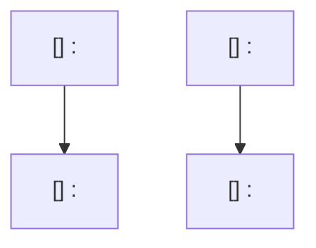

# Implementation Plan Workflow

Use this skill when producing or updating the consolidated roadmap in `docs/plan/roadmap.md`.

This skill is the source of truth for roadmap structure and execution-planning requirements.

## Workflow

1. **Clarify the plan request first**

   - Confirm the goal, intended outcome, scope boundaries, exclusions, and delivery constraints.
   - Ask focused follow-up questions only when missing information would change the plan structure or sequencing.

1. **Collect planning context**

   - Read `docs/plan/AGENTS.md`, `docs/plan/roadmap.md`, and the related source files before writing.
   - Capture only the constraints that materially affect scope, sequencing, validation, or exclusions.

1. **Choose the roadmap operation**

   - For claiming an existing step before implementation, read `references/start-step.md` and keep the edit isolated to that step's `#### Assignee` field.
   - For revising an existing pending step, read `references/update-step.md` and update only the named roadmap sections that need to change while preserving the canonical step structure.
   - For inserting a new pending step, read `references/add-step.md` and draft the full canonical step block before reconciling any surrounding roadmap sections the new work affects.

1. **Sync the roadmap when the skill changes**

   - When updating this `SKILL.md`, review `docs/plan/roadmap.md` and `docs/plan/AGENTS.md` in the same turn and sync them so they match the updated rules.
   - Respect explicit user exclusions when deciding which existing roadmap content to leave untouched.

1. **Draft or revise the consolidated roadmap**

   - Keep all active planning in `docs/plan/roadmap.md`. Do not create a new per-feature plan file unless the user explicitly asks for a temporary migration artifact.
   - Keep one shared execution diagram and one shared `## Implementation Steps` section for the whole roadmap.
   - Use named streams to explain parallel work, but do not split the roadmap into multiple per-feature step sections or multiple diagrams.
   - Keep already-landed behavior in `## Current State Snapshot`; do not retain implemented steps in `## Implementation Steps`.
   - Keep snapshot rows scannable: one short current-state sentence plus a status, without long file lists in the table cells.
   - In each step, render `Assignee`, `Why now`, `Usable outcome`, `Substeps`, `Tests`, and `Docs` as their own subtopics on separate lines instead of inline bold labels.
   - Keep the UUID only in the `[UUID] Stream: Title` step heading so the step keeps a stable identifier even if ordering changes.
   - Render `#### Assignee` as the first subsection in every step and store the owning GitHub user handle there in `@assignee` format, or use `No assignee` when the step is currently unowned.
   - For the current direct-to-`main` team workflow, treat assignment as a visible roadmap change: the engineer claiming a step must land a dedicated commit that updates that step's exact `#### Assignee` field, push that commit so the team can see ownership, and only then start implementation in later commits.
   - Do not mix assignee-claim edits with implementation changes in the same commit for the direct-to-`main` workflow.
   - Use size budgeting during roadmap creation, not after the fact. Before finalizing the roadmap, estimate the changed-line scope for each step, split oversized work into additional steps, and keep those size estimates in planning notes or reviewer reasoning rather than rendering a `#### Size` block in `docs/plan/` files.
   - Treat each step as one mergeable planned slice. Keep every planned step at `XL` or smaller, and split any step that would be `XXL` before handing off the plan.
   - Define `atomic` as one mergeable acceptance story: the step can land, be tested, documented, and reverted independently without needing a follow-up step just to become coherent or usable.
   - Prefer one primary usable outcome per step. If the `#### Usable outcome` sentence describes two sibling capabilities, split the step.
   - Target `2..=5` checklist items under `#### Substeps`. If a step needs more than `5` implementation items, split it into additional steps instead of hiding multiple deliverables in one slice.
   - Split by executable outcome, not by architecture layer. Prefer steps such as `persist X`, `render X`, `edit X`, or `reconcile X` when they each form their own usable slice, rather than bundling multiple outcomes into one cross-layer bucket.
   - Use step titles that name one outcome. If a title needs `and`, `plus`, or multiple verbs to describe separate deliverables, split the work unless those words only clarify one tightly coupled result.
   - Use this size table when labeling a planned step:

     | Size | Changed lines |
     |------|---------------|
     | `XS` | `0..=10` |
     | `S` | `11..=30` |
     | `M` | `31..=80` |
     | `L` | `81..=200` |
     | `XL` | `201..=500` |
     | `XXL` | `501+` |
   - Write each checklist item under `#### Substeps` as a short human-readable title followed by the detailed implementation guidance for that item, preserving the concrete file and constraint details instead of collapsing them into the title alone.
   - Structure steps as evolving usable slices. Each step must include the implementation work plus the tests and documentation needed for that slice before it can be considered complete.
   - Keep implementation checklist items under `#### Substeps`, then extract validation work into `#### Tests` and documentation work into `#### Docs` immediately after `#### Substeps`.
   - Mention every required file directly in the checklist text for the relevant substep instead of adding a trailing `Primary files` block.
   - Format the title portion of every step heading as `[UUID] Stream: Title`.
   - Use the `Stream: Title` portion of that heading title to help readers understand which work can proceed in parallel.

1. **Define execution sequence and guardrails**

   - Make the first step in each stream the smallest usable iteration instead of standalone groundwork.
   - Ensure later steps extend that working baseline and keep tests/docs in the same step as the behavior change.
   - Do not reserve testing or documentation for a final catch-all step; if a step changes behavior, it owns the validation and docs updates for that change.
   - Keep the single roadmap diagram aligned with the step list and use it to show which streams can run in parallel.

1. **Quality check before handing off**

   - Remove duplicated or contradictory checklist items and trim stale completed detail when it no longer helps active execution.
   - Verify every step can be executed, validated, and merged independently.
   - Verify every step answers `What becomes newly possible after only this step lands?` in one sentence.
   - Verify every step was split using the size table below before handoff, even though the resulting plan should not render a `#### Size` section.
   - Verify no planned step is larger than `XL`; split oversized work before handoff.
   - Verify no step has more than `5` implementation checklist items under `#### Substeps`; split crowded steps before handoff.
   - Verify every step heading title uses the exact `[UUID] Stream: Title` format and that the UUID value is valid.
   - Verify every step starts with explicit `#### Assignee` before `#### Why now`.
   - Verify every `#### Assignee` value uses `@assignee` GitHub-handle format or the exact text `No assignee`.
   - Verify every step has explicit `#### Tests` and `#### Docs` sections when they are required by that slice.
   - Verify every `#### Substeps` checklist item starts with a human-readable title while keeping the detailed implementation guidance in the same item.
   - Reject steps that bundle multiple acceptance stories behind one title, one `#### Usable outcome`, or one combined validation block.
   - Reject plans that save most tests/docs for the last step instead of keeping them attached to the relevant behavior changes.
   - Verify the roadmap uses one shared diagram and one shared step list.
   - Verify no implemented step remains in the roadmap; completed work belongs in snapshot context or should disappear entirely.
   - When this skill changed, verify the roadmap and active planning inventory in `docs/plan/` were reviewed and updated to match the new rules unless the user explicitly excluded them.
   - Verify cross-stream dependencies are aligned or clearly marked for user resolution.
   - Verify the final roadmap reflects the clarified requirements the user provided.

1. **Maintain roadmap hygiene**

   - When a step is fully implemented and no further tracked work remains for it, remove that step from `docs/plan/roadmap.md` instead of keeping completed work as permanent active inventory.
   - If follow-up work is still needed after a step is otherwise complete, add a new pending step with its own scope and checklist instead of extending the completed step indefinitely.
   - Keep the roadmap concise by collapsing shipped context into snapshot rows rather than preserving completed implementation detail.

## Roadmap Skeleton

Use this skeleton when adding or revising `docs/plan/roadmap.md`:

````markdown
# Agentty Roadmap

<One-sentence summary of how this file tracks the active project roadmap.>

## Current State Snapshot

| Area | Current state in codebase | Status |
|------|---------------------------|--------|
| <area> | <short observable state> | <status> |

## Active Streams

- `<stream>`: <what this stream owns>

## Implementation Approach

- <how the roadmap is split into usable streams and slices>

## Suggested Execution Order



## Implementation Steps

### [<uuid>] <Stream>: <Step Title>

#### Assignee

`No assignee`

#### Why now

<rationale>

#### Usable outcome

<what the user can do after this iteration lands>

#### Substeps

- [ ] **<Human-readable substep title>.** <Detailed implementation task within this step, including files and constraints>

#### Tests

- [ ] <tests/validation needed for this step>

#### Docs

- [ ] <documentation updates needed for this step>

### [<uuid>] <Stream>: <Step Title>

#### Assignee

`No assignee`

#### Why now

<rationale>

#### Usable outcome

<what the user can do after this iteration lands>

#### Substeps

- [ ] **<Human-readable substep title>.** <Detailed implementation task within this step, including files and constraints>

#### Tests

- [ ] <tests/validation needed for this step>

#### Docs

- [ ] <documentation updates needed for this step>

## Cross-Stream Notes

- <active overlap, ownership decision, or unresolved dependency between streams>

## Status Maintenance Rule

- Keep only not-yet-implemented steps in `## Implementation Steps`.
- In the current direct-to-`main` workflow, claim a step by landing and pushing a dedicated commit that updates only that step's exact `#### Assignee` field before implementation work begins.
- After implementing a step, remove it from the roadmap and refresh the snapshot rows that changed.
- When a step changes behavior, complete its `#### Tests` and `#### Docs` work in that same step before removing it.
- If more work remains after a completed step, add a new pending step instead of preserving completed detail.
````
